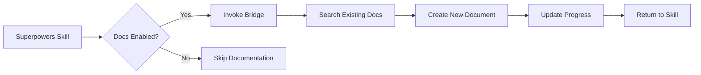

# Document-Driven Bridge

## Overview

This skill bridges **superpowers** workflow skills with **document-driven-ai-workflow** CLI tool, enabling automatic document creation and management at key workflow points.

## Prerequisites

**REQUIRED:** The `document-driven-ai-workflow` skill must be installed and available. Check installation by running:

```bash
# Check if docs command is available
which docs || node /path/to/document-driven-ai-workflow/cli.js --help
```

**Configuration Required:** `.superpowers-config.yaml` must have:

```yaml
documentation:
  enabled: true
  cli_path: "node /path/to/document-driven-ai-workflow/cli.js"
  # or if installed globally:
  # cli_path: "docs"
```

## When This Skill Is Used

This skill is **automatically invoked** by other superpowers skills when:

1. **`brainstorming`** completes → Create/update context documents
2. **`writing-plans`** completes → Create task documents
3. **`test-driven-development`** finds bugs → Create bug documents
4. **`finishing-a-development-branch`** → Update project status and archive documents

## The Bridge Commands

### `docs:search "query"`

Search existing documentation before starting any work.

**Usage:**
```bash
# Before brainstorming
$DOCS_CLI search "project architecture"

# Before writing plans
$DOCS_CLI search "related features"

# Before debugging
$DOCS_CLI search "similar bugs"
```

**When to use:** ALWAYS search before creating new documents to avoid duplication.

### `docs:create <type> "title"`

Create a new document with automatic timestamp.

**Types:** `task`, `bug`, `decision`, `context`

**Usage:**
```bash
# After brainstorming - capture design decisions
$DOCS_CLI create decision "Adopt React for frontend"

# After writing-plans - track implementation tasks
$DOCS_CLI create task "Implement user authentication"

# During TDD - record bugs for investigation
$DOCS_CLI create bug "Test failure in auth module"

# During finishing - create context for future work
$DOCS_CLI create context "API integration patterns"
```

### `docs:update <file> "status:value" "progress:note"`

Update existing document status and progress.

**Status values:** `待开始`, `进行中`, `已完成`, `已阻塞`, `已取消`

**Usage:**
```bash
# Mark task as in progress
$DOCS_CLI update ".docs/active/2025-01-07-task-auth.md" "status:进行中" "progress:完成基础组件"

# Mark bug as fixed
$DOCS_CLI update ".docs/active/2025-01-07-bug-auth-crash.md" "status:已修复" "progress:修复空指针问题"

# Mark task as complete
$DOCS_CLI update ".docs/active/2025-01-07-task-auth.md" "status:已完成"
```

### `docs:status`

View current project status including active tasks, bugs, and decisions.

**Usage:**
```bash
# Before finishing development branch
$DOCS_CLI status

# Output shows:
# - Active tasks with their status
# - Outstanding bugs
# - Recent decisions
# - Context documents available
```

## Integration Pattern

### Standard Workflow Integration



### Example: brainstorming Integration

**Step 1: Before Design**
```markdown
## Generate Design Options

FIRST: Run `$DOCS_CLI search "project architecture"` to understand existing context.
```

**Step 2: After Design**
```markdown
## Capture Decisions

IF design includes important technical choices:
  Run `$DOCS_CLI create decision "Design decision title"` with rationale
```

### Example: writing-plans Integration

**Step 1: Create Plan Document**
```markdown
## Create Implementation Task

ALWAYS run:
```bash
$DOCS_CLI create task "Implement: [feature-name]"
```

This creates a timestamped task document that tracks:
- Implementation steps from this plan
- Progress updates during execution
- Completion status
```

**Step 2: Update During Execution**
```markdown
## Track Progress

After each checkpoint:
```bash
$DOCS_CLI update "$TASK_DOC" "status:进行中" "progress:[checkpoint-description]"
```

## Configuration

Create `.superpowers-config.yaml` in your project root:

```yaml
# Superpowers Configuration
documentation:
  enabled: true  # Set to false to disable document integration

  # Path to document-driven-ai-workflow CLI
  cli_path: "node /path/to/document-driven-ai-workflow/cli.js"

  # Document categories to create at each workflow point
  workflows:
    brainstorming:
      create:
        - type: decision
          when: "technical_decisions_made"
        - type: context
          when: "new_context_needed"

    writing-plans:
      create:
        - type: task
          always: true

    test-driven-development:
      create:
        - type: bug
          when: "test_fails"
      update:
        - type: bug
          when: "bug_fixed"

    finishing-a-development-branch:
      actions:
        - type: status
          always: true
        - type: archive
          when: "merging_to_main"

  # Auto-archiving settings
  archive:
    enabled: true
    after_days: 30  # Archive completed docs after 30 days
    keep_active:
      - type: task
        status: ["进行中", "已阻塞"]
```

## Error Handling

**If CLI not found:**
```bash
# Warn but continue
echo "⚠️  document-driven-ai-workflow CLI not found. Skipping documentation."
echo "   Install from: https://github.com/LouisHors/document-driven-ai-workflow"
```

**If .docs not initialized:**
```bash
# Auto-initialize
$DOCS_CLI init
```

**If configuration missing:**
```bash
# Use defaults
echo "ℹ️  No .superpowers-config.yaml found. Using default documentation settings."
```

## Best Practices

1. **Search Before Create**: Always run `docs:search` before creating new documents
2. **Update Frequently**: Keep documents current as work progresses
3. **Archive When Done**: Move completed documents to archive during finishing
4. **Context First**: Create context documents early in project lifecycle
5. **Decisions Matter**: Record all significant technical decisions

## Troubleshooting

**Problem**: Commands fail with "command not found"
**Solution**: Update `cli_path` in `.superpowers-config.yaml` to use full path

**Problem**: Documents not being created
**Solution**: Check that `documentation.enabled: true` in config

**Problem**: Can't find documents later
**Solution**: Use `docs:status` to see all active documents and their locations

## See Also

- **horspowers:brainstorming** - Design decisions captured here
- **horspowers:writing-plans** - Implementation tasks created here
- **horspowers:test-driven-development** - Bug tracking integrated here
- **horspowers:finishing-a-development-branch** - Final status check here
