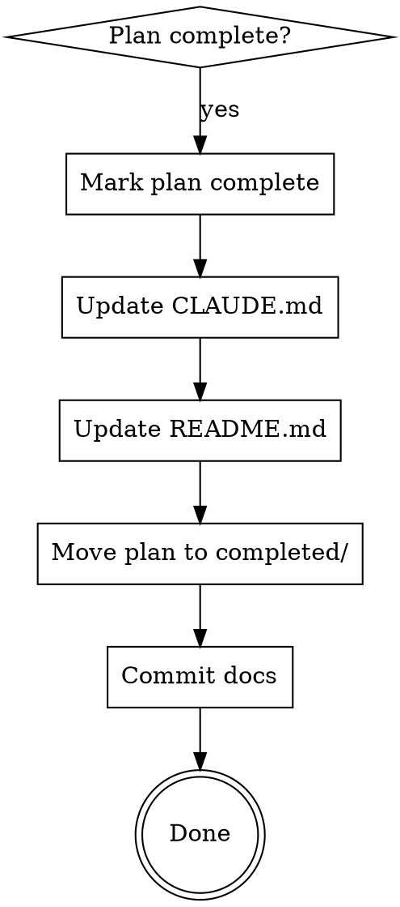

# Documenting Completed Implementation

## Overview

After completing an implementation plan, finalize documentation: mark plan complete, update CLAUDE.md and README.md, commit everything.

**Core principle:** Completed work needs completed documentation, version controlled.

## When to Use

Use when ALL these are true:
- Implementation plan exists in `docs/plans/`
- All plan tasks are completed
- Tests pass (if applicable)
- Ready to finalize documentation

**Called by:** executing-plans (Step 5), subagent-driven-development (Step 7)

**Do NOT use for:**
- Work without a plan file
- Incomplete implementations
- Documentation-only changes

## The Process



### Step 1: Mark Plan Complete

**File:** `docs/plans/<plan-name>.md`

Add status header at top (after title, before existing content):

```markdown
> **Status:** ✅ COMPLETED - YYYY-MM-DD
>
> **Implementation:** [1-2 sentence summary of what was built]
```

**Template:**
- Use ✅ emoji for visual clarity
- Date format: YYYY-MM-DD
- Blank line between Status and Implementation
- Summary: What was implemented (not how/why)

**Example:**
```markdown
# Upload Metrics Tracking Implementation Plan

> **Status:** ✅ COMPLETED - 2026-01-06
>
> **Implementation:** All 8 tasks completed successfully. Schema restructured, token tracking enhanced, upload reason tracking added, scripts verified.

> **For Claude:** Use executing-plans to implement this plan task-by-task.
```

### Step 2: Update CLAUDE.md

**Purpose:** Document for future Claude instances

**Add to Implementation History section** (create if doesn't exist):
```markdown
## Implementation History

Recent implementations (see docs/plans/completed/ for details):

- **YYYY-MM-DD**: [Feature name] - [1-line summary of what was built]
```

Keep last 10-15 implementations only. Archive older entries by removing them (full details remain in completed plans).

**Also add/update feature documentation** as needed:
- Commands section: New commands/scripts with brief description
- Architecture section: Structural changes
- Feature sections: High-level overview (2-4 bullets, NOT full API docs)

**Scope:**
- Commands: Just the command + brief description
- Features: High-level, 2-4 bullets
- Examples: Only if needed for clarity (keep short)

**Do NOT:**
- Add full API documentation (that goes in README)
- Duplicate README content
- Add verbose examples

**Example:**
```markdown
## Implementation History

- **2026-01-06**: Metrics Tracking - Schema restructured, token tracking enhanced, upload reason tracking added

## Metrics Tracking

**Schema Structure:**
- `fileUploads.*` - Upload patterns and costs
- `geminiTokenUsage.*` - AI processing costs
- Upload reasons: 'new', 'modification', 'expiration'

```bash
# Setup indexes
node packages/admin-ui/scripts/setup-metrics-indexes.js

# Query metrics
node packages/admin-ui/scripts/query-metrics.js user1
```
```

### Step 3: Update README.md

**First, check if README already documents this feature:**

Extract feature name from the plan file being documented:
```bash
# Find the plan file being documented (most recent non-completed plan)
PLAN_FILE=$(ls -t docs/plans/[0-9][0-9][0-9][0-9]-*.md 2>/dev/null | grep -v '/completed/' | head -1)

if [ -z "$PLAN_FILE" ]; then
    echo "Error: No active plan file found in docs/plans/"
    exit 1
fi

# Strip date prefix (YYYY-MM-DD-) and convert hyphens to spaces
# Example: docs/plans/2026-01-11-todoist-integration.md → "todoist integration"
FEATURE_NAME=$(basename "$PLAN_FILE" .md | sed 's/^[0-9][0-9][0-9][0-9]-[0-9][0-9]-[0-9][0-9]-//' | sed 's/-/ /g')
```

**Check for dedicated section in README:**
```bash
# Look for section headers mentioning the feature
grep -i "^## .*${FEATURE_NAME}" README.md
grep -i "^### .*${FEATURE_NAME}" README.md
```

**Decision tree:**

| Section Found | Documentation State | Action |
|---------------|---------------------|--------|
| Yes (## or ###) | Comprehensive section exists | Skip update, note to user |
| No | Missing or only brief mentions | Add documentation |

**If section exists:**
```
✅ README.md already has a dedicated section for <feature>

Found section: [show matching header]

Skipping README update. Review the existing section to ensure it's current.
```

Proceed to Step 4.

**If no section found:**

Add user-facing documentation following these guidelines:

**What to document:**
- Feature purpose (what it does, why it exists)
- How to use it (examples, commands, configuration)
- Any setup required (environment variables, credentials)
- Related features or dependencies

**Where to add it:**
- Features section (if one exists)
- Before the "Development" or "Contributing" section
- At the end of user-facing content (before technical sections)

**Format:**
```markdown
## [Feature Name]

[Brief description of what this feature does]

### Usage

[Concrete examples showing how to use it]

### Configuration

[Any setup, environment variables, or options]
```

**Example for Todoist integration:**
```markdown
## Todoist Integration

The calendar prep system can output your schedule to Todoist, creating tasks for each event.

### Usage

Run the output Lambda:
```bash
npm run output:todoist
```

### Configuration

Set these environment variables in `.env`:
- `TODOIST_API_TOKEN` - Your Todoist API token
- `TODOIST_PROJECT_ID` - Target project ID (optional, defaults to Inbox)
```
```

### Step 4: Move Plan to Completed

**Archive the completed plan:**

```bash
# Create completed directory if doesn't exist
mkdir -p docs/plans/completed

# Move and rename with date
mv docs/plans/<plan-name>.md docs/plans/completed/YYYY-MM-DD-<plan-name>.md
```

### Step 5: Commit Documentation

**REQUIRED:** Commit all documentation updates.

```bash
git add docs/plans/completed/ CLAUDE.md README.md
git commit -m "docs: complete <feature-name> implementation

Mark implementation plan as completed, update CLAUDE.md and README
with new <feature-name> information.

- Plan: Mark as completed (YYYY-MM-DD), move to completed/
- CLAUDE.md: Add to Implementation History, update [section]
- README: [what was updated]
"
```

**Commit message format:**
- Type: `docs:`
- Summary: What was completed
- Body: Bullet list of changes
- Include co-authoring footer

## Verification

Before finishing, verify:

```bash
# Check what changed
git diff HEAD~1

# Verify plan was moved and has status header
head -10 docs/plans/completed/YYYY-MM-DD-<plan-name>.md | grep "Status.*COMPLETED"

# Verify commit includes all files
git log -1 --stat
```

## Common Mistakes

| Mistake | Fix |
|---------|-----|
| **Forgot to commit** | Documentation not in git = lost work. Always commit. |
| **No status emoji** | Use ✅ for visual clarity in plan headers |
| **Wrong date format** | Use YYYY-MM-DD not "on 2026-01-06" |
| **Didn't move plan** | Completed plans go to docs/plans/completed/YYYY-MM-DD-name.md |
| **No Implementation History** | Add to CLAUDE.md so future Claude can discover past work |
| **Too much in CLAUDE.md** | Move detailed examples to README |
| **Too little in README** | Users need working examples, not just descriptions |
| **Vague commit message** | Bullet what changed in each file |

## Quick Reference

```markdown
# Plan Status Template
> **Status:** ✅ COMPLETED - YYYY-MM-DD
>
> **Implementation:** [Summary of what was built]

# CLAUDE.md Scope
- Implementation History: Add one-line entry
- Commands (just command + brief note)
- High-level features (2-4 bullets)
- Short examples only if needed

# README.md Scope
- Setup instructions
- Working code examples
- Example output if helpful

# Archive Plan
mv docs/plans/<plan>.md docs/plans/completed/YYYY-MM-DD-<plan>.md

# Commit Message
docs: complete <feature> implementation

- Plan: Mark as completed (YYYY-MM-DD), move to completed/
- CLAUDE.md: Add to Implementation History, update [section]
- README: [updates]
```

## Red Flags - You Forgot Something

- Didn't commit the documentation → Add commit step
- Plan has no status header → Add template at top
- Plan still in docs/plans/ → Move to completed/ with date prefix
- No Implementation History entry → Add to CLAUDE.md
- CLAUDE.md has full API docs → Move to README
- README has no examples → Add working code users can copy
- Commit message just says "update docs" → Add bullet list of what changed
