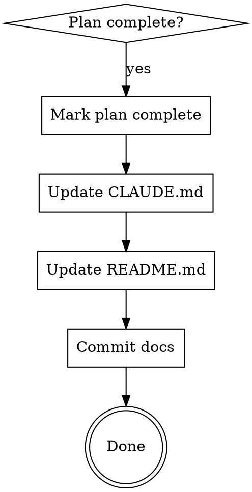

# Documenting Completed Implementation

## Overview

After completing an implementation plan, finalize documentation: mark plan complete, update CLAUDE.md and README.md, commit everything.

**Core principle:** Completed work needs completed documentation, version controlled.

## When to Use

Use when ALL these are true:
- Implementation plan exists in `docs/plans/`
- All plan tasks are completed
- Tests pass (if applicable)
- Ready to finalize documentation

**Called by:** executing-plans (Step 5), subagent-driven-development (Step 7)

**Do NOT use for:**
- Work without a plan file
- Incomplete implementations
- Documentation-only changes

## The Process



### Step 1: Mark Plan Complete

**File:** `docs/plans/<plan-name>.md`

Add status header at top (after title, before existing content):

```markdown
> **Status:** ✅ COMPLETED - YYYY-MM-DD
>
> **Implementation:** [1-2 sentence summary of what was built]
```

**Template:**
- Use ✅ emoji for visual clarity
- Date format: YYYY-MM-DD
- Blank line between Status and Implementation
- Summary: What was implemented (not how/why)

**Example:**
```markdown
# Upload Metrics Tracking Implementation Plan

> **Status:** ✅ COMPLETED - 2026-01-06
>
> **Implementation:** All 8 tasks completed successfully. Schema restructured, token tracking enhanced, upload reason tracking added, scripts verified.

> **For Claude:** Use executing-plans to implement this plan task-by-task.
```

### Step 2: Update CLAUDE.md

**Purpose:** Document for future Claude instances

**Add/Update:**
- New commands/scripts (in Commands section)
- Architecture changes (in Architecture section)
- Key patterns/features (new section if major feature)

**Scope:**
- Commands: Just the command + brief description
- Features: High-level, 2-4 bullets
- Examples: Only if needed for clarity (keep short)

**Do NOT:**
- Add full API documentation (that goes in README)
- Duplicate README content
- Add verbose examples

**Example:**
```markdown
## Metrics Tracking

**Schema Structure (2026-01-06):**
- `fileUploads.*` - Upload patterns and costs
- `geminiTokenUsage.*` - AI processing costs
- Upload reasons: 'new', 'modification', 'expiration'

```bash
# Setup indexes
node packages/admin-ui/scripts/setup-metrics-indexes.js

# Query metrics
node packages/admin-ui/scripts/query-metrics.js user1
```
```

### Step 3: Update README.md

**Purpose:** User-facing quickstart and setup

**Add/Update:**
- Installation steps (if new dependencies)
- Configuration (if new env vars)
- Usage examples (if new features)
- Commands (if new scripts)

**Scope:**
- Setup instructions: Clear, step-by-step
- Examples: Working code users can copy-paste
- Commands: With example output if helpful

**Balance:**
- Quickstart: Keep it brief
- Full docs: Link to separate docs/ files if >50 lines

**Example:**
```markdown
### Metrics Tracking

```bash
# Setup MongoDB indexes (one-time)
node packages/admin-ui/scripts/setup-metrics-indexes.js

# Query metrics for a user
node packages/admin-ui/scripts/query-metrics.js user1
```

**Example Output:**
```
Date: 2026-01-06
  Uploads: 15 files, 5242880 bytes
  Tokens: 40000 total (25000 used, 15000 cached, 37.5% cache rate)
```
```

### Step 4: Commit Documentation

**REQUIRED:** Commit all documentation updates.

```bash
git add docs/plans/<plan-name>.md CLAUDE.md README.md
git commit -m "docs: complete <feature-name> implementation

Mark implementation plan as completed, update CLAUDE.md and README
with new <feature-name> information.

- Plan: Mark as completed (YYYY-MM-DD)
- CLAUDE.md: [what was updated]
- README: [what was updated]

🤖 Generated with Claude Code
Co-Authored-By: Claude Sonnet 4.5 <noreply@anthropic.com>"
```

**Commit message format:**
- Type: `docs:`
- Summary: What was completed
- Body: Bullet list of changes
- Include co-authoring footer

## Verification

Before finishing, verify:

```bash
# Check what changed
git diff HEAD~1

# Verify plan has status header
head -10 docs/plans/<plan-name>.md | grep "Status.*COMPLETED"

# Verify commit includes all files
git log -1 --stat
```

## Common Mistakes

| Mistake | Fix |
|---------|-----|
| **Forgot to commit** | Documentation not in git = lost work. Always commit. |
| **No status emoji** | Use ✅ for visual clarity in plan headers |
| **Wrong date format** | Use YYYY-MM-DD not "on 2026-01-06" |
| **Too much in CLAUDE.md** | Move detailed examples to README |
| **Too little in README** | Users need working examples, not just descriptions |
| **Vague commit message** | Bullet what changed in each file |

## Quick Reference

```markdown
# Plan Status Template
> **Status:** ✅ COMPLETED - YYYY-MM-DD
>
> **Implementation:** [Summary of what was built]

# CLAUDE.md Scope
- Commands (just command + brief note)
- High-level features (2-4 bullets)
- Short examples only if needed

# README.md Scope
- Setup instructions
- Working code examples
- Example output if helpful

# Commit Message
docs: complete <feature> implementation

- Plan: Mark as completed (YYYY-MM-DD)
- CLAUDE.md: [updates]
- README: [updates]

🤖 Generated with Claude Code
Co-Authored-By: Claude Sonnet 4.5 <noreply@anthropic.com>
```

## Red Flags - You Forgot Something

- Didn't commit the documentation → Add commit step
- Plan has no status header → Add template at top
- CLAUDE.md has full API docs → Move to README
- README has no examples → Add working code users can copy
- Commit message just says "update docs" → Add bullet list of what changed
