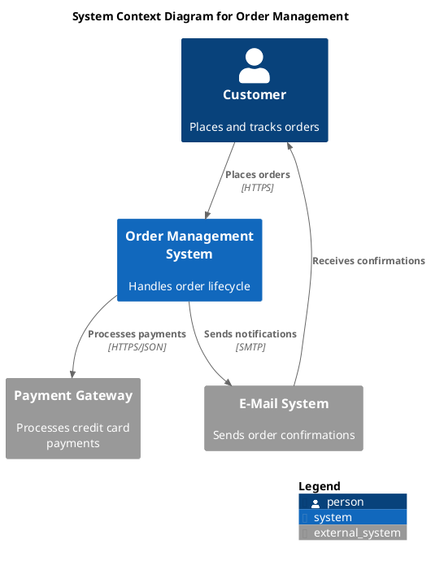
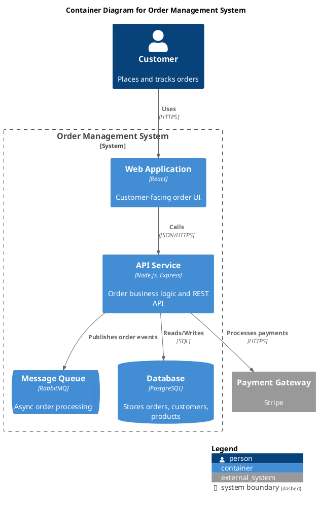
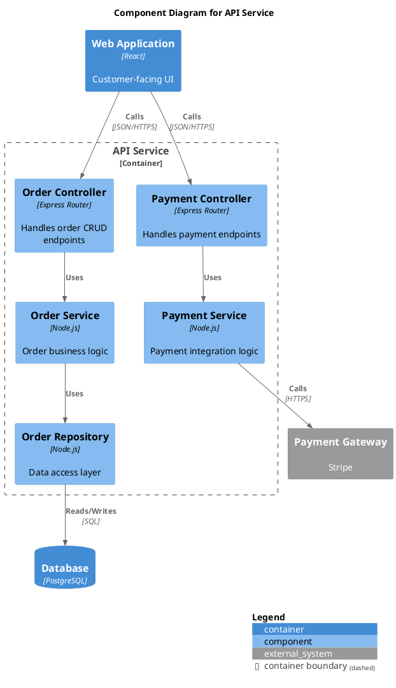
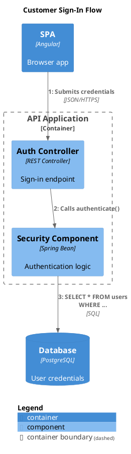
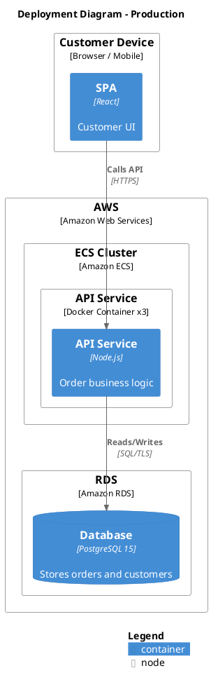
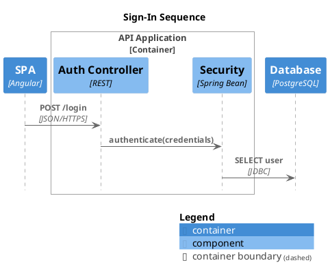

# Drawing C4 Diagrams with PlantUML

## Overview

Generate C4 model architecture diagrams as `.puml` files using the C4-PlantUML library. The user describes their system in natural language; you pick the right diagram type, extract elements and relationships, and produce a ready-to-render `.puml` file.

**Core principle:** Listen to the user's description, identify the right abstraction level, and generate a complete, valid `.puml` file — not a sketch, not pseudocode.

## When to Use

- User asks to "draw", "diagram", "visualize", or "document" software architecture
- User describes systems, services, APIs, databases, users, deployments
- User mentions "C4", "context diagram", "container diagram", "component diagram"
- User wants to show how systems interact, how code is deployed, or how a request flows

## Picking the Right Diagram Type

| User talks about... | Diagram type | C4 level |
|---|---|---|
| Users and which systems they use | **System Context** | L1 — highest zoom |
| Multiple systems across an org | **System Landscape** | L1 — org-wide |
| Applications, databases, message queues inside one system | **Container** | L2 |
| Classes, modules, services inside one container | **Component** | L3 |
| How a request flows step-by-step (numbered) | **Dynamic** | Any level |
| How a request flows as message exchange | **Sequence** | Any level |
| Where containers run (servers, cloud, pods) | **Deployment** | Infrastructure |

**When uncertain:** Start with System Context (L1). It's always useful and you can zoom in later. Ask the user: *"Would you like me to zoom into any of these systems to show their internal containers?"*

## The Process

1. **Ask where to place the file** — suggest `docs/diagrams/<diagram-name>.puml` as default location
2. **Listen** — extract persons, systems, containers, components, and relationships from the user's description
3. **Pick diagram type** — use the table above
4. **Generate `.puml`** — create the file with `create_file`
5. **Validate syntax** — run the PlantUML `-checkonly` command (see Validation below). If errors, fix and re-validate until clean
6. **Open preview** — execute the VS Code command `plantuml.preview` to show the rendered diagram to the user in a side panel
7. **Iterate with the user** — the user sees the rendered diagram; adjust based on their feedback (add elements, change layout, etc.) and re-validate after each change

## Validation

Validate `.puml` files using the PlantUML CLI before presenting them to the user. This catches undefined macros, syntax errors, and typos that the editor's linter misses.

**Validation command:**

```sh
java -jar "$HOME/.vscode/extensions/jebbs.plantuml-2.18.1/plantuml.jar" -checkonly <path-to-file>.puml
```

**Exit codes:**
- `0` — diagram is valid
- `200` — syntax error (line number and details on stderr)

**Iterative validation loop:**

1. Create or edit the `.puml` file
2. Run `-checkonly` against it
3. If exit code is `200`: read the error from stderr, fix the issue in the file, go to step 2
4. If exit code is `0`: the diagram is valid — proceed to preview

> **Note:** The agent cannot see the rendered image. Syntax validation confirms the diagram *compiles* but cannot confirm it *looks right*. Always open the preview so the user can visually verify layout, spacing, and completeness.

> **Fish shell note:** fish does not support heredocs. Use `create_file` to write `.puml` files — never pipe diagram content via heredoc in fish.

## Opening the Preview

After validation passes, open the PlantUML preview programmatically:

```
run_vscode_command: plantuml.preview
```

This opens a live-updating side panel showing the rendered diagram. The preview auto-refreshes when the file changes, so subsequent edits are visible immediately.

**Alternatively**, tell the user they can preview manually with `Alt+D` (macOS: `Option+D`) or right-click → **"PlantUML: Preview Current Diagram"**.

## Include Strategy

Use the PlantUML standard library (no internet required):

```plantuml
!include <C4/C4_Context>
!include <C4/C4_Container>
!include <C4/C4_Component>
!include <C4/C4_Dynamic>
!include <C4/C4_Deployment>
!include <C4/C4_Sequence>
```

If the user needs the latest features (bleeding edge), use remote includes:

```plantuml
!include https://raw.githubusercontent.com/plantuml-stdlib/C4-PlantUML/master/C4_Container.puml
```

**Default to standard library includes** unless the user requests otherwise.

## Quick-Start Examples

### System Context Diagram (L1)

The big picture. Who uses the system and what external systems does it talk to?



### Container Diagram (L2)

Zoom into one system. What applications, data stores, and services live inside?



### Component Diagram (L3)

Zoom into one container. What modules, classes, or services compose it?



### Dynamic Diagram

Show a specific flow with numbered steps.



### Deployment Diagram

Show where containers run in production.



### Sequence Diagram (C4 styled)

Show message flow between participants in UML sequence style with C4 styling.

**Important:** Boundaries use `Boundary_End()` instead of `{ }` in sequence diagrams.



## Element Quick Reference

| Macro | Use for | Diagram level |
|---|---|---|
| `Person(alias, label, ?descr)` | Human user | All |
| `Person_Ext(alias, label, ?descr)` | External human user | All |
| `System(alias, label, ?descr)` | Your software system | Context |
| `System_Ext(alias, label, ?descr)` | External system you don't own | Context |
| `SystemDb(alias, label, ?descr)` | System that is primarily a data store | Context |
| `SystemQueue(alias, label, ?descr)` | System that is primarily a queue | Context |
| `Container(alias, label, ?techn, ?descr)` | Application, service, data store | Container |
| `ContainerDb(alias, label, ?techn, ?descr)` | Database | Container |
| `ContainerQueue(alias, label, ?techn, ?descr)` | Message queue | Container |
| `Component(alias, label, ?techn, ?descr)` | Module, class, package inside a container | Component |
| `ComponentDb(alias, label, ?techn, ?descr)` | Component that is a data store | Component |
| `ComponentQueue(alias, label, ?techn, ?descr)` | Component that is a queue | Component |
| `Deployment_Node(alias, label, ?type, ?descr)` | Server, VM, pod, cloud region | Deployment |
| `Node(alias, label, ?type, ?descr)` | Short alias for Deployment_Node | Deployment |

**`_Ext` suffix** = external element (outside the system boundary, shown in gray).

## Boundary Quick Reference

| Macro | Use for |
|---|---|
| `System_Boundary(alias, label)` | Group containers inside a system |
| `Container_Boundary(alias, label)` | Group components inside a container |
| `Enterprise_Boundary(alias, label)` | Group systems inside an enterprise |
| `Boundary(alias, label, ?type)` | Generic boundary with custom type |
| `Boundary_End()` | **Sequence diagrams only** — close a boundary (no `{ }`) |

## Relationship Quick Reference

| Macro | Description |
|---|---|
| `Rel(from, to, label, ?techn, ?descr)` | Relationship (default direction) |
| `BiRel(from, to, label, ?techn)` | Bidirectional relationship |
| `Rel_U(from, to, label, ?techn)` | Force upward direction |
| `Rel_D(from, to, label, ?techn)` | Force downward direction |
| `Rel_L(from, to, label, ?techn)` | Force left direction |
| `Rel_R(from, to, label, ?techn)` | Force right direction |
| `Rel_Back(from, to, label, ?techn)` | Reverse arrow direction |
| `Rel_Neighbor(from, to, label, ?techn)` | Place elements adjacent |

## Layout Options

```plantuml
LAYOUT_TOP_DOWN()           ' Default — elements flow top to bottom
LAYOUT_LEFT_RIGHT()         ' Elements flow left to right
LAYOUT_LANDSCAPE()          ' Landscape orientation
LAYOUT_WITH_LEGEND()        ' Auto-add legend at bottom
LAYOUT_AS_SKETCH()          ' Hand-drawn sketch style
SHOW_LEGEND()               ' Show legend (use as LAST line)
SHOW_FLOATING_LEGEND()      ' Floating legend (positionable)
HIDE_STEREOTYPE()           ' Hide stereotype labels
```

**Arrange elements without relationships:**

```plantuml
Lay_U(from, to)    ' Place "from" above "to"
Lay_D(from, to)    ' Place "from" below "to"
Lay_L(from, to)    ' Place "from" left of "to"
Lay_R(from, to)    ' Place "from" right of "to"
```

## Tags and Custom Styling

Add visual differentiation with tags:

```plantuml
' Define tags
AddElementTag("microservice", $shape=EightSidedShape(), $bgColor="#438DD5")
AddElementTag("storage", $shape=RoundedBoxShape())
AddElementTag("legacy", $bgColor="#c0c0c0", $fontColor="#000000", $legendText="Legacy system")
AddRelTag("async", $lineStyle=DashedLine(), $legendText="Async communication")

' Use tags on elements
Container(svc, "Order Service", "Go", "Handles orders", $tags="microservice")
ContainerDb(db, "Legacy DB", "Oracle", "Stores orders", $tags="storage+legacy")

' Use tags on relationships
Rel(svc, queue, "Publishes events", $tags="async")

SHOW_LEGEND()   ' Tags appear in the legend automatically
```

**Available shapes:** `SharpCornerShape()` (default), `RoundedBoxShape()`, `EightSidedShape()`
**Available line styles:** `DashedLine()`, `DottedLine()`, `BoldLine()`, `SolidLine()`

## Sprites and Icons

```plantuml
' Built-in person sprites
Person(user, "User", $sprite="person")
Person(admin, "Admin", $sprite="person2")
System_Ext(bot, "Bot", $sprite="robot")

' External icon libraries
!define DEVICONS https://raw.githubusercontent.com/tupadr3/plantuml-icon-font-sprites/master/devicons
!include DEVICONS/angular.puml
!include DEVICONS/java.puml
Container(spa, "SPA", "Angular", "Frontend", $sprite="angular")
Container(api, "API", "Java", "Backend", $sprite="java")
```

## Element Properties

Add structured metadata tables to elements:

```plantuml
AddProperty("Team", "Platform Engineering")
AddProperty("SLA", "99.9%")
Container(api, "API Service", "Go", "Core API")
```

## File Placement

- **Ask the user** where they want diagram files placed
- **Default suggestion:** `docs/diagrams/<diagram-name>.puml`
- **Naming convention:** descriptive kebab-case, e.g. `system-context-banking.puml`, `container-order-management.puml`

## Previewing in VS Code

After creating and validating a `.puml` file:

1. **Programmatic:** Execute the `plantuml.preview` VS Code command — this opens the preview side panel automatically
2. **Manual:** `Alt+D` (macOS: `Option+D`) or right-click → **"PlantUML: Preview Current Diagram"**

The preview auto-updates on file changes. After each edit-and-validate cycle, the user sees the updated diagram immediately.

## Common Mistakes

| Mistake | Fix |
|---|---|
| Using `{ }` for boundaries in sequence diagrams | Use `Boundary_End()` instead |
| Forgetting `@startuml` / `@enduml` | Always wrap diagrams in these markers |
| Putting containers directly on context diagrams | Context = systems only. Zoom in with a container diagram |
| Missing `SHOW_LEGEND()` when using tags | Add `SHOW_LEGEND()` as the **last line** |
| Using spaces in `$tags` assignment | No space around `=`: `$tags="v1"` not `$tags = "v1"` |
| Using commas in tag names | PlantUML doesn't support commas in tag names |
| Combining multiple tags incorrectly | Use `+` to combine: `$tags="tag1+tag2"` |
| Not including the right library | Each diagram type needs its own include (see Include Strategy) |
| Overly complex single diagrams | Split into multiple diagrams at different C4 levels |

## Detailed API Reference

For the complete macro signatures, element-specific tag definitions, boundary styling, and advanced features, see c4-plantuml-reference.md in this directory.
