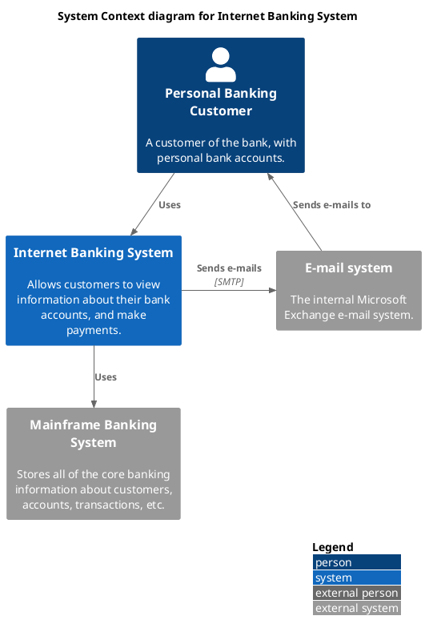
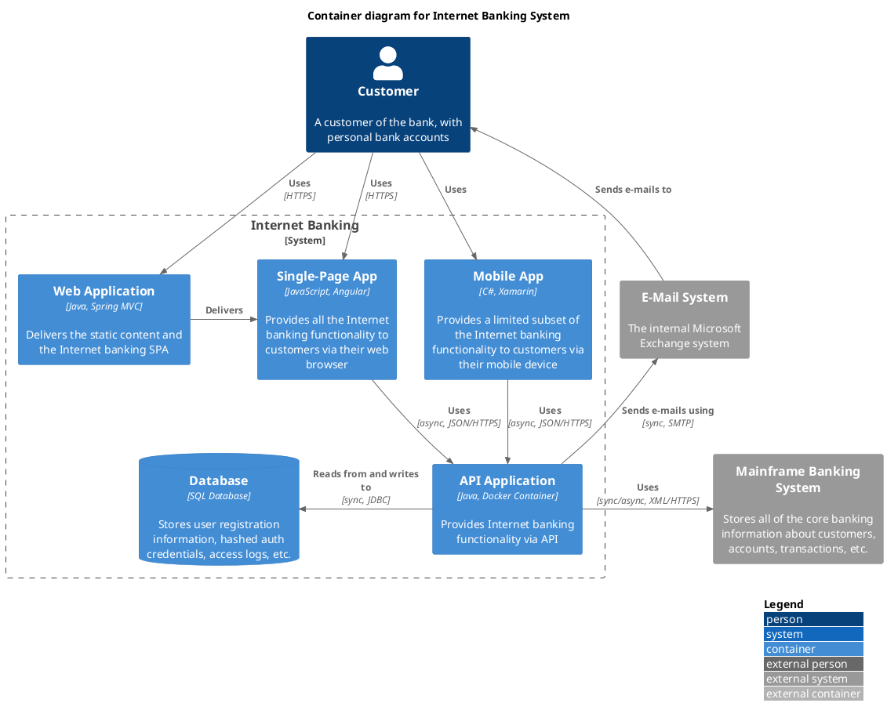
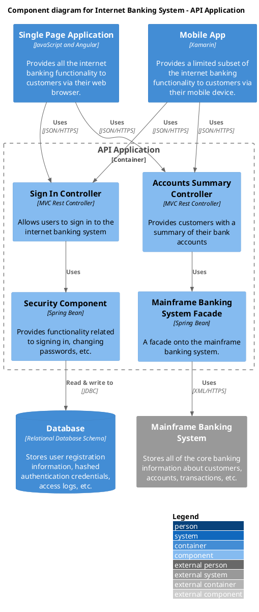
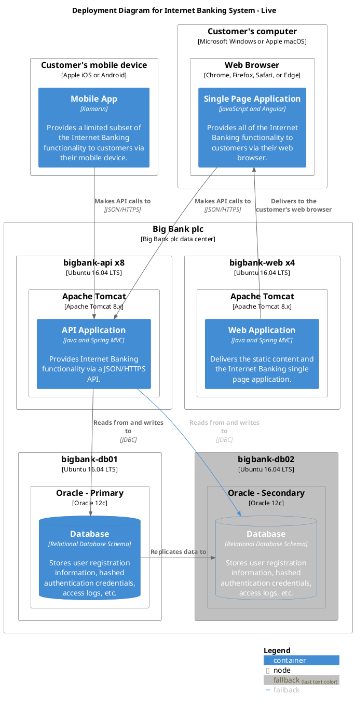
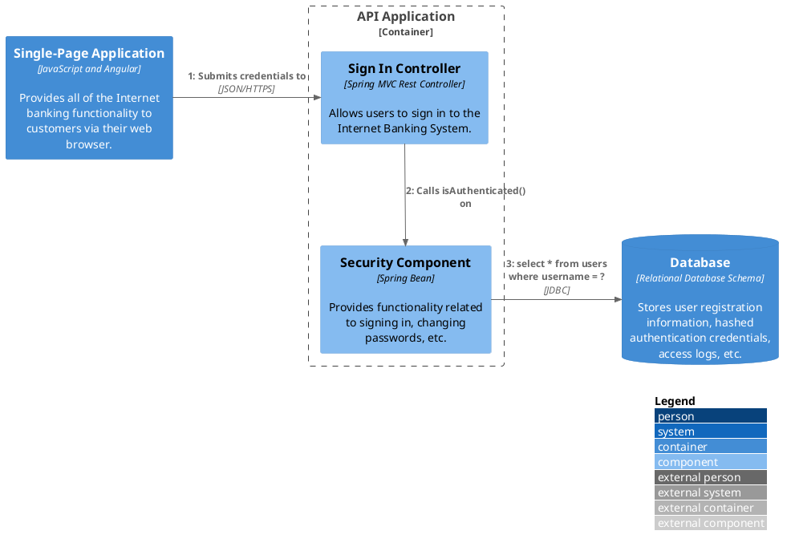
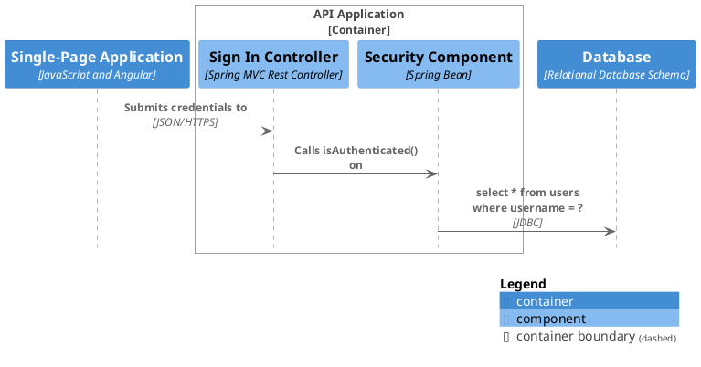

# C4-PlantUML Complete Reference

Comprehensive API reference for all C4-PlantUML macros, parameters, and features.

**Source:** [plantuml-stdlib/C4-PlantUML](https://github.com/plantuml-stdlib/C4-PlantUML)

## Parameter Conventions

- `arg` — required parameter
- `?arg` — optional parameter; set via keyword `$arg=...` (e.g. `$tags="myTag"`)
- All elements support: `?sprite`, `?tags`, `?link` as optional keyword arguments

## System Context & System Landscape (C4_Context)

```plantuml
!include <C4/C4_Context>
```

### Elements

| Macro | Parameters |
|---|---|
| `Person` | `(alias, label, ?descr, ?sprite, ?tags, ?link, ?type)` |
| `Person_Ext` | `(alias, label, ?descr, ?sprite, ?tags, ?link, ?type)` |
| `System` | `(alias, label, ?descr, ?sprite, ?tags, ?link, ?type, ?baseShape)` |
| `System_Ext` | `(alias, label, ?descr, ?sprite, ?tags, ?link, ?type, ?baseShape)` |
| `SystemDb` | `(alias, label, ?descr, ?sprite, ?tags, ?link, ?type)` |
| `SystemDb_Ext` | `(alias, label, ?descr, ?sprite, ?tags, ?link, ?type)` |
| `SystemQueue` | `(alias, label, ?descr, ?sprite, ?tags, ?link, ?type)` |
| `SystemQueue_Ext` | `(alias, label, ?descr, ?sprite, ?tags, ?link, ?type)` |

### Boundaries

| Macro | Parameters |
|---|---|
| `Boundary` | `(alias, label, ?type, ?tags, ?link, ?descr)` |
| `Enterprise_Boundary` | `(alias, label, ?tags, ?link, ?descr)` |
| `System_Boundary` | `(alias, label, ?tags, ?link, ?descr)` |

### Sprites

Built-in person/robot sprites: `person`, `person2`, `robot`, `robot2`

### Type Extension

`Person()` and `System()` support `$type` argument displayed as `[characteristic]`.

## Container Diagram (C4_Container)

```plantuml
!include <C4/C4_Container>
```

Inherits all System Context macros plus:

| Macro | Parameters |
|---|---|
| `Container` | `(alias, label, ?techn, ?descr, ?sprite, ?tags, ?link, ?baseShape)` |
| `Container_Ext` | `(alias, label, ?techn, ?descr, ?sprite, ?tags, ?link, ?baseShape)` |
| `ContainerDb` | `(alias, label, ?techn, ?descr, ?sprite, ?tags, ?link)` |
| `ContainerDb_Ext` | `(alias, label, ?techn, ?descr, ?sprite, ?tags, ?link)` |
| `ContainerQueue` | `(alias, label, ?techn, ?descr, ?sprite, ?tags, ?link)` |
| `ContainerQueue_Ext` | `(alias, label, ?techn, ?descr, ?sprite, ?tags, ?link)` |
| `Container_Boundary` | `(alias, label, ?tags, ?link, ?descr)` |

## Component Diagram (C4_Component)

```plantuml
!include <C4/C4_Component>
```

Inherits all Container macros plus:

| Macro | Parameters |
|---|---|
| `Component` | `(alias, label, ?techn, ?descr, ?sprite, ?tags, ?link, ?baseShape)` |
| `Component_Ext` | `(alias, label, ?techn, ?descr, ?sprite, ?tags, ?link, ?baseShape)` |
| `ComponentDb` | `(alias, label, ?techn, ?descr, ?sprite, ?tags, ?link)` |
| `ComponentDb_Ext` | `(alias, label, ?techn, ?descr, ?sprite, ?tags, ?link)` |
| `ComponentQueue` | `(alias, label, ?techn, ?descr, ?sprite, ?tags, ?link)` |
| `ComponentQueue_Ext` | `(alias, label, ?techn, ?descr, ?sprite, ?tags, ?link)` |

## Dynamic Diagram (C4_Dynamic)

```plantuml
!include <C4/C4_Dynamic>
```

Inherits all Component macros plus automatic step numbering.

### Index Macros

| Macro | Description |
|---|---|
| `Index($offset=1)` | Returns current index, increments next (function) |
| `SetIndex($new_index)` | Returns and sets new index (function) |
| `LastIndex()` | Returns last used index (function) |
| `increment($offset=1)` | Increment index (procedure, no output) |
| `setIndex($new_index)` | Set index (procedure, no output) |

All relationship macros support `?index` parameter: `Rel($from, $to, $label, $index="5")`.

## Deployment Diagram (C4_Deployment)

```plantuml
!include <C4/C4_Deployment>
```

Inherits Container macros plus:

| Macro | Parameters |
|---|---|
| `Deployment_Node` | `(alias, label, ?type, ?descr, ?sprite, ?tags, ?link)` |
| `Node` | `(alias, label, ?type, ?descr, ?sprite, ?tags, ?link)` |
| `Node_L` | `(alias, label, ?type, ?descr, ?sprite, ?tags, ?link)` |
| `Node_R` | `(alias, label, ?type, ?descr, ?sprite, ?tags, ?link)` |

`Node()` is a short alias for `Deployment_Node()`. `Node_L`/`Node_R` force left/right alignment.

Deployment nodes nest naturally:

```plantuml
Deployment_Node(aws, "AWS") {
    Deployment_Node(ecs, "ECS", "Container Service") {
        Container(api, "API", "Go")
    }
}
```

## Sequence Diagram (C4_Sequence)

```plantuml
!include <C4/C4_Sequence>
```

### Critical Differences from Other Diagram Types

1. **Boundaries use `Boundary_End()`** — NOT `{ }`
2. Element descriptions are hidden by default
3. Only `Rel()` is supported (no directional variants)

```plantuml
Container_Boundary(api, "API Application")
    Component(ctrl, "Controller", "REST")
    Component(svc, "Service", "Spring Bean")
Boundary_End()
```

### Additional Macros

| Macro | Description |
|---|---|
| `Boundary_End()` | Close a boundary block |
| `SHOW_ELEMENT_DESCRIPTIONS(?show)` | Toggle element descriptions |
| `SHOW_FOOT_BOXES(?show)` | Toggle foot boxes |
| `SHOW_INDEX(?show)` | Toggle index numbers |

### Relationship

```
Rel($from, $to, $label, $techn="", $descr="", $sprite="", $tags="", $link="", $index="", $rel="")
```

`$rel` allows PlantUML arrow customization (e.g. `->`, `-->`, `->>`, `-->`).

### Supported PlantUML Sequence Features

- [Grouping messages](https://plantuml.com/sequence-diagram#425ba4350c02142c) (`alt`, `else`, `opt`, `loop`, etc.)
- [Dividers](https://plantuml.com/sequence-diagram#d4b2df53a72661cc) (`== Section ==`)
- [References](https://plantuml.com/sequence-diagram#63d5049791d9d79d) (`ref over`)
- [Delays](https://plantuml.com/sequence-diagram#8f497c1a3d15af9e) (`...delay...`)

## Relationships (All Diagrams)

### Core

| Macro | Parameters |
|---|---|
| `Rel` | `(from, to, label, ?techn, ?descr, ?sprite, ?tags, ?link)` |
| `BiRel` | `(from, to, label, ?techn, ?descr, ?sprite, ?tags, ?link)` |

### Directional

| Macro | Direction |
|---|---|
| `Rel_U` / `Rel_Up` | Force upward |
| `Rel_D` / `Rel_Down` | Force downward |
| `Rel_L` / `Rel_Left` | Force left |
| `Rel_R` / `Rel_Right` | Force right |
| `Rel_Back` | Reverse arrow |
| `Rel_Neighbor` | Place adjacent |
| `Rel_Back_Neighbor` | Reverse + adjacent |

BiRel also supports: `BiRel_U`, `BiRel_D`, `BiRel_L`, `BiRel_R`.

## Layout Macros

### Global

| Macro | Effect |
|---|---|
| `LAYOUT_TOP_DOWN()` | Default top-to-bottom flow |
| `LAYOUT_LEFT_RIGHT()` | Left-to-right flow |
| `LAYOUT_LANDSCAPE()` | Landscape orientation |
| `LAYOUT_WITH_LEGEND()` | Auto legend at bottom-right |
| `LAYOUT_AS_SKETCH()` | Hand-drawn sketch style |
| `SHOW_LEGEND(?hideStereotype, ?details)` | Show calculated legend (must be last line) |
| `SHOW_FLOATING_LEGEND(?alias, ?hideStereotype, ?details)` | Positionable floating legend |
| `HIDE_STEREOTYPE()` | Hide stereotype labels |
| `HIDE_PERSON_SPRITE()` | Hide person icon |
| `SHOW_PERSON_SPRITE(?sprite)` | Show specific person sprite |
| `SHOW_PERSON_PORTRAIT()` | Show portrait-style person |
| `SHOW_PERSON_OUTLINE()` | Show outline-style person (PlantUML >= 1.2021.4) |

### Element Arrangement (No Relationships)

| Macro | Description |
|---|---|
| `Lay_U(from, to)` / `Lay_Up` | Place from above to |
| `Lay_D(from, to)` / `Lay_Down` | Place from below to |
| `Lay_L(from, to)` / `Lay_Left` | Place from left of to |
| `Lay_R(from, to)` / `Lay_Right` | Place from right of to |
| `Lay_Distance(from, to, ?distance)` | Set distance between elements |

## Tags and Stereotypes

### Add Tag Definitions

| Macro | Parameters |
|---|---|
| `AddElementTag` | `(tagStereo, ?bgColor, ?fontColor, ?borderColor, ?shadowing, ?shape, ?sprite, ?techn, ?legendText, ?legendSprite, ?borderStyle, ?borderThickness)` |
| `AddRelTag` | `(tagStereo, ?textColor, ?lineColor, ?lineStyle, ?sprite, ?techn, ?legendText, ?legendSprite, ?lineThickness)` |
| `AddBoundaryTag` | `(tagStereo, ?bgColor, ?fontColor, ?borderColor, ?shadowing, ?shape, ?type, ?legendText, ?borderStyle, ?borderThickness, ?sprite, ?legendSprite)` |

### Element-Specific Tag Shortcuts

These use element-specific default colors:

| Macro | Element |
|---|---|
| `AddPersonTag(...)` | Person |
| `AddExternalPersonTag(...)` | Person_Ext |
| `AddSystemTag(...)` | System |
| `AddExternalSystemTag(...)` | System_Ext |
| `AddContainerTag(...)` | Container |
| `AddExternalContainerTag(...)` | Container_Ext |
| `AddComponentTag(...)` | Component |
| `AddExternalComponentTag(...)` | Component_Ext |
| `AddNodeTag(...)` | Deployment_Node |

### Update Default Styles

| Macro | Description |
|---|---|
| `UpdateElementStyle(elementName, ...)` | Modify default element style |
| `UpdateRelStyle(textColor, lineColor)` | Modify default relationship colors |
| `UpdateBoundaryStyle(...)` | Modify default boundary style |
| `UpdateContainerBoundaryStyle(...)` | Modify container boundary style |
| `UpdateSystemBoundaryStyle(...)` | Modify system boundary style |
| `UpdateEnterpriseBoundaryStyle(...)` | Modify enterprise boundary style |
| `UpdateLegendTitle(newTitle)` | Change legend title text |

### Using Tags

```plantuml
' Single tag
Container(svc, "Service", "Go", "API", $tags="microservice")

' Multiple tags (combine with +)
Container(api, "API", "Java", "Legacy API", $tags="v1+legacy")
```

### Tag Rules

- No spaces around `=` in `$tags="..."`
- No commas in tag names
- If two tags define the same skinparam, first definition wins
- Combined tag styles (e.g. `"tag1&tag2"`) must be defined explicitly for merged colors
- `SHOW_LEGEND()` is required to display tags in legend

### Shape Options

| Function | Shape |
|---|---|
| `SharpCornerShape()` | Rectangle with sharp corners (default) |
| `RoundedBoxShape()` | Rectangle with rounded corners |
| `EightSidedShape()` | Octagon |

### Line Style Options

| Function | Style |
|---|---|
| `DashedLine()` | Dashed line |
| `DottedLine()` | Dotted line |
| `BoldLine()` | Bold line |
| `SolidLine()` | Solid line (default/reset) |

## Properties

Add structured data tables to elements and relationships.

| Macro | Description |
|---|---|
| `SetPropertyHeader(col1, ?col2, ?col3, ?col4)` | Set column headers (max 4). Default: "Name", "Description" |
| `WithoutPropertyHeader()` | Suppress header; second column becomes bold |
| `AddProperty(col1, ?col2, ?col3, ?col4)` | Add a property row to the **next** element or relationship |

```plantuml
SetPropertyHeader("Property", "Value")
AddProperty("Deployment", "Kubernetes")
AddProperty("Replicas", "3")
Container(api, "API", "Go", "Core API with properties")
```

## Sprites and Images

### Built-in

`person`, `person2`, `robot`, `robot2`

### External Sprite Libraries

```plantuml
!define DEVICONS https://raw.githubusercontent.com/tupadr3/plantuml-icon-font-sprites/master/devicons
!define FONTAWESOME https://raw.githubusercontent.com/tupadr3/plantuml-icon-font-sprites/master/font-awesome-5
!include DEVICONS/angular.puml
!include FONTAWESOME/users.puml
```

### Image Options

| Format | Example |
|---|---|
| Stdlib sprite | `$sprite="person2"` |
| Image URL | `$sprite="img:https://example.com/icon.png"` |
| OpenIconic | `$sprite="&folder"` |
| Scaled | `$sprite="person2,scale=0.5"` |
| Colored | `$sprite="person2,color=red"` |

## Version Information

| Macro | Description |
|---|---|
| `C4Version()` | Current C4-PlantUML version string |
| `C4VersionDetails()` | Floating table with PlantUML + C4 versions |

## Comprehensive Example — Internet Banking System

### System Context (L1)



### Container (L2)



### Component (L3)



### Deployment



### Dynamic



### Sequence


