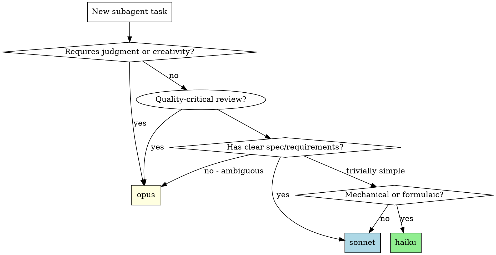

# Dynamic Model Selection

## Overview

Not every task needs your most powerful model. Match model capability to task complexity to optimize cost without sacrificing quality.

**Core principle:** Match model power to task impact. Use opus for tasks where deeper reasoning materially improves outcomes, sonnet for well-defined execution, haiku for mechanical work.

## Model Tiers

| Tier | Model | Strengths | Cost |
|------|-------|-----------|------|
| **Tier 1** | `opus` | Architecture, debugging, complex reasoning, ambiguous specs | Highest |
| **Tier 2** | `sonnet` | Code generation from clear specs, refactoring, reviews | Medium |
| **Tier 3** | `haiku` | File search, formatting, commit messages, simple transforms | Lowest |

## Task Routing Table

### Tier 1: Opus (Deep Reasoning, Quality-Critical)

Use when the task requires judgment, creativity, ambiguity handling, or when quality materially benefits from deeper reasoning.

| Task | Why Opus |
|------|----------|
| Architecture design | Requires trade-off analysis and system thinking |
| Debugging root cause analysis | Needs hypothesis generation and elimination |
| Spec interpretation with ambiguity | Needs nuanced understanding of intent |
| Cross-system refactoring | Must understand ripple effects across codebase |
| Security review | Requires adversarial thinking |
| Plan creation (writing-plans) | Needs deep understanding of project context |
| Brainstorming | Creative exploration of design alternatives |
| Code quality review | Catches subtle issues: hidden coupling, edge cases, architectural drift |
| Implementation with multi-file changes | Cross-file coordination benefits from system-level reasoning |
| Complex spec compliance review | Multi-requirement specs with implicit constraints |

### Tier 2: Sonnet (Clear Spec, Moderate Complexity)

Use when the task is well-defined and scoped, requiring solid execution but not deep reasoning.

| Task | Why Sonnet |
|------|------------|
| Implementing single-file plan tasks | Spec is clear, scope is contained |
| Simple spec compliance review | Comparing code against a short, explicit requirements list |
| Test writing from spec | Requirements are clear, need good test design |
| Refactoring within a file | Scope is contained, patterns are clear |
| Bug fix with known cause | Root cause identified, just needs the fix |

### Tier 3: Haiku (Mechanical/Formulaic Tasks)

Use when the task is repetitive, formulaic, or doesn't require deep reasoning.

| Task | Why Haiku |
|------|-----------|
| File search and exploration | Pattern matching, no reasoning needed |
| Commit message generation | Formulaic output from diff |
| Code formatting / linting fixes | Mechanical transformations |
| Simple rename refactors | Search and replace with validation |
| Generating boilerplate | Template-based output |
| Running and reporting test results | Execute and summarize |
| Documentation from existing code | Describe what's already written |

## Decision Flowchart



**Quick decision rule:**
1. Ambiguous, creative, multi-system, or quality-critical review? → **opus**
2. Clear spec, single-file scope, straightforward execution? → **sonnet**
3. Could a script do it? → **haiku**

## How to Apply

### In Agent Tool Calls

When dispatching subagents, set the `model` parameter:

```typescript
// Complex debugging - needs opus
Agent(subagent_type: "general-purpose", model: "opus",
  description: "Debug race condition in auth flow",
  prompt: "Investigate the intermittent auth failure...")

// Implementation from clear plan - sonnet is sufficient
Agent(subagent_type: "general-purpose", model: "sonnet",
  description: "Implement Task 3: Add user validation",
  prompt: "You are implementing Task 3...")

// File search and report - haiku handles this fine
Agent(subagent_type: "Explore", model: "haiku",
  description: "Find all auth-related files",
  prompt: "List all files related to authentication...")
```

### In Subagent-Driven Development

When executing a plan with subagent-driven-development:

| Subagent Role | Default Model | Escalation | Rationale |
|---------------|---------------|------------|-----------|
| Implementer | `sonnet` | → `opus` for multi-file, new subsystem, ambiguous spec | Clear single-file spec needs solid coding; multi-file needs system reasoning |
| Spec reviewer | `sonnet` | → `opus` for complex multi-requirement specs | Simple comparisons are well-defined; complex specs have implicit constraints |
| Code quality reviewer | `opus` | — | Quality review benefits from deeper reasoning about coupling, edge cases, architectural drift |
| Final cross-cutting reviewer | `opus` | — | Needs to see system-wide interactions |

### In Parallel Agent Dispatch

When dispatching parallel agents:

```typescript
// Mix models based on each task's complexity
Agent(model: "sonnet", prompt: "Fix test timing in abort.test.ts...")  // Known issue
Agent(model: "opus", prompt: "Debug flaky race condition...")           // Unknown root cause
Agent(model: "haiku", prompt: "Update import paths in 5 files...")     // Mechanical
```

## Cost Impact

Typical subagent-driven-development session (5 tasks):

| Without model selection | With model selection |
|------------------------|---------------------|
| 5x implementer (opus) | 5x implementer (sonnet) |
| 5x spec reviewer (opus) | 5x spec reviewer (sonnet) |
| 5x quality reviewer (opus) | 5x quality reviewer (opus) |
| 1x final reviewer (opus) | 1x final reviewer (opus) |
| **16 opus calls** | **10 sonnet + 6 opus** |

This balances cost savings (~40% reduction) with quality — opus handles all review and reasoning tasks where its deeper analysis adds real value, while sonnet handles well-scoped implementation and simple spec checks.

## When to Escalate

Start with the recommended tier, but escalate if:

- **haiku → sonnet:** Task turns out more complex than expected, haiku produces low-quality output
- **sonnet → opus (implementer):** Multi-file changes, new subsystem creation, ambiguous spec, architectural decisions not covered in spec, or unexpected complexity
- **sonnet → opus (spec reviewer):** Complex multi-requirement spec with implicit constraints or cross-cutting concerns
- **Any tier:** Subagent asks questions that suggest the task needs more reasoning power

## Red Flags

**Never use haiku for:**
- Tasks with ambiguous requirements
- Debugging unknown issues
- Architecture or design decisions
- Security-sensitive code review

**Never use opus for:**
- Simple file searches or grep operations
- Commit message generation
- Boilerplate code generation
- Running commands and reporting output

## Integration

This skill integrates with:
- **superpowers:dispatching-parallel-agents** - Set model per agent based on task complexity
- **superpowers:subagent-driven-development** - Set model per subagent role
- **superpowers:executing-plans** - Choose model based on task in current batch
