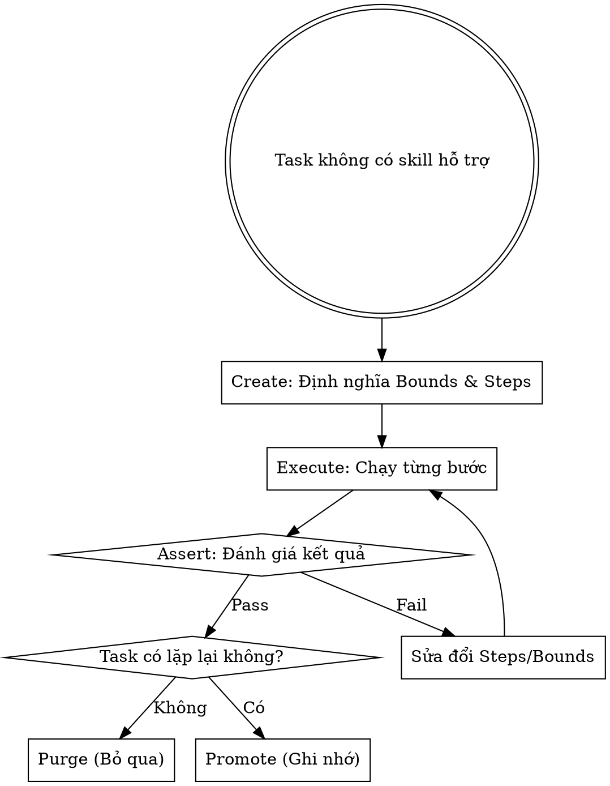

# Dynamic Skill Synthesis (Bộ Kỹ Năng Siêu Thích Ứng)

Khi một task nằm ngoài phạm vi quản lý của các skill hiện có, Agent **TUYỆT ĐỐI KHÔNG** được trả lời chung chung hoặc xử lý sơ sài. Thay vào đó, Agent phải kích hoạt quy trình này để tự thiết kế một Kỹ năng tạm thời (Ephemeral Skill) ngay trong tâm trí.

## Vòng Đời Của Ephemeral Skill (Skill Lifecycle)

Mỗi khi tạo một Ephemeral Skill, Agent phải tuần tự đi qua 4 giai đoạn sau:

### 1. Create (Tạo kỹ năng)
Định nghĩa một `EphemeralSkill` rõ ràng trong tâm trí trước khi thực hiện bất cứ hành động nào:
*   **Mục tiêu (Goal):** Xác định chính xác kết quả đầu ra cần đạt được.
*   **Micro-prompts / System Bounds:** Đặt ra các quy tắc nghiêm ngặt mà kỹ năng này phải tuân theo (VD: format dữ liệu, giới hạn API, ngôn ngữ lập trình).
*   **Quy trình (Step-by-step):** Viết ra 3-5 bước hành động cụ thể để giải quyết task.

### 2. Execute (Thực thi)
Bắt đầu hành động dựa trên quy trình vừa tạo:
*   Sử dụng các công cụ sẵn có (bash, read, write...) tuân thủ chặt chẽ các giới hạn (bounds) đã được định nghĩa ở bước Create.

### 3. Assert (Kiểm chứng - Assertion Unit)
Đây là bước bắt buộc để đảm bảo chất lượng:
*   Tự thiết kế một "Test Case" hoặc "Assertion Unit" trong tâm trí.
*   Kiểm tra kết quả sinh ra: *Kết quả này có vi phạm System Bounds không? Đầu ra có khớp với Mục tiêu ban đầu không?*
*   Nếu thất bại, Agent phải quay lại bước 1 hoặc 2 để tinh chỉnh kỹ năng/thực thi lại.

### 4. Save/Purge (Bảo lưu hoặc Hủy bỏ)
*   **Purge (Mặc định):** Nếu kỹ năng này chỉ phục vụ một task dùng một lần, hãy xóa nó khỏi bộ nhớ làm việc ngay sau khi hoàn thành để tiết kiệm Context Window.
*   **Promote/Save:** Nếu nhận thấy task này có xu hướng lặp lại nhiều lần trong session hiện tại, hãy "Promote" (nâng cấp) nó bằng cách lưu lại quy trình này vào Memory (sử dụng công cụ `initiate_memory_recording` nếu có) để tái sử dụng mà không cần phải Create lại.

---

## Luồng thực thi (Mental Model)

