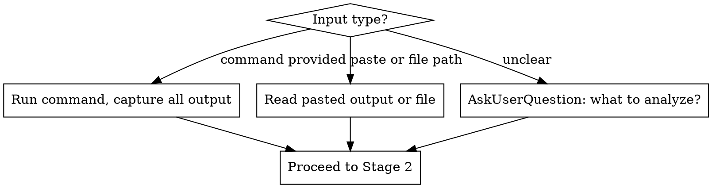

# Error Forensics

## Overview

Accept any error artifact, investigate it forensically, and produce a structured report with root cause, evidence, and a proposed fix. Offer to apply the fix when confidence warrants it.

**Core principle:** Evidence first, root cause second, fix third — always ask before applying.

## When to Use

Use when you have any of:
- A command that's failing (test run, build, startup, deploy)
- A stack trace or exception output
- A log file or pasted error output
- A process that exits with a non-zero code

**Do NOT use when:**
- The user has already identified root cause and just wants implementation
- The error is trivially obvious from a single line (typo, missing file named explicitly) — note: a SyntaxError with a line number is NOT trivially obvious; the cause (extra brace, missing bracket, multi-line expression) requires file inspection

## The Four Stages

### Stage 1: Collect Artifact

Determine what to analyze:



**When running commands:** Capture stdout, stderr, and exit code. Only run read-only diagnostic commands. Never run commands that write files, install packages, or modify state.

### Stage 2: Analyze

1. **Parse error signals:** exception types, failed assertions, exit codes, stack traces, missing symbols, config errors, missing dependencies, permission issues, network failures
2. **Identify affected component:** which file, service, module, layer, or dependency is the origin
3. **Trace to root cause:** follow the stack or error chain to its source — not the symptom, the origin

**If evidence is insufficient after the initial artifact:**
- Propose up to 2 targeted follow-up read-only diagnostic commands (e.g., `env | grep <var>`, `which <tool>`, `cat <config>`, `pip show <pkg>`)
- Use `AskUserQuestion` to get permission before running them:

```
"I need more information to diagnose this. Can I run these commands?"
Options:
  - Yes, run them
  - No, I'll provide the information
```

**If scenario is complex or multi-system:**
- Invoke `superpowers:brainstorming` for structured clarification before proceeding

**Determine confidence:**

| Confidence | Criteria |
|-----------|----------|
| **High** | Evidence directly points to one clear root cause. Fix is unambiguous. |
| **Medium** | Strong evidence but one or more assumptions required. Fix is probable. |
| **Low** | Evidence is indirect or ambiguous. Multiple possible root causes. |

**If confidence is Low:** Use `AskUserQuestion` to ask clarifying questions before proposing a fix.

### Stage 3: Report

Always produce this structured report, regardless of confidence:

```
## Error Forensics Report

**Artifact:** [command run or description of pasted output]
**Severity:** Critical / High / Medium / Low
**Confidence:** High / Medium / Low

### Root Cause
[1-3 sentences: what went wrong and why — be specific]

### Evidence
- [Exact log line, stack frame, exit code, or assertion that proves it]
- [Additional evidence if present]

### Affected Component
[Specific file path, service name, dependency, or system layer]

### Proposed Fix
[Concrete, specific fix: exact code change, config value, command, or setting]
[Medium confidence: note what assumption the fix rests on]

### Diagnostic Trail
[Only if follow-up commands were run: what was run and what it revealed]
[Omit section entirely if no follow-up commands were needed]
```

### Stage 4: Offer to Apply

**After the report:**

| Confidence | Action |
|-----------|--------|
| High | Use `AskUserQuestion`: "Should I apply this fix?" |
| Medium | Use `AskUserQuestion`: "Should I apply this fix? (Note: [state the assumption])" |
| Low | Do NOT offer to apply. Ask clarifying questions instead. |

**AskUserQuestion options:**
> If `AskUserQuestion` is unavailable (e.g., subagent context), ask via plain text with the same options listed explicitly.
- Apply now
- Show me the exact changes first
- Skip — I'll handle it

**If "Apply now":** Apply the fix. Then use `superpowers:verification-before-completion` to verify the issue is resolved before claiming success.

**If "Show me the exact changes first":** Show the diff or exact code change. Re-ask with the same three options.

**If "Skip":** Stop. The report is the deliverable.

## Red Flags — Stop and Reconsider

- Proposing a fix before completing the report
- Applying any change without using `AskUserQuestion` first
- Running commands that write to disk or install packages during investigation
- Claiming confidence is High when evidence is indirect or assumes anything
- Offering to apply when confidence is Low
- Skipping the structured report for "obvious" errors
- Calling confidence Medium or High when the only evidence is an exit code or single ambiguous signal
- Fixing the symptom (the line that threw) instead of the root cause (why it threw)

## Common Mistakes

| Mistake | Correct behavior |
|---------|-----------------|
| "Clearly the issue is X, let me fix it" | Always produce report first, always ask before applying |
| Running `npm install` to "just check" | Only read-only commands during investigation |
| High confidence from a single stack frame | Trace to origin; a stack frame is a symptom |
| Proposing fix when confidence is Low | Ask clarifying questions first |
| Inflating confidence to Medium/High when evidence is minimal (e.g., only an exit code) | Label confidence honestly as Low and ask clarifying questions |
| Skipping Diagnostic Trail section | Omit only if truly no follow-up commands ran |

## Integration

- **`superpowers:systematic-debugging`** — Use that skill when the developer wants to drive their own investigation. Use `error-forensics` when you have an artifact and want a forensic report with a proposed fix.
- **`superpowers:verification-before-completion`** — Required after applying any fix. Must verify the error is resolved before claiming success.
- **`superpowers:brainstorming`** — Invoke for complex multi-system scenarios where structured clarification is needed before analysis.
