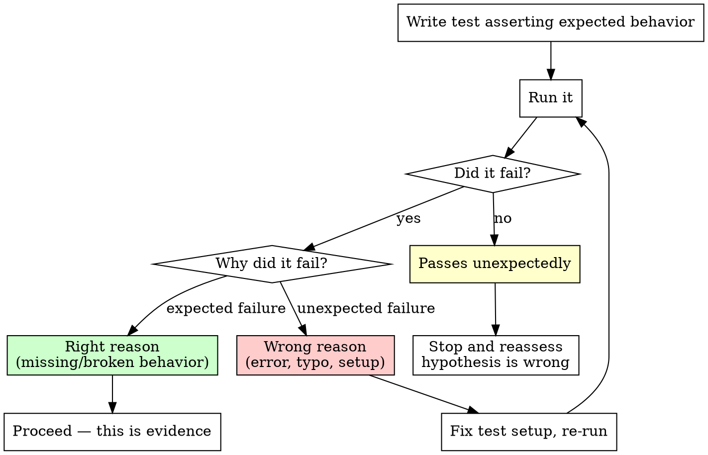

# Evidence-Driven Testing

## Overview

A test that passes immediately proves nothing. A test that fails for the wrong reason proves nothing. Only a test that fails for the exact reason you predicted is evidence.

**Core principle:** Write test. Watch it fail. Confirm it fails for the RIGHT REASON. Only then proceed.

**Violating the letter of this process is violating the spirit of testing.**

## The Iron Law

```
NO PROCEEDING WITHOUT CONFIRMING THE FAILURE REASON
```

A failing test is not evidence until you've confirmed WHY it fails.

## The Discipline



### Step 1: Write a Test That Asserts Expected Behavior

State what SHOULD happen, not what currently happens.

- For a bug: assert the correct behavior (the test will fail because the bug exists)
- For a hypothesis: assert what would be true IF your hypothesis is correct
- For a feature: assert the desired behavior (the test will fail because the feature doesn't exist yet)

### Step 2: Run It and Confirm It Fails

Execute the test. It must fail.

**If it passes:** Your assumption is wrong. Either:
- The bug doesn't exist where you think it does
- The hypothesis is incorrect
- The behavior already exists

**STOP and reassess.** Do not proceed. A passing test at this stage is not a success — it means you're testing the wrong thing.

### Step 3: Confirm It Fails for the RIGHT REASON

This is the critical step most people skip. Read the failure output:

**Right reasons (proceed):**
- Expected value doesn't match actual value (behavior is wrong/missing)
- Function returns incorrect result
- Expected error not raised
- Assertion on specific behavior fails

**Wrong reasons (fix and re-run):**
- Import error / module not found
- Syntax error in test
- Test setup fails (fixture, database, file not found)
- Timeout (environment issue, not behavior)
- Wrong test file/function targeted

A test that errors is not a test that fails. Fix the error, re-run, get a proper failure.

### Step 4: Proceed With Evidence

You now have a test that:
- Asserts specific expected behavior
- Fails because that behavior is missing or broken
- Fails for a reason you understand and predicted

This is evidence. What you do next depends on your commitment level.

## Commitment Levels

This skill does not dictate what happens to the test after it serves as evidence. The calling skill decides:

| Context | Commitment | After evidence is gathered |
|---------|-----------|---------------------------|
| **Investigating a hypothesis** | Scratch | Test may be discarded if hypothesis is disproven. Confirmed tests survive as reproduction evidence. |
| **Fixing a confirmed bug** | Promoted | Triage's confirmed scratch test gets promoted to a permanent unit test. Confirm it still fails before fixing (baseline). |
| **Implementing a feature** | Permanent | Test is the spec. Written to stay. |

The discipline is identical at every level. What varies is lifecycle.

## Anti-Patterns

| Pattern | Problem |
|---------|---------|
| "Test fails, good enough" | Didn't check WHY it fails |
| "Test errors out, close enough" | Error ≠ failure. Fix the error. |
| "Test passes, I'll adjust it" | You're testing the wrong thing. Reassess. |
| "I'll check the failure reason later" | Later never comes. Check now. |
| "The failure message is long, skip it" | The message IS the evidence. Read it. |
| Writing test after the fix/implementation | You can't confirm the failure reason retroactively |

## Red Flags — STOP

- Proceeding after a test passes unexpectedly
- Treating an error as a failure
- Not reading the failure output
- Assuming the failure reason without checking
- Skipping "Step 3" because "it obviously fails for the right reason"

**All of these mean: you don't have evidence. Go back to Step 2.**

## Integration

**Referenced by:**
- **superpowers:bug-triage** — at scratch commitment level for hypothesis testing
- **superpowers:bug-fix** — at promoted commitment level for reproduction baseline
- **superpowers:test-driven-development** — at permanent commitment level for feature specs

**Complements:**
- **superpowers:systematic-debugging** Phase 4 — "create failing test case" uses this as the detailed how
- **superpowers:verification-before-completion** — verifies the test passes AFTER the fix/implementation
