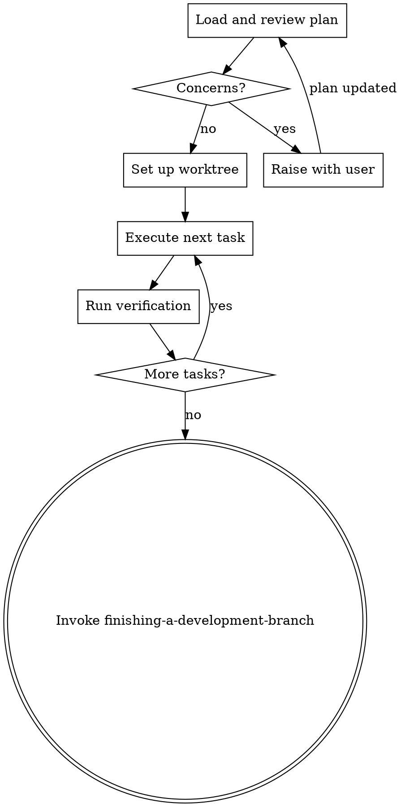

# Executing Plans

Implement an approved plan in controlled batches with explicit verification.

## Required Start

Announce: `I'm using the executing-plans skill to implement this plan.`

Load plan, review critically, execute all tasks, report when complete.

## Process

**Note:** Tell your human partner that Superpowers works much better with access to subagents. The quality of its work will be significantly higher if run on a platform with subagent support (such as Claude Code or Codex). If subagents are available, use superpowers:subagent-driven-development instead of this skill.

## The Process

### Step 1: Load and Review Plan
1. Read the plan completely.
2. Review critically — identify any questions or concerns.
3. If concerns: raise them with the user before starting.
4. If no concerns: create task tracking and proceed.

### Step 2: Set Up Workspace
If working on main/master branch AND the plan involves code changes:
- Set up isolated workspace via `using-git-worktrees`.

If already on a feature branch, or the plan is documentation/config only:
- Skip worktree setup. Confirm with user that the current branch is appropriate.

### Step 3: Execute Tasks
For each task:
1. Follow each step exactly (plan has bite-sized steps with checkboxes).
2. Run verifications as specified.
3. Mark task complete.
4. For tasks involving UI/UX or frontend implementation, apply guidance from `frontend-design`.
5. For tasks involving React/Next.js code, apply `vercel-react-best-practices` for performance optimization.

**Note:** Superpowers works significantly better with subagent support. If subagents are available, use `subagent-driven-development` instead — the quality of work will be higher with fresh-context-per-task and two-stage review gates.

## Engineering Rigor for Complex Tasks

When a task is architectural, high-risk, or touches cross-module boundaries:
- Validate the approach against requirements and constraints before coding.
- Identify edge cases and error paths specific to this task.
- Consider simpler architectures or alternative approaches.
- Ensure changes remain maintainable and don't create hidden coupling.
- If 2 implementation attempts fail, pause and reassess the approach rather than forcing a third attempt.

## Execution Rules

- Do not skip plan steps unless user approves deviation.
- Never start implementation on main/master branch without explicit user consent — ensure isolated workspace is ready first.
- Keep edits scoped to the current task.
- Do not claim completion without fresh command output.

**Stop immediately and ask for clarification — never guess — when:**
- A dependency is missing or unavailable.
- The plan has a critical gap that prevents starting.
- An instruction is unclear or contradictory.
- Verification fails repeatedly (2+ attempts).

## Context Hygiene

For each task, keep only:
- Current task details
- Constraints
- Relevant prior decisions
- Verification evidence

Do not carry long historical summaries. Never forward full session history to subagents — construct their prompts from scratch with only the items above.

## Completion

After all tasks pass verification:
1. Announce `finishing-a-development-branch`.
2. Invoke `finishing-a-development-branch`.

## Remember
- Review plan critically first
- Follow plan steps exactly
- Don't skip verifications
- Reference skills when plan says to
- Stop when blocked, don't guess
- Never start implementation on main/master branch without explicit user consent

## Integration

**Required workflow skills:**
- **superpowers:using-git-worktrees** - Ensures isolated workspace (creates one or verifies existing)
- **superpowers:writing-plans** - Creates the plan this skill executes
- **superpowers:finishing-a-development-branch** - Complete development after all tasks
