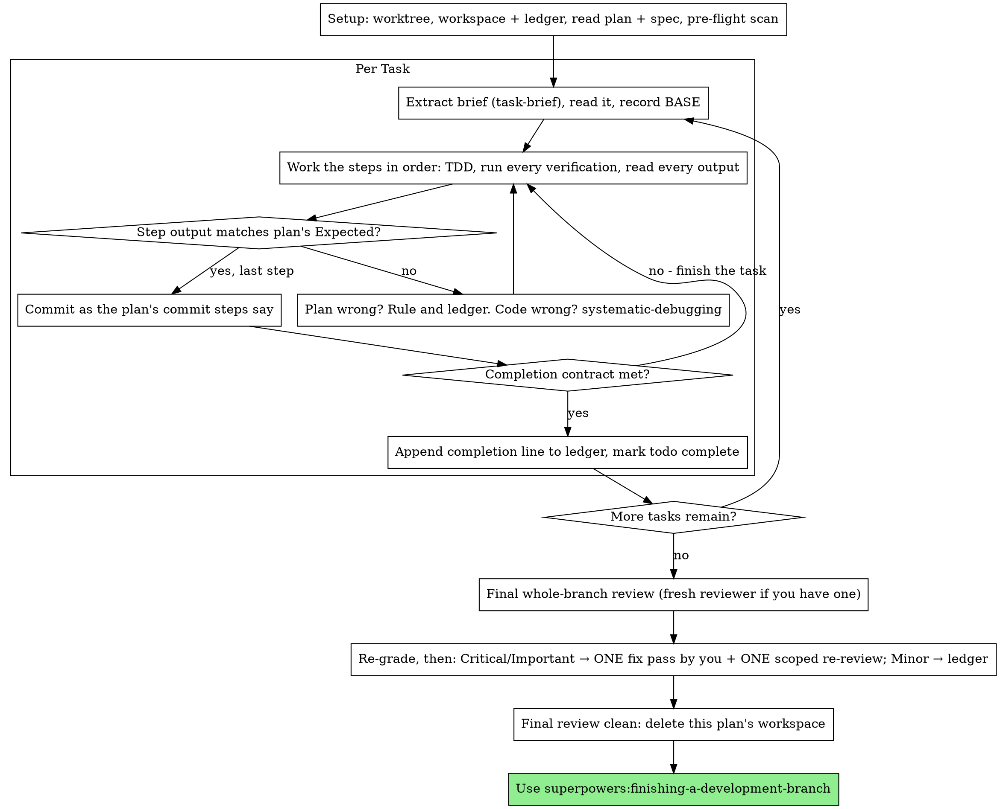

# Executing Plans

Execute the plan yourself, task by task, in this session: no implementer
subagent per task, no reviewer per task. One fresh-context review of the
whole branch at the end.

**Why inline:** Subagent-driven development pays for a fresh implementer
and a fresh reviewer on every task, each re-reading the codebase from zero.
Inline execution pays for one context (yours) plus one reviewer at the end.
What it gives up is a fresh context per task and a second pair of eyes per
task. This skill keeps what those two things bought, by other means: the
brief is the spec, the ledger is your memory, TDD is the per-task gate, and
the final reviewer is the second pair of eyes.

**Core principle:** The plan already did the thinking. Execute it exactly,
prove each step with a test you watched fail and then pass, and leave a
record that survives your own forgetting.

**Narration:** between tool calls, narrate at most one short line — the
ledger and the tool results carry the record.

**Continuous execution:** Do not pause to check in with your human partner
between tasks. They chose inline execution to spend less, not to answer
"should I continue?" after every task. Execute all tasks from the plan
without stopping.

**Rulings, not stalls.** Conflicts, ambiguities, plan defects — decide them.
The spec is the binding authority, the plan is its argument, and your
judgment settles what neither answers. Record every decision in the ledger
as `Ruling: <what you decided> — <why> — <what it costs if wrong>`, and keep
going. Deviating from the plan without a ledgered ruling is a decision made
in secret.

Four things stop you, and only these: an irreversible or destructive
operation; a security-sensitive action; a side effect outside this worktree
that norms say you ask about first (a merge, a push to a shared branch, a
publish); and a plan so broken that every path forward is a guess. For
those, stop and ask.

## When to Use

- You have a plan from superpowers:writing-plans and your human partner
  chose inline execution at the handoff.
- Your harness has no subagent tool (see the per-platform references in
  `../using-superpowers/references/`). Never fabricate a dispatch; run
  the plan here.
- Tasks are mostly independent — the same precondition as
  superpowers:subagent-driven-development.

Prefer superpowers:subagent-driven-development when your human partner
wants a review gate on every task, or when the plan is long enough that
its later tasks would run on a compacted context. Inline execution over a
long plan still works — the ledger is what makes it recoverable — but the
last tasks get the least of you.

## The Process


```dot
digraph process {
    rankdir=TB;

    subgraph cluster_per_task {
        label="Per Task";
        "Extract brief (task-brief), read it, record BASE" [shape=box];
        "Work the steps in order: TDD, run every verification, read every output" [shape=box];
        "Step output matches plan's Expected?" [shape=diamond];
        "Plan wrong? Rule and ledger. Code wrong? systematic-debugging" [shape=box];
        "Commit as the plan's commit steps say" [shape=box];
        "Completion contract met?" [shape=diamond];
        "Append completion line to ledger, mark todo complete" [shape=box];
    }

    "Setup: worktree, workspace + ledger, read plan + spec, pre-flight scan" [shape=box];
    "More tasks remain?" [shape=diamond];
    "Final whole-branch review (fresh reviewer if you have one)" [shape=box];
    "Re-grade, then: Critical/Important → ONE fix pass by you + ONE scoped re-review; Minor → ledger" [shape=box];
    "Final review clean: delete this plan's workspace" [shape=box];
    "Use superpowers:finishing-a-development-branch" [shape=box style=filled fillcolor=lightgreen];

    "Setup: worktree, workspace + ledger, read plan + spec, pre-flight scan" -> "Extract brief (task-brief), read it, record BASE";
    "Extract brief (task-brief), read it, record BASE" -> "Work the steps in order: TDD, run every verification, read every output";
    "Work the steps in order: TDD, run every verification, read every output" -> "Step output matches plan's Expected?";
    "Step output matches plan's Expected?" -> "Plan wrong? Rule and ledger. Code wrong? systematic-debugging" [label="no"];
    "Plan wrong? Rule and ledger. Code wrong? systematic-debugging" -> "Work the steps in order: TDD, run every verification, read every output";
    "Step output matches plan's Expected?" -> "Commit as the plan's commit steps say" [label="yes, last step"];
    "Commit as the plan's commit steps say" -> "Completion contract met?";
    "Completion contract met?" -> "Work the steps in order: TDD, run every verification, read every output" [label="no - finish the task"];
    "Completion contract met?" -> "Append completion line to ledger, mark todo complete" [label="yes"];
    "Append completion line to ledger, mark todo complete" -> "More tasks remain?";
    "More tasks remain?" -> "Extract brief (task-brief), read it, record BASE" [label="yes"];
    "More tasks remain?" -> "Final whole-branch review (fresh reviewer if you have one)" [label="no"];
    "Final whole-branch review (fresh reviewer if you have one)" -> "Re-grade, then: Critical/Important → ONE fix pass by you + ONE scoped re-review; Minor → ledger";
    "Re-grade, then: Critical/Important → ONE fix pass by you + ONE scoped re-review; Minor → ledger" -> "Final review clean: delete this plan's workspace";
    "Final review clean: delete this plan's workspace" -> "Use superpowers:finishing-a-development-branch";
}
```

## Setup

Ensure the work happens in an isolated workspace: use
superpowers:using-git-worktrees to create one or verify the existing one.
Never start implementation on a main/master branch without your human
partner's explicit consent.

Conversation memory does not survive compaction. An inline executor that
loses its place re-implements tasks whose commits already exist — the same
failure as a controller re-dispatching them, paid for in your own context.
Track progress in a ledger file, not only in todos. Harness todos are a
live view; the ledger is the record.

The workspace and ledger are shared with superpowers:subagent-driven-development
— same directory, same format — so a plan can change executors mid-flight
and the new one resumes from the same ledger.

- Each plan owns a workspace: at skill start, run
  `../subagent-driven-development/scripts/sdd-workspace PLAN_FILE` — it
  prints the plan's git-ignored directory
  (`<repo-root>/.superpowers/sdd/<plan-basename>/`), home to every
  artifact for THIS plan: ledger, briefs, review packages. Another plan's
  directory is never yours to read or write.
- Check for this plan's ledger at `<workspace>/progress.md`. If its first
  line names your plan file, tasks with a `Task <N>: complete` line are
  DONE — do not redo them; resume at the first task without one. Their
  commits exist in git even when your context no longer remembers making
  them: after compaction, trust the ledger and `git log` over your own
  recollection. A ledger whose first line names a different plan file is
  another plan's progress: leave it and start your own, fresh.
- Create the ledger with its identity as the first line:
  `# SDD ledger — plan: <plan file path>`.
- `git clean -fdx` will destroy the workspace (it's git-ignored scratch);
  if that happens, recover from `git log`.

Read the plan once, note its context and Global Constraints, and create a
todo per task. If the plan names a Spec, read that too: the spec is the
authority the plan argues from, and conflicts inside the plan resolve
against it. A plan with no reachable spec gets a ledger note saying so —
rulings made without one are provisional.

**REQUIRED SUB-SKILL:** load superpowers:test-driven-development now,
before Task 1. It governs every step of every task below; a plan whose
steps already say "write the failing test first" does not exempt you
from reading it.

Before Task 1, scan the plan once for conflicts, writing down what you
checked as you check it: tasks that contradict each other or the plan's
Global Constraints, and anything the plan mandates that a reviewer would
call a defect (a test that asserts nothing, verbatim duplication of a
logic block). The scan's output is a table, not a verdict: one row per
pair of tasks that share a file or an interface (what one produces against
what the other consumes, and what you found), and one row per task (does
its own text agree with itself — the tests it specifies against the code
it specifies). "The scan is clean" without those rows is not a scan you
ran. Write the table to the ledger, rule on each conflict it surfaces with
the spec as the binding authority, record each ruling beside its row, and
start Task 1.

## The Task Loop

Everything you print, and every tool result, stays resident in your
context for the rest of the session. Redirect long test output to a file
in the workspace and read its tail; read a brief, not the whole plan.

### 1. Take the task

- Run `../subagent-driven-development/scripts/task-brief PLAN_FILE N` and
  read the brief file it prints. Read the brief for every task, including
  ones you remember from setup: what you remember is a summary, the brief
  has the exact values, signatures, and test cases.
- Record BASE (`git rev-parse HEAD`). The final review package and any
  mid-plan diff you need are cut from it.
- Mark the task's todo in_progress.

### 2. Work the steps

The plan's steps are already in RED-GREEN order; follow them in that
order under superpowers:test-driven-development, loaded at setup. A test
step's code is written first and run first. Watching it fail is a step,
not a formality — a test that passes before the implementation exists is
a finding about the test.

Every step that runs a command has an `Expected:` line. Run the command,
read its output, and compare. Three outcomes:

- **Matches.** Next step.
- **The code is wrong.** Use superpowers:systematic-debugging. Find the
  cause; never patch the symptom to make the step's output match.
- **The plan is wrong** — a step contradicts the spec, an interface from an
  earlier task doesn't match what this task consumes, a command that
  cannot work. Rule on the smallest change that satisfies the spec, ledger
  it as `Task <N>: Ruling: <finding> — <what you decided and why>`, and
  continue. The ruling is carried, not remembered: later tasks that touch
  the same interface read it from the ledger.

Commit as the plan's commit steps say. A task that spans several commits
is fine; BASE is what the review range is cut from, never `HEAD~1`.

### 3. The completion contract

Before a task's ledger line, all of the following are true, with evidence
in this session — not inferred from the diff looking right:

- Every test the brief names exists and ran in this task, and you read
  the output.
- The final test run for the task passed, and its command and result go
  in the ledger line.
- Every `Expected:` line in the brief was compared against real output.
- Every deviation from the brief has a `Ruling:` line in the ledger.

**REQUIRED SUB-SKILL:** superpowers:verification-before-completion governs
the claim. If any item is missing, the task is not complete: finish it.

### 4. Complete the task

Append the completion line to the ledger in the same message as your
other bookkeeping:

`Task <N>: complete (commits <base7>..<head7>, tests: <command> → <result>)`

Then mark the todo complete and take the next task. Never take the next
task while this one's contract is unmet.

## Final Review

Run `../subagent-driven-development/scripts/review-package PLAN_FILE MERGE_BASE HEAD`
(MERGE_BASE = the commit the branch started from, e.g.
`git merge-base main HEAD`) and review from the file it prints.

**With a subagent tool:** dispatch the reviewer on the most capable
available model — the whole-branch review is a judgment task — using
superpowers:requesting-code-review's
[code-reviewer.md](../requesting-code-review/code-reviewer.md), with the
package path, the plan and spec paths, and a pointer to the ledger's
`Ruling:` lines so it can weigh the calls you made. Specify the model
explicitly; an omitted model inherits the session's, which may not be the
most capable. This is the one fresh context the whole run buys. Do not
skip it, and do not replace it with your own read of the diff.

**Without a subagent tool:** read code-reviewer.md and perform that review
yourself against the package, as a separate pass after the last task's
ledger line. Write `Final review: self-review (no subagent tool)` to the
ledger, and say so in your final message: a self-review by the author is
weaker than a fresh reviewer, and your human partner decides whether that
is enough before merge.

Sort the findings before you act on any of them. The reviewer's severity
labels are advice; the gate is yours. Re-grade first: a finding labeled
Minor that describes an unhandled exception, a traceback reaching the
user, data loss, or a wrong result on valid input is Important, whatever
the label says — reviewers have filed crashes as Minor because the spec
did not mention the input that triggers them. Then:

- **Critical and Important** enter the fix pass.
- **Minor** goes to the ledger as `Final: minor (deferred): <one-liner>`
  and to your final message under "Deferred minors". Minors never enter
  the fix pass, and never become rulings — a ruling is a decision about a
  conflict, not a note that you declined a polish suggestion.

Fix the Critical and Important findings yourself — you are the
implementer here — in ONE pass, each fix under TDD, covering tests re-run.
Then run exactly one scoped re-review of the fix range
(`review-package PLAN_FILE FIX_BASE HEAD`, dispatched with
superpowers:subagent-driven-development's
[re-review-prompt.md](../subagent-driven-development/re-review-prompt.md)
on a mid-tier model — the re-review verifies named fixes against a small
diff and does not need the most capable model — or performed yourself
without a subagent tool). Adjudicate residual findings as rulings in the
ledger. There is no second fix pass — residual load-bearing findings
surface to your human partner when finishing-a-development-branch
presents the options.

## Finish

Before you delete anything, collect every ledger line containing
`Ruling:` into your final message under "Rulings I made", in the order you
made them, each with what it costs if wrong, and every `minor (deferred)`
line under "Deferred minors". Both lists are exhaustive. Your final
message is the only place the decisions you took on your human partner's
behalf — and the findings you chose not to act on — reach them.

When the final review is clean and its fixes are committed, delete this
plan's workspace directory — the git history is the record now. Sibling
directories belong to other plans; leave them alone.

Use superpowers:finishing-a-development-branch.

## Common Rationalizations

| Excuse | Reality |
|--------|---------|
| "I remember what Task N says" | You remember a summary. The brief has the exact values. Read it. |
| "The plan's code is right, skip watching the test fail" | A test you never saw fail proves nothing. It is one step. Run it. |
| "I'll run the full suite at the end instead of per step" | Per-step runs are how you learn which step broke it. The end-of-task run is the contract, not a substitute. |
| "The plan is wrong here, I'll just do the right thing" | Do the right thing and ledger the ruling. Unledgered deviation is a decision made in secret. |
| "I'll write the ledger lines after a few tasks" | Compaction does not wait for a convenient moment. One line per task, in the same message as the commit. |
| "Let me check in before the next task" | They chose inline to spend less. Progress prompts spend their time instead. Only the four stops stop you. |
| "I read my own diff carefully; the final reviewer is redundant" | Same author, same blind spots. The reviewer is the only fresh context this run buys. |
| "Tests should pass, the change was trivial" | "Should" is not evidence. The contract requires the command and its output. |
| "Subagents are slow and expensive, I'll skip the final review too" | Inline already removed the per-task reviewers. One review of the whole branch is the floor, not the ceiling. |
| "The reviewer said Minor, so it's Minor" | A traceback is Important whatever the label. Re-grade, then gate. |
| "I'll fix the minors too while I'm in there" | Minors cost a fix pass and a re-review each time. Ledger them; your partner decides. |

## Example Workflow

```
You: I'm using the executing-plans skill to implement this plan inline.

[Setup: worktree verified]
[Read plan once: docs/superpowers/plans/feature-plan.md; spec read]
[Resolve workspace: sdd-workspace docs/superpowers/plans/feature-plan.md — no ledger inside, fresh start]
[Pre-flight scan: 2 shared-interface rows, 4 self-consistency rows, clean; written to ledger]
[Create todos for all tasks]

Task 1: Hook installation script

[task-brief plan 1 → read brief; BASE a1b2c3d]
[Step 1: write failing test — written]
[Step 2: run it — FAIL: install_hook not defined. Matches Expected.]
[Step 3: implement — written]
[Step 4: run it — PASS 1/1. Matches Expected.]
[Step 5: commit — d4e5f6a]
[Contract: tests ran, output read, no deviations]
[Ledger: Task 1: complete (commits a1b2c3d..d4e5f6a, tests: npm test -- hooks → 1/1 pass)]

Task 2: Recovery modes

[task-brief plan 2 → read brief; BASE d4e5f6a]
[Step 2: run failing test — FAIL, but on an import error: Task 1 exported
 installHook, brief consumes install_hook]
[Ruling: brief's consumer name is a typo against Task 1's Produces block;
 use installHook — Ledger: Task 2: Ruling: install_hook → installHook — matches Task 1 Produces — cost if wrong: one rename]
[Steps 2-5 as planned; commit b7c8d9e]
[Ledger: Task 2: complete (commits d4e5f6a..b7c8d9e, tests: npm test -- recovery → 8/8 pass)]

...

[After all tasks: review-package plan MERGE_BASE HEAD; dispatch code-reviewer, most capable model]
Reviewer: One Important finding — progress reporting interval hardcoded.
[Fix pass: extract PROGRESS_INTERVAL under TDD; commit; review-package FIX_BASE HEAD; scoped re-review]
Re-reviewer: ADDRESSED. No new breakage.

Rulings I made:
- Task 2: install_hook → installHook (brief typo; cost if wrong: one rename)

[Delete this plan's workspace — the record now lives in git]

Using superpowers:finishing-a-development-branch.
```
