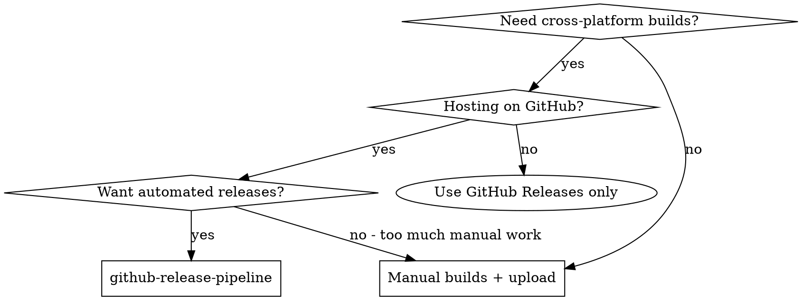

# GitHub Release Pipeline

Automate cross-platform builds and release publishing using gh CLI and GitHub Actions. Supports any project that builds platform-specific binaries (Tauri, Electron, Go, Rust native, etc.).

**Why gh + GitHub Actions:** Zero external services needed. Everything runs on GitHub infrastructure. One `gh release create` triggers builds across all platforms, and artifacts land automatically on the release page.

**Core principle:** Tag triggers workflow, workflow builds and uploads, user downloads from release page. No manual steps after initial setup.

## When to Use



## Prerequisites

- gh CLI installed: `brew install gh` / `winget install GitHub.cli`
- Authenticated: `gh auth login`
- Repository exists: `gh repo create <name> --public`

## Phase 1: Initial Setup

### Step 1: Authenticate gh CLI

```bash
gh auth login
```

Select "GitHub.com" → "HTTPS" → "Login with browser".

Verify:
```bash
gh auth status
```

### Step 2: Create Repository (if needed)

```bash
gh repo create <repo-name> --description "Description" --public
```

### Step 3: Configure Workflow Permissions

Required for the `GITHUB_TOKEN` to upload release assets.

GitHub web UI → Repository → Settings → Actions → General → Workflow permissions → **Read and write**

### Step 4: Create Workflow File

Create `.github/workflows/release.yml` using the template in Phase 2 below.

## Phase 2: Workflow Template

### Cross-Platform Build Matrix

```yaml
name: Release

on:
  release:
    types: [published]

jobs:
  build:
    strategy:
      fail-fast: false
      matrix:
        include:
          - platform: 'windows-latest'
            target: ''
            name: 'app-x64.exe'
            path: 'target/release/app.exe'
          - platform: 'macos-latest'
            target: 'aarch64-apple-darwin'
            name: 'app-aarch64.dmg'
            path: 'target/aarch64-apple-darwin/release/bundle/dmg/*.dmg'
          - platform: 'macos-latest'
            target: 'x86_64-apple-darwin'
            name: 'app-x64.dmg'
            path: 'target/x86_64-apple-darwin/release/bundle/dmg/*.dmg'
          - platform: 'ubuntu-22.04'
            target: ''
            name: 'app-x64.AppImage'
            path: 'target/release/bundle/appimage/*.AppImage'

    runs-on: ${{ matrix.platform }}

    steps:
      - uses: actions/checkout@v4

      - name: Setup Node.js
        uses: actions/setup-node@v4
        with:
          node-version: 20

      - name: Install Rust
        uses: dtolnay/rust-toolchain@stable
        with:
          targets: ${{ matrix.target }}

      - name: Install Linux dependencies
        if: matrix.platform == 'ubuntu-22.04'
        run: |
          sudo apt-get update
          sudo apt-get install -y libwebkit2gtk-4.1-dev libappindicator3-dev librsvg2-dev patchelf

      - name: Install dependencies
        run: npm install

      - name: Build (Windows)
        if: matrix.platform == 'windows-latest'
        run: npm run build

      - name: Build (macOS)
        if: matrix.platform == 'macos-latest'
        run: npm run build -- --target ${{ matrix.target }}

      - name: Build (Linux)
        if: matrix.platform == 'ubuntu-22.04'
        run: npm run build -- --bundles appimage

      - name: Upload release asset
        uses: softprops/action-gh-release@v2
        with:
          files: ${{ matrix.path }}
          tag_name: ${{ github.ref_name }}
        env:
          GITHUB_TOKEN: ${{ secrets.GITHUB_TOKEN }}
```

### Adapt to Your Project

Replace these values for your project:

| Placeholder | What to set |
|---|---|
| `npm run build` | Your build command (e.g., `npm run tauri build`, `make`, `go build`) |
| `npm run build -- --target ...` | Build with target triple for cross-compilation |
| `npm run build -- --bundles appimage` | Override bundle type for Linux |
| `target/release/app.exe` | Path to your Windows binary |
| `target/*/release/bundle/dmg/*.dmg` | Path to your macOS dmg |
| `target/release/bundle/appimage/*.AppImage` | Path to your Linux AppImage |
| `libwebkit2gtk-4.1-dev ...` | Linux deps for your framework (remove if not needed) |

## Phase 3: Publishing a Release

```bash
# 1. Commit and push your changes
git add . && git commit -m "feat: description" && git push

# 2. Create and push a version tag
git tag v1.0.0 && git push origin v1.0.0

# 3. Create the release (triggers CI)
gh release create v1.0.0 \
  --title "v1.0.0" \
  --notes "## What's New\n- Feature A\n- Feature B\n\n## Downloads\n- Windows: app-x64.exe\n- macOS: app-x64.dmg / app-aarch64.dmg\n- Linux: app-x64.AppImage"

# 4. Monitor build progress
gh run list

# 5. Check build logs if something fails
gh run view <run-id> --log-failed
```

## Troubleshooting

### Issue: "Resource not accessible by integration"

**Symptom:** Release upload fails with `Resource not accessible by integration`

**Cause:** Default `GITHUB_TOKEN` has read-only permissions

**Fix:** Repository → Settings → Actions → General → Workflow permissions → **Read and write**

### Issue: "unexpected argument" on build command

**Symptom:** `npm run build --target aarch64-apple-darwin` fails

**Cause:** `--target` must be passed through `--` to the underlying build tool

**Fix:**
```yaml
run: npm run build -- --target aarch64-apple-darwin
```

### Issue: "--bundle" unrecognized

**Symptom:** `--bundle appimage` fails with `unexpected argument`

**Cause:** CLI uses plural form `--bundles`

**Fix:**
```yaml
run: npm run build -- --bundles appimage
```

### Issue: macOS dmg not in release

**Symptom:** macOS build succeeds but no dmg on release page

**Cause:** Bundle targets not configured in project config

**Fix:** Add `dmg` to your project's bundle targets configuration (e.g., `tauri.conf.json` → `bundle.targets`)

### Issue: Action parameter name changed

**Symptom:** `softprops/action-gh-release` errors on `tag` input

**Cause:** Parameter renamed from `tag` to `tag_name` in v2

**Fix:**
```yaml
with:
  tag_name: ${{ github.ref_name }}
```

### Issue: Workflow not triggering

**Symptom:** Push doesn't start the workflow

**Cause:** Workflow file may be in wrong location or have YAML errors

**Fix:**
- Ensure file is at `.github/workflows/release.yml`
- Validate YAML syntax
- Check workflow is enabled in Repository → Settings → Actions

## Best Practices

1. **Use `fail-fast: false`** in matrix strategy so one platform failure doesn't cancel others
2. **Pin action versions** (`@v4`, `@v2`) to avoid breaking changes
3. **Use `--` separator** when passing flags through npm scripts to underlying tools
4. **Test locally first** with `act` CLI before pushing
5. **Use semantic versioning** for tags: `v1.0.0`, `v1.1.0`, `v2.0.0`
6. **Keep release notes concise** with download instructions per platform
7. **Set `GITHUB_TOKEN` explicitly** in upload step for clarity

## Integration

**Companion skills:**
- **superpowers:writing-plans** - Use when planning the release features before building
- **superpowers:subagent-driven-development** - Use for building individual platform targets in parallel

**Related CLI tools:**
- `gh` - GitHub CLI for repository and release management
- `act` - Run GitHub Actions workflows locally for testing
