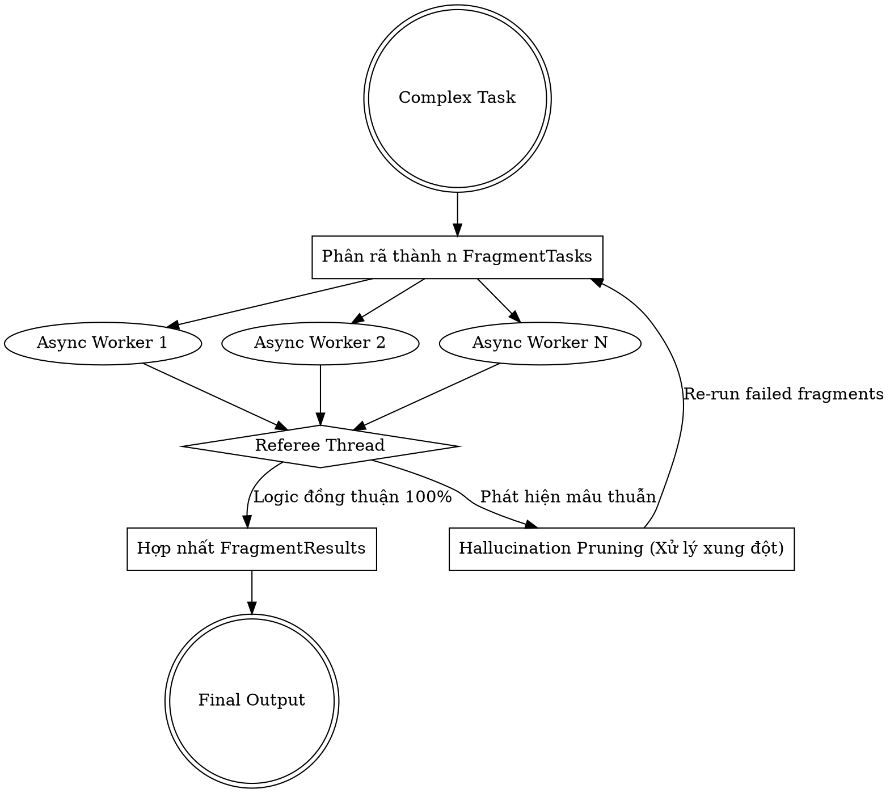

# Hyper-Fragmented Reasoning (Siêu Phân Mảnh Suy Luận)

Cơ chế này được kích hoạt **chỉ khi** task được đánh giá là cực kỳ phức tạp và người dùng đã đồng ý qua câu hỏi: *"Task này phức tạp, bạn có muốn bật cơ chế Siêu phân mảnh suy luận để tăng tối đa độ chính xác không?"*

Mục tiêu cốt lõi của kỹ năng này là bẻ gãy task lớn, xử lý đồng thời, và đối chiếu chéo (Cross-verification) để ép tỷ lệ ảo giác (Hallucination) về 0%.

## Quy Trình 3 Bước

### 1. Atomic Decomposition (Phân rã nguyên tử)
Không giải quyết task nguyên khối. Hãy bẻ gãy nó thành các cấu trúc `FragmentTask` nhỏ nhất có thể.
*   **Cấu trúc `FragmentTask`:**
    *   `ID`: Định danh duy nhất cho sub-task.
    *   `Content`: Nội dung/logic nguyên tử cần giải quyết.
    *   `Priority`: Mức độ ưu tiên để sắp xếp thứ tự thực thi.
    *   `Status`: Pending -> In-Progress -> Completed.

### 2. Async Coordinator Engine (Điều phối xử lý bất đồng bộ)
Trong tư duy của Agent, các `FragmentTask` không phụ thuộc lẫn nhau phải được xử lý cùng một lúc.
*   Hãy tưởng tượng bạn đang mở nhiều luồng (threads/goroutines) để đọc file, tổng hợp dữ liệu hoặc viết test case đồng thời.
*   Kết quả của mỗi thread được đóng gói thành một `FragmentResult` (bao gồm *Data* và *Confidence Score*).

### 3. Referee Thread (Luồng Trọng Tài & Hallucination Pruning)
Đây là bước tối quan trọng. Tuyệt đối không ghép nối trực tiếp các `FragmentResult` để trả về cho người dùng mà chưa qua Trọng tài.
*   **Cross-verification:** Trọng tài (chính là bạn trong vai trò phản biện) phải xem xét các `FragmentResult`.
*   **Conflict Resolution:** Nếu 2 sub-task đưa ra dữ liệu mâu thuẫn (VD: Sub-task 1 nói file A không tồn tại, Sub-task 2 lại cố gắng đọc file A), Trọng tài phải dừng luồng, reject kết quả đó, và khởi tạo lại `FragmentTask` để xác minh lại sự thật (Ground Truth).
*   **Consensus:** Chỉ khi tất cả các `FragmentResult` đạt điểm Confidence tối đa và logic liền mạch, Trọng tài mới hợp nhất chúng lại (Synthesizing) thành kết quả cuối cùng.

---

## Dataflow / Luồng dữ liệu

