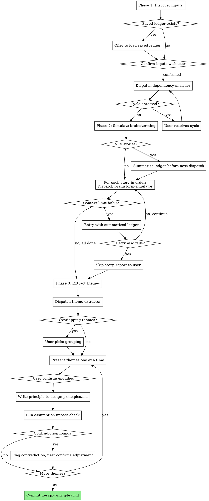

# Identify Design Principles

Surface cross-cutting design decisions across all stories in a project before writing individual specs. Produces a `design-principles.md` file that `write-spec` consumes for autonomous spec generation.

**Core principle:** Ask high-level questions once, apply answers across all stories — don't repeat the same decisions per story.

**Announce at start:** "I'm using the identify-design-principles skill to surface cross-cutting design decisions."

**Harness requirement:** This skill dispatches dependency-analyzer, brainstorm-simulator, and theme-extractor subagents. It requires a platform with subagent support (such as Claude Code or Codex). If subagents are not available, notify the user and stop.

## When to Use

- Starting a multi-story project (PRD + roadmap with 3+ stories)
- Want to reduce repeated decision-making during per-story spec writing
- Have stories across GitHub issues, roadmap files, or standalone files

## When NOT to Use

- Single-story project — just use brainstorming or write-spec directly
- No written stories exist — help the user write them first
- Already have a design-principles.md — use write-spec directly

## The Process

You MUST create a task for each phase step and complete in order.



### Phase 1: Discovery & Dependency Analysis

1. Check for saved ledger at `docs/superpowers/.design-principles-ledger.json`. If found, offer to load: "I found a saved questions ledger from a previous run ({N} questions, {M} stories processed). Load it and continue with remaining stories?"
2. Scan `docs/` for PRD and roadmap files
3. Check for GitHub issues explicitly referenced in those files (e.g., `#12`, `#15`)
4. For label-based discovery, ask the user whether to also search for issues with a specific label rather than guessing
5. Confirm findings with user: "I found PRD at `docs/prd.md` and 8 stories in `docs/roadmap.md`. I also see issues #12, #15, #20 referenced in the roadmap — correct?"
6. User can correct or add additional inputs
7. Dispatch **dependency-analyzer** subagent with all story content + PRD:

```
Agent tool:
  subagent_type: "general-purpose"
  prompt: [use dependency-analyzer-prompt.md template, inject {prd_content}, {stories}]
```

> **Note:** The dependency-analyzer is designed for a lighter-weight model (sonnet-class) and the brainstorm-simulator and theme-extractor are designed for a heavier model (opus-class), but model selection depends on platform capabilities. The Agent/Task tool does not currently support a `model` parameter.

8. If cycle detected: report cycle to user, ask which dependency to drop, re-dispatch analyzer

### Phase 2: Brainstorm Simulation

Dispatch **brainstorm-simulator** subagent iteratively — one dispatch per story in dependency order.

```
For each story in dependency order:
  Agent tool:
    subagent_type: "general-purpose"
    prompt: [use brainstorm-simulator-prompt.md template, inject:
      {prd_content}, {story_content}, {story_id}, {story_source},
      {story_order}, {total_stories}, {story_dependencies},
      {questions_ledger}  ← output from previous dispatch (empty for first story)
    ]
```

The orchestrator carries the questions ledger between dispatches. Each simulator dispatch receives the current ledger and returns an updated ledger.

**Context management for >15 stories:** If story count exceeds 15, summarize the accumulated ledger before passing to the next simulator dispatch. The summary retains: all assumed decisions (question + answer pairs), dependency relationships, and key constraints. It drops: detailed "why it matters" rationale and per-question confidence annotations from already-processed stories.

**Context-limit failure handling:** On a per-story context-limit failure:
1. Retry that single story with a summarized ledger (same summarization strategy as >15 threshold)
2. If retry also fails, skip that story and report it to the user
3. After a context-limit failure triggers summarization, continue using summarized form for all subsequent dispatches (permanent activation)
4. Save the questions ledger collected so far to `docs/superpowers/.design-principles-ledger.json`
5. Report to user which stories were processed and which remain
6. User can re-invoke the skill with remaining stories; on startup, Phase 1 checks for a saved ledger and offers to load it as starting context

**Ledger save/reload:** The orchestrator saves the questions ledger to `docs/superpowers/.design-principles-ledger.json` on context-limit failure. On skill startup (Phase 1), check if this file exists. If it does, offer to the user: "I found a saved questions ledger from a previous run ({N} questions, {M} stories processed). Load it and continue with remaining stories?" On user confirmation, load the ledger and skip already-processed stories. After successful completion of all phases, delete the saved ledger file. The ledger file is intermediate state — add `docs/superpowers/.design-principles-ledger.json` to `.gitignore` if not already present.

### Phase 3: Theme Extraction & User Session

1. Dispatch **theme-extractor** subagent with the complete questions ledger:

```
Agent tool:
  subagent_type: "general-purpose"
  prompt: [use theme-extractor-prompt.md template, inject {questions_ledger}]
```

2. If overlapping themes detected: present to user, ask which grouping or whether to merge
3. Present themes to user one at a time as multiple-choice questions
4. After each user confirmation:
   a. Write that principle to `docs/superpowers/design-principles.md`
   b. Run assumption impact check against existing principles
   c. If contradiction found: flag it, recommend adjustment, user confirms
   d. Impact check is single-pass: if an existing principle is adjusted, re-run impact check on that adjusted principle only (one level of cascade, not recursive)
5. Commit the file after all themes are confirmed

### Assumption Impact Check

When saving a new design principle:
1. Check all existing principles' Assumptions sections
2. If the new decision contradicts or invalidates an assumption, flag it to the user
3. Recommend how to adjust the affected assumption
4. User confirms or modifies
5. If an existing principle was adjusted, re-run impact check on that adjusted principle only (single-pass, one level of cascade)
6. Updated principles are saved together

### design-principles.md File Format

Location: `docs/superpowers/design-principles.md`

```markdown
# Design Principles

> Generated by identify-design-principles on YYYY-MM-DD
> Source: docs/prd.md, docs/roadmap.md

## [Theme Name]

**Decision:** [the what]

**Context:** [which stories drove it, why]

**Assumptions:**
- [what must hold true for this decision to be valid]

**Implications:**
- [what it means for implementation]
```

### Input Formats Supported

Stories can come from:
- **GitHub issues** — referenced by number (e.g., #12, #15), fetched via GitHub MCP tools
- **Sections in a roadmap markdown file** — parsed from headings/structure
- **Standalone local files** — one file per story
- **A mix of all three**

## Error Handling

| Error | Response |
|-------|----------|
| Dependency cycle detected | Report cycle, ask user which dependency to drop, re-run analyzer |
| Brainstorm-simulator context limit (per-story) | Retry with summarized ledger; if retry fails, skip story and report |
| GitHub issue fetch fails | Skip issue, log warning, report during confirmation step |
| Theme-extractor produces overlapping themes | Present overlaps to user, ask which grouping or whether to merge |

## Red Flags

**Never:**
- Skip the dependency analysis phase
- Let brainstorm-simulator modify any files (read-only)
- Proceed to Phase 3 without confirming inputs with user
- Write to design-principles.md without user confirmation per theme
- Skip the assumption impact check after writing a principle
- Run recursive impact checks (single-pass with one cascade level only)

## Remember

- One question at a time during Phase 3 — don't overwhelm the user
- The questions ledger schema is the contract between simulator and extractor
- Context-limit failure permanently activates summarization mode
- Impact check is single-pass: one level of cascade, not recursive
- The orchestrator carries state between subagent dispatches — subagents are stateless
- Save ledger to `docs/superpowers/.design-principles-ledger.json` on context-limit failure; check for saved ledger on startup; delete after successful completion
