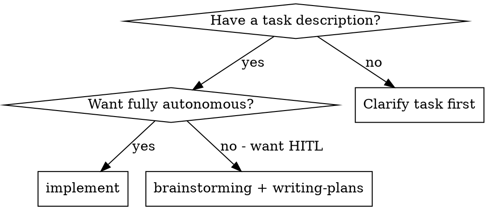
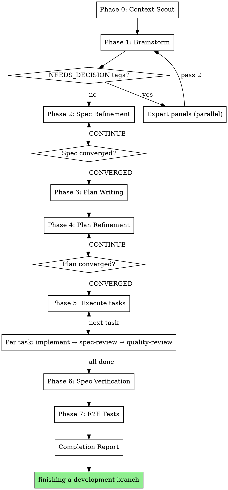

# Autonomous Implementation

Fully autonomous end-to-end implementation pipeline. Takes a task description and runs to completion without user intervention: brainstorm → spec → refine-spec → plan → refine-plan → execute → verify → e2e tests.

**Core principle:** Subagent-everything. Main thread is a lightweight orchestrator. Expert panels replace user input at every decision point.

**Announce at start:** "I'm using the implement skill to autonomously build this end-to-end."

**Autonomy contract:** This skill replaces every user decision point with an expert panel. If you want human-in-the-loop at design, use brainstorming + writing-plans instead.

## When to Use



- Have a task description (natural language, issue URL, story, or file path)
- Want fully autonomous implementation with no interactive prompts
- Trust expert panels to make design decisions

## When NOT to Use

- Need human-in-the-loop for design decisions — use brainstorming + writing-plans instead
- Task is too vague to brainstorm even with expert panels — clarify first
- Need git push, branch, or PR — caller's responsibility after this skill completes
- Need worktree management — caller decides execution context before invoking
- Need interactive user confirmation at any phase — everything here is autonomous

## Prerequisites

**Required:** Task description (natural language, issue URL, story definition, or file path)

**Optional:** PRD reference, existing spec, design-principles.md, specific constraints

If input is ambiguous or too vague, dispatch an expert panel to clarify intent rather than asking the user.

**Harness requirement:** This skill dispatches subagents at every phase (10+ distinct subagent roles). It requires a platform with subagent support (such as Claude Code or Codex). If subagents are not available, notify the user and stop — implement cannot run in single-agent mode.

## Git Policy

The orchestrator owns committing but never pushes. Subagents never touch git.

**Before Phase 1:** Ensure `docs/superpowers/plans/` is in `.gitignore`. If not, add it and commit the `.gitignore` change.

**Commit points:**

| When | What to commit | Message pattern |
|------|---------------|-----------------|
| After Phase 1 (spec produced) | `docs/superpowers/specs/YYYY-MM-DD-<slug>-design.md` | `feat(<slug>): add design spec` |
| After Phase 2 (spec refined) | Updated spec file | `refine(<slug>): spec converged round {N}` |
| After each Phase 5 task | Files from `FILES_TOUCHED` | `feat(<slug>): implement task {N} — {task name}` |
| After Phase 6 fixes | Fixed files | `fix(<slug>): spec verification fixes` |
| After Phase 7 (e2e tests) | Test files | `test(<slug>): add e2e tests` |

**Never commit:**
- Plans (`docs/superpowers/plans/`) — ephemeral working documents, must be gitignored
- Temporary or intermediate files

**Never:**
- Push to remote
- Create branches
- Create PRs or merge

**Subagent git override:** Implementer subagents are told: "Do not make any git operations (commit, branch, push). The orchestrator controls git. Skip any 'Commit your work' steps." The orchestrator commits after each task passes review.

## Resume Detection

On startup, derive canonical slug from task description.

**Slug derivation:** Lowercase the task description, remove stop words (a, an, the, is, for, to, of, in, on, with), kebab-case remaining words, truncate to max 4 words. Example: 'Create an autonomous implementation skill' → 'autonomous-implementation-skill'. The slug is used for all artifact file naming.

Check for existing artifacts:
- Spec file: `docs/superpowers/specs/YYYY-MM-DD-<slug>-design.md` (exact prefix match)
- Plan file: `docs/superpowers/plans/YYYY-MM-DD-<slug>.md` (exact prefix match)
- Implemented code: files referenced in plan that already exist on disk

**Refinement completion markers:** `Refinement: CONVERGED round {N}` in `## Refinement Status` section.

If artifacts exist:
- Spec exists + not refined → resume at Phase 2
- Spec exists + refined → resume at Phase 3
- Plan exists + not refined → resume at Phase 4
- Plan exists + refined → resume at Phase 5
- All tasks in plan completed → resume at Phase 6

## The Process

You MUST create a task for each phase step and complete in order.



### Subagent Hierarchy

```
Main Thread (Orchestrator)
├── Phase 0: Context Scout (subagent)
├── Phase 1: Autonomous Brainstormer (subagent)
│   └── Expert Panel (3 parallel subagents) — answers each decision point
├── Phase 2: Spec Refinement Loop (subagent pair: simulator + fixer)
├── Phase 3: Plan Writer (subagent)
├── Phase 4: Plan Refinement Loop (subagent pair: simulator + fixer)
├── Phase 5: Execution (fresh subagent per task)
│   └── Per task: implementer → spec-reviewer → code-quality-reviewer
├── Phase 6: Spec Verification (subagent)
└── Phase 7: E2E Test Writer (subagent)
```

The orchestrator's only jobs:
1. Read artifacts (files) between phases
2. Dispatch subagents via Agent tool with `subagent_type: general-purpose`
3. Check phase exit criteria
4. Move to next phase or re-dispatch on failure

## Subagents

| Agent | Phase | Model | Prompt Template | Purpose |
|-------|-------|-------|-----------------|---------|
| Context Scout | 0 | sonnet | `./context-scout-prompt.md` | Gather project context |
| Autonomous Brainstormer | 1 | sonnet | `./autonomous-brainstormer-prompt.md` | Two-pass spec generation |
| Expert Panelist (x3) | any | sonnet | `./expert-panel-prompt.md` | Domain Expert, Devil's Advocate, Pragmatist |
| Expert Synthesizer | any | haiku | `./expert-synthesizer-prompt.md` | Detect panel agreement |
| Expert Moderator | any | opus | `./expert-moderator-prompt.md` | Resolve 3-way splits |
| Spec Simulator | 2 | sonnet | `skills/refining-specs/spec-simulator-prompt.md` | Pressure-test spec |
| Spec Fixer | 2 | sonnet | `skills/refining-specs/spec-fixer-prompt.md` | Patch spec gaps |
| Plan Writer | 3 | sonnet | *(inline prompt)* | Generate implementation plan |
| Plan Document Reviewer | 3 | sonnet | `skills/writing-plans/plan-document-reviewer-prompt.md` | Review plan quality |
| Plan Simulator | 4 | sonnet | `skills/refining-plans/plan-simulator-prompt.md` | Pressure-test plan |
| Plan Fixer | 4 | sonnet | `skills/refining-plans/plan-fixer-prompt.md` | Patch plan gaps |
| Implementer | 5 | sonnet | `skills/subagent-driven-development/implementer-prompt.md` | Implement task (fresh per task) |
| Spec Reviewer | 5 | sonnet | `skills/subagent-driven-development/spec-reviewer-prompt.md` | Verify task matches spec |
| Code Quality Reviewer | 5 | sonnet | `skills/subagent-driven-development/code-quality-reviewer-prompt.md` | Review code quality |
| Scenario Generator | 6 | opus | `skills/verify-spec/scenario-generator-prompt.md` | Extract verifiable scenarios |
| Server Runner | 6 | haiku | `skills/verify-spec/server-runner-prompt.md` | Start application |
| Navigator | 6 | sonnet | `skills/verify-spec/navigator-prompt.md` | Execute scenarios |
| Planner | 6 | opus | `skills/verify-spec/planner-prompt.md` | Plan fixes |
| Coder | 6 | sonnet | `skills/verify-spec/coder-prompt.md` | Implement fixes |
| Test Writer | 7 | sonnet | `skills/verify-spec/test-writer-prompt.md` | Write e2e tests |

All subagents use `subagent_type: "general-purpose"` for MCP tool access.

## Subagent Boilerplate

Every subagent dispatched by this skill receives this preamble prepended to their prompt:

```
## Research Requirements (MANDATORY)

You MUST actively use these capabilities — do not skip them:

1. **Context7**: Before making technology decisions, look up current documentation
   for relevant libraries and frameworks using the context7 MCP tools.
2. **Web Search**: Confirm assumptions about best practices, check for known issues,
   and validate architectural choices using Perplexity or web search.
3. **Expert Skills**: Check if specialized skills are available for your domain.
   Use the Skill tool to invoke them when applicable. Look for skills matching
   your task domain (e.g., expert:engage for library expertise, frontend-design
   for UI work, architect:* for architecture decisions).
4. **Codebase Conventions**: Follow existing patterns in the codebase. When in doubt,
   grep for similar patterns before inventing new ones.

Do not proceed on assumptions when you can verify.
```

## Expert Panel Design

When any subagent would normally ask the user a question, the orchestrator intercepts and dispatches an expert panel instead.

### Panel Composition (3 parallel subagents)

| Role | Mandate | Model |
|------|---------|-------|
| **Domain Expert** | Deep domain knowledge, cite sources, use context7 + web search | sonnet |
| **Devil's Advocate** | Challenge assumptions, find risks, argue against easy path | sonnet |
| **Pragmatist** | Simplest path, YAGNI, follow codebase patterns | sonnet |

### Decision Protocol

1. Dispatch all three panelists in parallel (use `./expert-panel-prompt.md`)
2. Collect all three responses
3. Dispatch **Synthesizer** (haiku) with all three responses (use `./expert-synthesizer-prompt.md`)
4. **If Synthesizer reports AGREEMENT: yes** → take majority position, tag `[panel-decided]` or `[panel-decided: 2/3]`
5. **If Synthesizer reports AGREEMENT: no** → dispatch **Moderator** (opus) with all positions + synthesizer output (use `./expert-moderator-prompt.md`)
6. Record decision with rationale in the spec/plan artifact

### Decision Tags

| Tag | Meaning |
|-----|---------|
| `[design-principle]` | Covered by existing design-principles.md |
| `[researched]` | Obvious from codebase context + research |
| `[panel-decided]` | Expert panel unanimous or near-unanimous |
| `[panel-decided: 2/3]` | Majority decision (2 of 3 agreed) |
| `[panel-decided: moderated]` | 3-way split, moderator synthesized |

## Phase Details

### Phase 0: Context Scout

**Dispatch:** `./context-scout-prompt.md`

Gathers all available project context: codebase structure, frameworks, test setup, existing specs, design principles, available expert skills.

**Exit criteria:** Context summary returned.

### Phase 1: Autonomous Brainstorming

**Dispatch:** `./autonomous-brainstormer-prompt.md`

**Two-pass model:**

**Pass 1 — Decision Collection:**
- Dispatch brainstormer with task description + Phase 0 context + design-principles
- Brainstormer works through all stages, tags `NEEDS_DECISION:` for unresolvable questions
- Output: draft spec at `docs/superpowers/specs/YYYY-MM-DD-<slug>-design.md`

**Orchestrator — Decision Resolution:**
- Read spec file, grep for `NEEDS_DECISION` lines
- If none found → skip to exit criteria
- Dispatch expert panels for all collected questions in parallel
- Collect all panel decisions

**Pass 2 — Decision Integration:**
- Re-dispatch brainstormer with: original context + all panel decisions formatted as `DECISION: {question} → {answer}`
- Brainstormer revises spec, replacing `NEEDS_DECISION` tags with resolved decisions
- If Pass 2 introduces no new `NEEDS_DECISION` tags → done
- If new `NEEDS_DECISION` tags → resolve via expert panel, re-dispatch (max 3 total passes)

**Exit criteria:** Spec file written with no remaining `NEEDS_DECISION` tags. **Commit the spec.**

### Phase 2: Spec Refinement

1. Dispatch spec-simulator subagent
2. If critical/important findings → dispatch spec-fixer
3. Check convergence:
   - **CONVERGED** (no critical/important) → proceed to Phase 3
   - **CONTINUE** (fixable gaps) → iterate
   - **ESCALATE** (same concern persists round 2+) → dispatch expert panel, then re-simulate
4. Max 5 iterations. If not converged after 5: expert panel final resolution, proceed.

**ESCALATE detection:** The orchestrator detects ESCALATE when the same critical finding (matching by category or description) appears in consecutive simulation rounds after fixes were applied. Comparison is by the orchestrator reading both round's findings — not by simulator output format.

Write `Refinement: CONVERGED round {N}` to `## Refinement Status` section of spec.

**Exit criteria:** Spec converged or max iterations with expert panel resolution. **Commit the refined spec.**

### Phase 3: Plan Writing

The orchestrator constructs the plan-writer prompt inline by providing:
- Refined spec content (full text)
- Phase 0 context summary
- Writing-plans conventions: bite-sized tasks with checkbox syntax, clear file structure, TDD steps
- Each task pattern: write failing test → run failing → implement → run passing
- The subagent boilerplate preamble

The plan-writer subagent is dispatched as `general-purpose` with these materials. No separate prompt template is needed — the orchestrator assembles the prompt from the spec and conventions.

Output: plan at `docs/superpowers/plans/YYYY-MM-DD-<slug>.md`

After writing, dispatch plan-document-reviewer. Iterate until approved (max 5 review rounds).

**Exit criteria:** Plan written and passes plan-document-reviewer.

### Phase 4: Plan Refinement

Same pattern as Phase 2:
1. Dispatch plan-simulator
2. If critical/important → dispatch plan-fixer
3. Convergence check with expert panel as escalation path
4. Max 5 iterations

Write `Refinement: CONVERGED round {N}` to `## Refinement Status` section of plan.

**Exit criteria:** Plan converged or max iterations with expert panel resolution.

### Phase 5: Execution

**Git:** Subagents do not commit (see Git Policy). The orchestrator commits after each task passes both reviews.

**Per-task flow:**
1. Dispatch fresh implementer subagent with: full task text, spec excerpt, Phase 0 context, git override (see Git Policy)
2. Implementer MUST include `FILES_TOUCHED: [list]` in response
3. Dispatch spec-reviewer → if issues, re-dispatch implementer (max 3 rounds)
4. Dispatch code-quality-reviewer → if issues, re-dispatch implementer (max 3 rounds)
5. **Orchestrator commits** the FILES_TOUCHED for this task
6. If implementer reports `BLOCKED` or `NEEDS_CONTEXT`:
   - Dispatch expert panel to resolve
   - Re-dispatch fresh implementer with: original task + expert answers + FILES_TOUCHED from previous

**Exit criteria:** All tasks completed, reviewed, and committed.

### Phase 6: Spec Verification

**For runnable projects (web app / API / CLI):**
1. Dispatch scenario-generator (extract verifiable scenarios from spec)
2. Dispatch server-runner subagent to auto-detect and start the application
3. Dispatch navigator to execute scenarios
4. Failures → dispatch planner + coder to fix → re-navigate (max 10 iterations)

**For non-runnable projects (library / plugin):**
1. Dispatch scenario-generator adapted for library/plugin verification:
   - API contract scenarios
   - Integration scenarios
   - Test execution scenarios
2. Dispatch verification subagent that runs tests, checks exports, validates types. The orchestrator constructs the verification prompt inline, instructing the subagent to: run the test suite (`{test_command}` from Phase 0), check module exports against spec, validate types with `{type_check_tool}` if available, and confirm integration points. No separate template needed — assembled from Phase 0 context.
3. Failures → dispatch planner + coder to fix → re-verify

**Application won't start:** Dispatch planner + coder to fix startup (max 3 attempts), then skip Phase 6 and note in report.

**Exit criteria:** All scenarios pass or max iterations with report.

### Phase 7: E2E Test Writer

- Use existing test framework from Phase 0
- Follow existing test conventions
- Write tests for all confirmed scenarios from Phase 6
- Use context7 for test framework APIs
- Run tests to confirm passing
- If tests fail: re-dispatch test-writer with failure output (max 3 attempts)

**Exit criteria:** E2E tests written and passing. **Commit the test files.**

## Orchestrator State

```
current_phase: 0-7
phase_artifacts: {
  context_summary: string (Phase 0 output)
  spec_path: string (Phase 1 output)
  plan_path: string (Phase 3 output)
  task_status: Map<task_id, status> (Phase 5 progress)
  verification_report: string (Phase 6 output)
  test_files: string[] (Phase 7 output)
}
decisions_log: Array<{phase, question, panel_votes, decision, rationale}>
```

## Failure Handling

| Failure | Response |
|---------|----------|
| Subagent reports BLOCKED | Dispatch expert panel to unblock |
| Subagent reports NEEDS_CONTEXT | Dispatch research subagent, then re-dispatch |
| Phase fails to converge (max iterations) | Expert panel final call, proceed |
| Spec verification finds unfixable issues | Log in report, proceed with passing scenarios |
| Application won't start | Planner + coder fix (max 3), then skip Phase 6 |
| E2E tests fail | Re-dispatch test-writer with failures (max 3) |

## Completion Report

When all phases complete, output:

```
## Implementation Complete

**Task:** {original task description}
**Spec:** {spec file path}
**Plan:** {plan file path}

### Decisions Made
- {N} decisions from design-principles
- {M} decisions from research
- {P} decisions from expert panel

### Implementation
- {X} tasks completed
- {Y} files created/modified

### Verification
- {A}/{B} scenarios passed
- {C} e2e tests written and passing

### Panel Decisions Log
[list of expert panel decisions with rationale — for user review]

### Known Issues
[any unresolved items from verification]
```

**The terminal state is outputting the Implementation Complete report and then invoking finishing-a-development-branch** to present merge/PR/cleanup options to the caller.

**REQUIRED SUB-SKILL:** Use superpowers:finishing-a-development-branch after the completion report.

## Remember

- Expert panel replaces user at every decision point — never ask the user
- Subagents never touch git — orchestrator owns all commits
- Commit specs (after producing and refining), commit per task, commit tests — never commit plans
- Prepend research boilerplate to every subagent dispatch
- Override git instructions in implementer prompts (subagents skip commit steps)
- Run to completion — every phase, no shortcuts
- Use opus for moderator decisions, sonnet for panelists and implementation, haiku for synthesizer
- Tag every autonomous decision with appropriate markers
- If converged, stop iterating. If ESCALATE, dispatch expert panel

## Red Flags

**Never:**
- Ask the user for input during execution (dispatch expert panel instead)
- Skip research (context7/web search) when making technology decisions
- Proceed without Phase 0 context gathering
- Skip spec refinement or plan refinement phases
- Execute without verification (Phase 6)
- Ship without e2e tests (Phase 7)
- Push, create branches, create PRs, or merge
- Commit plans (`docs/superpowers/plans/`) — they must be gitignored
- Let subagents make git operations
- Manage worktrees

**Always:**
- Tag autonomous decisions with appropriate markers
- Log all expert panel decisions with rationale
- Run to completion — every phase
- Use opus for moderator decisions, sonnet for panelists and implementation
- Prepend research boilerplate to every subagent dispatch
- Override git instructions in implementer prompts (see Git Policy)
- Commit specs after producing and after refining
- Commit after each completed task in Phase 5
- Ensure `docs/superpowers/plans/` is gitignored before writing plans

**If expert panel produces no agreement:**
- Dispatch moderator (opus) — never skip this step
- If moderator also can't resolve, take the pragmatist's position

**If subagent reports BLOCKED:**
- Dispatch expert panel to unblock
- Never force the same model to retry without new context
- If panel can't unblock, escalate to next phase's failure handling

**If phase exceeds max iterations:**
- Expert panel makes final call
- Proceed with their recommendation
- Log the unresolved concern in the completion report

## Integration

**Required workflow skills (prompt templates reused):**
- **superpowers:refining-specs** — spec-simulator and spec-fixer templates (Phase 2)
- **superpowers:refining-plans** — plan-simulator and plan-fixer templates (Phase 4)
- **superpowers:writing-plans** — plan-document-reviewer template (Phase 3)
- **superpowers:subagent-driven-development** — implementer, spec-reviewer, code-quality-reviewer templates (Phase 5)
- **superpowers:verify-spec** — scenario-generator, server-runner, navigator, planner, coder, test-writer templates (Phases 6-7)

**Terminal skill:**
- **superpowers:finishing-a-development-branch** — invoked after completion report

**Related skills:**
- **superpowers:brainstorming** — interactive alternative to Phase 1
- **superpowers:writing-plans** — interactive alternative to Phase 3
- **superpowers:executing-plans** — interactive alternative to Phase 5
