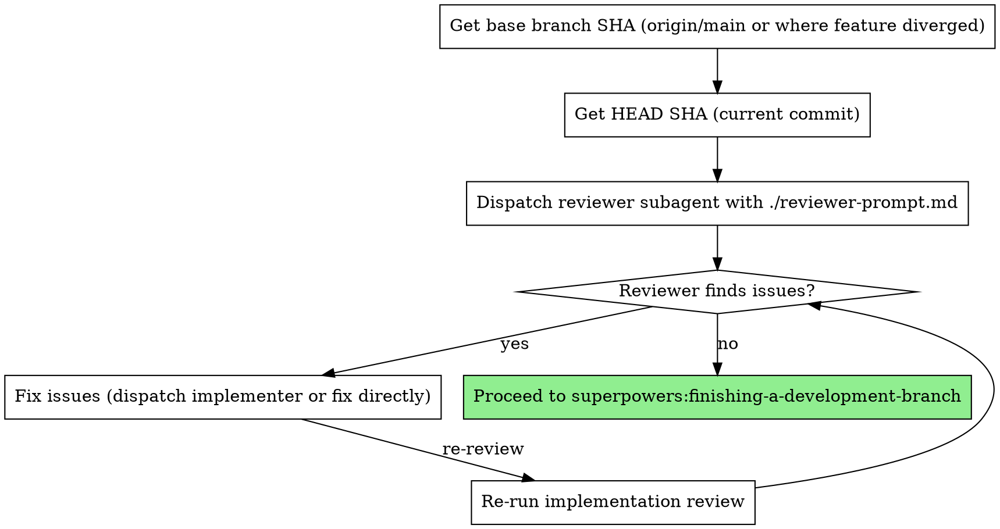

# Implementation Review

Review the entire feature implementation with fresh eyes, focusing on issues that only surface when looking at all tasks together.

**Core principle:** Per-task reviews verify each piece works. Implementation review verifies the pieces work together.

## When to Use

- After all tasks complete in subagent-driven-development (auto-suggested)
- After executing-plans completes all batches
- Before merging any multi-task feature branch
- When asked to "review the whole thing" or "look at everything with fresh eyes"

**Not needed for:** Single-task changes, hotfixes, documentation-only PRs.

## The Process



## How to Dispatch

```bash
# Get the FULL feature range — not just the last task
BASE_SHA=$(git merge-base HEAD origin/main)  # or origin/master
HEAD_SHA=$(git rev-parse HEAD)
```

Then dispatch using `./reviewer-prompt.md` template with:
- `{BASE_SHA}` — where the feature branch diverged
- `{HEAD_SHA}` — current tip
- `{FEATURE_SUMMARY}` — what the feature does (1-2 sentences)
- `{TASK_LIST}` — list of tasks that were implemented

**Critical:** The diff range must cover ALL tasks, not just the last one. This is the entire point of the skill.

## What It Catches (That Per-Task Reviews Miss)

| Category | Example | Why Per-Task Misses It |
|----------|---------|----------------------|
| Cross-task inconsistency | Config says port 3000, README says 8080 | Each file reviewed in isolation |
| Duplicated constants | Same timeout defined in two modules | Each task added it independently |
| Code duplication | Identical function in two files, different names | Each task's reviewer only sees one copy |
| Dead code from iteration | Conditional where both branches are identical | Emerged from incremental changes across tasks |
| Documentation gaps | Feature supported in one module but not another, undocumented | Per-task reviewer sees one side |
| Unclear/inconsistent errors | Multiple modules throw same generic message | Each reviewer sees one throw site |

## Red Flags

**Never:**
- Use per-task SHA range (defeats the purpose)
- Skip this because per-task reviews passed (that's exactly when cross-task issues hide)
- Treat this as optional for multi-task features

**If reviewer finds issues:**
- Fix them before proceeding to finishing-a-development-branch
- Re-run the review after fixes
- Don't skip re-review

## Integration

**Called by:**
- **superpowers:subagent-driven-development** — auto-suggested after all tasks complete
- **superpowers:executing-plans** — after all batches complete

**Leads to:**
- **superpowers:finishing-a-development-branch** — once review passes
