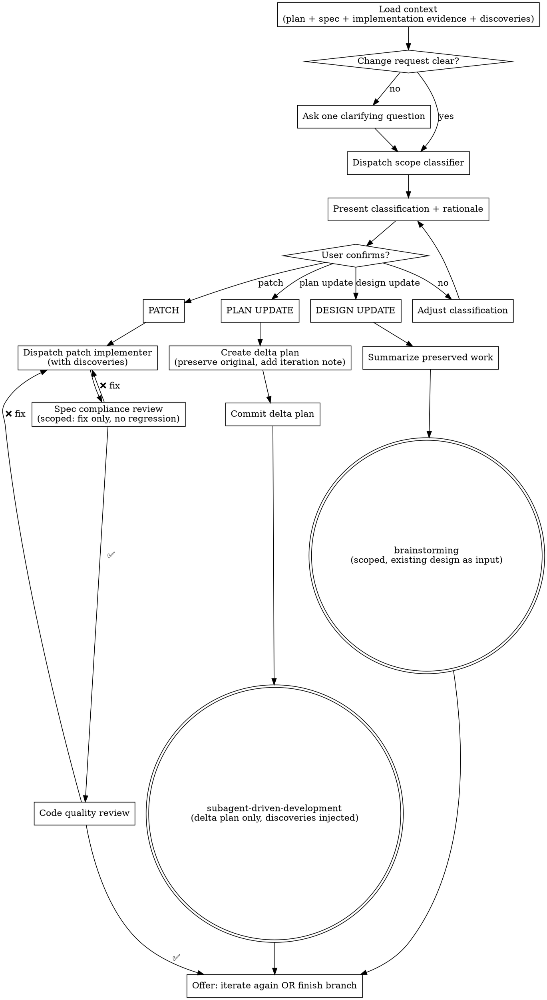

# Iterating on Plans

## Overview

Bridge the gap between "execution complete" and "truly done." When implementation is 80–90% right but needs targeted refinement, this skill classifies the change request, routes it to the right rework level, and preserves all quality gates.

**Announce at start:** "I'm using the iterating-on-plans skill to refine this implementation."

**Three rework levels:**

| Level | When to use | What happens |
|-------|-------------|--------------|
| **Patch** | Bug, typo, small behavioral tweak — isolated to 1–3 files, no design change | Mini-task → implementer subagent → 2-stage review |
| **Plan Update** | Missing requirement, scope gap, requirement change — no architectural shift | Create delta plan → run affected work via SDD |
| **Design Update** | Architectural change, new major capability, contradiction in design | Scoped re-brainstorm → new plan → SDD |

<HARD-GATE>
Do NOT make any code changes, edit the plan, or invoke any other skill before:
1. Running the scope classifier subagent
2. Presenting the classification + rationale to the user
3. Getting explicit user confirmation to proceed

Misclassifying a change wastes more tokens than one confirmation message.
</HARD-GATE>

---

## Step 1: Load Context

Before classifying anything, gather:

**1a. Plan file**
- Locate the plan: `docs/superpowers/plans/` — find the most recent plan for this feature, or ask the user if ambiguous
- Note which tasks are `[x]` (complete) and which are `[ ]` (incomplete)

**1b. Design doc**
- Locate the spec: `docs/superpowers/specs/` — find the corresponding design doc
- If missing, note it (classifier will work without it but with reduced accuracy)

**1c. Current implementation evidence**
- Capture the worktree state: `git status --short`
- Capture the implementation delta:
  - Prefer the feature-branch diff against its base branch (`git diff --stat <base>...HEAD` and `git diff <base>...HEAD`)
  - Also include uncommitted changes if present (`git diff --stat` and `git diff`)
  - If the base branch is unclear, summarize recent implementation commits with `git log --oneline --stat`
- Read the files named by the plan, design doc, or diff that are likely touched by the change request
- If no useful code/diff evidence is available, state that explicitly — don't let the classifier infer blast radius from plan text alone

**1d. Prior discoveries** *(optional — proceed without if absent)*
- Check for an `## Accumulated Discoveries` section at the bottom of the plan file
- Check for `docs/superpowers/discoveries/<plan-name>-discoveries.md`
- If found, extract the full discoveries list — it will be injected into all subagents

**1e. Change request**
- This is what the user described: the bug, missing feature, or architectural concern
- If the request is vague ("it doesn't feel right"), ask one clarifying question before classifying

---

## Step 2: Classify the Change

Dispatch a scope-classifier subagent using `./scope-classifier-prompt.md`.

Provide the subagent with:
- The user's change request (verbatim)
- The full plan text (with checkbox states)
- The design doc (or note if absent)
- Current implementation evidence (diffs, file excerpts, or note if absent)
- Prior discoveries (or note if absent)

The classifier returns:
- `PATCH` | `PLAN_UPDATE` | `DESIGN_UPDATE`
- Rationale (why this level, not another)
- Implementation evidence used
- Blast radius (which files / tasks / design sections are affected)
- Change description (precise description of what needs to happen)
- For `PLAN_UPDATE`: list of completed task IDs whose outputs are superseded by the delta plan

---

## Step 3: Present Classification and Get Confirmation

**Always show the user the classification before acting.** Present it like this:

```
I've classified this as a [PATCH / PLAN UPDATE / DESIGN UPDATE].

**Why:** [Rationale from classifier — 1–2 sentences]

**Evidence checked:** [Implementation evidence used — diff/files inspected, or note if missing]

**Blast radius:** [Files affected / Tasks affected / Design section affected]

**What I'll do:**
[For PATCH]: Dispatch an implementer subagent to fix [X] in [files]. Two-stage review follows.
[For PLAN UPDATE]: Create a delta plan for [new/changed tasks], add a short note to the original plan, then execute the delta plan via subagent-driven-development.
[For DESIGN UPDATE]: Start a scoped re-brainstorm focused on [section], preserving [what stays the same]. Normal flow follows: brainstorming → writing-plans → subagent-driven-development.

Shall I proceed?
```

Wait for the user's confirmation.

**If the user disagrees with the classification level** (e.g., insists a PLAN_UPDATE is "just a patch"):
- Do NOT silently accept the downgrade
- Make the risk explicit: explain specifically which completed tasks will be wrong after the change and why
- Give the user enough information to make an informed decision
- Defer to the user once they confirm they understand the risk — but document their override in the active plan or delta plan as an `## Iteration Note`
- Never pretend the risk doesn't exist to avoid friction

Example response when user overrides:
> "I hear you — the edit itself is one line. The reason I flagged PLAN_UPDATE is that Task 5 calls `User.save()` and compares against the stored value directly. After this change that comparison will break silently. If you've already accounted for that, treat this as a patch and I'll proceed immediately. If not, Tasks 5 and 7 need delta-plan coverage. Which do you prefer?"

---

## Step 4: Execute the Routed Level

### Route A — Patch

1. Dispatch a patch implementer subagent using `./patch-implementer-prompt.md`
   - Inject: mini-task description (from classifier), affected files, prior discoveries
2. After implementer reports DONE:
   - **Spec compliance review** — dispatch spec-reviewer using `../subagent-driven-development/spec-reviewer-prompt.md`
     - Scope the review: "Did this fix the stated issue and *only* that? No regressions, no scope creep."
   - If ❌: implementer fixes → re-review until ✅
3. **Code quality review** — dispatch code reviewer using `../subagent-driven-development/code-quality-reviewer-prompt.md`
   - If issues found: implementer fixes → re-review until approved
4. Offer next step (see Step 5)

### Route B — Plan Update

1. **Create a delta plan by default:**
   - Preserve the original plan as historical truth; do not un-check completed tasks or rewrite their bodies
   - Create `docs/superpowers/plans/<original-plan-stem>-iteration-YYYY-MM-DD.md`
   - Include the affected completed tasks as "superseded" instead of making their old checkboxes ambiguous
   - Append to the original plan only for immediate bookkeeping corrections or a tiny tail task where no completed work is superseded
   - Put this header at the top of the delta plan:
     ```markdown
     ## Iteration Note — [date]
     **Original plan:** [path]
     **Change:** [one-sentence description]
     **Superseded completed tasks:** [list, or "None"]
     **New/changed tasks:** [list]
     **Implementation evidence used:** [short summary of diff/files inspected]
     ```
2. **Add a short pointer to the original plan:**
   - Add or update an `## Iterations` section with:
     ```markdown
     - [date]: [change summary]. Active delta plan: `docs/superpowers/plans/<delta-plan>.md`. Supersedes: [tasks or "None"].
     ```
   - Do not edit the original completed task text except for this pointer
3. Commit the plan update:
   ```bash
   git add docs/superpowers/plans/<original-plan>.md docs/superpowers/plans/<delta-plan>.md
   git commit -m "plan: [brief description of iteration change]"
   ```
   If this is an append-only exception with no delta plan, stage only the edited original plan.
4. Announce: "Delta plan created. Executing affected and new tasks."
5. **REQUIRED SUB-SKILL:** Use `superpowers:subagent-driven-development` — execute the delta plan only, preserving already-complete original tasks unless the delta explicitly replaces them
6. Inject prior discoveries and implementation evidence into every implementer subagent dispatch (add them to the Context section of each implementer prompt)
7. Offer next step (see Step 5)

### Route C — Design Update

1. Summarize what to preserve for the user:
   ```
   Before re-brainstorming, I'll preserve:
   - [Completed tasks / components that don't change]
   - [Constraints and tech stack decisions that stand]

   The re-brainstorm will be scoped to: [affected design section]
   ```
2. Confirm with user before invoking brainstorming
3. **REQUIRED SUB-SKILL:** Use `superpowers:brainstorming`
   - Pass the existing design doc as starting context
   - Scope the brainstorm explicitly: "We're revisiting [section] only. Everything else is locked."
4. Normal flow continues: `brainstorming → writing-plans → subagent-driven-development`

---

## Step 5: Offer Next Step

After completing any patch or plan update, present:

```
Iteration complete. What next?

1. **Iterate again** — describe another change (superpowers:iterating-on-plans)
2. **Finish the branch** — merge, PR, or discard (superpowers:finishing-a-development-branch)
```

Do not automatically invoke `finishing-a-development-branch` — let the user decide if more iteration is needed.

---

## Process Flow



---

## Key Principles

- **Classify before acting** — never skip the classifier, never skip confirmation
- **Classify from evidence** — include the current implementation/diff, not just the plan
- **Original plans are history** — use delta plans for plan-level iteration; only add a short pointer to the original
- **Discoveries always travel** — inject prior discoveries into every subagent, at every level
- **Full 2-stage review, scaled depth** — patch reviews are tighter in scope, not lighter in rigor
- **One iteration at a time** — complete the current iteration fully before accepting the next request
- **Never make completed checkboxes ambiguous** — the plan's `[x]` state is historical truth; supersede stale work explicitly in the delta plan

---

## Failure Modes to Avoid

| Anti-pattern | Why it's wrong |
|---|---|
| Skipping classification and just fixing "obviously simple" bugs | Small fixes break cross-file contracts silently ("reference drift") |
| Classifying from plan text without inspecting the current implementation | The plan describes intent; the code and diff show actual blast radius |
| Re-running the entire plan because one task needs fixing | Wastes tokens, may re-introduce already-resolved issues |
| Editing completed tasks in-place during iteration | History stops being trustworthy and checked boxes stop having a clear meaning |
| Starting a design update without summarizing what's preserved | Brainstorming skill may re-question settled decisions |
| Injecting all discoveries without filtering | Stale discoveries from prior architecture can mislead subagents |
| Accepting user's classification without running the classifier | User's framing is often incorrect; the classifier reads the actual code |
| Silently accepting user's override of classifier level | Make the risk explicit first — "just do what they say" leaves silent breakage |
| Committing partial or failing in-scope work when out-of-scope files are found | Only commit work that is complete, tested, and independently useful; otherwise report NEEDS_CONTEXT without committing |

---

## Integration

**Offered by:**
- `superpowers:subagent-driven-development` — after all tasks complete
- `superpowers:executing-plans` — after all batches complete

**Invokes:**
- `./scope-classifier-prompt.md` — classifies the change request
- `./patch-implementer-prompt.md` — implements patch-level fixes
- `../subagent-driven-development/spec-reviewer-prompt.md` — spec compliance review
- `../subagent-driven-development/code-quality-reviewer-prompt.md` — code quality review
- `superpowers:subagent-driven-development` — re-executes plan-level changes
- `superpowers:brainstorming` — handles design-level changes
- `superpowers:finishing-a-development-branch` — offered after iteration is complete
