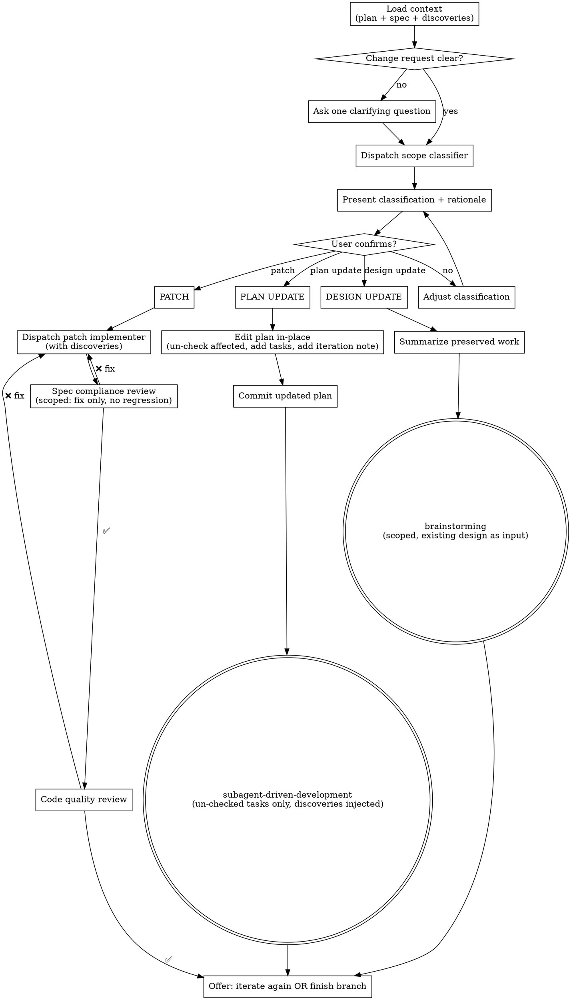

# Iterating on Plans

## Overview

Bridge the gap between "execution complete" and "truly done." When implementation is 80–90% right but needs targeted refinement, this skill classifies the change request, routes it to the right rework level, and preserves all quality gates.

**Announce at start:** "I'm using the iterating-on-plans skill to refine this implementation."

**Three rework levels:**

| Level | When to use | What happens |
|-------|-------------|--------------|
| **Patch** | Bug, typo, small behavioral tweak — isolated to 1–3 files, no design change | Mini-task → implementer subagent → 2-stage review |
| **Plan Update** | Missing requirement, scope gap, requirement change — no architectural shift | Edit plan in-place → re-run affected tasks via SDD |
| **Design Update** | Architectural change, new major capability, contradiction in design | Scoped re-brainstorm → new plan → SDD |

<HARD-GATE>
Do NOT make any code changes, edit the plan, or invoke any other skill before:
1. Running the scope classifier subagent
2. Presenting the classification + rationale to the user
3. Getting explicit user confirmation to proceed

Misclassifying a change wastes more tokens than one confirmation message.
</HARD-GATE>

---

## Step 1: Load Context

Before classifying anything, gather:

**1a. Plan file**
- Locate the plan: `docs/superpowers/plans/` — find the most recent plan for this feature, or ask the user if ambiguous
- Note which tasks are `[x]` (complete) and which are `[ ]` (incomplete)

**1b. Design doc**
- Locate the spec: `docs/superpowers/specs/` — find the corresponding design doc
- If missing, note it (classifier will work without it but with reduced accuracy)

**1c. Prior discoveries** *(optional — proceed without if absent)*
- Check for an `## Accumulated Discoveries` section at the bottom of the plan file
- Check for `docs/superpowers/discoveries/<plan-name>-discoveries.md`
- If found, extract the full discoveries list — it will be injected into all subagents

**1d. Change request**
- This is what the user described: the bug, missing feature, or architectural concern
- If the request is vague ("it doesn't feel right"), ask one clarifying question before classifying

---

## Step 2: Classify the Change

Dispatch a scope-classifier subagent using `./scope-classifier-prompt.md`.

Provide the subagent with:
- The user's change request (verbatim)
- The full plan text (with checkbox states)
- The design doc (or note if absent)
- Prior discoveries (or note if absent)

The classifier returns:
- `PATCH` | `PLAN_UPDATE` | `DESIGN_UPDATE`
- Rationale (why this level, not another)
- Blast radius (which files / tasks / design sections are affected)
- Change description (precise description of what needs to happen)
- For `PLAN_UPDATE`: list of completed task IDs that need to be un-checked and re-executed

---

## Step 3: Present Classification and Get Confirmation

**Always show the user the classification before acting.** Present it like this:

```
I've classified this as a [PATCH / PLAN UPDATE / DESIGN UPDATE].

**Why:** [Rationale from classifier — 1–2 sentences]

**Blast radius:** [Files affected / Tasks affected / Design section affected]

**What I'll do:**
[For PATCH]: Dispatch an implementer subagent to fix [X] in [files]. Two-stage review follows.
[For PLAN UPDATE]: Edit the plan in-place — mark tasks [N, M] incomplete, add [new tasks]. Re-execute via subagent-driven-development.
[For DESIGN UPDATE]: Start a scoped re-brainstorm focused on [section], preserving [what stays the same]. Normal flow follows: brainstorming → writing-plans → subagent-driven-development.

Shall I proceed?
```

Wait for the user's confirmation. If they push back on the classification, re-classify with their input or adjust the approach manually.

---

## Step 4: Execute the Routed Level

### Route A — Patch

1. Dispatch a patch implementer subagent using `./patch-implementer-prompt.md`
   - Inject: mini-task description (from classifier), affected files, prior discoveries
2. After implementer reports DONE:
   - **Spec compliance review** — dispatch spec-reviewer using `../subagent-driven-development/spec-reviewer-prompt.md`
     - Scope the review: "Did this fix the stated issue and *only* that? No regressions, no scope creep."
   - If ❌: implementer fixes → re-review until ✅
3. **Code quality review** — dispatch code reviewer using `../subagent-driven-development/code-quality-reviewer-prompt.md`
   - If issues found: implementer fixes → re-review until approved
4. Offer next step (see Step 5)

### Route B — Plan Update

1. **Edit the plan file in-place:**
   - Un-check (`- [ ]`) any completed tasks the classifier flagged as affected
   - Add new tasks at the end (or inline if they depend on specific completed tasks)
   - Add a `## Iteration Note` section at the top of the plan with:
     ```markdown
     ## Iteration Note — [date]
     **Change:** [one-sentence description]
     **Tasks modified:** [list]
     **Tasks added:** [list]
     ```
2. Commit the updated plan:
   ```bash
   git add docs/superpowers/plans/<plan-file>.md
   git commit -m "plan: [brief description of iteration change]"
   ```
3. Announce: "Plan updated. Re-executing affected and new tasks."
4. **REQUIRED SUB-SKILL:** Use `superpowers:subagent-driven-development` — execute only the un-checked tasks (skip already-complete ones)
5. Inject prior discoveries into every implementer subagent dispatch (add them to the Context section of each implementer prompt)
6. Offer next step (see Step 5)

### Route C — Design Update

1. Summarize what to preserve for the user:
   ```
   Before re-brainstorming, I'll preserve:
   - [Completed tasks / components that don't change]
   - [Constraints and tech stack decisions that stand]

   The re-brainstorm will be scoped to: [affected design section]
   ```
2. Confirm with user before invoking brainstorming
3. **REQUIRED SUB-SKILL:** Use `superpowers:brainstorming`
   - Pass the existing design doc as starting context
   - Scope the brainstorm explicitly: "We're revisiting [section] only. Everything else is locked."
4. Normal flow continues: `brainstorming → writing-plans → subagent-driven-development`

---

## Step 5: Offer Next Step

After completing any patch or plan update, present:

```
Iteration complete. What next?

1. **Iterate again** — describe another change (superpowers:iterating-on-plans)
2. **Finish the branch** — merge, PR, or discard (superpowers:finishing-a-development-branch)
```

Do not automatically invoke `finishing-a-development-branch` — let the user decide if more iteration is needed.

---

## Process Flow



---

## Key Principles

- **Classify before acting** — never skip the classifier, never skip confirmation
- **In-place plan edits** — single source of truth; git preserves history
- **Discoveries always travel** — inject prior discoveries into every subagent, at every level
- **Full 2-stage review, scaled depth** — patch reviews are tighter in scope, not lighter in rigor
- **One iteration at a time** — complete the current iteration fully before accepting the next request
- **Never re-run completed tasks** — the plan's `[x]` state is the contract; only un-check what the classifier explicitly flags

---

## Failure Modes to Avoid

| Anti-pattern | Why it's wrong |
|---|---|
| Skipping classification and just fixing "obviously simple" bugs | Small fixes break cross-file contracts silently ("reference drift") |
| Re-running the entire plan because one task needs fixing | Wastes tokens, may re-introduce already-resolved issues |
| Starting a design update without summarizing what's preserved | Brainstorming skill may re-question settled decisions |
| Injecting all discoveries without filtering | Stale discoveries from prior architecture can mislead subagents |
| Accepting user's classification without running the classifier | User's framing is often incorrect; the classifier reads the actual code |

---

## Integration

**Offered by:**
- `superpowers:subagent-driven-development` — after all tasks complete
- `superpowers:executing-plans` — after all batches complete

**Invokes:**
- `./scope-classifier-prompt.md` — classifies the change request
- `./patch-implementer-prompt.md` — implements patch-level fixes
- `../subagent-driven-development/spec-reviewer-prompt.md` — spec compliance review
- `../subagent-driven-development/code-quality-reviewer-prompt.md` — code quality review
- `superpowers:subagent-driven-development` — re-executes plan-level changes
- `superpowers:brainstorming` — handles design-level changes
- `superpowers:finishing-a-development-branch` — offered after iteration is complete
