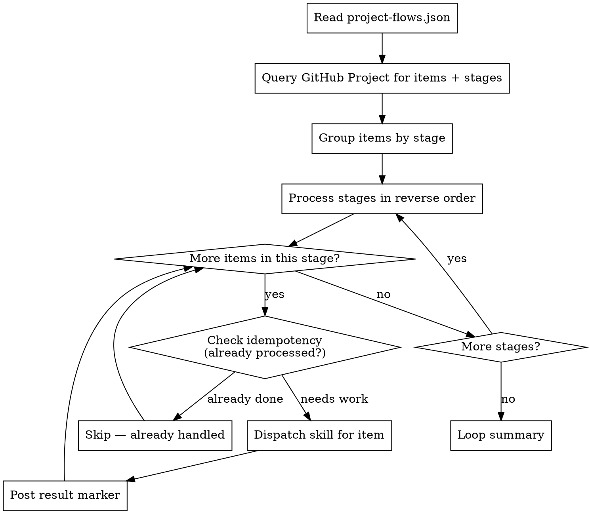

# Loop Orchestrator

## Overview

Process multiple issues through their workflow stages by reading GitHub Project state and dispatching skills. All communication happens via GitHub issue comments — never terminal input. Items are processed non-blocking: if one is stuck, move to the next.

**Core principle:** Read state, dispatch skill, post result, move on. Never block.

## When to Use

- Managing a GitHub Project with items at various stages
- Running an autonomous processing loop
- Any time multiple issues need to progress through a workflow

## Prerequisites

- `project-flows.json` exists in the consuming repo (created by `/setup`)
- `gh` CLI authenticated with access to the repo and project
- Read `handler-authority` for async communication model

## Configuration

The orchestrator reads everything it needs from `project-flows.json`:

```json
{
  "repo": "owner/repo",
  "github_owner": "owner",
  "flows": {
    "bug": {
      "project_number": 11,
      "stages": [
        { "name": "Triage", "skill": "bug-triage", "exit_marker": "[TRIAGE_READY]", ... }
      ]
    }
  }
}
```

Key fields per stage:
- `skill` — which skill to dispatch
- `exit_marker` — posted when the skill completes successfully
- `question_marker` — posted when the skill needs human input
- `fail_marker` — posted on failure
- `optional` + `skip_condition` — stage can be skipped

## The Loop



### Step 1: Read State

```bash
gh project item-list <project_number> --owner <owner> --format json
```

Parse items and their Status field values. Group items by their current stage.

### Step 2: Process in Reverse Stage Order

Process stages from the end of the flow backwards:

**Bug flow example:**
1. Done items first (PR creation, cleanup)
2. UserTest items (manage UAT)
3. Test items (run gates)
4. Fix items (implement fixes)
5. Triage items (investigate)

**Why reverse?** Downstream items completing first means:
- Resources are freed (UAT instances torn down)
- PRs are created before starting new investigations
- Avoids starting new work when existing work is almost done

### Step 3: Idempotency Check

Before dispatching a skill for an item, check if it was already processed:

1. Read the issue's comments
2. Look for the stage's `exit_marker`, `fail_marker`, or `question_marker`
3. If marker exists AND no new artifacts or handler responses since the marker: **skip**
4. If marker exists AND handler responded to a question: **re-dispatch** with the new context
5. If no marker: **dispatch**

```bash
gh issue view <issue#> --repo <owner/repo> --json comments
```

### Step 4: Dispatch Skill

For each item that needs work:

1. Load the issue context (title, body, comments, labels)
2. Determine the skill from the stage config
3. Invoke the skill with:
   - Issue number and context
   - Async mode (communicate via GitHub comments, not terminal)
   - Project-specific context from `.claude/shared/`

### Step 5: Post Result

After the skill completes:

- **Success:** Post the stage's `exit_marker` on the issue
- **Needs input:** Post the stage's `question_marker` with the question, tagging the handler
- **Failure:** Post the stage's `fail_marker` with details

```bash
gh issue comment <issue#> --repo <owner/repo> --body "<marker> <details>"
```

### Step 6: Move to Next Item

Never block. If a skill needs human input:
1. Post the question marker
2. Move to the next item
3. The handler's response will be picked up on the next loop iteration

### Step 7: Loop Summary

After processing all stages, output a summary (to the terminal, NOT to GitHub):

```
Loop iteration complete:
- Triage: 2 items processed (1 ready, 1 question posted)
- Fix: 1 item processed (complete)
- Test: 1 item processed (PASS)
- UserTest: 0 items
- Done: 1 item processed (PR created)

Deferred: 0 items (resource limits)
Next iteration: ready when invoked
```

**Resource limits** (token budget, session time) go in the loop summary only — never posted to GitHub.

## Stage Advancement

**The loop does NOT auto-promote items between stages.**

1. The loop runs the skill for the item's current stage
2. Posts the exit marker when the skill completes
3. The handler (human) decides when to move the item to the next stage in the GitHub Project

This keeps humans in control of progression. The agent does the work; the human decides when to advance.

## Optional Stages

When a stage has `"optional": true`:
- Check the `skip_condition` against the issue context
- If the condition is met (e.g., "no user-facing changes"): post a comment recommending the handler skip this stage, with the reasoning
- Do NOT auto-skip — the handler decides

## Handling Multiple Flows

If both bug and feature flows are configured, process them in the same loop iteration:
1. Read items from bug project
2. Read items from feature project
3. Process all items, grouped by stage, in reverse order across both flows

## Non-Blocking Principle

- **Never** wait for terminal input
- **Never** block on a handler response — post and move on
- **Never** post resource limits to GitHub (tokens, session time, deferral reasons)
- **Always** post questions/status via GitHub issue comments
- **Always** tag the handler when posting a question

## Error Handling

| Situation | Action |
|-----------|--------|
| `gh` command fails | Log error in loop summary, skip item, continue |
| Skill fails unexpectedly | Post fail marker with error details, move to next item |
| Project not found | Stop loop, report configuration error |
| Item has no issue linked | Skip item, note in loop summary |
| Rate limited by GitHub API | Back off, continue with remaining items |

## Anti-Patterns

| Pattern | Problem |
|---------|---------|
| Auto-promoting items between stages | Removes human control |
| Blocking on handler response | Wastes time, other items could progress |
| Posting resource limits to GitHub | Confuses handlers with internal details |
| Processing stages in forward order | Starts new work before finishing existing work |
| Skipping idempotency check | Duplicate comments, duplicate work |
| Re-dispatching without checking for new context | Repeats the same work with same result |

## Red Flags — STOP the Loop

- `project-flows.json` is missing or invalid
- GitHub authentication is broken
- Project doesn't exist or has no Status field
- Repeated errors on the same item (3+ failures)

Report the error and stop. Don't retry blindly.

## Integration

**Uses:**
- All stage skills (dispatches them per item)
- **superpowers:handler-authority** — for async communication model
- `project-flows.json` — for flow and stage configuration

**Managed by:**
- The `/loop` command (convenience wrapper for invoking this skill)
