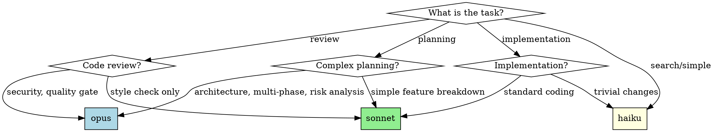

# Model Selection for Agents

## Overview

**Core principle:** Complex planning and code review warrant opus model. Implementation tasks use sonnet. Choose based on task complexity, not cost anxiety.

## When to Use

**Use this skill when:**
- Dispatching agents for implementation plan execution
- Creating or reviewing complex architectural plans
- Performing security or quality code reviews
- Breaking down large features into tasks
- User mentions "cost", "budget", or "efficiency" (resist downgrading quality)
- Production incidents or "urgent" requests (don't let time pressure override)
- User emphasizes speed or constraints (maintain quality standards)

**Symptoms you need this:**
- Uncertain which model to specify in Task tool
- Feel torn between thoroughness and cost
- About to ask user permission for using opus
- Defaulting to sonnet for everything
- Doing code review inline instead of dispatching
- Creating distinctions between "cost anxiety" and "budget constraints"
- Thinking "this situation is special" or "my judgment overrides"

## Model Selection Reference

| Task Type | Model | Reasoning |
|-----------|-------|-----------|
| Complex planning (architecture, refactoring, multi-phase) | **opus** | Architectural decisions, sequencing, risk analysis |
| Code review (security, quality gates) | **opus** | Missing vulnerabilities is expensive, need thoroughness |
| Standard implementation | **sonnet** | Balance of capability and cost for coding tasks |
| Simple refactoring | **sonnet** | Straightforward transformations |
| Running tests, gathering info | **sonnet** | Mechanical tasks |
| Quick searches, simple fixes | **haiku** | Speed matters, low complexity |

## Core Patterns

**Planning agents:** Use `model: "opus"` for complex architectural planning (migrations, refactoring, multi-phase)

**Code review agents:** Use `model: "opus"` and dispatch as separate agent (not inline). Security/quality gates need thoroughness.

**Implementation agents:** Use `model: "sonnet"` for standard coding tasks

**Example:**
```typescript
// Complex planning → opus
Task({ subagent_type: "Plan", model: "opus", prompt: "Plan Redux→Zustand migration" })

// Code review → opus, dispatched
Task({ subagent_type: "superpowers:code-reviewer", model: "opus", prompt: "Review auth security" })

// Implementation → sonnet
Task({ subagent_type: "general-purpose", model: "sonnet", prompt: "Implement login endpoint" })
```

## Overcoming Cost Anxiety

**When user mentions cost/budget/efficiency:**
- Don't ask permission - confidently choose right tool
- Use opus for planning & review (mistakes are expensive)
- Use sonnet for implementation (matches capability to need)
- Inform user of choice, don't seek approval

**Response pattern:**
"I'm using opus for [security review/complex planning] because [vulnerabilities are expensive/architecture matters]. I'll use sonnet for implementation to balance quality with cost."

## Dispatch Code Review as Agent

**Always dispatch code review as separate opus agent for:** security code, complex features (>500 lines), architecture changes, production systems

**Never do inline.** Pattern: `Task({ subagent_type: "superpowers:code-reviewer", model: "opus", prompt: "Review [X] for security, edge cases, performance, best practices" })`

## Common Mistakes

| Excuse | Reality |
|--------|---------|
| "I don't have strong intuitions about models" | This skill gives you the intuitions. Use it. |
| "User wants efficiency" | Efficiency = right tool for the job, not cheapest tool. |
| "Sonnet is probably fine" | For planning and review? No. Use opus. |
| "Let me ask user which model" | You're the expert. Choose confidently. |
| "Cost matters more than quality" | Bad quality costs more than opus API calls. |
| "I'll do code review myself" | Dispatch it with opus for better quality. |
| "This planning is complex but I'll use sonnet" | Complex planning = opus. Period. |
| "User has 'explicit budget constraints' not 'cost anxiety'" | Same thing. Use opus. Don't create distinctions. |
| "Production incident needs speed over quality" | Opus response time for code review: ~seconds. Not slower enough to matter. Use opus. |
| "Time pressure overrides the skill guidance" | No. Skill applies under ALL circumstances including emergencies. |
| "Skills are tools not rules, I'll use judgment" | This IS the judgment. Follow it. |

## Red Flags - Check Yourself

**Stop and use opus when you're thinking:**
- "This architecture plan is complex but sonnet should handle it"
- "I'll ask the user if opus is okay"
- "User mentioned costs so I'll skip opus"
- "I'll do the code review inline to save costs"
- "Not sure which model, so sonnet"
- "User said 'budget constraints' not just 'costs', so this is different"
- "Production is down, speed matters more than quality"
- "It's an emergency, I should use my judgment to override"
- "The skill is general guidance, this situation is special"

**All of these mean: You need opus. Use it confidently.**

## Addressing Sophisticated Rationalizations

### "But the user has EXPLICIT budget constraints, not vague cost anxiety"

**This is a false distinction.** Whether the user says:
- "I'm worried about costs" (vague anxiety)
- "I have a tight budget" (explicit constraint)
- "Every API call counts" (specific concern)

**The principle remains:** For quality gates (planning, security review), opus is the right choice because the cost of mistakes exceeds API costs.

**If user genuinely cannot afford opus:**
They'll tell you to stop working entirely, not to use cheaper models for critical tasks. Trust that.

### "But this is a production incident, speed matters"

**Opus is not meaningfully slower for code review tasks.**
- Typical opus response for code review: 30-90 seconds
- Typical sonnet response for code review: 20-60 seconds
- Difference: ~30 seconds maximum

**In a production incident:**
- Getting the RIGHT answer in 90s > getting a WRONG answer in 60s
- If sonnet misses the bug, you've wasted time AND still have the incident
- The 30-second difference is noise compared to incident duration

**Bottom line:** Use opus. The speed argument doesn't hold water.

### "But skills are guidelines, not absolute rules"

**This skill IS your judgment framework.** When you think:
- "I should use my judgment here" → You already did, by reading this skill
- "This situation is different" → It's not. Follow the skill.
- "Guidelines aren't absolute" → This one is. For quality gates, use opus.

**If there's a legitimate exception** (there almost never is), the skill would explicitly state it. It doesn't. Use opus.

## Decision Tree



## Integration

**Use opus when invoking:** superpowers:writing-plans, superpowers:requesting-code-review, superpowers:code-reviewer

**In executing-plans/subagent-driven-development:** Use opus for reviewer agents, sonnet for implementation agents
