## Mode System (v3.1)

This skill supports four modes to adapt to different cognitive styles and accessibility needs:

### Mode Selection

**Base Modes** (choose one):
1. **Neurodivergent Mode** - ADHD-friendly, energy-aware, compassionate language
2. **Neurotypical Mode** - Direct, efficient, standard cognitive load

**Accessibility Modes** (optional, combinable with base modes):
3. **Colorblind-Safe Mode** - Pattern-based differentiation for all color vision types
4. **Monochrome Mode** - Pure black & white optimized for printing and e-ink displays

**Mode Combinations Available:**
- Neurodivergent + Colorblind-Safe
- Neurodivergent + Monochrome
- Neurotypical + Colorblind-Safe
- Neurotypical + Monochrome
- Colorblind-Safe only (no base mode features)
- Monochrome only (no base mode features)

**Selection Methods:**

**1. Auto-Detect (Default)**
- Analyzes user language for distress signals ("overwhelmed", "paralyzed", "stuck")
- Detects mentions of neurodivergent conditions or executive dysfunction
- Detects accessibility requests ("colorblind-safe", "print-friendly", "grayscale")
- Defaults to neurodivergent mode when ambiguous (inclusive design)

**2. Explicit Mode Request**
- User says: "Use neurotypical mode" or "Use ADHD mode"
- User says: "Use colorblind-safe mode" or "Make it print-friendly"
- User says: "Combine neurodivergent and colorblind-safe modes"
- Persists for current conversation unless changed

**3. Configuration File**
- User creates: `.claude/neurodivergent-visual-org-preference.yml`
- Sets default base mode, accessibility modes, time multipliers, chunk sizes
- Can set auto-enable rules (e.g., monochrome for PDFs)

### Mode Characteristics

**Base Mode Features:**

| Aspect | Neurodivergent Mode | Neurotypical Mode |
|--------|---------------------|-------------------|
| Chunk size | 3-5 items | 5-7 items |
| Time estimates | 1.5-2x with buffer | Standard |
| Task granularity | 3-10 min micro-steps | 15-30 min tasks |
| Language | Compassionate, validating | Direct, efficient |
| Colors | Calming (blues/greens) | Standard themes |
| Energy scaffolding | Explicit (spoons, breaks) | Minimal |

**Accessibility Mode Features:**

| Aspect | Colorblind-Safe Mode | Monochrome Mode |
|--------|---------------------|-----------------|
| Color usage | Redundant (patterns + color) | Pure B&W only (#000/#fff) |
| Border patterns | Dashed/dotted variations | Solid/dashed/dotted styles |
| Text labels | Prefixed ([KEEP], [DONATE]) | Verbose ([✓ KEEP], [? MAYBE]) |
| Shape coding | Diamond/hexagon/trapezoid | Distinct geometric shapes |
| Fill patterns | N/A (white fill, patterned borders) | Solid/crosshatch/dots/white |
| Border thickness | 1-3px for hierarchy | 1-3px for hierarchy |
| Symbols | Redundant icons (✅ 📦 🤔) | Text-based (✓ → ?) |
| Best for | All color vision types | B&W printing, e-ink displays |
| WCAG compliance | 2.1 AA (Use of Color 1.4.1) | 2.1 AAA (Maximum contrast) |

**Mode Combination Notes:**
- Base mode controls language, time estimates, and cognitive scaffolding
- Accessibility mode controls visual encoding (patterns, contrast, shapes)
- Both can be active simultaneously for maximum accommodation

### Backward Compatibility

v3.1 maintains v3.0 behavior:
- Defaults to neurodivergent base mode (v2.0 compatible)
- Accessibility modes are opt-in (not enabled by default)
- v3.0 visualizations remain valid (no breaking changes)

## Mode Detection Algorithm

**Step 1: Check for explicit base mode request**
```python
base_mode = None
accessibility_mode = None

# Detect base mode
if "neurotypical mode" in user_message.lower():
    base_mode = "neurotypical"
elif "adhd mode" or "neurodivergent mode" in user_message.lower():
    base_mode = "neurodivergent"
```

**Step 2: Check for explicit accessibility mode request**
```python
# Detect colorblind-safe mode
colorblind_keywords = ["colorblind", "color blind", "colorblind-safe",
                      "colour blind", "accessible colors", "pattern-based",
                      "cvd", "color vision deficiency"]
if any(keyword in user_message.lower() for keyword in colorblind_keywords):
    accessibility_mode = "colorblind-safe"

# Detect monochrome mode (takes precedence over colorblind-safe)
monochrome_keywords = ["monochrome", "black and white", "b&w", "grayscale",
                      "greyscale", "print-friendly", "printing", "e-ink",
                      "black & white", "photocopier"]
if any(keyword in user_message.lower() for keyword in monochrome_keywords):
    accessibility_mode = "monochrome"
```

**Step 3: Check configuration file**
```python
if config_file_exists():
    config = load_user_preference()

    # Apply base mode if not explicitly set
    if base_mode is None:
        base_mode = config.get("default_mode", "neurodivergent")

    # Apply accessibility mode if not explicitly set
    if accessibility_mode is None:
        accessibility_mode = config.get("colorblind_safe", False) and "colorblind-safe"
        if not accessibility_mode:
            accessibility_mode = config.get("monochrome", False) and "monochrome"
```

**Step 4: Auto-detect base mode from language**
```python
distress_signals = ["overwhelmed", "paralyzed", "stuck", "can't decide",
                   "don't know where to start", "too much"]
neurodivergent_mentions = ["adhd", "autism", "executive dysfunction",
                          "time blindness", "decision paralysis"]
energy_mentions = ["spoons", "burned out", "exhausted", "no energy"]

if base_mode is None:
    if any(signal in user_message.lower() for signal in
           distress_signals + neurodivergent_mentions + energy_mentions):
        base_mode = "neurodivergent"
```

**Step 5: Default to neurodivergent base mode (inclusive)**
```python
if base_mode is None:
    base_mode = "neurodivergent"  # Backward compatible with v2.0
```

**Step 6: Apply modes**
```python
# accessibility_mode can be None, "colorblind-safe", or "monochrome"
# base_mode will always be "neurodivergent" or "neurotypical"
apply_modes(base_mode=base_mode, accessibility_mode=accessibility_mode)
```

## Accessibility Mode Implementation

### Colorblind-Safe Mode Specifications

**Purpose:** Make diagrams accessible for all color vision types (protanopia, deuteranopia, tritanopia, achromatopsia) while remaining clear for regular color vision.

**Design Principles:**
1. **Never rely on color alone** - always pair with patterns, shapes, or text
2. **Pattern-based differentiation** - use border styles as primary encoding
3. **Explicit text labels** - prefix all nodes with type indicators
4. **Shape coding** - use different node shapes for different categories
5. **High contrast borders** - all nodes have bold, visible borders

**Mermaid Implementation:**

**Border Pattern System:**
```mermaid
%%{init: {'theme':'base'}}%%
flowchart TD
    Keep["[✅ KEEP] Item"]
    Donate["[📦 DONATE] Item"]
    Maybe["[🤔 MAYBE] Item"]
    Break["[🛑 BREAK] Rest"]

    style Keep fill:#ffffff,stroke:#000000,stroke-width:3px,stroke-dasharray: 5 5
    style Donate fill:#ffffff,stroke:#000000,stroke-width:2px,stroke-dasharray: 10 5
    style Maybe fill:#ffffff,stroke:#000000,stroke-width:2px,stroke-dasharray: 2 2
    style Break fill:#ffffff,stroke:#000000,stroke-width:3px,stroke-dasharray: 1 4
```

**Pattern Legend:**
- `stroke-dasharray: 5 5` - Short dashes (KEEP items, positive actions)
- `stroke-dasharray: 10 5` - Long dashes (DONATE items, external actions)
- `stroke-dasharray: 2 2` - Dots (MAYBE items, uncertain states)
- `stroke-dasharray: 1 4` - Dot-dash (BREAK items, pauses)
- `stroke-width: 3px` - Critical importance
- `stroke-width: 2px` - Standard importance
- `stroke-width: 1px` - Detail level

**Shape Coding:**
- `([text])` - Rounded rectangle: Standard process steps
- `{text}` - Diamond: Decision points
- `[[text]]` - Hexagon-style: Critical deadlines
- `[/text/]` - Trapezoid: Break/rest states
- `>text]` - Asymmetric: External dependencies

**Text Prefix System:**
- `[✅ KEEP]` - Items to keep
- `[📦 DONATE]` - Items to donate/give away
- `[🤔 MAYBE]` - Uncertain decisions
- `[🛑 BREAK]` - Rest/break required
- `[⚠️ CRITICAL]` - Critical deadline or warning
- `[START]` - Starting point
- `[END]` - Completion point
- `[DECIDE]` - Decision point

**Color Strategy:**
- White fills (`#ffffff`) for all nodes
- Black borders (`#000000`) for maximum contrast
- Colors can be added for users with color vision, but information is encoded in patterns

### Monochrome Mode Specifications

**Purpose:** Optimize for black & white printing, photocopying, and e-ink displays where color is unavailable.

**Design Principles:**
1. **Pure black and white only** - no grays (print unreliably)
2. **Fill pattern hierarchy** - use patterns to show importance
3. **Border style differentiation** - solid/dashed/dotted for categories
4. **Verbose text labels** - more explicit than colorblind-safe mode
5. **Extra whitespace** - better print legibility

**Mermaid Implementation:**

**Fill Pattern System:**
```mermaid
%%{init: {'theme':'base'}}%%
flowchart TD
    Critical["[★ CRITICAL] Deadline"]
    High["[! HIGH] Important"]
    Medium["[→ MEDIUM] Standard"]
    Standard["[○ STANDARD] Normal"]

    style Critical fill:#000000,stroke:#000000,stroke-width:3px,color:#ffffff
    style High fill:#ffffff,stroke:#000000,stroke-width:3px
    style Medium fill:#ffffff,stroke:#000000,stroke-width:2px,stroke-dasharray: 10 5
    style Standard fill:#ffffff,stroke:#000000,stroke-width:2px
```

**Fill Pattern Hierarchy:**
- Solid black fill + white text: `fill:#000000,color:#ffffff` - Priority 1 (Critical)
- White fill + bold border: `fill:#ffffff,stroke-width:3px` - Priority 2 (High)
- White fill + dashed border: `stroke-dasharray: 10 5` - Priority 3 (Medium)
- White fill + solid border: Standard weight - Priority 4 (Standard)

**Border Style System:**
- `stroke-width:3px` + solid - Critical/deadlines
- `stroke-width:2px` + solid - Standard steps
- `stroke-dasharray: 10 5` - Optional/medium priority
- `stroke-dasharray: 5 5` - Maybe/uncertain
- `stroke-dasharray: 2 2` - Breaks/pauses

**Text Prefix System (Verbose):**
- `[★ CRITICAL DEADLINE]` - Critical with visual marker
- `[✓ KEEP]` - Text checkmark
- `[→ DONATE]` - Text arrow
- `[? MAYBE]` - Text question mark
- `[■ BREAK]` - Text square (stop sign)
- `[○ START]` - Text circle
- `[● END]` - Filled circle

**Spacing Considerations:**
- Use more vertical space between nodes
- Larger font sizes recommended (handled by `<br/>` for multi-line)
- Wide margins in flowchart layout

### Mode Combination Logic

**When both base mode and accessibility mode are active:**

1. **Base mode controls:**
   - Language tone (compassionate vs direct)
   - Time estimates (buffered vs standard)
   - Task granularity (micro-steps vs standard tasks)
   - Energy scaffolding (explicit vs minimal)

2. **Accessibility mode controls:**
   - Visual encoding (colors, patterns, shapes)
   - Border styles and thickness
   - Text prefix style
   - Fill patterns (monochrome only)

3. **Both modes respected simultaneously:**
   - Neurodivergent + Colorblind-Safe = ADHD-friendly language + pattern-based visuals
   - Neurodivergent + Monochrome = ADHD-friendly language + B&W print-optimized
   - Neurotypical + Colorblind-Safe = Efficient language + pattern-based visuals
   - Neurotypical + Monochrome = Efficient language + B&W print-optimized

**Example Combined Output:**

```mermaid
%%{init: {'theme':'base'}}%%
flowchart TD
    Start(["[○ START] Decision time<br/>(Take 3 seconds max)"])
    Q1{"[? DECIDE]<br/>Do I love it?<br/>(Not obligated)"}
    Keep["[✓ KEEP]<br/>Pack for move<br/>(Fits in new space)"]
    Donate["[→ DONATE]<br/>Helps someone else<br/>(Guilt-free)"]
    Break["[■ BREAK]<br/>Rest 10 min<br/>(Decision fatigue signal)"]

    Start --> Q1
    Q1 -->|YES| Keep
    Q1 -->|NO| Donate
    Q1 -->|UNSURE| Break

    style Start fill:#ffffff,stroke:#000000,stroke-width:3px
    style Q1 fill:#ffffff,stroke:#000000,stroke-width:2px
    style Keep fill:#ffffff,stroke:#000000,stroke-width:3px,stroke-dasharray: 5 5
    style Donate fill:#ffffff,stroke:#000000,stroke-width:2px,stroke-dasharray: 10 5
    style Break fill:#000000,stroke:#000000,stroke-width:3px,color:#ffffff
```
*This example shows: Neurodivergent language (compassionate, with parenthetical reassurance) + Monochrome visual encoding (B&W with patterns)*

## Configuration File Schema

Users can create a configuration file to set default modes and customize behavior:

**File Location:** `.claude/neurodivergent-visual-org-preference.yml`

**Complete Configuration Example:**

```yaml
# Neurodivergent Visual Org v3.1 Configuration

# Base mode (required, choose one)
default_mode: neurodivergent  # Options: neurodivergent, neurotypical

# Accessibility modes (optional, can enable one or both)
colorblind_safe: false         # Enable pattern-based differentiation
monochrome: false              # Enable pure B&W print optimization

# Auto-enable rules for accessibility modes
# Note: These will PROMPT for confirmation before applying
auto_prompt_monochrome:
  when_printing: true           # Suggest monochrome when printing
  when_exporting_pdf: true      # Suggest monochrome for PDF export
  when_exporting_png: false     # Keep current mode for PNG exports

auto_prompt_colorblind_safe:
  when_sharing: true            # Suggest colorblind-safe for shared docs
  when_public: true             # Suggest for public-facing documents

# Base mode customizations
neurodivergent_customizations:
  chunk_size: 4                 # Items per chunk (3-5 recommended)
  time_multiplier: 1.5          # Buffer multiplier for time estimates
  micro_step_duration: 5        # Minutes per micro-step (3-10 recommended)
  show_energy_scaffolding: true # Show spoons/breaks explicitly
  use_compassionate_language: true

neurotypical_customizations:
  chunk_size: 6                 # Items per chunk (5-7 recommended)
  time_multiplier: 1.0          # Standard time estimates
  task_duration: 20             # Minutes per task (15-30 recommended)
  show_energy_scaffolding: false
  use_direct_language: true

# Colorblind-safe mode customizations
colorblind_safe_patterns:
  keep: "short-dash"            # Options: short-dash, long-dash, dots, dot-dash, solid
  donate: "long-dash"
  maybe: "dots"
  break: "dot-dash"
  critical: "solid"

  # Border thickness (1-3 recommended)
  critical_thickness: 3
  standard_thickness: 2
  detail_thickness: 1

# Monochrome mode customizations
monochrome_fills:
  priority_1_critical: "solid-black"  # Solid black fill, white text
  priority_2_high: "white-bold"       # White fill, bold border
  priority_3_medium: "white-dashed"   # White fill, dashed border
  priority_4_standard: "white"        # White fill, standard border

# General preferences
preferences:
  always_include_legends: true  # Include pattern/color legends in diagrams
  verbose_labels: true          # Use longer, more explicit labels
  extra_whitespace: false       # Add more space between nodes (good for printing)
  show_wcag_compliance: false   # Show WCAG compliance notes

# Mermaid.live link preferences
mermaid_links:
  # Note: Mermaid 11.12.1+ fixed <br/> encoding, no longer needs URL encoding
  auto_generate: true           # Automatically provide mermaid.live links
  use_base64: false             # Use URL params instead of base64 (more readable)
```

**Minimal Configuration (Just Change Defaults):**

```yaml
# Simple config - just set your preferred defaults
default_mode: neurodivergent
colorblind_safe: true   # Always use patterns for accessibility
```

**Print-Optimized Configuration:**

```yaml
# Optimized for printing and sharing
default_mode: neurodivergent
monochrome: true
preferences:
  extra_whitespace: true
  verbose_labels: true
```

**Configuration Precedence:**

1. **Explicit user request** in current message (highest priority)
2. **Configuration file** settings
3. **Auto-detection** from language
4. **Default** (neurodivergent mode, no accessibility modes)

**Loading Configuration:**

The skill automatically checks for `.claude/neurodivergent-visual-org-preference.yml` at the start of each conversation. If found, settings are applied. Users can override any setting with explicit requests like "use colorblind-safe mode for this diagram".

# Neurodivergent Visual Organization

Create visual organizational tools that make invisible work visible and reduce cognitive overwhelm. This skill generates Mermaid diagrams optimized for neurodivergent thinking patterns, leveraging research-backed design principles that work WITH ADHD brain wiring rather than against it.

## Why Visual Tools Work for ADHD Brains

Visual aids externalize executive function by:
- **Converting abstract concepts** (time, energy, priorities) into concrete visual formats
- **Reducing working memory load** by moving information from internal to external scaffolding
- **Combating "out of sight, out of mind"** through persistent visual presence
- **Leveraging visual-spatial strengths** while compensating for working memory deficits
- **Providing immediate feedback** that ADHD brains need for sustained engagement
- **Making time tangible** to address time blindness (a core ADHD deficit)

Research shows altered early sensory processing in ADHD (P1 component deficits), making thoughtful visual design critical for reducing sensory load and improving focus.

## When to Use This Skill

Use when the user:
- Feels overwhelmed by a task or project ("I don't know where to start")
- Needs to break down something complex into steps
- Is stuck making a decision or mentions analysis paralysis
- Asks "what should I focus on?" or "what's on my plate?"
- Mentions executive dysfunction, time blindness, or decision fatigue
- Wants to see how tasks connect or depend on each other
- Needs to track progress across multiple things
- Says something feels "too big" or "too much"
- Requests help with routines, habits, or time management
- Needs energy tracking or spoon theory visualization
- Wants to understand system states or process flows

## Core Principles

**Always apply these neurodivergent-friendly principles:**
- Use compassionate, non-judgmental language (never "just do it" or "should be easy")
- Give realistic time estimates with buffer (use 1.5-2x what seems reasonable)
- Acknowledge energy costs, not just time (consider spoon theory)
- Break tasks into 3-10 minute micro-steps (smaller than you think)
- Include "you can modify this" permission statements (combat perfectionism)
- Celebrate starting, not just finishing (task initiation is a real achievement)
- Make "done" concrete and achievable (vague goals create paralysis)
- Show progress, not just what's left (focus on accomplishments)
- Limit information to 3-5 chunks per section (working memory constraint)
- Use calming color palettes (blues, greens, muted tones)
- Provide generous white space (reduce visual overwhelm)
- Create clear visual hierarchy (size, color, contrast)

## Neurodivergent-Friendly Design Standards

### Color Psychology for ADHD

**Primary Palette (Use These)**
- **Blues and greens** in soft, muted tones - promote tranquility and focus
- **Muted browns** - provide grounding without stimulation
- **Soft pastels** (light blues, lavenders, pale greens) - reduce visual stress
- **Muted yellows** (sparingly) - boost energy without overstimulation

**Avoid**
- Bright reds, oranges, intense yellows - increase hyperactivity/agitation
- Bright saturated colors - cause sensory overload
- Clashing color combinations - create visual stress

**Implementation**
- Use `forest` theme (green-based) or `neutral` theme (muted earth tones)
- Apply 60-30-10 rule: 60% calming background, 30% secondary, 10% accent
- Maintain 4.5:1 contrast ratio minimum (WCAG compliance)
- Never rely on color alone - pair with icons, patterns, or text labels

### Information Density Management

**Miller's Law + ADHD Considerations**
- Working memory holds 5-7 chunks (neurotypical) or 3-5 chunks (ADHD)
- Stay at lower end (3-5 chunks) to prevent cognitive overload
- Increased cognitive load reduces ADHD performance more severely

**Practical Limits**
- **Flowcharts**: 15-20 nodes maximum before splitting into multiple diagrams
- **Mindmaps**: 3-4 levels deep maximum
- **Pie charts**: 6-8 slices for readability
- **Lists**: No more than 2 lists of 3-5 items per diagram
- **Sections**: Use timeline/journey sections to chunk events logically

**Implementation**
- Break complex diagrams into digestible sections
- Use progressive disclosure (show relevant info upfront, details on demand)
- Provide TL;DR sections at beginning of complex diagrams
- Include generous white space between elements

### Visual Hierarchy Principles

**Size Contrast** (must be dramatic for ADHD attention)
- H1 significantly larger than H2, which is notably larger than body text
- Important nodes visibly larger than standard nodes
- Use `classDef` to style critical elements distinctly

**Priority Signaling**
- Distinguish important information through bold or color
- Use visual highlights for critical numbers or elements
- Separate each instruction clearly
- Implement color-coded systems for immediate visual feedback

**Avoid**
- Competing visual elements fighting for attention
- Auto-playing animations or flashy effects (extremely distracting)
- Blinking or flashing elements
- More than 2 fonts per diagram

## Comprehensive Mermaid Diagram Selection Guide

Mermaid 11.12.1 offers **22 diagram types**. Choose based on cognitive need:

### Executive Function & Task Management

| User Need | Best Diagram Type | When to Use |
|-----------|------------------|-------------|
| "I don't know where to start" | **Flowchart** (decision tree) | Diagnose task initiation blocks |
| "This task is overwhelming" | **Gantt chart** or **Timeline** | Break into sequential phases with time |
| "How are tasks connected?" | **Flowchart** (dependencies) | Show prerequisite relationships |
| "What's the order of operations?" | **Timeline** or **State diagram** | Sequential progression with states |
| "Track project phases" | **Gantt chart** | Complex projects with dependencies |

### Decision-Making & Prioritization

| User Need | Best Diagram Type | When to Use |
|-----------|------------------|-------------|
| "I can't decide between options" | **Quadrant chart** | 2-dimensional comparison (Eisenhower Matrix) |
| "Need to weigh factors" | **Flowchart** (decision tree) | Branching logic with validation |
| "What should I focus on first?" | **Quadrant chart** | Urgent/Important matrix |
| "Too many things on my plate" | **Pie chart** | Visualize proportional allocation |
| "Comparing multiple aspects" | **User journey** | Track satisfaction across dimensions |

### Organization & Current State

| User Need | Best Diagram Type | When to Use |
|-----------|------------------|-------------|
| "What's on my plate?" | **Kanban** (if available) | Track To Do/Doing/Done states |
| "Show task status" | **State diagram** | Visualize item states and transitions |
| "Organize by category" | **Mindmap** | Non-linear brainstorming and categorization |
| "See the big picture" | **Mindmap** | Hierarchical overview of complex topic |
| "Track multiple projects" | **Gantt chart** | Parallel timelines with milestones |

### Time & Energy Management

| User Need | Best Diagram Type | When to Use |
|-----------|------------------|-------------|
| "Make time visible" | **Timeline** with sections | Combat time blindness with visual periods |
| "Plan my day/week" | **Gantt chart** | Time-blocked schedule with buffer |
| "Track energy patterns" | **Pie chart** or **XY chart** | Spoon theory visualization |
| "Pomodoro planning" | **Timeline** | Show focus/break cycles visually |
| "Energy allocation" | **Sankey diagram** | Show energy flow across activities |

### Habits & Routines

| User Need | Best Diagram Type | When to Use |
|-----------|------------------|-------------|
| "Build a morning routine" | **Flowchart** or **Timeline** | Sequential steps with time estimates |
| "Habit stacking" | **Flowchart** | Show trigger → action chains |
| "Track habit progress" | **User journey** | Satisfaction scores across habit stages |
| "Visual routine chart" | **Timeline** with sections | Color-coded daily schedule |

### Systems & Processes

| User Need | Best Diagram Type | When to Use |
|-----------|------------------|-------------|
| "How does this system work?" | **State diagram** | Show system states and transitions |
| "Process flow" | **Flowchart** | Step-by-step procedures |
| "Data/resource flow" | **Sankey diagram** | Visualize flow and distribution |
| "Relationships between entities" | **ER diagram** or **Mindmap** | Show connections and structure |
| "Architecture/structure" | **Architecture diagram** (beta) | System components with icons |

## Detailed Syntax Guide for Priority Types

### Flowcharts: Decision Trees & Task Breakdown

**Syntax Basics**
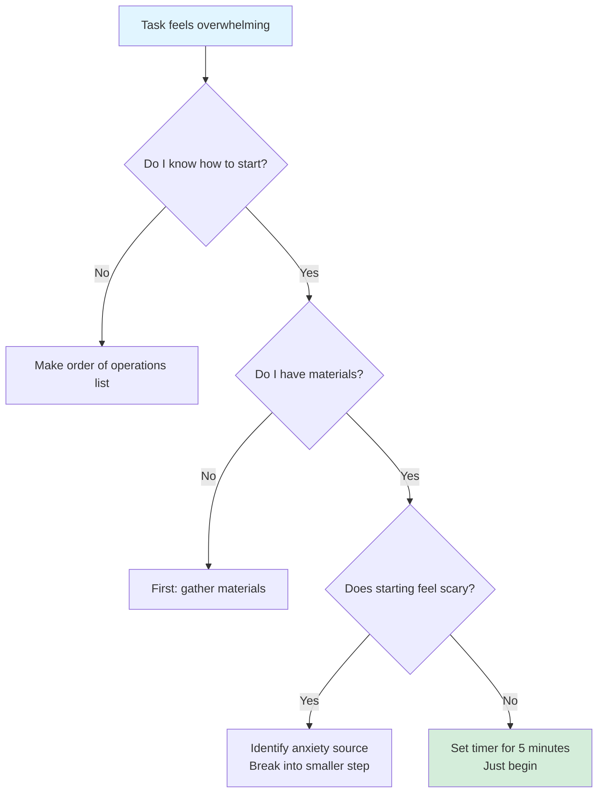

**Node Shapes**
- `[]` Rectangle - standard task/statement
- `()` Rounded rectangle - softer, process step
- `{}` Diamond - decision point (yes/no question)
- `[[]]` Subroutine shape - sub-process
- `[()]` Stadium shape - start/end point
- `{{}}` Hexagon - preparation step

**Arrows & Labels**
- `-->` Simple arrow
- `-->|label|` Labeled arrow
- `-.->` Dotted arrow (optional path)
- `==>` Thick arrow (emphasis)

**Subgraphs for Chunking**
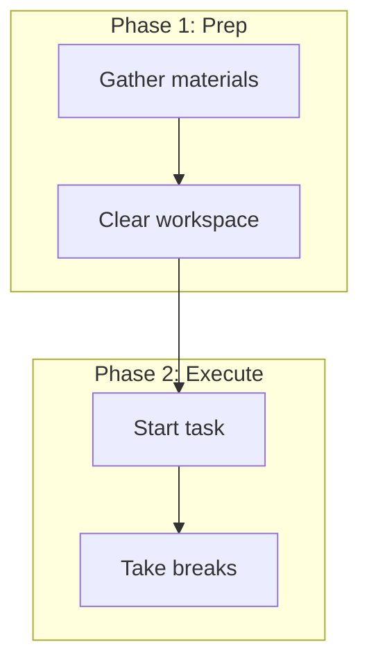

**Best Practices**
- Limit to 15-20 nodes before splitting
- Use subgraphs to chunk information (3-5 chunks)
- Include validation and reassurance in nodes
- Make decision diamonds clear yes/no questions
- Add encouraging statements in terminal nodes

### Mindmaps: Non-Linear Brainstorming

**Syntax Basics**
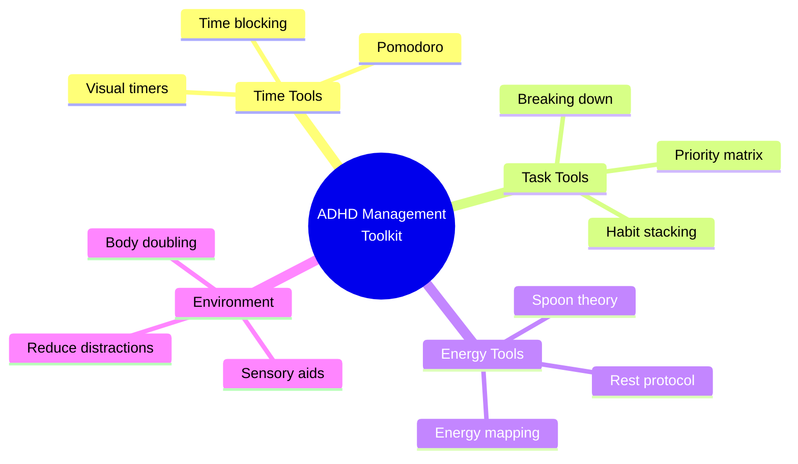

**Key Rules**
- **Start with `mindmap`** keyword
- **Root node** in double parentheses `((text))`
- **Indentation defines hierarchy** - relative spacing only
- **Maximum 3-4 levels deep** to prevent overwhelm
- **Markdown support**: `**bold**`, `*italic*`, `<br/>` for line breaks

**Node Shapes**
- Default text (no delimiters)
- `[Square]`
- `(Rounded)`
- `((Circle))`
- `)Cloud(`
- `{{Hexagon}}`

**Icons** (⚠️ **breaks in GitHub**)
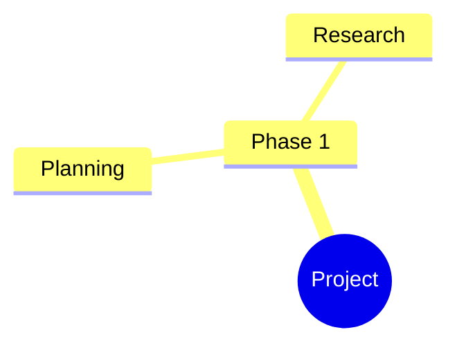

**Best Practices**
- Match ADHD's non-linear thinking patterns
- Use for brainstorming where all ideas appear simultaneously
- Keep branches to 3-5 items each (Miller's Law)
- Avoid icons if sharing on GitHub
- Use consistent indentation (2 or 4 spaces)

### Timelines: Making Time Tangible

**Syntax Basics**
```mermaid
%%{init: {'theme':'forest'}}%%
timeline
    title My Day - Time Blocked for ADHD
    section Morning (High Energy)
    7:00 AM : Wake up routine
           : Medication + breakfast
    8:00 AM : Deep work block
           : Most important task
    section Midday (Medium Energy)
    12:00 PM : Lunch + movement break
    1:00 PM : Meetings + collaboration
    section Afternoon (Variable Energy)
    3:00 PM : Admin tasks
           : Email + light work
    5:00 PM : Wrap up + tomorrow prep
```

**Critical Rules**
- Start with `timeline` keyword
- Optional: `title Your Title` on second line
- **All events before first `section` are IGNORED**
- Format: `TimePeriod : Event1` or `TimePeriod : Event1 : Event2`
- Each event starts with colon on new line
- Time periods accept **any text** (not just numbers): "Q1 2024", "Phase 1", "Morning"

**Sections for Color Coding**
- Use `section Section Name` to group time periods
- Without sections: each period gets its own rainbow color
- With sections: all periods in section share section's color
- Sections provide natural information chunking

**Comments** (⚠️ **weird behavior**)
- `%%` renders as visible text (despite syntax highlighting)
- Use `#` for true inline comments
- Best to avoid comments in timelines

**Best Practices**
- Use sections to chunk events by energy level or day phase
- Make time periods visible (address time blindness directly)
- Include buffer time between events
- Use `<br/>` for line breaks within events
- Color-code by energy: high (green), medium (yellow), low (blue)

### Quadrant Charts: Priority Matrices

**Syntax Basics**
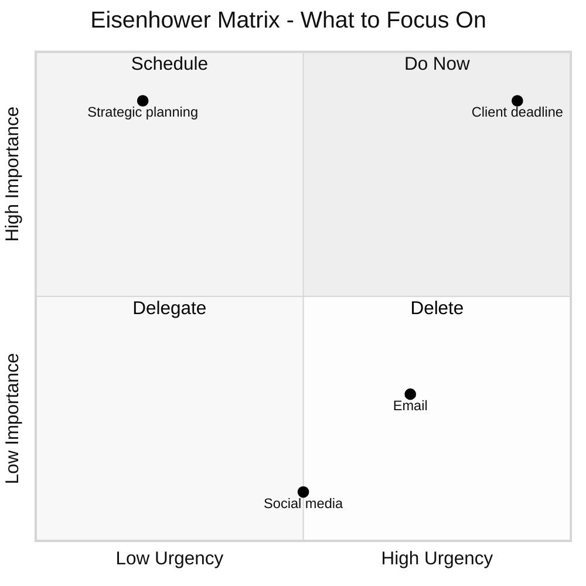

**Quadrant Numbering** (⚠️ **clockwise from top-right**)
- `quadrant-1`: Top-right (high x, high y)
- `quadrant-2`: Top-left (low x, high y)
- `quadrant-3`: Bottom-left (low x, low y)
- `quadrant-4`: Bottom-right (high x, low y)

**Data Points**
- Format: `Point Name: [x, y]`
- **Coordinates must be 0-1** (0 = left/bottom, 1 = right/top)
- Styling: `Point:::className: [x, y]` or inline `radius: 12, color: #ff3300`

**Axis Configuration**
- Single side: `x-axis Label`
- Two sides: `x-axis Left --> Right`
- Same for y-axis

**Best Practices**
- Perfect for Eisenhower Matrix (urgent/important)
- Limit to 8-12 points for readability
- Use for 2-dimensional comparisons
- Clearly label what each quadrant means
- Provides clear action categories (eliminates analysis paralysis)

### Pie Charts: Proportional Visualization

**Syntax Basics**
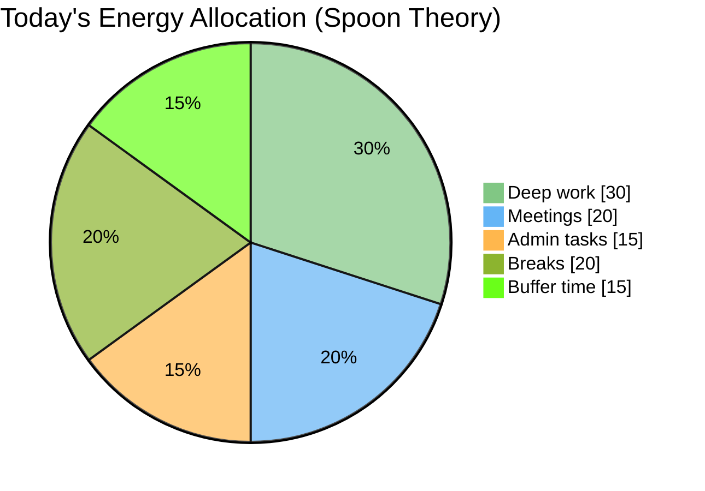

**Key Rules**
- Start with `pie` keyword
- `showData` on second line (optional) displays values + percentages
- Title: `title Title Text` (quotes optional)
- Data: `"Label" : Value` - labels in double quotes, positive numbers only
- Limit to 6-8 slices for readability

**Color Assignment** (⚠️ **by size, not order**)
- Colors assigned largest to smallest percentage
- `pie1` = largest slice, `pie2` = second largest, etc.
- Configure via `themeVariables` in directive

**Best Practices**
- Excellent for spoon theory / energy visualization
- Show proportional time allocation
- Visualize work distribution across categories
- No more than 8 slices (cognitive load)
- Use for "how am I spending my time/energy?" questions

### State Diagrams: System States & Transitions

**Syntax Basics**
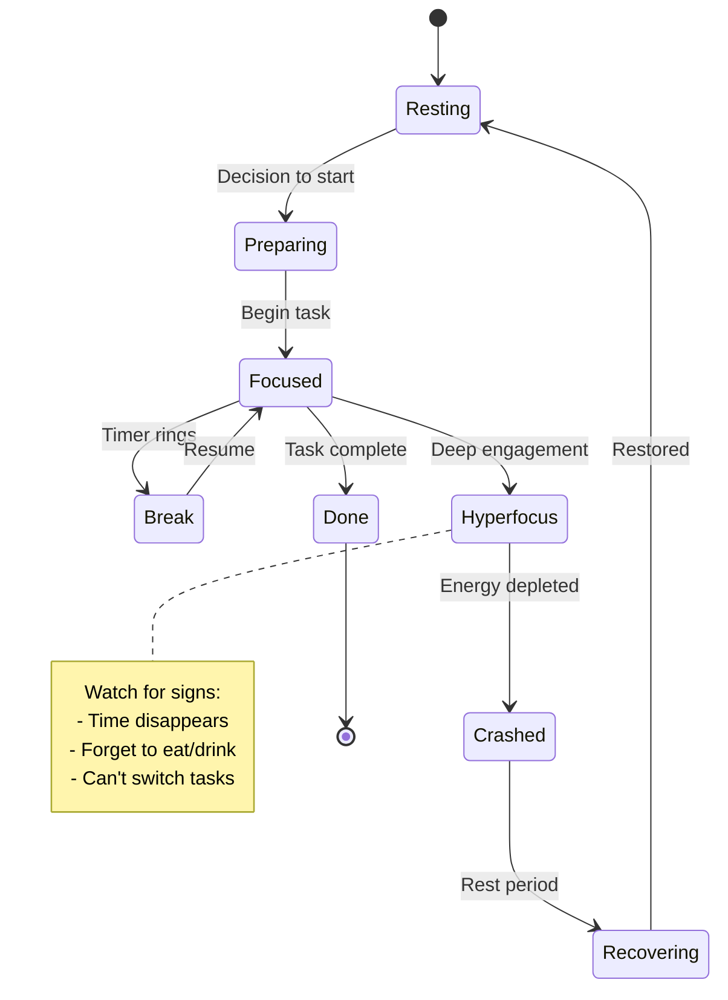

**Key Rules**
- Use `stateDiagram-v2` (not v1)
- `[*]` represents start/end points
- Define states: simple `Moving` or `state Moving` or `Still: Description`
- Transitions: `State1 --> State2: Event label`
- Notes: `note right of State` (or left, right, left of)

**Composite States** (nested)
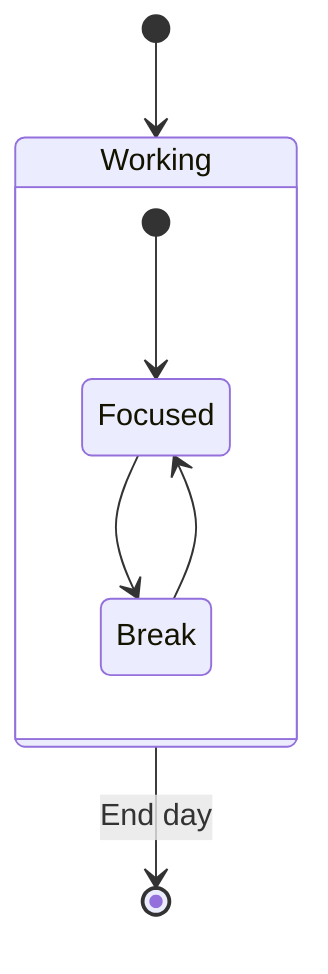

**Advanced Features**
- **Choice nodes**: `state choice <<choice>>` for branching
- **Fork/Join**: `<<fork>>` and `<<join>>` for parallel states
- **Concurrency**: `--` separator between parallel groups

**⚠️ Common Errors**
- Cannot style `[*]` start/end states
- Lowercase "end" as state name breaks diagram (use "End" or "END")
- Cannot transition between internal states of different composites

**Best Practices**
- Track work/focus states and transitions
- Show ADHD-specific states (hyperfocus, crashed, recovering)
- Include notes with coping strategies
- Visualize system states for technical understanding
- Make abstract process flows concrete

### Sankey Diagrams: Flow Visualization

**Syntax Basics**
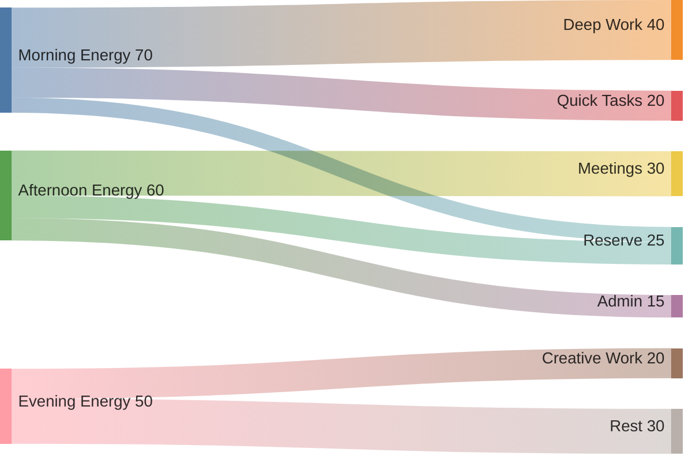

**Critical Rules**
- Start with **YAML frontmatter config** (not directive style)
- Use `sankey-beta` keyword (not `sankey`)
- **CSV format**: `source,target,value` (exactly 3 columns)
- Names with commas: wrap in double quotes `"Name, Inc",Target,10`
- Literal quotes: use double pairs `"He said ""Hi""",Target,5`
- Values must be positive numbers (decimals OK)

**Configuration** (in frontmatter only)
```yaml
config:
  sankey:
    showValues: true          # Display numbers on links
    linkColor: 'gradient'     # 'source', 'target', 'gradient', or hex
    nodeAlignment: 'justify'  # 'justify', 'center', 'left', 'right'
    width: 800               # Diagram width in pixels
    height: 600              # Diagram height in pixels
```

**⚠️ Critical Limitations**
- **No Unicode/non-ASCII characters** (Czech, Japanese, etc.) - causes parse failures
- No title syntax support
- No node aliases
- Node reordering can create unnecessary crossings
- Directive-style `%%{init: {}}%%` config causes errors
- Beta status means syntax may change

**Best Practices**
- Visualize energy flow across activities (spoon theory)
- Show resource distribution and allocation
- Track where time/effort goes
- Make invisible energy expenditure visible
- Use for "where does all my time go?" questions

### User Journey Maps: Experience Tracking

**Syntax Basics**
```mermaid
journey
    title Building a New Habit - ADHD Journey
    section Week 1: Setup
        Choose tiny habit: 5: Me
        Set up reminder: 4: Me, App
        First attempt: 3: Me
    section Week 2: Struggle
        Forget to do it: 2: Me
        Add visual cue: 4: Me
        Start seeing progress: 4: Me
    section Week 3: Momentum
        Feels automatic: 5: Me
        Missing feels weird: 5: Me
```

**Key Rules**
- Start with `journey` keyword
- Optional: `title Your Title`
- Sections: `section Section Name`
- Tasks: `Task Name: <score>: <actors>` (precise format)
- **Scores must be 1-5 integers**:
  - 1 = very negative
  - 2 = negative
  - 3 = neutral
  - 4 = positive
  - 5 = very positive
- Actors comma-separated (optional)

**⚠️ Common Errors**
- Scores outside 1-5 range break rendering
- Incorrect colon placement in format
- Forgetting to indent tasks under sections

**Best Practices**
- Track satisfaction across habit-building phases
- Show emotional journey of ADHD management
- Visualize experience across project stages
- 5-point scale reduces decision complexity (good for ADHD)
- Validates struggle periods (week 2 dip is normal)

## Troubleshooting Common Errors

### Indentation Issues
**Problem**: Generic errors in mindmaps, composites, Kanban
**Solution**: 
- Use consistent indent (2 or 4 spaces)
- Check relative indentation levels carefully
- Remember: actual amount doesn't matter, only relative difference

### Reserved Words
**Problem**: Diagram breaks when using "end"
**Solution**: Use "End", "END", or any capitalization variant

### Special Characters
**Problem**: Quotes, commas, unicode characters break rendering
**Solution**:
- Use `""` for literal double quotes
- Wrap comma-containing text in double quotes
- **Avoid unicode** in Sankey diagrams (no workaround)
- Use HTML entities: `#` + character code

### Configuration Errors
**Problem**: Config doesn't apply or causes errors
**Solution**:
- **Sankey requires YAML frontmatter** (not directives)
- Most other diagrams use `%%{init: {}}%%` directives
- `showData` in pie charts must be on line 2
- Remove `::icon()` syntax for GitHub compatibility

### Version Compatibility
**Problem**: Diagram feature not rendering
**Solution**:
- Packet diagrams: v11.0.0+
- Architecture diagrams: v11.1.0+
- Sankey diagrams: v10.3.0+
- Beta features may change syntax
- Test in Mermaid Live Editor (mermaid.live) first

### Points Disappear in Quadrant Charts
**Problem**: Data points not showing
**Solution**: 
- Ensure coordinates are between 0-1
- Check quadrant numbering (clockwise from top-right)

### Timeline Events Missing
**Problem**: Events don't appear
**Solution**: 
- ALL events before first `section` are ignored
- Add a section before any events

## Workflow: Creating Effective Neurodivergent Visualizations

### Step 1: Understand the Need & Gather Context

Ask clarifying questions if needed:
- What specifically feels overwhelming?
- What's the desired outcome?
- What's the time frame (if any)?
- What's your current energy level?
- Have you tried to start? What stopped you?

**Listen for key phrases:**
- "I don't know where to start" → Task initiation block (flowchart diagnosis)
- "Too many things" → Overwhelm (quadrant chart or Kanban)
- "I can't decide" → Analysis paralysis (decision tree or matrix)
- "Time disappears" → Time blindness (timeline or Gantt)
- "No energy" → Spoon theory (pie chart or Sankey)

### Step 2: Select Diagram Type

Based on the cognitive need, choose the appropriate diagram type from the comprehensive guide above. Consider:

**Information Processing Need:**
- **Sequential thinking** → Timeline, Gantt, Flowchart
- **Hierarchical organization** → Mindmap, State diagram
- **Comparison** → Quadrant chart, Pie chart
- **Flow tracking** → Sankey, User journey
- **Status management** → State diagram, Kanban

**Cognitive Load:**
- **High overwhelm** → Simple flowchart (≤10 nodes), Timeline with 3 sections
- **Medium complexity** → Mindmap (3 levels), Quadrant chart (≤10 points)
- **Detail needed** → Gantt chart, Sankey, User journey

### Mode-Aware Template Selection

After determining user need and mode:

1. **Load template from mode-specific directory:**
   - Neurodivergent: `templates/neurodivergent/[pattern].md`
   - Neurotypical: `templates/neurotypical/[pattern].md`

2. **Apply mode characteristics:**
   - Chunk size limits
   - Time estimate multipliers
   - Language style
   - Color schemes

3. **Generate diagram:**
   - Use Mermaid syntax from template
   - Customize with user-specific content
   - Apply mode-appropriate styling

**Example:**
```
User: "I need to clean my apartment but don't know where to start" (auto-detect → neurodivergent)
Pattern: task-breakdown
Template: templates/neurodivergent/task-breakdown.md
Characteristics: 3-5 minute tasks, compassionate language, energy indicators
```

### Step 3: Apply Neurodivergent Design Principles

Before generating the diagram, plan for:

**Color & Theme**
- Use `forest` or `neutral` theme for calming palette
- Limit to 3-4 colors maximum
- Apply 60-30-10 rule
- Ensure 4.5:1 contrast ratio

**Information Density**
- Chunk into 3-5 sections maximum
- Limit nodes/points per section to 5-7 items
- Use white space generously
- Add TL;DR if complex

**Language**
- Compassionate phrasing (no "just" or "should")
- Realistic time estimates (1.5-2x)
- Acknowledge energy costs
- Include validation statements
- Provide permission to modify

**Visual Hierarchy**
- Make important nodes notably larger
- Use `classDef` for styling priority items
- Clear next actions in distinct color
- Progress indicators where applicable

### Step 4: Generate Visualization

Create the Mermaid diagram following the selected pattern. Customize with:
- User's specific tasks/options/context
- Realistic time estimates (be generous!)
- Energy indicators (⚡ symbols or spoon counts)
- Compassionate, validating language
- Clear, concrete next actions
- Progress markers (celebrate what's done)

**Always use the Mermaid validation tool to render the diagram.**

### Step 5: Provide Context & Support

After showing the diagram, include:

**Explanation**
- How to read/use the diagram
- What each section/color represents
- Where to start (concrete first step)

**Permission & Flexibility**
- "You can modify this however works for you"
- "This is a starting point, not a rigid rule"
- "It's okay to skip steps or adjust times"

**Validation & Encouragement**
- "Starting is genuinely the hardest part - you're not weak"
- "Task initiation difficulty is executive dysfunction, not laziness"
- "Breaking this down is progress in itself"

**Offer Integration**
- "Would you like me to save this to your Obsidian vault?"
- "Want me to create a follow-up diagram for [next step]?"
- "Need help breaking down any of these steps further?"

## Integration with Obsidian & Note-Taking

If the user wants to save visualizations:

1. Use `obsidian:create` tool to create a new note
2. Include helpful context above the diagram:
   ```markdown
   # Project Breakdown - [Project Name]
   
   Created: [Date]
   Energy level when created: [Level]
   
   ## How to use this
   [Brief instructions]
   
   ## The Breakdown
   [Mermaid code block]
   
   ## Next Actions
   - [ ] [First concrete step]
   
   ## Notes
   [Space for adjustments]
   ```
3. Use clear, descriptive filenames: "Task Breakdown - Apartment Cleaning.md"
4. Suggest tagging: #adhd-tools, #task-breakdown, etc.

## Switching Modes Mid-Conversation

Users can request mode changes at any time:

**To neurotypical mode:**
- "Can you make this more high-level?"
- "Use neurotypical mode for this diagram"
- "Make it more efficient/compact"

**To neurodivergent mode:**
- "Break this down more"
- "I'm feeling overwhelmed, can you simplify?"
- "Use ADHD-friendly mode"

**To colorblind-safe mode:**
- "Make this colorblind-friendly"
- "Use patterns instead of colors"
- "I need this accessible for color vision deficiency"

**To monochrome mode:**
- "I need to print this in black and white"
- "Make this e-ink friendly"
- "Can you make a print-optimized version?"

**To combine modes:**
- "Use neurodivergent mode with colorblind-safe patterns"
- "Make it ADHD-friendly and monochrome for printing"
- "Neurotypical + colorblind-safe please"

**What changes when switching:**
1. Regenerate current diagram with new mode template
2. Adjust chunk sizes and time estimates (base mode)
3. Update language style (base mode)
4. Apply visual encoding patterns (accessibility mode)
5. Update color scheme, borders, and fills
6. Adjust text prefixes and labels
7. Explain what changed and why

## Reference Files (Additional Patterns)

The skill includes detailed reference files with specific patterns:

- **references/task-breakdowns.md** - Linear timelines, branching breakdowns, energy-aware sequences
- **references/decision-tools.md** - Decision trees, weighted matrices, elimination filters
- **references/project-maps.md** - Phase maps, dependency diagrams, MVP breakdowns
- **references/current-state-boards.md** - Kanban boards, priority matrices, context tracking
- **references/time-boxing.md** - Pomodoro technique, time-blocked days, focus sessions, energy mapping
- **references/habit-building.md** - Tiny habits, routine sequences, habit stacking, momentum tracking
- **references/accountability-support.md** - Body doubling, check-ins, support networks, crisis protocols
- **references/focus-regulation.md** - Pre-task calm-down, sensory tools, emotional regulation, recovery

**Read relevant reference files for specific proven patterns and examples.**

## Anti-Patterns to Avoid

### Design Anti-Patterns
❌ Too many nodes/elements (>20 in flowchart, >8 in pie chart)
❌ More than 4-5 information chunks per section
❌ Bright, clashing colors or high-saturation palettes
❌ Competing visual elements fighting for attention
❌ Auto-playing animations or flashy effects
❌ Insufficient white space causing visual overwhelm
❌ Text walls without chunking or hierarchy

### Language Anti-Patterns
❌ Judgmental phrases: "just do it", "should be easy", "simply"
❌ Unrealistic time estimates (underestimate by 50%+)
❌ Vague goals: "work on project" (too abstract)
❌ Perfectionist standards: "must complete all steps"
❌ No acknowledgment of energy costs
❌ Making everything urgent/high-priority (creates paralysis)

### Process Anti-Patterns
❌ Creating diagrams without usage instructions
❌ Forgetting to validate with Mermaid tool before sharing
❌ Not offering to save to Obsidian/notes
❌ Skipping permission statements about modification
❌ Providing no encouragement or validation
❌ Creating one-size-fits-all solutions
❌ Ignoring user's current energy level

### Technical Anti-Patterns
❌ Using icons `::icon()` in GitHub-bound diagrams
❌ Directive config for Sankey diagrams
❌ Unicode characters in Sankey diagrams
❌ Lowercase "end" as state name
❌ Timeline events before first section
❌ Quadrant coordinates outside 0-1 range
❌ Forgetting `showData` on line 2 for pie charts

## Example Usage Scenarios

### Scenario 1: Task Initiation Paralysis

**User:** "I need to clean my apartment but it's so messy I don't know where to start"

**Claude's Approach:**
1. Recognize **task initiation block** (classic executive dysfunction)
2. Choose **flowchart** (decision tree to diagnose the block) or **timeline** (break into phases)
3. Apply principles:
   - Break into 10-15 minute chunks
   - Start with "quick wins" (visible progress)
   - Include decision points: "Do I have cleaning supplies?"
   - Use `forest` theme (calming green)
   - Add validation: "Feeling overwhelmed is valid"
4. Generate diagram with specific rooms/tasks
5. Render with Mermaid tool
6. Provide context: "Start with just ONE quick win - seeing progress helps motivation"
7. Offer to save to Obsidian

### Scenario 2: Decision Paralysis

**User:** "Should I take this new job offer or stay at my current job? I've been thinking about it for weeks and can't decide"

**Claude's Approach:**
1. Recognize **analysis paralysis** (decision fatigue)
2. Ask about key factors that matter to them
3. Choose **quadrant chart** (2-dimensional comparison) or **flowchart** (decision tree with validation)
4. Apply principles:
   - Limit to 5-7 key factors (prevent overwhelm)
   - Use neutral theme (reduce emotional reactivity)
   - Include validation: "Big decisions are hard - breaking it down helps"
   - Clear action categories per quadrant
5. Generate diagram with their specific priorities
6. Include reflection prompt: "Notice which quadrant has more clustering?"
7. Offer to create follow-up diagram exploring gut feeling

### Scenario 3: Overwhelmed by Multiple Tasks

**User:** "I have too many things on my plate and can't figure out what to do first"

**Claude's Approach:**
1. Recognize **overwhelm + priority paralysis**
2. Choose **quadrant chart** (Eisenhower Matrix) or **pie chart** (see proportions)
3. Apply principles:
   - Sort into 4 clear categories (Do Now, Schedule, Delegate, Delete)
   - Use calming colors with clear differentiation
   - Limit to 10-12 tasks visible at once
   - Include permission: "Not everything has to be done today"
4. Create Eisenhower Matrix showing tasks by urgency/importance
5. Provide clear next actions: "Start with just ONE from 'Do Now' quadrant"
6. Validate: "Having too much is real - this isn't a personal failure"
7. Offer to break down the "Do Now" task further if needed

### Scenario 4: Time Blindness Struggle

**User:** "My day just disappears and I never get my important work done. Time management tools don't work for me"

**Claude's Approach:**
1. Recognize **time blindness** (core ADHD deficit)
2. Choose **timeline** (make time visible) or **Gantt chart** (time-blocked day)
3. Apply principles:
   - Use sections for energy levels (Morning: high, Afternoon: medium)
   - Include buffer time between tasks (1.5x estimate)
   - Color-code by task type (deep work, admin, breaks)
   - Realistic 2-3 hour deep work block maximum
4. Generate time-blocked day with visible time periods
5. Include validation: "Time blindness is neurological, not a character flaw"
6. Provide usage tip: "Set phone alarms for section transitions"
7. Offer to track actual vs. estimated time to reveal patterns

### Scenario 5: Habit Building Difficulty

**User:** "I want to start exercising but I always forget or can't get myself to do it"

**Claude's Approach:**
1. Recognize **habit initiation + memory challenges**
2. Choose **flowchart** (habit stacking) or **user journey** (track experience)
3. Apply principles:
   - Start with "tiny habit" (2 minutes of stretching, not 30-minute workout)
   - Attach to existing habit: "After I brush teeth → 2 push-ups"
   - Include setup phase: "Put yoga mat by bed the night before"
   - Track satisfaction scores showing Week 2 dip is normal
4. Generate habit stacking flowchart or journey map
5. Validate: "Brains need 30-90 days for habits - Week 2 always sucks"
6. Provide tip: "Visual cue (mat by bed) bypasses working memory"
7. Offer follow-up: weekly journey tracking to show progress

### Scenario 6: Spoon Theory / Energy Management

**User:** "I'm always exhausted and don't know why I have no energy for things I need to do"

**Claude's Approach:**
1. Recognize **energy depletion** without awareness of expenditure
2. Choose **pie chart** (energy allocation) or **Sankey diagram** (energy flow)
3. Apply principles:
   - Visualize different spoon types (executive, social, sensory, focus)
   - Show where energy goes (make invisible visible)
   - Use calming colors with distinct categories
   - Include recovery/reserve allocation
4. Generate spoon allocation pie chart for typical day
5. Validate: "ADHD brains use more energy for 'simple' tasks"
6. Provide insight: "Notice how much goes to masking/compensation?"
7. Offer follow-up: weekly energy pattern tracking to identify drains

## Research Foundation

This skill is built on:

**ADHD Neuroscience**
- Cognitive-Energetic Model (effort, arousal, activation, vigilance)
- Working memory constraints (3-5 chunks for ADHD vs 5-7 neurotypical)
- P1 component deficits in early visual processing
- Time perception distortions (time blindness)

**Visual Processing Research**
- Visual aids externalize executive function
- Working memory offloading improves performance
- Visual-spatial strengths in ADHD populations
- Pattern recognition as compensatory strategy

**Cognitive Load Theory**
- Increased load reduces ADHD performance more severely
- Chunking reduces working memory demands
- Progressive disclosure manages attention
- Predictable layouts reduce cognitive friction

**Design Principles**
- WCAG accessibility guidelines (4.5:1 contrast)
- Miller's Law (5±2 chunks, adjusted for ADHD)
- Gestalt principles (proximity, similarity)
- Nielsen Norman Group findings (79% scan vs read)

## Community Resources

Active neurodivergent community innovation:
- **Reddit r/ADHD** - User-shared tools and patterns
- **ADDitude Magazine** - Research-backed strategies
- **CHADD** - Evidence-based resources
- **Neurodivergent-founded apps**: Tiimo, RoutineFlow, Lunatask

**Key Insight**: Designing for cognitive accessibility creates better experiences for everyone. Visual diagrams that work for ADHD brains represent excellent information design universally.

## Playground Links and URL Encoding

When providing links to edit Mermaid diagrams in online playgrounds (like https://mermaid.live), you MUST properly URL-encode the diagram content, especially HTML entities like `<br/>` tags.

### Common Issue: Broken `<br/>` Tags

Mermaid diagrams use `<br/>` for line breaks in node text. These MUST be encoded properly in URLs.

**❌ BROKEN** (angle brackets not encoded):
```
https://mermaid.live/edit#pako:flowchart TD
    Start{Can decide<br/>in 3 seconds?}
```

**✅ CORRECT** (all characters properly encoded):
```
https://mermaid.live/edit#pako:flowchart%20TD%0A%20%20%20%20Start%7BCan%20decide%3Cbr%2F%3Ein%203%20seconds%3F%7D
```

### URL Encoding Rules

Use Python's `urllib.parse.quote()` with `safe=''` to encode ALL special characters:

```python
import urllib.parse

diagram = """flowchart TD
    Start{Can decide<br/>in 3 seconds?}"""

encoded = urllib.parse.quote(diagram, safe='')
url = f"https://mermaid.live/edit#pako:{encoded}"
```

**Key encodings:**
- `<` → `%3C`
- `>` → `%3E`
- `/` → `%2F`
- Space → `%20`
- Newline → `%0A`
- `{` → `%7B`
- `}` → `%7D`

### When Providing Playground Links

Always include properly encoded playground links in your diagram output:

```markdown
## 🎯 Master Decision Flowchart

[🎨 Edit in Playground](https://mermaid.live/edit#pako:{PROPERLY_ENCODED_DIAGRAM})

\`\`\`mermaid
{DIAGRAM_CODE}
\`\`\`
```

This allows users to:
- View rendered diagrams online
- Edit and customize diagrams
- Share diagrams with collaborators
- Access diagrams on mobile devices

### Testing Links

Before providing a playground link, verify that:
1. The URL opens without errors
2. The diagram renders correctly
3. All `<br/>` tags display as line breaks (not literal `<br/>` text)

If angle brackets appear as literal text in the rendered diagram, the URL encoding is broken.

## Version History

- **v3.0.1** (Current): Fixed playground link URL encoding for `<br/>` tags and other HTML entities. Added comprehensive URL encoding guidance and checklist item.
- **v3.0** : Mode system (neurodivergent/neurotypical/auto-detect), configuration file support, enhanced accessibility features
- **v2.0**: Comprehensive Mermaid 11.12.1 syntax, research-backed neurodivergent design principles, troubleshooting guide, expanded diagram types
- **v1.0**: Initial release with basic patterns and reference files

---

## Quick Reference Card

**When user says...** → **Use this diagram type**

- "I don't know where to start" → Flowchart (decision tree)
- "This is overwhelming" → Timeline or Gantt (break into phases)
- "I can't decide" → Quadrant chart (Eisenhower Matrix)
- "What should I focus on?" → Quadrant chart or Pie chart
- "Too many things" → Kanban or State diagram
- "Time disappears" → Timeline (make time visible)
- "No energy" → Pie or Sankey (spoon theory)
- "How does this work?" → State diagram or Flowchart
- "Build a habit" → Flowchart (habit stacking) or User journey
- "Plan my day" → Timeline or Gantt (time-blocked)

**Always:**
✅ Use calming colors (forest/neutral theme)
✅ Limit to 3-5 chunks per section
✅ Be compassionate and realistic
✅ Validate with Mermaid tool
✅ Provide usage instructions
✅ Offer to save to Obsidian
✅ Properly URL-encode playground links (especially `<br/>` tags)

**Never:**
❌ Judgmental language ("just" or "should")
❌ Unrealistic time estimates
❌ Too many nodes/elements
❌ Bright clashing colors
❌ Skip encouragement and validation