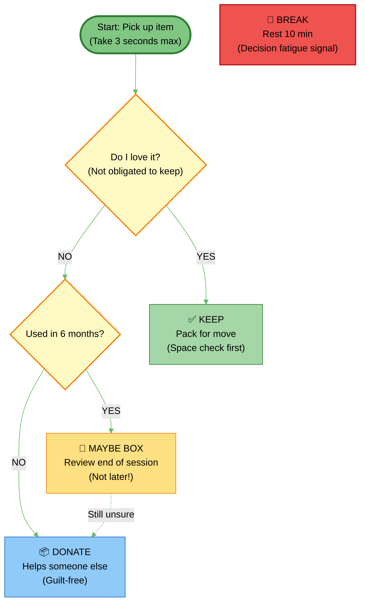
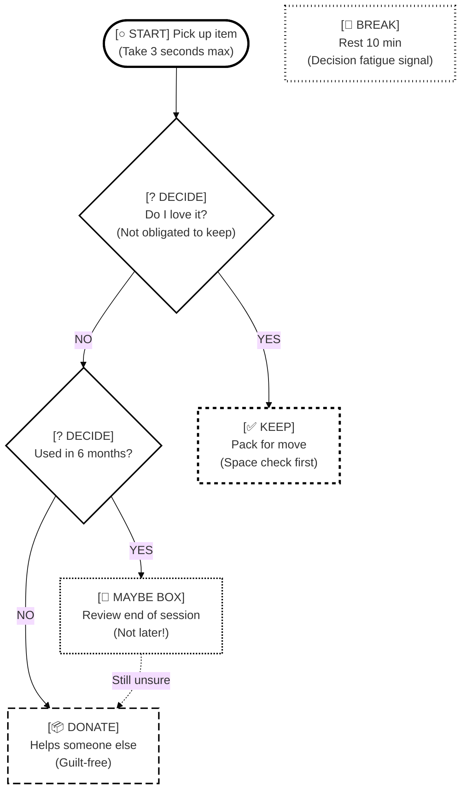
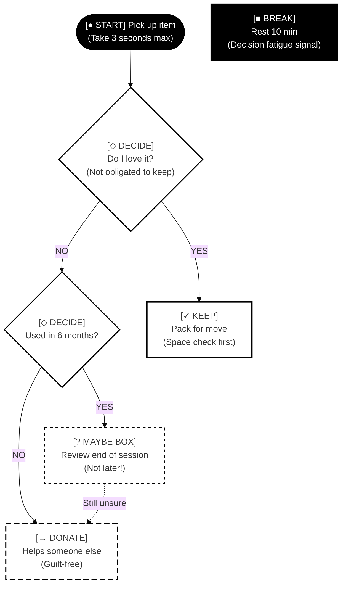
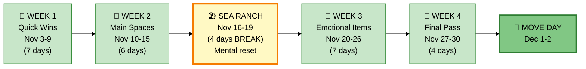
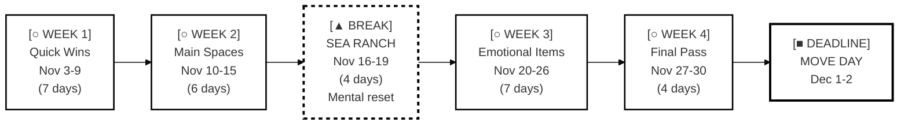
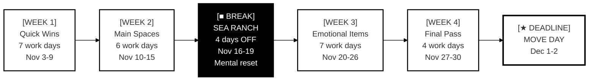

# v3.1 Accessibility Modes - Complete Examples

This document demonstrates the three visual encoding modes available in neurodivergent-visual-org v3.1:
1. **Regular Mode** - Standard color-based encoding (works for full color vision)
2. **Colorblind-Safe Mode** - Pattern-based encoding (works for all color vision types)
3. **Monochrome Mode** - Pure B&W encoding (optimized for printing and e-ink)

All examples use **neurodivergent base mode** (ADHD-friendly language and time estimates). You can combine any accessibility mode with either neurodivergent or neurotypical base mode.

---

## Example 1: Simple Decision Flow

**Scenario:** Deciding whether to keep or donate an item during decluttering.

### Regular Mode (Color-Based)



**Strengths:**
- Quick visual scanning with calming colors
- Intuitive color associations (green = keep, blue = donate)
- ADHD-friendly (soft pastels, not overwhelming)

**Weaknesses:**
- Fails for colorblind users (8% of males, 0.5% of females)
- Loses meaning in B&W printing
- Color meanings must be learned

---

### Colorblind-Safe Mode (Pattern-Based)



**Pattern Legend:**
- `━ ━ ━` Short dashes (5px gap) = KEEP items
- `━━━ ━━━` Long dashes (10px gap) = DONATE items
- `· · · ·` Dots (2px) = MAYBE items (uncertainty)
- `━·━·━·` Dot-dash (1px/4px) = BREAK needed
- **Bold border** (3px) = Critical/high importance
- **Standard border** (2px) = Normal importance

**Strengths:**
- Works for ALL color vision types (protanopia, deuteranopia, tritanopia, total colorblind)
- Text prefixes `[✅ KEEP]` make meaning explicit
- Patterns provide redundant encoding (you don't need to remember what they mean)
- Still printable in color or B&W

**Weaknesses:**
- Slightly more visual complexity (patterns + text)
- Requires learning pattern system (but self-documenting with prefixes)

---

### Monochrome Mode (Print-Optimized)



**Fill Pattern Legend:**
- `████` Solid black fill, white text = Critical (START, BREAK)
- `▯▯▯▯` White fill, bold 3px border = High importance (KEEP)
- `▯▯▯▯` White fill, dashed border = Medium priority (DONATE, MAYBE)
- `▯▯▯▯` White fill, standard border = Normal (DECIDE)

**Text Symbol Legend:**
- `[● START]` - Filled circle (start point)
- `[◇ DECIDE]` - Hollow diamond (decision)
- `[✓ KEEP]` - Text checkmark
- `[→ DONATE]` - Text arrow
- `[? MAYBE]` - Text question mark
- `[■ BREAK]` - Solid square (stop)

**Strengths:**
- Perfect for B&W photocopiers (no grays to print unpredictably)
- Excellent on e-ink displays (Kindle, reMarkable)
- Maximum contrast (#000000 vs #ffffff)
- Verbose text labels (no reliance on color or pattern memory)
- Budget-friendly (saves color ink)

**Weaknesses:**
- Less visually appealing than color versions
- More text-heavy (but this is intentional for clarity)
- Start point less prominent (but solid black compensates)

---

## Example 2: Weekly Timeline with Break

**Scenario:** 4-week decluttering timeline with mandatory break.

### Regular Mode (Color-Based)



---

### Colorblind-Safe Mode (Pattern-Based)



**Shape + Text Coding:**
- `[○ WEEK]` - Circle prefix for work periods
- `[▲ BREAK]` - Triangle prefix for mandatory breaks (warning to protect)
- `[■ DEADLINE]` - Square prefix for fixed deadlines

---

### Monochrome Mode (Print-Optimized)



**Monochrome Priorities:**
- Solid black = BREAK (Priority 1: Must protect)
- Bold border = Deadline (Priority 2: Cannot miss)
- Standard border = Work weeks (Priority 3: Standard)

---

## When to Use Each Mode

### Use Regular Mode When:
- ✅ You have full color vision
- ✅ Viewing on screen (not printing)
- ✅ Want calming, ADHD-friendly colors
- ✅ Need quick emotional processing (color associations)
- ✅ Personal use only (not sharing with unknown audience)

### Use Colorblind-Safe Mode When:
- ✅ You have any form of color vision deficiency (CVD)
- ✅ Sharing with others (unknown vision capabilities)
- ✅ Need WCAG 2.1 accessibility compliance
- ✅ Want redundant encoding (pattern + color + text)
- ✅ Public-facing documents or presentations
- ✅ Educational materials (reach widest audience)

### Use Monochrome Mode When:
- ✅ Printing on B&W printer or photocopier
- ✅ Using e-ink display (Kindle, reMarkable, etc.)
- ✅ Budget printing (save expensive color ink)
- ✅ Maximum contrast needed (vision impairments)
- ✅ Archival documents (B&W lasts longer than color)
- ✅ Faxing or scanning documents

---

## Mode Comparison Matrix

| Feature | Regular | Colorblind-Safe | Monochrome |
|---------|---------|-----------------|------------|
| **Color vision required** | ✅ Yes | ❌ No | ❌ No |
| **Works in B&W** | ⚠️ Loses meaning | ✅ Yes | ✅ Perfect |
| **Photocopy-friendly** | ❌ Poor | ⚠️ Good | ✅ Excellent |
| **E-ink display** | ⚠️ Okay | ✅ Good | ✅ Excellent |
| **Screen viewing** | ✅ Excellent | ✅ Good | ⚠️ Utilitarian |
| **Quick scanning** | ✅ Fastest | ✅ Fast | ⚠️ Slower |
| **Learning curve** | ⚠️ Learn colors | ✅ Self-doc | ✅ Self-doc |
| **Visual appeal** | ✅ High | ✅ Medium | ⚠️ Functional |
| **Protanopia support** | ❌ Fails | ✅ Works | ✅ Works |
| **Deuteranopia support** | ❌ Fails | ✅ Works | ✅ Works |
| **Tritanopia support** | ⚠️ Some issues | ✅ Works | ✅ Works |
| **Total colorblind** | ❌ Fails | ✅ Works | ✅ Works |
| **Print cost** | 💰💰💰 Color | 💰💰 Color | 💰 B&W |
| **WCAG 2.1 1.4.1** | ❌ Fails | ✅ Pass | ✅ Pass |

---

## Combining Base Mode with Accessibility Mode

**Example Commands:**

```markdown
"Create a task breakdown using neurodivergent mode with colorblind-safe patterns"
→ ADHD-friendly language + pattern-based visuals

"Make a timeline with neurotypical mode and monochrome for printing"
→ Efficient language + B&W print-optimized

"Use ADHD mode with print-friendly encoding"
→ Compassionate language + monochrome visuals
```

**What You Get:**

| Base Mode | Accessibility Mode | Language | Time Estimates | Visual Encoding |
|-----------|-------------------|----------|----------------|-----------------|
| Neurodivergent | None | Compassionate | 1.5-2x buffer | Calming colors |
| Neurodivergent | Colorblind-Safe | Compassionate | 1.5-2x buffer | Patterns + text |
| Neurodivergent | Monochrome | Compassionate | 1.5-2x buffer | Pure B&W |
| Neurotypical | None | Direct | Standard | Standard colors |
| Neurotypical | Colorblind-Safe | Direct | Standard | Patterns + text |
| Neurotypical | Monochrome | Direct | Standard | Pure B&W |

---

## Testing Your Diagrams

### Colorblind Simulation Tools

**Online Simulators:**
- [Coblis Color Blindness Simulator](https://www.color-blindness.com/coblis-color-blindness-simulator/)
- [Colblindor CVD Simulator](https://www.color-blindness.com/color-blindness-tests/)

**Browser DevTools:**
- Chrome/Edge: DevTools → Rendering → Emulate vision deficiencies
- Firefox: Accessibility Inspector → Simulate

**Test Process:**
1. Create diagram in colorblind-safe or monochrome mode
2. Run through all CVD simulators (protanopia, deuteranopia, tritanopia)
3. Verify all information remains clear without color
4. Check that text prefixes and patterns convey full meaning

### Print Testing

**For Monochrome Mode:**
1. Export diagram to PNG or PDF
2. Print on B&W laser printer
3. Check:
   - All text readable (12pt minimum)
   - Borders clearly visible (not too faint)
   - Fill patterns distinct (solid black vs white)
   - No grays that print unpredictably
4. Optional: Photocopy the print to test 3rd-generation degradation

---

## Accessibility Compliance

### WCAG 2.1 Guidelines Met

**Colorblind-Safe Mode:**
- ✅ **1.4.1 Use of Color** (Level A) - Information not conveyed by color alone
- ✅ **1.4.3 Contrast Minimum** (Level AA) - 4.5:1 contrast ratio (black borders)
- ✅ **1.4.6 Contrast Enhanced** (Level AAA) - 7:1 contrast ratio (black on white)

**Monochrome Mode:**
- ✅ **1.4.1 Use of Color** (Level A) - No color used
- ✅ **1.4.3 Contrast Minimum** (Level AA) - Pure B&W = maximum contrast
- ✅ **1.4.6 Contrast Enhanced** (Level AAA) - 21:1 contrast ratio (#000/#fff)
- ✅ **1.4.11 Non-text Contrast** (Level AA) - UI components have sufficient contrast

**Color Vision Deficiency Coverage:**
- ✅ Protanopia (red-blind, ~1% males)
- ✅ Deuteranopia (green-blind, ~1% males)
- ✅ Tritanopia (blue-blind, rare <0.01%)
- ✅ Achromatopsia (total colorblind, very rare)
- ✅ Regular color vision (patterns add clarity, not noise)

---

## Next Steps

1. **Try the examples above** - Copy and paste into Mermaid Live Editor
2. **Test with simulators** - Verify colorblind-safe mode works for you
3. **Print monochrome examples** - See how they look on paper
4. **Request mode combinations** - Mix base mode + accessibility mode
5. **Provide feedback** - What works? What could be clearer?

---

**Version:** 3.1.0
**Created:** 2025-11-04
**Purpose:** Demonstrate v3.1 accessibility modes with complete examples
**Related Files:**
- `SKILL.md` - Main skill documentation
- `COLORBLIND-MODE-PROPOSAL.md` - Design rationale and specifications
- `MODE-COMPARISON-EXAMPLES.md` - Side-by-side mode comparisons
