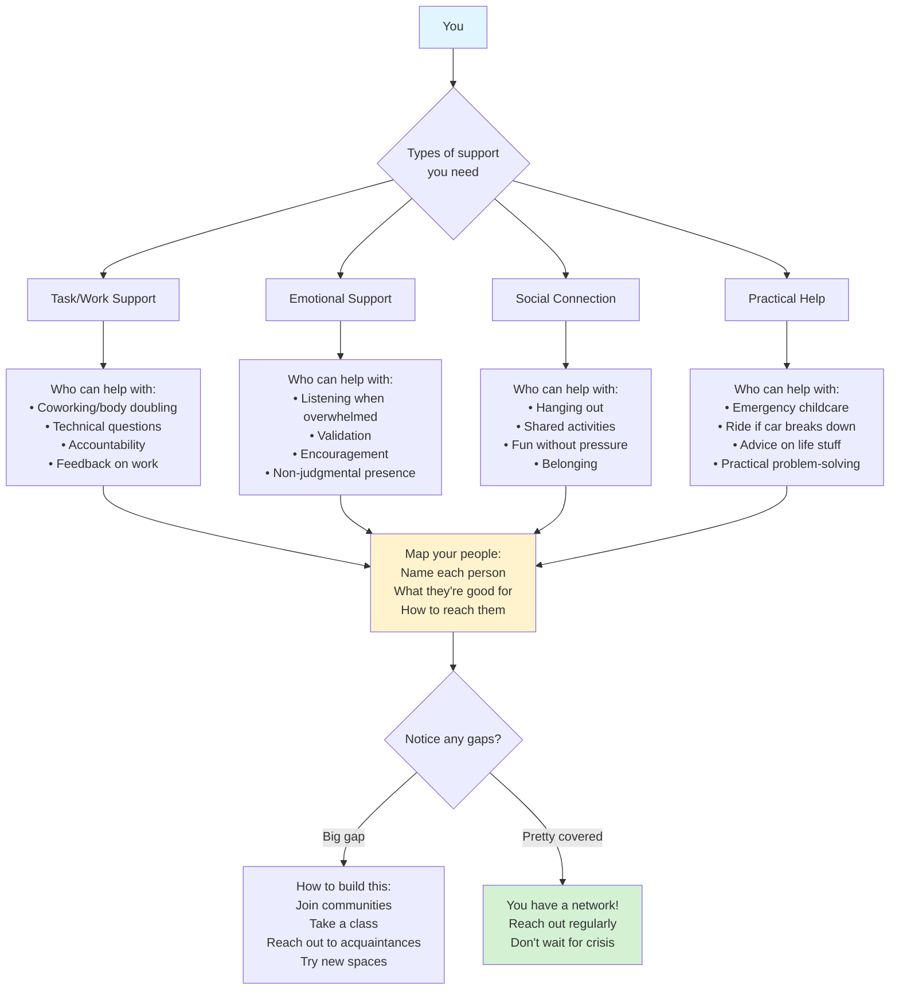

# Accountability & Support Planning

## Overview

Accountability patterns help create external support systems that work WITH neurodivergent brains. Includes body doubling, check-ins, and knowing when/how to reach out.

## When to Use

- User mentions working alone feels impossible
- User asks about accountability partners or body doubling
- User struggles to start tasks without external pressure
- User mentions isolation or needing company
- User asks "how do I stay accountable?"
- User needs help knowing when to ask for support

## Pattern: Body Doubling Session Plan

Use when user wants to try body doubling (working alongside someone).

**What body doubling is NOT:**
- Not collaboration (you work separately)
- Not socializing (minimal talking)
- Not teaching/helping (just presence)
- Not pressure (gentle accountability)

**What it IS:**
- Parallel work
- Borrowed motivation
- External regulation
- Warm companionship

## Pattern: Accountability Check-In Schedule

Use when user wants regular check-ins but not constant body doubling.

**Accountability partner guidelines:**
- NOT a manager or supervisor
- Someone also working on their goals
- Reciprocal support
- Check in on schedule
- Celebrate wins together
- No shame about struggles

**Where to find accountability partners:**
- ADHD online communities
- Friends with similar goals
- Coworkers (if appropriate)
- Paid accountability coaches
- Group programs

## Pattern: When to Reach Out Decision Tree

Use when user struggles knowing when to ask for help vs. figure it out alone.

**Important mindset shifts:**
- Asking for help = strength, not weakness
- 2 hours stuck = too long alone
- Documenting = helping future you
- Reciprocal support = healthy

**ADHD-specific note:** "I should figure this out" can trap you for hours. Set a timer when starting.

## Pattern: Support Network Map

Use when user needs to identify their support system.

**Key insight:** No one person = all support types. That's too much pressure. Different people for different needs.

**How to build support:**
- Start with ONE type of support
- Online communities count as real support
- Reciprocal support = sustainable
- Regular check-ins > crisis-only

## Pattern: Async Accountability System

Use when user can't find real-time accountability but still needs external structure.

**Why async works:**
- No scheduling required
- Works across time zones
- Reduces social pressure
- Creates documentation
- Private or public (your choice)

**Bonus:** Reading your own history = see progress you'd otherwise forget.

## Pattern: Crisis Support Protocol

Use when user needs to define support plan for bad days/burnout.

**Set up BEFORE crisis:**
- List your warning signs
- List your support people + contact info
- List what helps when struggling
- Review every 6 months

**Share this plan with:** One trusted person who can check on you.

## Language Guidelines

**Use connection-affirming, shame-reducing language:**

✅ DO:
- "Asking for help is a skill"
- "You don't have to do everything alone"
- "Support is for everyone, not just crisis"
- "Different people for different needs"
- "Reciprocal support is healthy"
- "Connection is as important as productivity"

❌ DON'T:
- "You should be able to handle this"
- "Don't be a burden"
- "You're asking for help too much"
- "Figure it out yourself"
- "Stop being needy"

## Building Support Capacity

**For ADHD specifically:**
- Isolation worsens symptoms
- External regulation helps executive function
- Body doubling = borrowed motivation
- Regular check-ins = external memory
- Shame prevents asking for help

**Start small:**
- One accountability partner
- One body doubling session
- One support person identified
- One async check-in system
- Build from there
