# Current State Tracking Patterns

## Overview

Current state visualizations help answer "what's on my plate right now?" and "where is everything?" They make invisible work visible and help manage cognitive load.

## When to Use

- User asks "what should I focus on?"
- User feels overwhelmed by "too many things"
- User needs to see what's active vs. waiting
- User mentions context-switching fatigue
- User wants to track progress on multiple fronts

## Pattern: Simple Kanban Board

Use for tracking active tasks through workflow states.

```mermaid
graph LR
    subgraph Backlog[" 📋 To Do"]
        T1[Plan Q1 goals]
        T2[Schedule dentist]
        T3[Research new laptop]
    end
    
    subgraph InProgress[" 🚧 In Progress"]
        I1[Draft team doc<br/>⚡⚡⚡<br/>45 min left]
        I2[Order birthday gift<br/>⚡<br/>10 min left]
    end
    
    subgraph Blocked[" ⏸️ Waiting/Blocked"]
        B1[Finish expense report<br/>Waiting for receipts]
        B2[Start new project<br/>Waiting for approval]
    end
    
    subgraph Done[" ✅ Done Today"]
        D1[Responded to emails]
        D2[Updated calendar]
        D3[Watered plants]
    end
    
    Backlog --> InProgress
    InProgress --> Done
    InProgress --> Blocked
    Blocked --> InProgress
    
    style InProgress fill:#fff3cd
    style Done fill:#d4f1d4
    style Blocked fill:#f8d7da
    style Backlog fill:#e1f5ff
```



**Key features:**
- Visual separation of states
- "Waiting/Blocked" category acknowledges not everything is in your control
- "Done today" section for celebrating progress
- Energy indicators (⚡) on in-progress items
- Time estimates for active work

**Limit in-progress items to 2-3** - more = cognitive overload.

## Pattern: Energy/Priority Matrix

Use when user needs to decide what to focus on based on energy AND importance.

```mermaid
quadrantChart
    title Task Prioritization Matrix
    x-axis Low Energy Cost --> High Energy Cost
    y-axis Low Impact --> High Impact
    quadrant-1 Schedule it<br/>(High energy, high impact)
    quadrant-2 Do now<br/>(Low energy, high impact)
    quadrant-3 Do when tired<br/>(Low energy, low impact)
    quadrant-4 Question it<br/>(High energy, low impact)
    
    Respond to client email: [0.2, 0.85]
    File expenses: [0.3, 0.4]
    Write project proposal: [0.85, 0.9]
    Organize desktop files: [0.5, 0.3]
    Quick team check-in: [0.3, 0.7]
    Deep work on feature: [0.9, 0.85]
    Water plants: [0.15, 0.2]
    Review design mockups: [0.6, 0.8]
```

**How to use:**
1. **Top-right (High impact, high energy)**: Schedule dedicated time
2. **Top-left (High impact, low energy)**: Do these first
3. **Bottom-left (Low impact, low energy)**: Do when tired/low motivation
4. **Bottom-right (High impact, high energy)**: Question if necessary

**Key insight:** Not everything urgent is high-energy. Not everything important needs peak focus.

## Pattern: Context-Based Current State

Use when user works across multiple contexts (personal, work, home).

```mermaid
flowchart TD
    Today[Today's Focus] --> Contexts{What context<br/>are you in?}
    
    Contexts --> Work[💼 Work Context]
    Contexts --> Home[🏠 Home Context]
    Contexts --> Personal[🧘 Personal Context]
    
    Work --> W1[Active: Finish slides<br/>⚡⚡⚡ 1 hour<br/>Due: Tomorrow]
    Work --> W2[Waiting: Feedback from team<br/>Check: Monday]
    Work --> W3[Backlog: Plan Q2<br/>Start: Next week]
    
    Home --> H1[Active: Meal prep<br/>⚡⚡ 45 min<br/>Do: Tonight]
    Home --> H2[Active: Order supplies<br/>⚡ 10 min<br/>Do: Now]
    Home --> H3[Waiting: Furniture delivery<br/>Arrives: Thursday]
    
    Personal --> P1[Active: Call friend<br/>⚡ 15 min<br/>Do: This weekend]
    Personal --> P2[Backlog: Research therapists<br/>Start: When ready]
    
    style Today fill:#e1f5ff
    style W1 fill:#fff3cd
    style H1 fill:#fff3cd
    style H2 fill:#fff3cd
    style P1 fill:#fff3cd
```



**Key features:**
- Separates contexts to reduce cognitive load
- Shows what's active in each context
- Helps with context-switching awareness
- Acknowledges different energy states for different contexts

## Pattern: Sprint/Time-Box Current State

Use when user wants to see what they're committing to for a specific time period.

```mermaid
gantt
    title This Week's Focus (Nov 4-8)
    dateFormat YYYY-MM-DD
    section Monday
    Review emails & calendar          :done, 2024-11-04, 1h
    Team standup                      :done, 2024-11-04, 30m
    Deep work: Draft proposal         :active, 2024-11-04, 2h
    section Tuesday
    Client call                       :2024-11-05, 1h
    Finish proposal                   :2024-11-05, 2h
    Admin tasks                       :2024-11-05, 1h
    section Wednesday
    Meeting-free deep work day        :crit, 2024-11-06, 6h
    section Thursday
    Team sync                         :2024-11-07, 1h
    Review feedback                   :2024-11-07, 2h
    1:1 with manager                  :2024-11-07, 30m
    section Friday
    Wrap up loose ends                :2024-11-08, 2h
    Weekly review                     :2024-11-08, 30m
    Light admin work                  :2024-11-08, 1h
```

**Key features:**
- Time-bound commitment (reduces overwhelm)
- Shows realistic workload for the week
- Includes admin/overhead time
- Protected focus time visible
- Can see if overcommitted

**Guideline:** If more than 6 hours of active work per day → overcommitted.

## Pattern: "Too Many Things" Triage

Use when user is overwhelmed and needs to quickly sort through mental clutter.

```mermaid
flowchart TD
    Overwhelm[😰 Everything feels urgent] --> List[Brain dump:<br/>List everything<br/>in your head<br/>5 minutes]
    
    List --> Sort{For each item,<br/>ask:}
    
    Sort --> Q1{Will something<br/>bad happen if I<br/>don't do this<br/>in 48 hours?}
    
    Q1 -->|Yes| Urgent[🔥 Truly Urgent<br/>Max 2-3 items]
    Q1 -->|No| Q2{Do I actually<br/>have to do this,<br/>or is it 'nice<br/>to have'?}
    
    Q2 -->|Must do| Important[📌 Important<br/>Schedule time]
    Q2 -->|Nice to have| Later[💭 Maybe Later<br/>Park it for now]
    Q2 -->|Not sure| Clarify[❓ Need Info<br/>Ask someone]
    
    Urgent --> Today[Do today:<br/>ONE urgent thing<br/>at a time]
    Important --> Week[Schedule this week:<br/>In specific time slots]
    Later --> Forget[Move to 'someday'<br/>list and forget<br/>for now]
    Clarify --> Ask[Send one email<br/>to get clarity]
    
    style Overwhelm fill:#f8d7da
    style Today fill:#fff3cd
    style Week fill:#e1f5ff
    style Forget fill:#d4f1d4
```



**Key features:**
- Starts from emotional state
- Rapid sorting without overthinking
- Permission to park things
- Limits "urgent" to what's truly urgent
- Ends with clear next actions

## Pattern: Completion Visibility

Use when user struggles to see progress or feels like nothing gets done.

```mermaid
flowchart LR
    Week[This Week] --> Mon[Monday ✅]
    Week --> Tue[Tuesday ✅]
    Week --> Wed[Wednesday ✅]
    Week --> Thu[Thursday 👉]
    Week --> Fri[Friday]
    
    Mon --> M1[✅ Sent client email<br/>✅ Updated slides<br/>✅ Watered plants]
    Tue --> T1[✅ Team meeting<br/>✅ Expense report<br/>✅ Ordered supplies]
    Wed --> W1[✅ Deep work session<br/>✅ Reviewed PRs<br/>✅ Made dinner]
    Thu --> T2[⏳ In progress:<br/>• Draft document<br/>• Schedule calls]
    Fri --> F1[📋 Planned:<br/>• Weekly review<br/>• Wrap up tasks]
    
    style Mon fill:#d4f1d4
    style Tue fill:#d4f1d4
    style Wed fill:#d4f1d4
    style Thu fill:#fff3cd
    style Fri fill:#e1f5ff
```



**Key features:**
- Shows completed work (often invisible)
- Includes "tiny" tasks (watered plants counts!)
- Current day highlighted
- Builds evidence of progress
- Combats "I got nothing done" feeling

## Language Guidelines

**Use validating, pressure-reducing language:**

✅ DO:
- "You can only work on 2-3 things at once"
- "It's okay to say no to low-priority items"
- "What can wait?"
- "What's blocking you that's outside your control?"
- "You've done more than you realize"
- "Small progress is still progress"

❌ DON'T:
- "You should be able to handle more"
- "Just get it all done"
- "Why isn't this finished yet?"
- "You're not being productive enough"
- "Stop being lazy"

## Capacity Guidelines

Help users avoid overcommitment:
- **Active work limit**: 2-3 items simultaneously
- **Daily capacity**: 4-6 hours of focused work (not 8!)
- **Meeting tolerance**: Different for everyone, but track it
- **Context switches**: Each switch costs 10-15 min of cognitive recovery
- **Buffer time**: Plan for 60-70% of available time, not 100%
