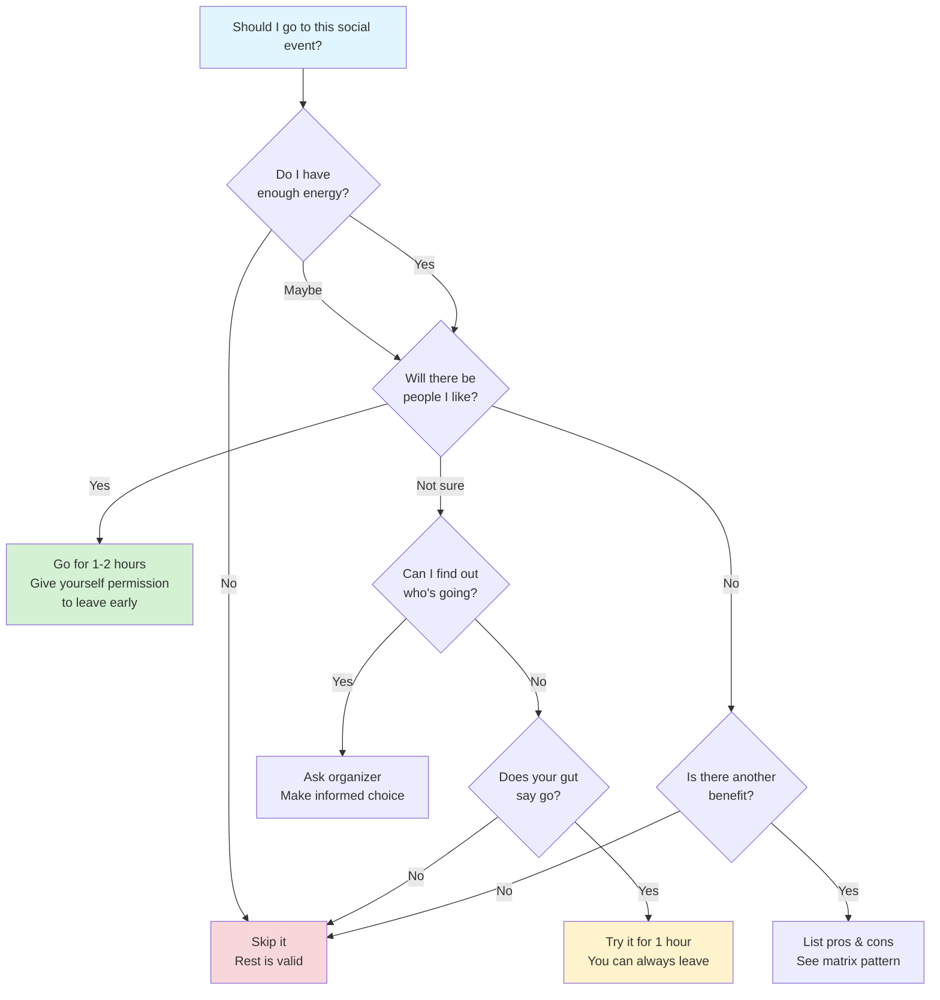
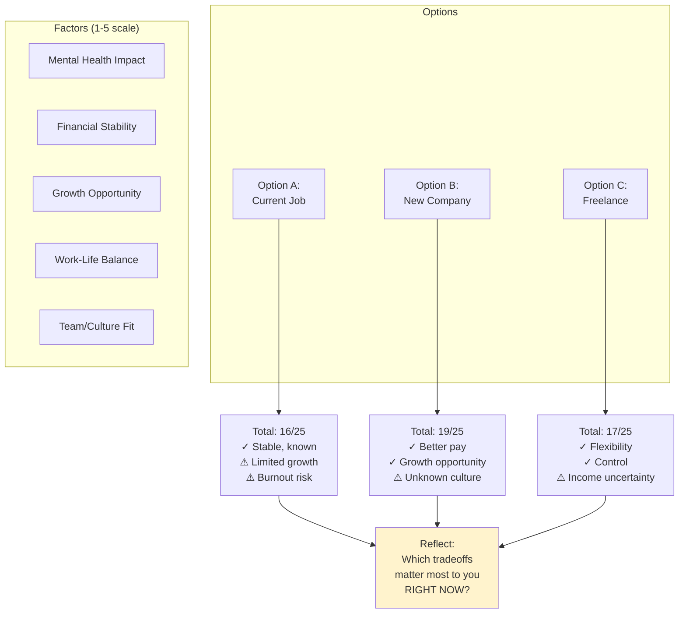
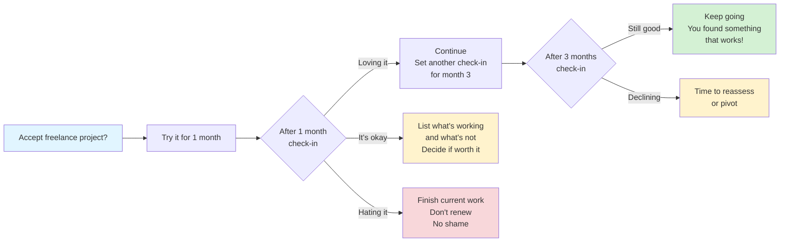
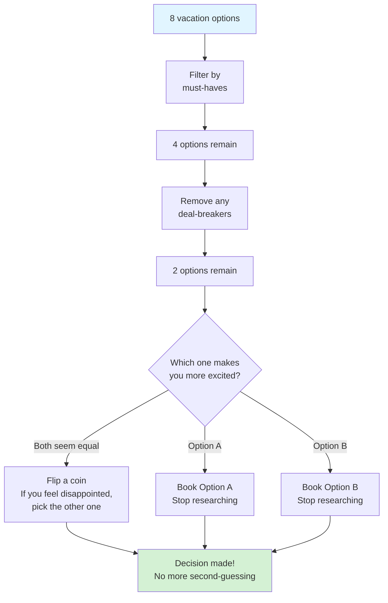

# Decision Tools Patterns

## Overview

Decision tools help navigate complex choices, reduce decision paralysis, and externalize decision-making processes that can loop endlessly in neurodivergent minds.

## When to Use

- User feels stuck between options
- User is overthinking a decision
- User mentions analysis paralysis or decision fatigue
- User needs to weigh multiple factors
- User asks "should I...?"

## Pattern: Simple Decision Tree

Use for yes/no decisions or choices with clear criteria.

**Key features:**
- Acknowledges "no" is a valid answer
- Includes energy level as primary factor
- Gives permission to change mind / leave early
- No judgment for any path

## Pattern: Weighted Decision Matrix

Use for complex decisions with multiple factors.

**Template for actual use:**
Create a table with:
- Rows: Your options
- Columns: Important factors (rate each 1-5)
- Total scores + key pros/cons

Then visualize the decision with the graph above.

**Key features:**
- Externalizes internal deliberation
- Makes tradeoffs explicit
- No "right answer" - shows what matters to YOU
- Acknowledges context (what matters "right now")

## Pattern: "If This, Then That" Logic

Use when decision depends on future unknowns or requires contingency planning.

**Key features:**
- Removes pressure to know the future
- Built-in check-in points
- Permission to change your mind
- "Try it and see" instead of "commit forever"

## Pattern: Elimination Decision

Use when overwhelmed by too many options (restaurants, vacation spots, job offers).

**Key features:**
- Reduces decision fatigue through filtering
- Uses gut-check method for final tie-breaker
- Coin flip trick reveals true preference
- Explicit "stop researching" boundary

## Language Guidelines

**Use reassuring, permission-giving language:**

✅ DO:
- "There's no perfect answer"
- "You can change your mind later"
- "What matters most to you *right now*?"
- "Trust your gut"
- "You can try it and see"
- "Not deciding is deciding - and that's okay too"

❌ DON'T:
- "Make the right choice"
- "Think it through more carefully"
- "You should know by now"
- "Just pick one"
- "Everyone else would..."

## Anti-Perfectionism Reminders

Include these where relevant:
- "Done is better than perfect"
- "You can course-correct later"
- "Most decisions are reversible"
- "Your future self will figure it out"
- "Good enough is actually good enough"
