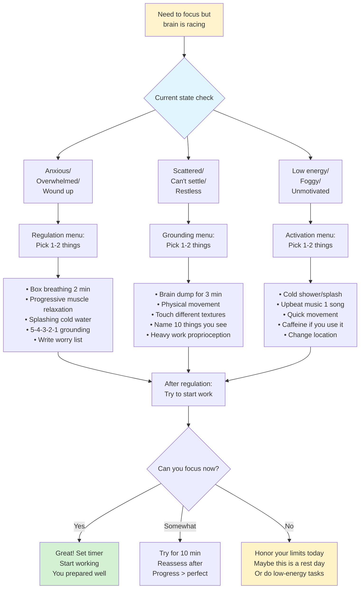
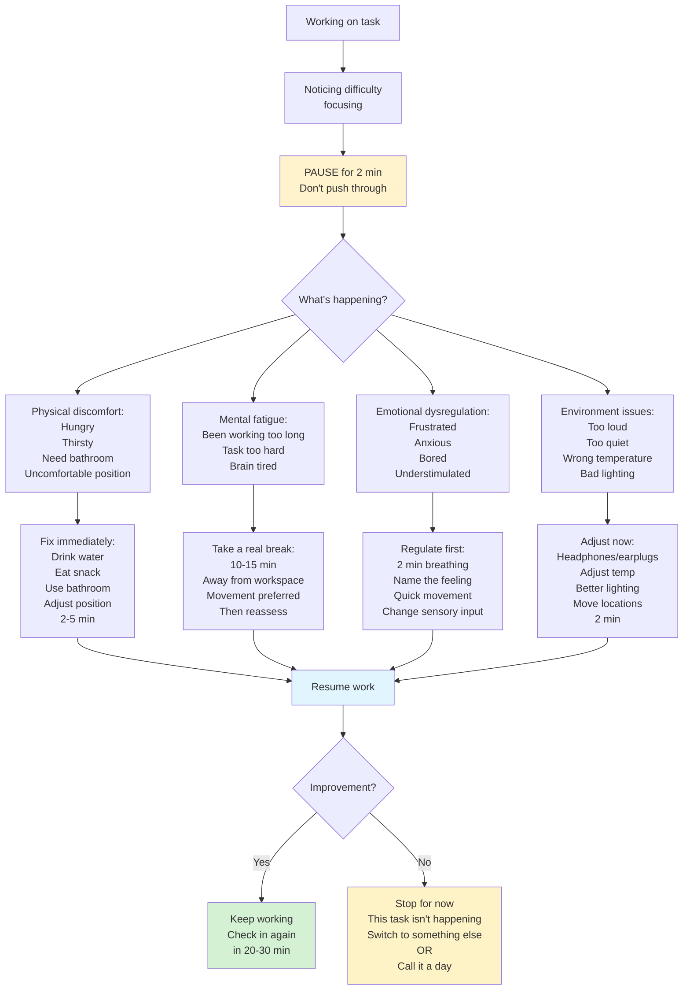
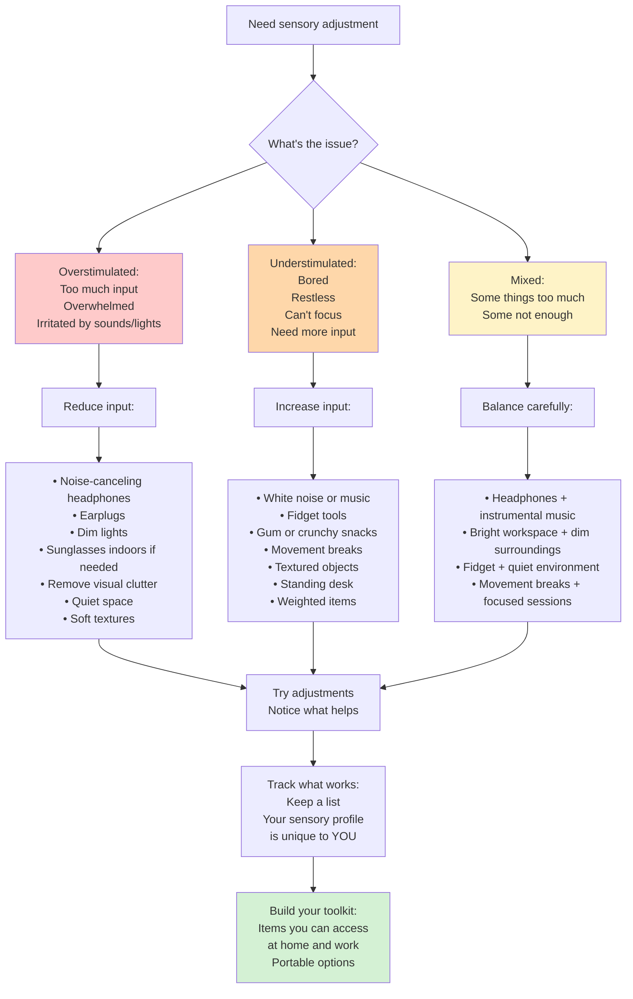
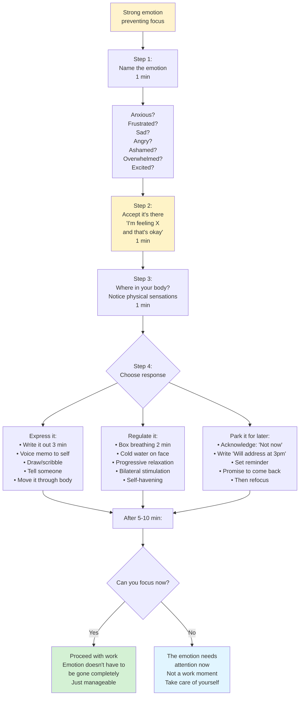
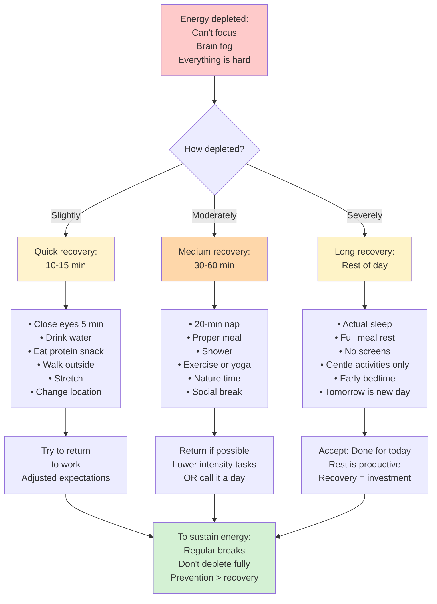

# Focus & Regulation Tools

## Overview

Focus and regulation patterns help manage ADHD symptoms in the moment through pre-task preparation, mid-work regulation, and recovery protocols. These are "in the moment" tools for when the brain needs support.

## When to Use

- User mentions racing thoughts or can't settle to work
- User asks how to calm down before focusing
- User is in hyperfocus crash and needs recovery
- User mentions overstimulation or sensory overwhelm
- User asks "how do I focus better?"
- User needs help with emotional regulation
- User mentions anxiety preventing work

## Pattern: Pre-Task Calm-Down Protocol

Use when user needs to regulate before starting focused work.

**Key insight:** Not every state can be regulated into focus. Sometimes the answer is "not today."

**Create your own regulation menu:** Track what actually helps YOU, not what "should" work.

## Pattern: Mid-Work Regulation Check-In

Use when user is working but struggling to maintain focus.

**Don't push through:** Pushing = burnout. Pausing = sustainable.

**Track patterns:** Notice WHEN focus breaks. Morning? After lunch? After 45 min? Adjust accordingly.

## Pattern: Hyperfocus Crash Recovery

Use when user has crashed after hyperfocus session.

```mermaid
flowchart LR
    Crash[After hyperfocus:<br/>Exhausted<br/>Depleted<br/>Can't function] --> First[First 10 min:<br/>Just breathe<br/>You're not broken<br/>This is normal]
    
    First --> Needs[Check basic needs:<br/>IMMEDIATELY]
    
    Needs --> N1[• Drink water<br/>• Eat something<br/>• Use bathroom<br/>• Change position<br/>• Blink/rest eyes]
    
    N1 --> Rest[Rest period:<br/>30-60 min minimum]
    
    Rest --> R1[Recovery activities:<br/>• Lie down<br/>• Close eyes<br/>• Gentle stretching<br/>• Quiet space<br/>• No screens if possible]
    
    R1 --> After{After rest:}
    
    After --> Assess[Assess capacity:<br/>What can you do now?]
    
    Assess --> Options[Options:<br/>Low: Rest more, minimal tasks<br/>Medium: Light admin, easy wins<br/>High: Unusual, but okay to continue]
    
    Options --> Prevent[Prevention for next time:<br/>• Set hyperfocus alarm<br/>• Scheduled breaks<br/>• Someone to interrupt you<br/>• Post-it notes<br/>• Better than recovery]
    
    style Crash fill:#fecaca
    style First fill:#fff3cd
    style Rest fill:#fef3c7
    style Prevent fill:#e1f5ff
```

**Hyperfocus is NOT a superpower:** It's a regulation difficulty. The crash costs more than the productivity gained.

**Prevention > recovery:** Set alarms every 45-60 min when hyperfocusing. Interrupt yourself.

## Pattern: Sensory Regulation Toolkit

Use when user needs to adjust sensory input to support focus.

**Common ADHD sensory needs:**
- Background noise (can't focus in silence)
- Fidgeting (helps concentration, not distraction)
- Movement (standing/walking while thinking)
- Oral stimulation (gum, crunchy snacks)
- Proprioception (weighted blanket, tight clothing)

**Your needs ≠ stereotypes:** You know what helps. Trust yourself.

## Pattern: Emotional Regulation for Focus

Use when user's emotional state is blocking ability to focus.

**ADHD & emotions:** Emotional regulation difficulty is core ADHD symptom. Not a character flaw.

**Emotions aren't enemies:** They're information. Listen, then choose response.

## Pattern: Decision Fatigue Recovery

Use when user has made too many decisions and can't focus.

```mermaid
flowchart LR
    Tired[Decision fatigue:<br/>Can't make choices<br/>Everything feels hard<br/>Indecisive] --> Stop[STOP deciding<br/>for rest of day]
    
    Stop --> Auto[Switch to<br/>autopilot mode]
    
    Auto --> Choices[Pre-made choices:<br/>No new decisions]
    
    Choices --> C1[• Eat usual meal<br/>• Wear comfortable clothes<br/>• Do routine tasks only<br/>• Follow existing plan<br/>• Say no to options<br/>• Pick first available]
    
    C1 --> Rest[Decision rest period:<br/>2-24 hours<br/>depending on depletion]
    
    Rest --> Prevent[Prevention:<br/>Reduce daily decisions]
    
    Prevent --> P1[Strategies:<br/>• Meal rotation<br/>• Capsule wardrobe<br/>• Default routines<br/>• Pre-made plans<br/>• Batch decisions<br/>• Decision-free times]
    
    P1 --> Protect[Protect decision energy<br/>for what matters:<br/>Not breakfast choice]
    
    style Tired fill:#fecaca
    style Stop fill:#fff3cd
    style Protect fill:#d4f1d4
```

**ADHD note:** Executive function includes decision-making. When depleted, everything becomes harder.

**Decision budget:** You have limited daily decisions. Spend wisely.

## Pattern: Energy Recovery Protocol

Use when user needs to recover energy to refocus.

**Energy is NOT unlimited:** Working through depletion = bigger crash later.

**Rest is work:** Recovery time IS productive time.

## Language Guidelines

**Use body-affirming, permission-giving language:**

✅ DO:
- "Your brain needs what it needs"
- "Sensory needs are real and valid"
- "Emotions are information, not obstacles"
- "Rest is part of the work process"
- "You're not broken, you're dysregulated"
- "Regulation tools are for everyone"

❌ DON'T:
- "Just focus harder"
- "Push through it"
- "You're being too sensitive"
- "Stop making excuses"
- "Everyone deals with this"
- "You should be able to handle this"

## Regulation Principles for ADHD

**What's different:**
- Harder to self-regulate without external support
- More sensitive to sensory input
- Difficulty recognizing depletion until severe
- Longer recovery time after dysregulation
- Need for more frequent breaks
- Higher baseline stimulation needs

**Design accordingly:**
- External cues (timers, reminders)
- Sensory toolkit easily accessible
- Regular check-ins built into schedule
- Permission to stop before breaking
- Lower expectations during recovery
- Diverse regulation strategies (not just "breathe")

## Building Your Regulation Practice

**Start with:**
1. Notice when dysregulated (tracking)
2. Try one regulation tool at a time
3. Track what actually helps
4. Build accessible toolkit
5. Practice in calm, not just crisis
6. Share tools with support people
7. Adjust as needed

**Remember:** What works for one person may not work for you. Your regulation toolkit is personal.
