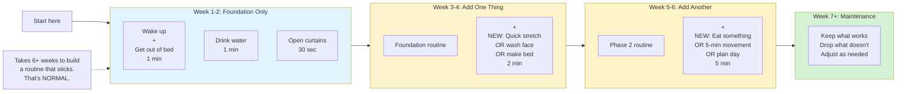
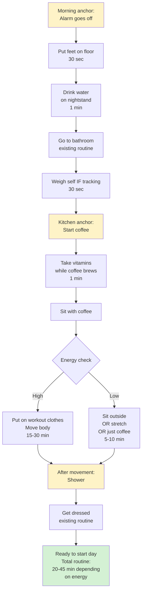
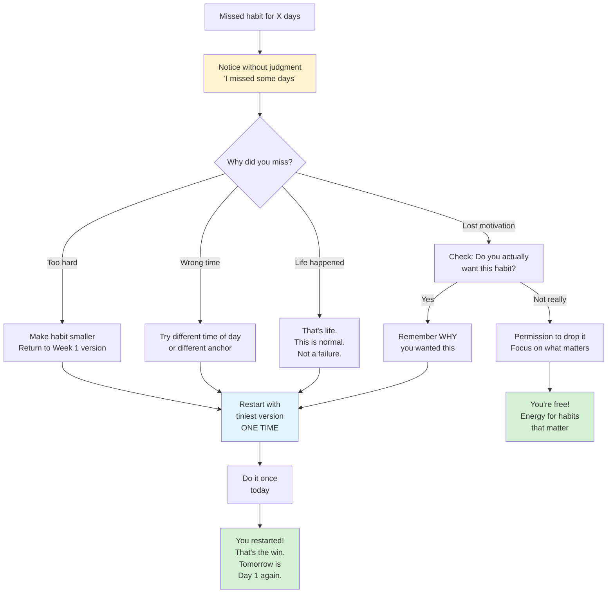

# Habit & Routine Building

## Overview

Habit and routine patterns help build sustainable systems through small, stackable actions and momentum-based progression. Designed for ADHD brains that struggle with consistency.

## When to Use

- User wants to build a new habit
- User mentions struggling with morning/evening routines
- User asks "how do I make myself do X?"
- User has failed at habit-building before
- User needs accountability or tracking systems
- User mentions "I can never stick with things"

## Pattern: Tiny Habit Builder

Use when user wants to start a new habit but struggles with consistency.

```mermaid
flowchart TD
    Start[Want to build a habit] --> Big{What's the<br/>ideal version?}
    
    Big --> Example1[Example:<br/>'Exercise 1 hour daily']
    Big --> Example2[Example:<br/>'Meditate 20 min']
    Big --> Example3[Example:<br/>'Write 1000 words']
    
    Example1 --> Shrink[Shrink it to<br/>absurdly tiny]
    Example2 --> Shrink
    Example3 --> Shrink
    
    Shrink --> Tiny1['Put on workout clothes'<br/>2 minutes]
    Shrink --> Tiny2['Sit on meditation cushion'<br/>30 seconds]
    Shrink --> Tiny3['Open writing doc'<br/>1 minute]
    
    Tiny1 --> Anchor[Attach to existing habit]
    Tiny2 --> Anchor
    Tiny3 --> Anchor
    
    Anchor --> Stack[Habit Stack formula:<br/>'After I [existing habit],<br/>I will [tiny new habit]']
    
    Stack --> Examples[Examples:<br/>After I pour coffee,<br/>I will put on workout clothes<br/><br/>After I brush teeth,<br/>I will sit on cushion<br/><br/>After I open laptop,<br/>I will open writing doc]
    
    Examples --> Do[Do ONLY the tiny version<br/>for 1 week]
    
    Do --> Check{Doing it consistently?}
    
    Check -->|No| Smaller[Make it even smaller<br/>OR pick different anchor<br/>OR wrong habit for now]
    Check -->|Yes| Celebrate1[Week 1 success!<br/>You proved you can do it]
    
    Celebrate1 --> Grow{Want to expand?}
    
    Grow -->|Not yet| Stay[Keep doing tiny version<br/>Consistency > size]
    Grow -->|Yes| Add[Add 1 more minute/rep<br/>Just ONE]
    
    Add --> Week2[Do new version<br/>for 1 week]
    Week2 --> Check
    
    style Start fill:#e1f5ff
    style Shrink fill:#fff3cd
    style Celebrate1 fill:#d4f1d4
    style Stay fill:#d4f1d4
```

**Why tiny works:**
- Removes activation energy barrier
- Success builds motivation
- Proves to brain you CAN do it
- Easy to restart if you miss a day
- Expands naturally when ready

**Common mistake:** Starting too big and giving up. Start SO small it feels silly.

## Pattern: Morning Routine Sequence

Use when user wants to build a sustainable morning routine.



**Key principles:**
- Start with bare minimum (phase 1)
- Add ONE thing at a time
- Wait 1-2 weeks before adding more
- No guilt about keeping it simple
- Your routine ≠ productivity influencer routines

**If you miss a day:** Just do phase 1 foundation. Always have a "minimum viable routine."

## Pattern: Habit Stacking Map

Use when user has several habits they want to build and needs to see how they connect.



**Using existing anchors:**
- Alarm, coffee, bathroom = reliable anchors
- Stack new habits onto existing ones
- Chain creates automatic sequence
- Energy check = flexible adaptation

## Pattern: Momentum Tracker

Use when user needs visual progress tracking to stay motivated.

```mermaid
flowchart LR
    subgraph Week1[" Week 1"]
        W1D1[✅ Mon]
        W1D2[✅ Tue]
        W1D3[✅ Wed]
        W1D4[❌ Thu]
        W1D5[✅ Fri]
        W1D6[✅ Sat]
        W1D7[✅ Sun]
    end
    
    subgraph Week2[" Week 2"]
        W2D1[✅ Mon]
        W2D2[✅ Tue]
        W2D3[✅ Wed]
        W2D4[✅ Thu]
        W2D5[✅ Fri]
        W2D6[❌ Sat]
        W2D7[✅ Sun]
    end
    
    subgraph Stats[" Progress"]
        Total[14 days attempted<br/>12 days completed<br/>86% success rate<br/>⭐ Amazing!]
    end
    
    Week1 --> Week2 --> Stats
    
    Note1[Missing 1-2 days per week<br/>is NORMAL and GOOD.<br/>You're being human.] -.-> Week1
    
    style W1D1 fill:#d4f1d4
    style W1D2 fill:#d4f1d4
    style W1D3 fill:#d4f1d4
    style W1D4 fill:#fecaca
    style W1D5 fill:#d4f1d4
    style W1D6 fill:#d4f1d4
    style W1D7 fill:#d4f1d4
    style W2D1 fill:#d4f1d4
    style W2D2 fill:#d4f1d4
    style W2D3 fill:#d4f1d4
    style W2D4 fill:#d4f1d4
    style W2D5 fill:#d4f1d4
    style W2D6 fill:#fecaca
    style W2D7 fill:#d4f1d4
    style Total fill:#fef3c7
```



**Tracking guidelines:**
- Binary is better (✅ or ❌, no scoring 1-10)
- Weekly view shows patterns
- Missing 1-2 days = still success
- If < 50% for 2 weeks → habit too big, shrink it
- Visual streak = dopamine for ADHD brain

## Pattern: Habit Recovery Protocol

Use when user misses days and needs help restarting without shame.



**Restart = normal part of habit building:**
- Missing days ≠ failure
- Restarting ≠ starting over
- You learned what doesn't work
- Each restart is data
- Permission to quit wrong habits

## Pattern: Evening Wind-Down Sequence

Use when user struggles with sleep routine or evening transition.

```mermaid
flowchart LR
    subgraph Signal[" 1 Hour Before Bed"]
        S1[Set alarm:<br/>'Start winding down'<br/>1 min]
        S2[Dim lights<br/>in main spaces<br/>2 min]
    end
    
    subgraph Transition[" 45 Min Before"]
        T1[Stop screens<br/>OR switch to calm content<br/>No social media]
        T2[Prep tomorrow:<br/>Lay out clothes<br/>Pack bag<br/>5 min]
        T3[Kitchen close:<br/>Clean up<br/>Prep coffee<br/>Set out water<br/>5 min]
    end
    
    subgraph Bedroom[" 30 Min Before"]
        B1[Enter bedroom] 
        B2[Change to sleep clothes<br/>Brush teeth<br/>Wash face<br/>10 min]
        B3[Do ONE calming thing:<br/>Read<br/>Journal<br/>Stretch<br/>Breathe<br/>10 min]
    end
    
    subgraph Sleep[" Lights Out"]
        SL1[In bed<br/>Lights off<br/>No phone<br/>Eyes closed]
    end
    
    Signal --> Transition --> Bedroom --> Sleep
    
    Note[Total: 1 hour<br/>Adjust times for<br/>your schedule] -.-> Signal
    
    style Signal fill:#fef3c7
    style Transition fill:#fed7aa
    style Bedroom fill:#fecaca
    style Sleep fill:#ddd6fe
```



**Why evening routine matters for ADHD:**
- Transitions are hard
- Screens = dopamine = delayed sleep
- Routine = cue to brain it's sleep time
- Morning starts the night before

**Flexibility:** If you miss the 1-hour alarm, start wherever you are. 15-min wind-down > no wind-down.

## Language Guidelines

**Use patience-based, anti-perfection language:**

✅ DO:
- "Start smaller than you think"
- "Consistency over intensity"
- "Missing days is part of the process"
- "You can restart anytime"
- "Your routine is for YOU"
- "Good enough is perfect"
- "What's the tiniest version?"

❌ DON'T:
- "Just stick with it"
- "Don't break the streak"
- "You need discipline"
- "Everyone can do this"
- "You're being lazy"
- "Try harder"

## Habit Science for ADHD

**What works differently:**
- Dopamine-driven motivation (not willpower)
- Need for novelty (routines get boring fast)
- Difficulty with delayed rewards (track daily, not monthly)
- Sensitive to failure (tiny wins > big fails)
- Time blindness (external cues essential)
- Executive dysfunction (reduce decisions)

**Design accordingly:**
- Make it SO easy you can't say no
- Add external reminders (alarms, notes, anchors)
- Celebrate tiny wins immediately
- Track visually for dopamine
- Build in flexibility
- Question "should" habits regularly
