# Project Mapping Patterns

## Overview

Project maps help see the big picture while breaking down the path forward. They make invisible work visible and show how pieces connect.

## When to Use

- User is starting a new project and doesn't know where to begin
- User feels overwhelmed by project scope
- User needs to see dependencies between tasks
- User asks "what do I need to do for this project?"
- User mentions feeling lost in the middle of a project

## Pattern: Project Phases Map

Use for projects with distinct phases or stages.

```mermaid
flowchart LR
    subgraph Phase1[" 🎯 Define Phase (Week 1)"]
        P1A[Clarify goal<br/>1 hour]
        P1B[List must-haves<br/>30 min]
        P1C[Identify constraints<br/>30 min]
    end
    
    subgraph Phase2[" 🔍 Research Phase (Week 2)"]
        P2A[Gather examples<br/>2 hours]
        P2B[List options<br/>1 hour]
        P2C[Pick approach<br/>1 hour]
    end
    
    subgraph Phase3[" 🛠️ Build Phase (Weeks 3-4)"]
        P3A[Create outline/structure<br/>2 hours]
        P3B[Fill in content<br/>6 hours]
        P3C[Initial review<br/>1 hour]
    end
    
    subgraph Phase4[" ✨ Finish Phase (Week 5)"]
        P4A[Revise based on feedback<br/>2 hours]
        P4B[Final polish<br/>1 hour]
        P4C[Ship it<br/>30 min]
    end
    
    Phase1 --> Phase2
    Phase2 --> Phase3
    Phase3 --> Phase4
    
    Note1[You are here 👉] -.-> Phase1
    
    style Phase1 fill:#e1f5ff
    style Phase2 fill:#fff3cd
    style Phase3 fill:#ffeef0
    style Phase4 fill:#d4f1d4
```

**Key features:**
- Chunks project into manageable phases
- Shows rough time estimates for planning
- Indicates current location ("You are here")
- Each phase has 3-5 tasks maximum
- Emoji help distinguish phases visually

## Pattern: Dependency Map

Use when tasks depend on each other or have blocking relationships.

```mermaid
flowchart TD
    Start[Plan Home Office Setup] --> Research[Research desk options<br/>⚡⚡ 2 hours]
    Start --> Measure[Measure space<br/>⚡ 15 min]
    
    Measure --> Layout[Sketch layout options<br/>⚡ 30 min]
    Research --> Layout
    
    Layout --> Budget[Set budget<br/>⚡ 30 min]
    
    Budget --> Shop[Order desk & chair<br/>⚡⚡ 1 hour]
    
    Shop --> Wait1[⏳ Wait for delivery<br/>5-7 days]
    
    Wait1 --> Clear[Clear space<br/>⚡⚡ 1 hour]
    Clear --> Assemble[Assemble furniture<br/>⚡⚡⚡ 2-3 hours]
    
    Assemble --> Arrange[Arrange items<br/>⚡⚡ 1 hour]
    
    Layout --> Tech[Check cable needs<br/>⚡ 20 min]
    Tech --> OrderCables[Order cables if needed<br/>⚡ 15 min]
    OrderCables --> Wait2[⏳ Wait for delivery<br/>2-3 days]
    Wait2 --> Arrange
    
    Arrange --> Done[Enjoy new setup!<br/>Take a photo]
    
    style Start fill:#e1f5ff
    style Done fill:#d4f1d4
    style Wait1 fill:#fff3cd
    style Wait2 fill:#fff3cd
```

**Key features:**
- Shows what can happen in parallel vs. sequentially
- Highlights waiting/blocking periods (⏳)
- Energy indicators for each task (⚡)
- Identifies the critical path
- Celebrates completion

## Pattern: Overwhelm-to-Action Breakdown

Use when user says "I don't even know where to start" or project feels too big.

```mermaid
flowchart TD
    Overwhelm[😰 Overwhelming Project:<br/>Plan cross-country move] --> Tiny[What's the tiniest<br/>first step?]
    
    Tiny --> List[Make a brain dump list<br/>15 min<br/>Everything that comes to mind]
    
    List --> Group{Can you group<br/>these into<br/>categories?}
    
    Group -->|Yes| Categories[Group into themes<br/>10 min<br/>Housing, Logistics, Stuff, People]
    Group -->|Feels hard| Skip[Skip categorizing<br/>Just pick easiest item]
    
    Categories --> Pick1[Pick ONE category<br/>to focus on today]
    Skip --> Pick2[Pick ONE item<br/>to do today]
    
    Pick1 --> Micro[Break that ONE thing<br/>into micro-steps]
    Pick2 --> Micro
    
    Micro --> Do[Do first micro-step<br/>10-15 min<br/>That's enough for today]
    
    Do --> Celebrate[🎉 Celebrate!<br/>You started.<br/>That's the hardest part.]
    
    style Overwhelm fill:#f8d7da
    style Celebrate fill:#d4f1d4
    style Do fill:#e1f5ff
```

**Key features:**
- Starts from emotional state (overwhelm)
- Reduces to tiniest possible action
- One thing at a time
- Celebrates starting (not finishing)
- No pressure to do more

## Pattern: Parallel Workstreams

Use for projects with multiple independent tracks that can happen simultaneously.

```mermaid
flowchart TD
    Start[App Development Project] --> Split{Can be split into<br/>parallel tracks}
    
    Split --> Design[🎨 Design Track]
    Split --> Backend[⚙️ Backend Track]
    Split --> Content[📝 Content Track]
    
    subgraph DesignWork[" "]
        D1[Wireframes<br/>⚡⚡⚡ 4 hours]
        D2[Visual design<br/>⚡⚡⚡ 6 hours]
        D3[Prototype<br/>⚡⚡⚡ 3 hours]
        D1 --> D2 --> D3
    end
    
    subgraph BackendWork[" "]
        B1[Set up database<br/>⚡⚡ 2 hours]
        B2[Build API<br/>⚡⚡⚡ 8 hours]
        B3[Testing<br/>⚡⚡ 3 hours]
        B1 --> B2 --> B3
    end
    
    subgraph ContentWork[" "]
        C1[Write copy<br/>⚡⚡ 3 hours]
        C2[Create examples<br/>⚡⚡ 2 hours]
        C3[Review & edit<br/>⚡ 1 hour]
        C1 --> C2 --> C3
    end
    
    Design --> DesignWork
    Backend --> BackendWork
    Content --> ContentWork
    
    D3 --> Merge[🔗 Integration Phase]
    B3 --> Merge
    C3 --> Merge
    
    Merge --> Final[Final polish & launch<br/>⚡⚡⚡ 4 hours]
    
    style Start fill:#e1f5ff
    style Final fill:#d4f1d4
```

**Key features:**
- Shows work can happen in parallel
- Helps delegate or time-shift work
- Makes it clear when tracks must merge
- Can help identify bottlenecks

## Pattern: Minimum Viable Progress (MVP)

Use when perfectionism is blocking progress or user needs permission to ship something "incomplete."

```mermaid
flowchart LR
    Start[Portfolio Website Project] --> MVP{What's the<br/>bare minimum?}
    
    MVP --> V1[" 🎯 Version 1: Bare Minimum<br/>(Shippable in 1 day)"]
    MVP --> V2[" ✨ Version 2: Better<br/>(If you have energy)"]
    MVP --> V3[" 🌟 Version 3: Ideal<br/>(Nice to have)"]
    
    V1 --> V1Tasks[• One-page HTML<br/>• Name & contact<br/>• 3 project links<br/>• Basic styling]
    
    V2 --> V2Tasks[• About section<br/>• Project descriptions<br/>• Responsive design<br/>• Custom domain]
    
    V3 --> V3Tasks[• Animations<br/>• Case studies<br/>• Blog section<br/>• Dark mode]
    
    V1Tasks --> Ship1[Ship V1<br/>Then stop or continue]
    V2Tasks --> Ship2[Ship V2<br/>Then stop or continue]
    V3Tasks --> Ship3[Ship V3<br/>You're done!]
    
    Ship1 -.Optional.-> Ship2 -.Optional.-> Ship3
    
    style V1 fill:#d4f1d4
    style V2 fill:#fff3cd
    style V3 fill:#e1f5ff
    style Ship1 fill:#d4f1d4
```

**Key features:**
- Separates "must have" from "nice to have"
- Permission to ship V1 and stop
- Shows optional progression
- Reduces perfectionism paralysis
- Clear definition of "done"

## Language Guidelines

**Use empowering, realistic language:**

✅ DO:
- "You can tackle this one phase at a time"
- "This can happen in parallel"
- "You're here → next is there"
- "Version 1 can be simple"
- "Take breaks between phases"
- "You can adjust the plan as you go"

❌ DON'T:
- "This is the only way"
- "You must complete everything"
- "It's a linear path"
- "You should finish faster"
- "Real professionals would..."

## Time Estimate Tips

When adding time estimates:
- Give ranges, not exact numbers ("2-3 hours" not "2 hours")
- Include setup/cleanup time
- Note when things require focus vs. can be split
- Indicate energy cost with ⚡ symbols
- Acknowledge waiting time separately (⏳)
