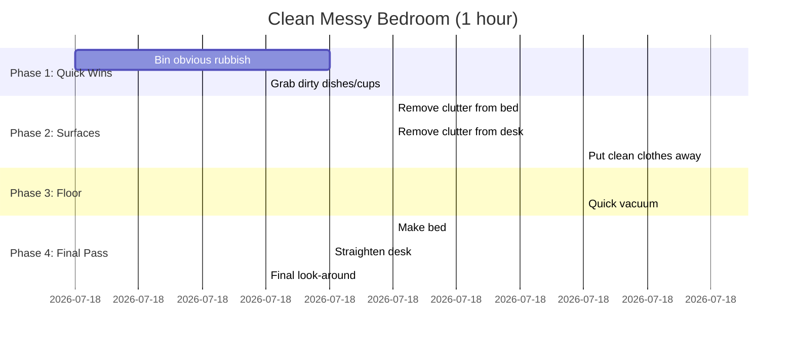
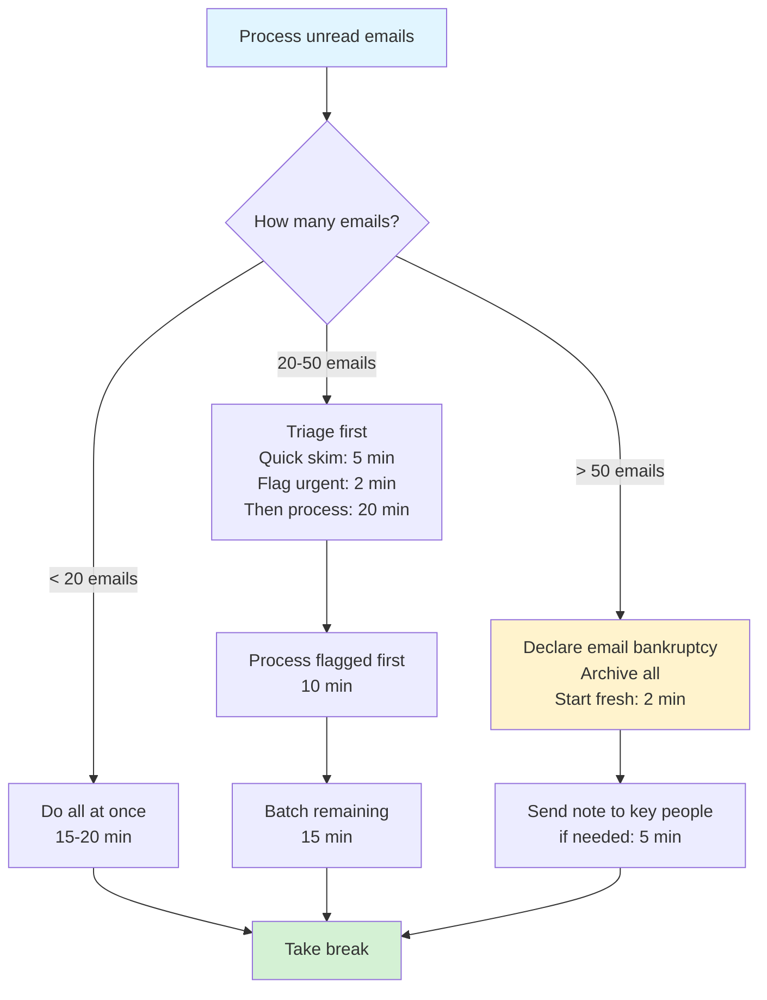
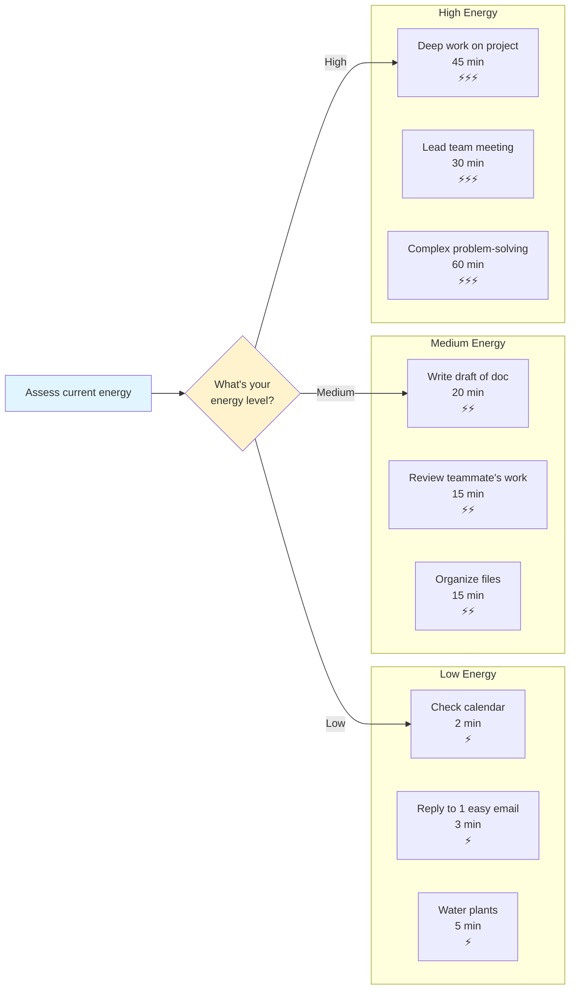

# Task Breakdown Patterns

## Overview

Task breakdowns help transform overwhelming tasks into manageable micro-steps with clear sequencing and time estimates.

## When to Use

- User says a task feels overwhelming or they don't know where to start
- User needs to see all the steps involved in something
- User mentions procrastination or executive dysfunction around a task
- User wants time estimates for planning

## Pattern: Linear Task Timeline

Use for tasks with a clear sequential order (cleaning, cooking, admin work).

**Key features:**
- Starts with easiest/"quick win" tasks to build momentum
- Groups related micro-tasks into phases
- Shows realistic time estimates (not "it should only take 10 minutes")
- Each step is 3-10 minutes maximum

## Pattern: Branching Task Breakdown

Use for tasks with multiple possible approaches or conditional steps.

**Key features:**
- Acknowledges different scenarios require different approaches
- Includes the "give yourself permission to not do it perfectly" option
- Shows decision points clearly
- Gives time estimates for each path

## Pattern: Energy-Aware Task Sequence

Use when user mentions energy levels, burnout, or needs to pace themselves.

**Key features:**
- Sorts tasks by energy cost, not just priority
- Gives permission to match tasks to current capacity
- Includes actual time estimates
- Uses clear energy indicators (⚡)

## Language Guidelines

**Use compassionate, neurodivergent-friendly language:**

✅ DO:
- "Quick win tasks to build momentum"
- "If this feels like too much, try..."
- "Take a 5-minute break after this"
- "This is the minimum viable version"
- "You can skip/modify this if needed"

❌ DON'T:
- "This should only take..."
- "Just do it"
- "Stop procrastinating"
- "It's easy"
- "Anyone can..."

## Time Estimate Guidelines

**Be realistic and generous:**
- Add buffer time (if something takes 10 minutes, say 15)
- Include transition time between tasks
- Account for getting started (the hardest part)
- Remember: estimates are not deadlines

**Example format:**
- "Sort laundry: 7 min" (not "5 min" even if that's technically enough)
- "Clear desk: 10 min + 2 min to find a home for mystery items"
- "Write email: 5 min to draft, 2 min to edit, 1 min to send"
