# Time-Boxing & Focus Sessions

## Overview

Time-boxing patterns help make time visible, create structure for open-ended work, and combat time blindness through visual boundaries and built-in breaks.

## When to Use

- User mentions time blindness or losing track of time
- User needs structure for open-ended work
- User struggles with "I'll just work until it's done" (leads to burnout)
- User asks how to use Pomodoro or time-blocking
- User needs help focusing or starting focused work
- User mentions working too long without breaks

## Pattern: Pomodoro Technique Breakdown

Use when user wants to try Pomodoro or needs structured focus time.


**Key modifications for ADHD:**
- ONE task only (write it down before starting)
- Permission to restart if distracted
- Mandatory breaks (not optional)
- Physical movement in breaks
- Celebration after 4 rounds
- No guilt about needing to restart

**If 25 minutes feels too long:** Try 15-minute work blocks with 3-minute breaks instead.

## Pattern: Time-Blocked Day

Use when user needs to plan their day with realistic time boundaries.

```mermaid
gantt
    title Tuesday Work Day (Time-blocked)
    dateFormat HH:mm
    section Morning Routine
    Wake up & coffee               :done, 08:00, 30m
    Quick planning                 :done, 08:30, 10m
    section Deep Work Block 1
    Focus: Draft proposal          :active, 08:40, 50m
    Break & movement               :09:30, 10m
    Focus: Continue proposal       :09:40, 50m
    section Mid-day
    Lunch & rest                   :10:30, 45m
    Light admin tasks              :11:15, 30m
    section Meetings
    Team standup                   :11:45, 30m
    1:1 with manager               :12:15, 30m
    section Deep Work Block 2
    Break & reset                  :12:45, 15m
    Focus: Review designs          :13:00, 45m
    section Wrap Up
    Reply to key emails            :13:45, 30m
    Update tomorrow's plan         :14:15, 15m
    Done for the day!              :milestone, 14:30, 0m
```

**Key features:**
- Realistic work hours (6.5 hours, not 8+)
- Breaks built in, not optional
- Meetings grouped when possible
- Deep work protected in blocks
- "Done for the day" boundary
- Buffer between activities

**Rule of thumb:** Never schedule more than 5 hours of focused work per day.

## Pattern: Focus Session Preparation

Use when user has trouble starting focused work or needs a launch sequence.


**Pre-focus ritual matters:**
- Reduces activation energy
- Creates consistent cue
- Removes barriers
- Acknowledges energy check
- Permission to stop if not working

## Pattern: Daily Energy Mapping

Use when user wants to plan their day around natural energy patterns.

```mermaid
flowchart LR
    subgraph Morning["🌅 Morning (8am-11am)<br/>Peak Energy ⚡⚡⚡"]
        M1[Deep work tasks<br/>Creative work<br/>Hard decisions<br/>Complex problems]
    end
    
    subgraph Midday["☀️ Midday (11am-2pm)<br/>Medium Energy ⚡⚡"]
        D1[Meetings<br/>Collaborative work<br/>Moderate tasks<br/>Light admin]
    end
    
    subgraph Afternoon["🌤️ Afternoon (2pm-4pm)<br/>Lower Energy ⚡"]
        A1[Routine tasks<br/>Email responses<br/>Organizing<br/>Light reading]
    end
    
    subgraph Evening["🌙 Evening (4pm-6pm)<br/>Variable Energy ⚡ or ⚡⚡"]
        E1[Social activities<br/>Exercise<br/>Personal projects<br/>OR rest]
    end
    
    Morning --> Midday --> Afternoon --> Evening
    
    Note[Track your patterns<br/>for 1 week to find<br/>YOUR energy rhythm] -.-> Morning
    
    style Morning fill:#fef3c7
    style Midday fill:#fed7aa
    style Afternoon fill:#fecaca
    style Evening fill:#ddd6fe
```



**Your energy patterns may differ:**
- Night owls: Peak may be evening
- After lunch dip: Common and valid
- Medication timing: Affects energy windows
- Sleep quality: Changes daily patterns

**How to use:**
1. Track energy for 1 week (simple 1-3 rating each hour)
2. Notice patterns
3. Schedule accordingly
4. Adjust as needed

## Pattern: Work Sprint Planning

Use when user has a specific time-limited work session planned.


**Important mindset shifts:**
- Progress = success (not just completion)
- Finishing ≠ working well
- Struggle = data for next time
- Showing up = worthy of recognition

## Pattern: Break Structure

Use when user forgets breaks or doesn't know what to do during breaks.


**Break guidelines:**
- Breaks are NOT for chores
- Breaks are NOT for scrolling phone (usually makes you more tired)
- Breaks ARE for actual rest
- Physical movement helps more than screens
- Going outside > staying at desk

## Language Guidelines

**Use time-aware, permission-giving language:**

✅ DO:
- "Set a timer to make time visible"
- "If 25 minutes feels too long, try 15"
- "You can stop early if it's not working"
- "Breaks are mandatory, not optional"
- "Track your energy to work WITH your brain"
- "Progress counts, even without finishing"

❌ DON'T:
- "Just focus for longer"
- "You should be able to do 8 hours"
- "Breaks are for later"
- "Keep pushing through"
- "Everyone else can focus longer"

## Time Estimate Tips

When creating time-boxed plans:
- Start with LESS time than you think you need
- Account for startup time (5-10 min to get into flow)
- Build in 5-min buffers between blocks
- Plan for 60-70% of available time, not 100%
- Include breaks in the total time calculation
- Remember: 4 hours of focused work = full day
