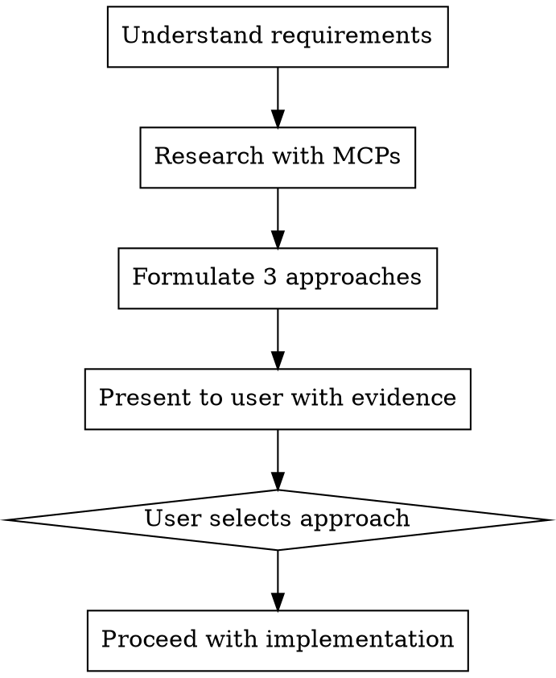

# Planning

## Overview

Research-first planning. Validate approaches against real documentation, real codebases, and real implementations before writing code.

**Core principle:** No implementation without evidence-backed approach selection.

**Announce at start:** "I'm using the planning skill to research approaches before implementation."

## When to Use

- New feature requiring architectural decisions
- Unfamiliar library or pattern
- Multiple valid approaches exist
- User asks "how should we build X?"

**Don't use for:** Single-line fixes, obvious bugs, tasks with explicit instructions.

## The Process



### Step 1: Understand Requirements

Clarify scope with the user. Identify:
- What the feature needs to do
- Constraints (performance, compatibility, existing patterns)
- Technologies already in use

### Step 2: Research with MCPs

**All three sources are REQUIRED. Do them in parallel using subagents.**

#### Context7: Current Library Docs
```
1. resolve-library-id for each relevant library
2. query-docs for the specific feature/API needed
3. Note: version-specific gotchas, recommended patterns, deprecations
```

#### Serper Search: Real-World Implementations
```
1. Search for "[feature] [framework] implementation"
2. Search for "[feature] best practices [year]"
3. Look for: blog posts with code, official guides, comparison articles
```

#### GitHub: Analogous Codebases
```
1. search-code for the pattern/API in real projects
2. search-repositories for projects solving the same problem
3. Look for: how production codebases structure this, common pitfalls
```

### Step 3: Formulate Exactly 3 Approaches

For each approach, provide:

```
### Approach N: [Name]

**How it works:** [2-3 sentences]

**Evidence:**
- Context7: [what the docs say about this approach]
- Serper: [what real-world articles recommend]
- GitHub: [how production codebases do it]

**Trade-offs:**
- Pro: [concrete benefit with source]
- Pro: [concrete benefit with source]
- Con: [concrete drawback with source]

**Fits this project because:** [why this works for the specific codebase]
```

### Step 4: Present and Get Decision

Present all 3 approaches. State your recommendation and why. Wait for user selection before writing any code.

## Red Flags

**Never:**
- Skip MCP research and guess at approaches
- Present approaches without evidence from real sources
- Start implementation before user selects an approach
- Present fewer than 3 or more than 3 approaches
- Use only one MCP source (all three required)

**If MCP is unavailable:**
- Note which source is missing
- Use WebSearch as fallback for that source
- Still present 3 evidence-backed approaches

## Quality Checklist

- [ ] All three MCP sources consulted (Context7, Serper, GitHub)
- [ ] Exactly 3 approaches with concrete trade-offs
- [ ] Each approach cites real evidence (not hypothetical)
- [ ] Recommendation stated with reasoning
- [ ] User selected approach before implementation began
