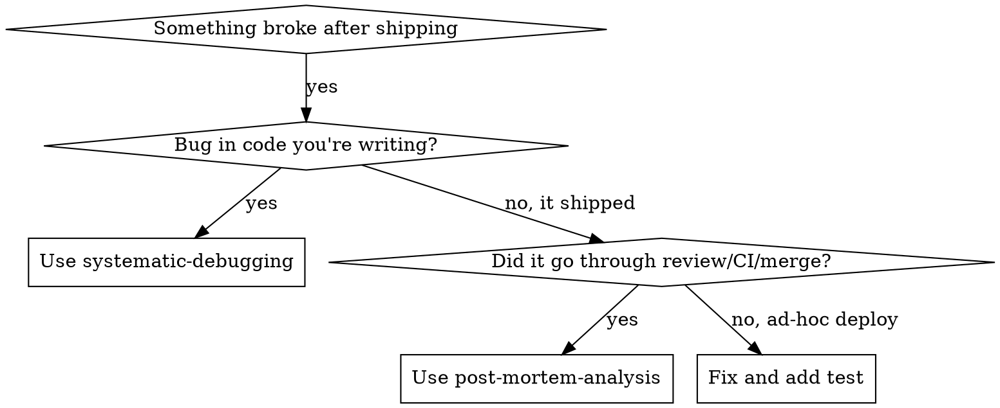

# Post-Mortem Analysis

## Overview

`systematic-debugging` fixes the immediate bug. This skill asks the harder question: **why did the full workflow let it through?**

When a failure escapes brainstorm, plan, TDD, code review, and merge -- the bug is a symptom. The root causes are structural: missing CI gates, inadequate documentation, invisible assumptions, or knowledge gaps. Surface-level analysis produces flat lists of observations. Structured analysis produces actionable prevention.

**Core principle:** Every production failure that survived the full development workflow reveals structural gaps in Machine, Material, Manual, or Man. Fix the structures, not the people.

**Violating the letter of this process is violating the spirit of incident analysis.**

## The Iron Law

```
NO ACTION ITEMS WITHOUT STRUCTURED ROOT CAUSE ANALYSIS FIRST
```

If you haven't completed Phase 2 (4M Analysis), you cannot propose fixes or action items.

## When to Use



**Use when:**
- Deployment failed after passing CI/review
- Released feature breaks in production
- User asks "what went wrong?" or "how did this ship?"
- Incident postmortem or retrospective requested
- Same class of bug keeps recurring despite fixes

**Do NOT use when:**
- Bug is in code you're actively writing (use `systematic-debugging`)
- Pre-merge test failure (use `systematic-debugging`)
- Hypothetical risk assessment (use brainstorming)
- Simple rollback without analysis needed

## The Five Phases

You MUST complete each phase before proceeding to the next.

### Phase 1: Timeline Reconstruction

**Before analyzing causes, establish facts:**

1. **When was the change introduced?**
   ```bash
   # Find the commit(s) that introduced the failure
   git log --oneline --since="<estimated date>" -- <affected files>
   git bisect start  # If unclear which commit
   ```

2. **When was it detected?**
   - Alert/monitoring timestamp
   - User report timestamp
   - How long between introduction and detection (detection gap)

3. **What was the first signal?**
   - Error logs, monitoring alerts, user complaints
   - Was the signal available earlier but missed?

4. **What workflow steps did it pass through?**
   - Was there a plan? Did the plan cover this area?
   - Were tests written? What did they test?
   - Was there code review? What did reviewers focus on?
   - Did CI pass? What did CI check?

5. **Reconstruct the timeline**

   ```
   YYYY-MM-DD HH:MM  Event description
   ─────────────────  ──────────────────
   <date>             Change introduced in commit <hash>
   <date>             PR created, review requested
   <date>             Review approved (reviewer: <who>)
   <date>             CI passed (checks: <list>)
   <date>             Merged to main
   <date>             Deployed to production
   <date>             First error signal (type: <what>)
   <date>             Incident detected by <who/what>
   <date>             Mitigation started
   ```

**Output:** A factual timeline. No analysis yet.

### Phase 2: 4M Root Cause Analysis

For each finding, classify into exactly one of four categories. **The goal is structural causes, not blame.**

#### Machine (Automated Systems)

What automated gates should have caught this but didn't?

- **CI/CD:** Was there a test that should have existed? A linter rule? A type check?
- **Monitoring:** Should an alert have fired sooner? Was there a gap in observability?
- **Deployment:** Should there have been a canary? A rollback trigger? A health check?
- **Environments:** Did staging differ from production in a way that masked the issue?

Ask: "What automated system, if it existed or were configured correctly, would have prevented this from shipping?"

#### Material (Artifacts and Inputs)

What artifacts were traps waiting to happen?

- **Configuration:** Were config files ambiguous, duplicated, or environment-dependent?
- **Dependencies:** Was there a version mismatch, implicit dependency, or breaking update?
- **Data:** Were there assumptions about data format, volume, or edge cases?
- **Infrastructure:** Were there hidden state dependencies, resource limits, or race conditions?

Ask: "What about the structure of our artifacts made this failure likely?"

#### Manual (Documentation and Process)

What documentation, checklists, or process steps were missing?

- **Checklists:** Was there a deployment checklist? Did it cover this scenario?
- **Runbooks:** Was there a runbook for this type of failure?
- **Templates:** Did the PR template prompt for relevant concerns?
- **Process:** Was there a review step that should exist but doesn't?

Ask: "What written guide, if it existed, would have prompted someone to check?"

#### Man (Knowledge and Context)

**Important:** Man findings are ALWAYS symptoms. Every knowledge gap traces back to a Machine, Material, or Manual gap. Use this category to identify symptoms, then trace each to its structural root.

- **Knowledge gaps:** Did the author/reviewer lack context about this area?
  - → Trace to Manual: What documentation would have provided that context?
  - → Trace to Machine: What automated check would have made the knowledge unnecessary?
- **Communication:** Was relevant context siloed or not shared?
  - → Trace to Manual: What process would ensure knowledge transfer?
- **Assumptions:** Did someone assume behavior without verifying?
  - → Trace to Machine: What test would have validated the assumption?

Ask: "What didn't the people involved know, and what structural change would have made that knowledge unnecessary or automatic?"

### Phase 3: Symptom vs Root Cause Separation

**For EACH finding from Phase 2, apply the 5 Whys:**

```
Finding: "Reviewer missed the edge case"

Why? → Reviewer didn't know about the edge case
Why? → No documentation of edge cases for this module
Why? → Module was built without specification
Why? → No template requiring edge case documentation
ROOT CAUSE (Manual): No specification template for new modules
```

**The test:** Can you act on it directly and structurally?

| Statement | Type | Action |
|-----------|------|--------|
| "Reviewer missed it" | Symptom | Trace to Manual/Machine |
| "No CI check for this class of error" | Root cause | Add the CI check |
| "Developer didn't know about the constraint" | Symptom | Trace to Manual |
| "No documentation of the constraint exists" | Root cause | Write the documentation |
| "Config was confusing" | Symptom | Trace to Material |
| "Two config files with overlapping keys" | Root cause | Consolidate configs |

**If you cannot trace a "Man" finding to a structural cause, it is not yet analyzed deeply enough. Keep asking why.**

### Phase 4: Action Items (One Per Root Cause)

**Each root cause becomes a separate, concrete work item:**

```markdown
### Action Item: [Brief title]

**4M Category:** Machine | Material | Manual
**Root Cause:** [The structural gap identified in Phase 3]
**Context:** [What happened because of this gap]
**Impact:** [What broke, blast radius, duration]

**Proposed Fix:**
[Concrete, actionable steps - not "improve testing" but "add integration test
for X that verifies Y under condition Z"]

**Acceptance Criteria:**
- [ ] [Specific, verifiable condition]
- [ ] [Another condition]

**Prevents Recurrence?** [Yes/Partial/No - if partial, explain residual risk]
```

**Rules:**
- ONE action item per root cause. Don't bundle.
- Proposed fixes must be concrete. "Improve testing" is not actionable.
- Each must have acceptance criteria that are verifiable.
- If a fix only partially prevents recurrence, say so.

### Phase 5: Self-Challenge

**Before finalizing, review your own analysis:**

1. **Symptom check:** "Did I mistake any symptoms for root causes?"
   - Re-read each action item. Could you ask "why?" again and get a deeper answer?

2. **4M coverage:** "Are there Machine/Material/Manual gaps I didn't explore?"
   - Did you check CI, monitoring, deployment, config, deps, data, docs, checklists, runbooks, templates?

3. **Prevention check:** "Would these fixes actually prevent recurrence?"
   - Imagine the same developer, same code, same rush. Would the structural changes catch it?

4. **Proportionality check:** "Are the fixes proportional to the impact?"
   - Don't propose massive process changes for a minor typo incident.
   - Don't propose a linter rule for a one-off architectural mistake.

5. **Missing perspectives:** "Who else was affected that I haven't considered?"
   - Downstream services? End users? On-call engineers?

## Output Format

```markdown
# Post-Mortem: [Incident Title]

**Date:** YYYY-MM-DD
**Severity:** [Critical/High/Medium/Low]
**Detection Gap:** [Time between introduction and detection]
**Resolution Time:** [Time between detection and fix]

## Timeline
[Phase 1 output]

## Root Cause Analysis (4M)

### Machine
[Findings or "No machine gaps identified"]

### Material
[Findings or "No material gaps identified"]

### Manual
[Findings or "No manual gaps identified"]

### Man (Symptoms → Structural Traces)
[Findings traced to Machine/Material/Manual, or "No knowledge gaps identified"]

## Action Items
[Phase 4 output - one section per root cause]

## Self-Challenge Results
[Phase 5 output - what you reconsidered]
```

## Red Flags - STOP and Re-Analyze

If you catch yourself:
- Listing observations without 4M classification
- Writing "reviewer should have caught this" without tracing to structural cause
- Proposing "be more careful" as an action item
- Bundling multiple root causes into one action item
- Skipping the 5 Whys on a "Man" finding
- Producing action items without acceptance criteria
- Writing "improve X" without concrete steps
- Jumping to action items before completing timeline

**ALL of these mean: STOP. Return to the appropriate Phase.**

## Common Rationalizations

| Excuse | Reality |
|--------|---------|
| "The cause is obvious, skip analysis" | Obvious causes are symptoms. Dig deeper. |
| "It was human error" | Human error is always a symptom of structural gaps. Trace it. |
| "We just need better reviews" | Reviews catch what they're prompted to check. Fix the prompt. |
| "This was a one-off" | One-offs reveal latent structural issues. Analyze anyway. |
| "Timeline is unnecessary, we know what happened" | Timeline reveals detection gaps and workflow holes you haven't noticed. |
| "The fix is already deployed, no need for postmortem" | The fix addresses the symptom. The postmortem addresses the system. |
| "We don't have time for a full analysis" | Skipping analysis guarantees this class of failure recurs. |
| "Adding more process will slow us down" | Targeted structural fixes (CI, docs, templates) accelerate future work. |

## Quick Reference

| Phase | Key Activities | Output |
|-------|---------------|--------|
| **1. Timeline** | Reconstruct events, identify detection gap | Factual timeline |
| **2. 4M Analysis** | Classify gaps: Machine, Material, Manual, Man | Categorized findings |
| **3. Symptom Separation** | 5 Whys on each finding, trace Man to structure | Root causes only |
| **4. Action Items** | One concrete item per root cause | Actionable work items |
| **5. Self-Challenge** | Review own analysis for gaps | Final validated report |

## Where This Fits

```
brainstorm → plan → implement (TDD) → review → merge → deploy
                                                          ↓
                                                     FAILURE?
                                                          ↓
                                              systematic-debugging
                                              (fix the immediate bug)
                                                          ↓
                                              post-mortem-analysis
                                              (fix the structural gaps)
                                                          ↓
                                              action items feed back into
                                              CI, docs, templates, checklists
```

## Related Skills

- **superpowers:systematic-debugging** - Fix the immediate bug (do this FIRST, then post-mortem)
- **superpowers:verification-before-completion** - Verify fixes before claiming done
- **superpowers:writing-plans** - Turn large action items into implementation plans
