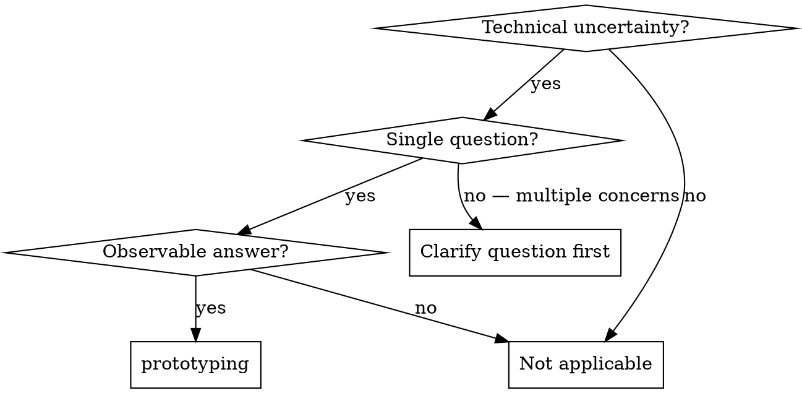
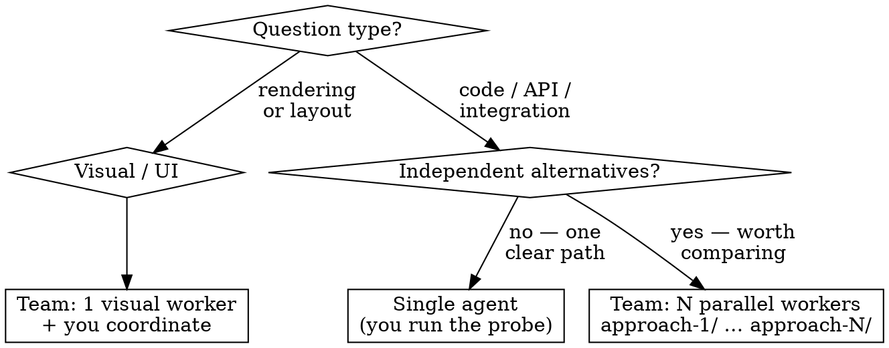
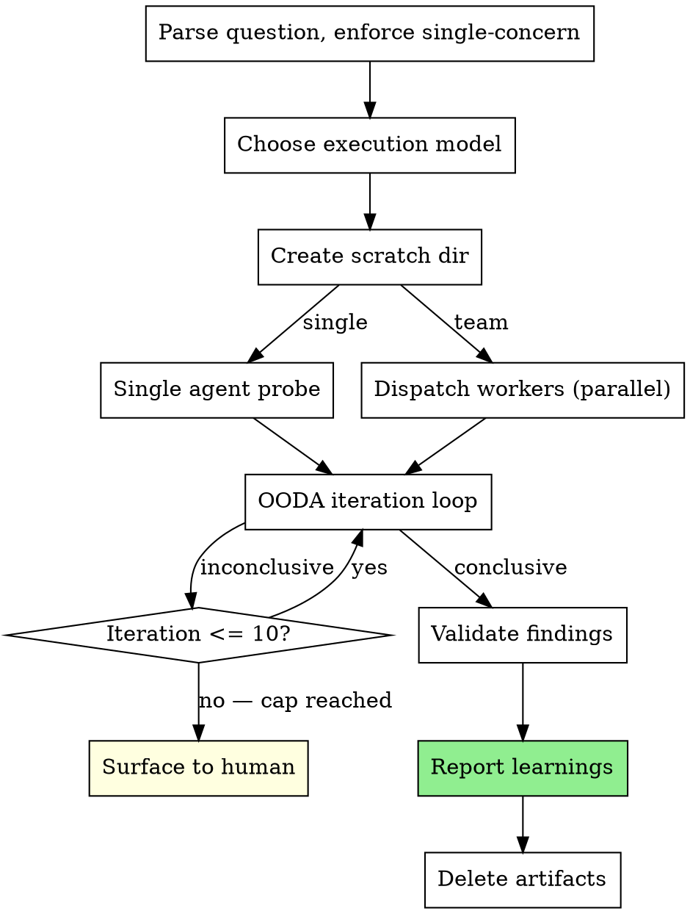

# Prototyping

Run a small, throwaway probe to answer one technical question. Kill uncertainty before it becomes a mid-sprint blocker.

**Core principle:** One question. Minimal code. Throw it away. Report findings.

**Announce at start:** "I'm using the prototyping skill to answer: [question]."

## When to Use



**Use when:**
- You don't know if a library or API does what you think it does
- An integration has never been tested end-to-end in this context
- A rendering or layout approach is unproven for the given data
- You need evidence before committing to a spec or plan

**Do NOT use when:**
- The answer can be found in documentation (read docs instead)
- The question spans multiple unrelated concerns (split it first)
- You're past the planning gate and implementation is already decided

## Scope Enforcement

**This skill handles exactly ONE technical question.**

**Borderline scope:** If the request is decomposable into 1–3 named single-question prototypes, suggest the split: "This looks like [N] separate questions: [list]. Should I run them as separate prototypes?" If the request cannot be decomposed into discrete questions, reject: "That's too broad for a prototype. A prototype answers one technical question."

Do not proceed with a multi-concern request. This is not negotiable.

## Execution Model

You decide the model autonomously. Never ask the human which to use.



**Single agent:** You run the probe directly. Use when the answer is unambiguous to verify in text output.

**Team: 1 visual worker:** Dispatch one worker subagent for visual questions. Worker uses Playwright to screenshot results. You coordinate and collect findings.

**Team: N parallel workers:** Dispatch N workers simultaneously, each in their own `approach-N/` subdirectory, when comparing independent alternatives is worth the cost.

## Scratch Directory

All prototype artifacts go under:

```
.superpowers/prototypes/<prototype-name>/
```

For parallel workers:
```
.superpowers/prototypes/<prototype-name>/approach-1/
.superpowers/prototypes/<prototype-name>/approach-2/
```

Name the prototype after the question, slugified (e.g., `sqlite-concurrent-writes`, `chart-svg-vs-canvas`).

## The Process



### Phase 0: Parse and Scope

1. Restate the technical question in one sentence
2. Confirm it is a single concern — if not, reject (see Scope Enforcement)
3. Choose execution model (see above — do not ask the human)
4. Name the prototype and create the scratch directory

### Phase 1: Execute

**Single agent:** Run the probe yourself. Write minimal code in the scratch directory. Run it. Observe.

**Team — dispatching workers:** Use `worker-prompt.md` as the template. Inject:
- `{expert_role}`: domain of the question (e.g., "SQLite expert", "React rendering expert")
- `{scratch_dir}`: absolute path to the worker's directory
- `{question}`: the single technical question, verbatim
- `{spec_context}`: relevant spec excerpt (if any) — empty string if none
- `{library_or_technology}`: the primary library or technology under test

Workers invoke `expert:engage` themselves using `{library_or_technology}`.

### Phase 2: OODA Iteration Loop

Each iteration must complete all four steps. The Orient step is mandatory — skip it and you are guessing.

```
iteration = 1
max_iterations = 10

while iteration <= max_iterations:
    # Observe: collect evidence from probe run
    # Orient: interpret evidence against the question
    #   → What does this tell us?
    #   → What assumption does it challenge?
    #   → Is the answer clear yet? Why or why not?
    # Decide: continue, pivot, or conclude
    # Act: run next probe variation OR declare conclusive

    if conclusive: break
    iteration += 1

if iteration > max_iterations:
    Surface to human with partial findings
```

**The Orient step is not optional.** Before deciding to continue or conclude, you must answer:
- What did I just learn?
- Does this answer the question?
- What would change the answer?

### Phase 3: Validate

**Code probes (automated):** Run the code and check output. A conclusive result means the output matches or contradicts the hypothesis clearly.

**Visual probes (UI only):** Present screenshot to the human. Get explicit confirmation that the result is interpretable. This is the only step that involves the human mid-skill.

### Phase 4: Report and Clean Up

**Report learnings in the conversation** — do not write a file.

```
## Prototype Results: [question]

### What works
- [Finding with exact working code snippet]

### What doesn't work
- [Gotcha / failure discovered]
- [Approach that was tried and failed, with why]

### Recommendations
- [Specific guidance for the implementation plan]

### Verdict
SUCCESS → ready for writing-plans (findings should be factored in)
— or —
SHOWSTOPPER → back to spec (with evidence of why)
```

**Routing on verdict:**
- **SUCCESS** → proceed to `writing-plans` with findings factored in
- **SHOWSTOPPER** → report findings and halt; the user decides whether to revise the spec or take a different approach

**Then delete artifacts:**

```bash
rm -rf .superpowers/prototypes/<prototype-name>/
```

Confirm deletion. Do not leave prototype code in the repo.

## Guard Rails

### Iron Laws

- **ONE question per prototype.** Multi-concern requests are rejected, not stretched to fit.
- **Artifacts are always deleted** after reporting. Never commit prototype code.
- **OODA Orient is mandatory.** Never skip from Observe directly to Act.
- **Iteration cap is 10.** If 10 iterations produce no conclusive answer, surface to human.

### Rationalization Prevention

| Thought | Reality |
|---------|---------|
| "I can answer two questions in one run — they're related" | One question. Reject and ask human to pick. |
| "The question is obvious, I'll skip the probe and just recommend" | If it were obvious, no prototype is needed. Run the probe. |
| "I'll keep the prototype code — it might be useful" | Delete it. Prototype code is not production code. |
| "10 iterations wasn't enough, I'll go to 15" | Cap at 10. Surface to human with partial findings. |
| "I should ask the human whether to use single agent or team" | You decide. The human hired you for judgment. |
| "The Orient step is just reflection — I can skip it under time pressure" | Orient is where reasoning happens. Skip it and you lose the loop. |
| "I'll report partial findings inline and skip the format" | Use the report format. Findings without structure don't transfer to the plan. |

### Red Flags — Stop and Recalibrate

- Prototype is growing beyond 50 lines of code
- You've answered a different question than the one stated
- You're planning to commit prototype code
- Orient step is empty ("proceed") with no reasoning
- Iteration count passed 10

## Integration

**Comes after:**
- **superpowers:write-spec** or **superpowers:refining-specs** — identifies the technical uncertainty to probe

**Comes before:**
- **superpowers:writing-plans** — prototype findings feed directly into plan assumptions

**Related:**
- **superpowers:brainstorming** — for exploring the problem space before the question is sharp
- **superpowers:systematic-debugging** — for known bugs; prototyping is for unknown behavior
