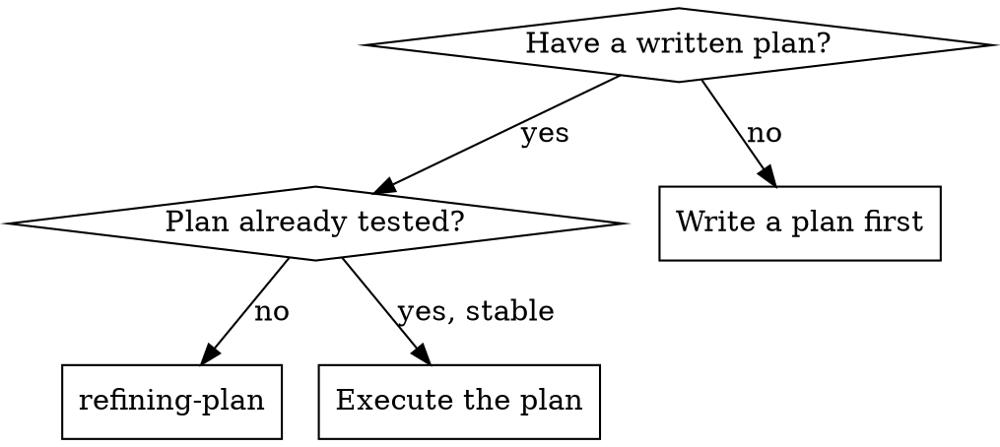
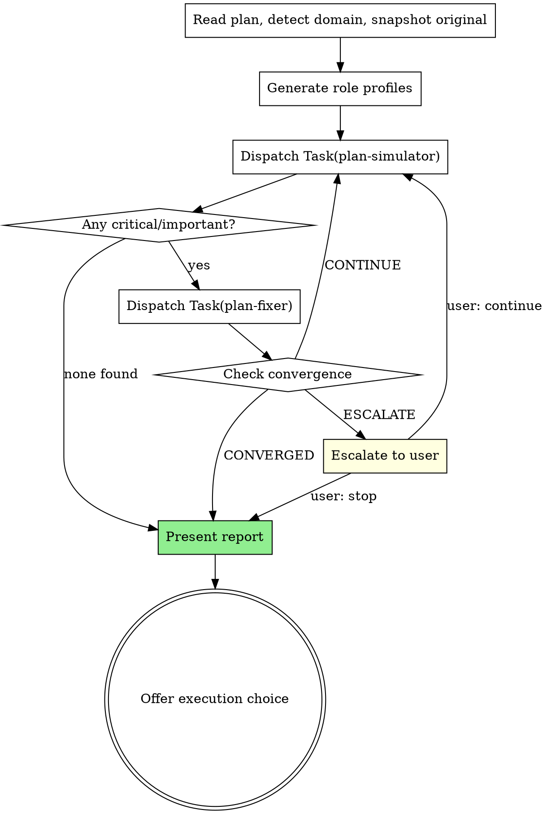

# Refining Plan

Iteratively simulate and refine a plan until stable: simulate → find issues → fix → check convergence → repeat.

**Core principle:** Simulate before executing — catch gaps on paper, not in code

**Announce at start:** "I'm using the refining-plan skill to pressure-test this plan."

## When to Use



**Use when:**
- Plan just created by writing-plans, before execution
- Plan has known gaps needing systematic discovery
- Complex plan with multiple tasks and dependencies

**Don't use when:**
- Plan is trivial (1-2 simple tasks)
- Already refined and stable

## Checklist

You MUST create a task for each of these items and complete them in order:

1. Read plan, detect domain, snapshot original text
2. Generate role profiles for plan-simulator and plan-fixer
3. Run simulation round (dispatch plan-simulator subagent)
4. Evaluate findings (skip to report if no critical/important)
5. Run fix round (dispatch plan-fixer subagent)
6. Check convergence (continue, converge, or escalate)
7. Present report and offer execution choice

## The Process



### Phase 1: Domain Detection

Read the plan file and determine:
1. **Domain**: backend, frontend, infrastructure, data, plugin-dev, ML/AI, devops, full-stack, other
2. **Technologies**: tools, frameworks, languages mentioned
3. **Key concerns**: highest-risk areas

Generate role profiles:
- plan-simulator: "Senior {domain} engineer who pressure-tests {technology} plans"
- plan-fixer: "{domain} specialist who patches {technology} plan gaps"

Log detected domain and roles before proceeding.

### Phase 2: Iteration Loop

Default max iterations: 5. For each round:

**Step 1: Dispatch plan-simulator subagent**

Use `./plan-simulator-prompt.md` template. Provide:
- Full plan text (don't make subagent read file)
- Generated role profile
- Iteration number
- Previous fixes summary (if iteration > 1)

**Step 2: Evaluate findings**

If no critical or important findings → CONVERGED, skip to Phase 3.

**Step 3: Dispatch plan-fixer subagent**

Use `./plan-fixer-prompt.md` template. Provide:
- Plan file path (fixer edits the file)
- Critical + important findings only
- Original plan snapshot for reference

**Step 4: Check convergence**

Apply in order:
1. **Diminishing returns** (round 2+): critical count unchanged → CONVERGED
2. **Recurring criticals** (round 3+): same concern text persists → ESCALATE to user
3. **Drift detection**: plan fundamentally changed direction → ESCALATE to user
4. **Otherwise**: CONTINUE

Track per round: `Round {N}: critical={X} important={Y} minor={Z} → {signal}`

### Phase 3: Report & Handoff

Present summary:

```
## Plan Refinement Complete

**Plan:** {plan_path}
**Domain:** {detected_domain}
**Iterations:** {completed}/{max}
**Stop Reason:** {CONVERGED | MAX_ITERATIONS | USER_STOPPED}

| Round | Critical | Important | Minor | Signal |
|-------|----------|-----------|-------|--------|
| ...   | ...      | ...       | ...   | ...    |
```

Then offer execution choice:

**"Plan refined and stable. Three execution options:**

**1. Subagent-Driven (this session)** — fresh subagent per task, review between tasks
- **REQUIRED SUB-SKILL:** Use superpowers:subagent-driven-development

**2. Parallel Session (separate)** — batch execution with checkpoints
- **REQUIRED SUB-SKILL:** New session uses superpowers:executing-plans

**3. Refine again** — run another round of refinement

**Which approach?"**

## Prompt Templates

- `./plan-simulator-prompt.md` - Dispatch plan-simulator subagent
- `./plan-fixer-prompt.md` - Dispatch plan-fixer subagent

## Red Flags

**Never:**
- Skip simulation and go straight to execution
- Let plan-fixer restructure the plan (only patch gaps)
- Continue iterating after CONVERGED signal
- Ignore ESCALATE signal (always surface to user)
- Run plan-fixer without simulation findings
- Modify the plan yourself (only plan-fixer subagent edits)

**If findings persist across 3+ rounds:**
- The issue likely needs a human decision, not more iteration
- ESCALATE rather than continuing

## Integration

**Required workflow skills:**
- **superpowers:writing-plans** — Creates the plan this skill refines

**Alternative workflow:**
- **superpowers:subagent-driven-development** — Execute refined plan (same session)
- **superpowers:executing-plans** — Execute refined plan (parallel session)
