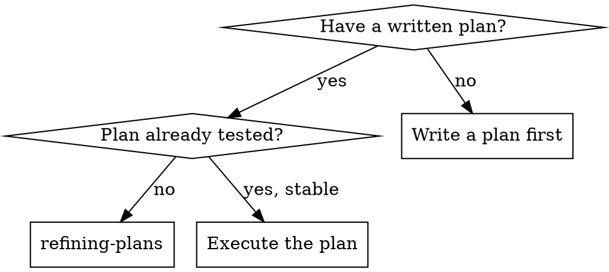
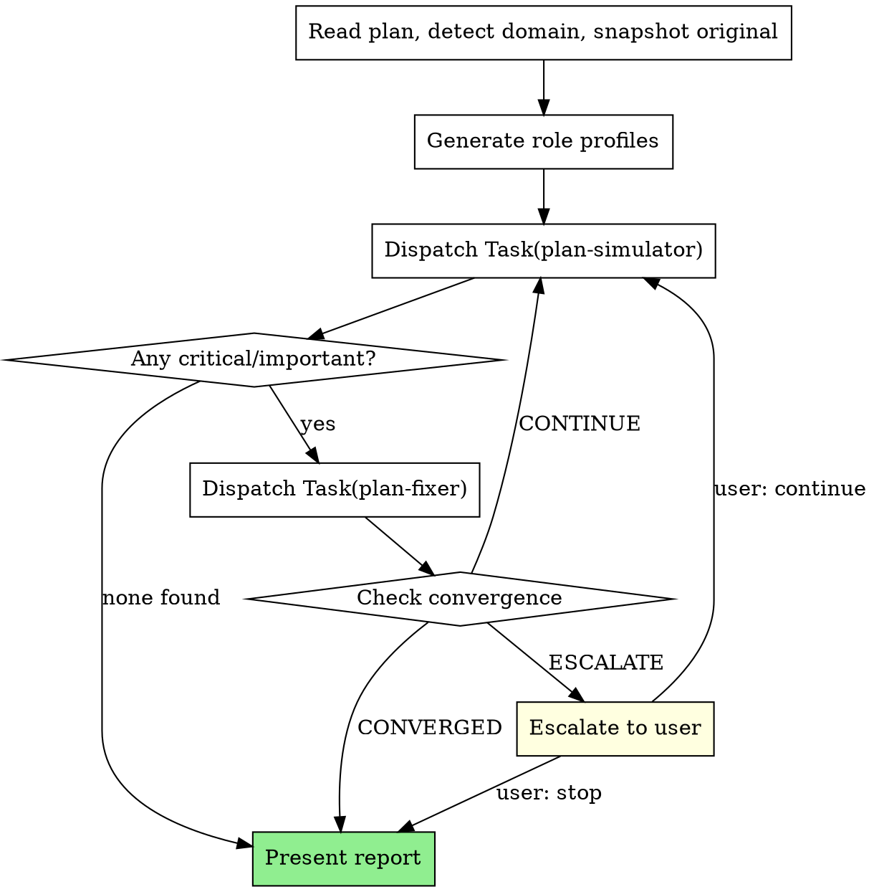

# Refining Plan

Iteratively simulate and refine a plan until stable: simulate → find issues → fix → check convergence → repeat.

**Core principle:** Simulate before executing — catch gaps on paper, not in code

**Announce at start:** "I'm using the refining-plans skill to pressure-test this plan."

## When to Use



## The Process

You MUST create a task for each phase step and complete in order.



### Phase 1: Domain Detection

Read the plan and determine domain (backend, frontend, infrastructure, data, plugin-dev, ML/AI, devops, full-stack, other), technologies, and key concerns.

Generate role profiles:
- plan-simulator: "Senior {domain} engineer who pressure-tests {technology} plans"
- plan-fixer: "{domain} specialist who patches {technology} plan gaps"

Log detected domain and roles before proceeding.

### Phase 2: Iteration Loop

Default max iterations: 5. For each round:

1. **Dispatch plan-simulator** — provide full plan text, role profile, iteration number, previous fixes summary (if iteration > 1)
2. **Evaluate** — no critical/important findings → CONVERGED, skip to Phase 3
3. **Dispatch plan-fixer** — provide plan file path, critical + important findings, original snapshot
4. **Check convergence:**
   - No critical/important findings → CONVERGED
   - Same critical concern persists across rounds (round 2+) → ESCALATE
   - Drift detection: plan changed direction → ESCALATE
   - Otherwise → CONTINUE

Track per round: `Round {N}: critical={X} important={Y} minor={Z} → {signal}`

### Phase 3: Report & Handoff

```markdown
## Plan Refinement Complete

**Plan:** {plan_path}
**Domain:** {detected_domain}
**Iterations:** {completed}/{max}
**Stop Reason:** {CONVERGED | MAX_ITERATIONS | USER_STOPPED}

| Round | Critical | Important | Minor | Signal |
|-------|----------|-----------|-------|--------|
| ...   | ...      | ...       | ...   | ...    |
```

Then offer execution choice:

**"Plan refined and stable. Three execution options:**

**1. Subagent-Driven (this session)** — fresh subagent per task, review between tasks
- **REQUIRED SUB-SKILL:** Use superpowers:subagent-driven-development

**2. Parallel Session (separate)** — batch execution with checkpoints
- **REQUIRED SUB-SKILL:** New session uses superpowers:executing-plans

**3. Refine again** — run another round of refinement

**Which approach?"**

## Red Flags

**Never:**
- Skip simulation and go straight to execution
- Let plan-fixer restructure the plan (only patch gaps)
- Continue after CONVERGED or ignore ESCALATE signal
- Run plan-fixer without simulation findings
- Modify the plan yourself (only plan-fixer subagent edits)
