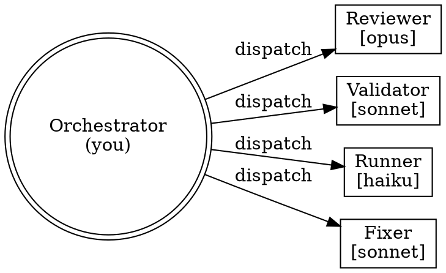
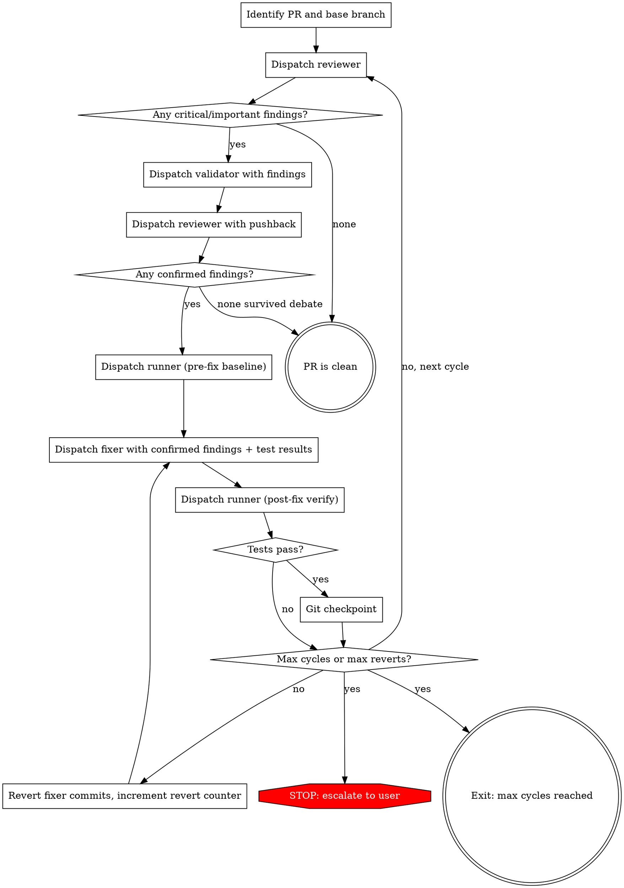
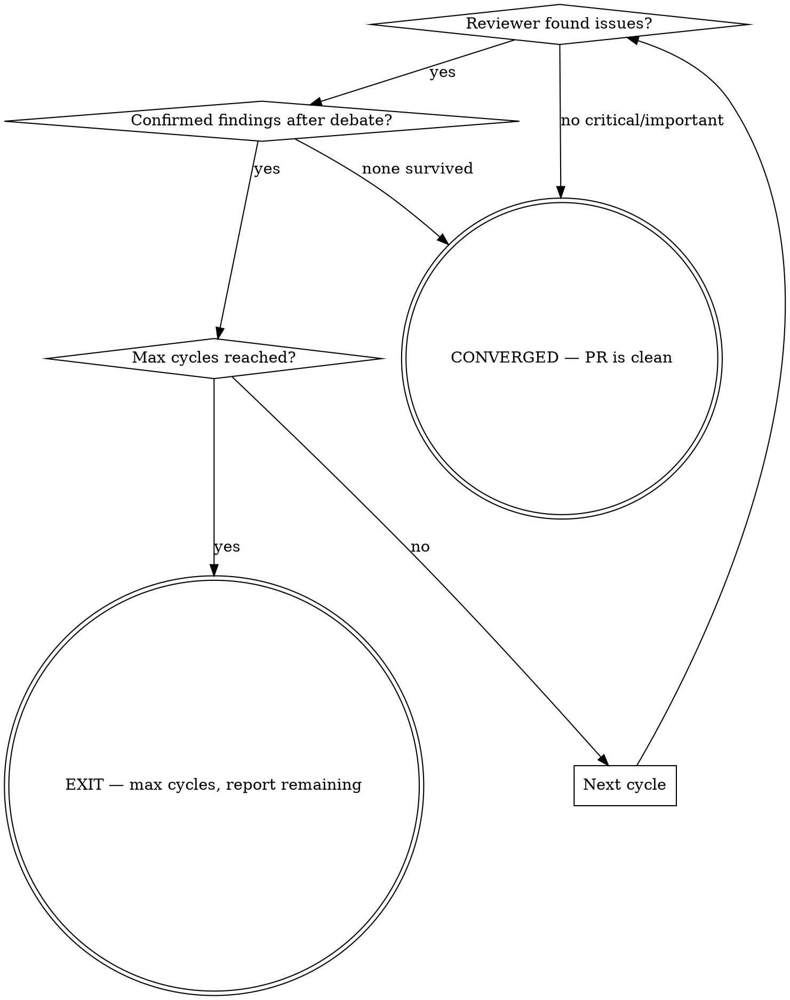

# Refining PRs

Iteratively stabilize PR code through adversarial review-validate-fix cycles until merge-ready: review -> validate -> debate -> test -> fix -> verify -> repeat.

**Core principle:** Separate evaluation from generation, challenge every finding before acting on it, and use objective test signals alongside subjective code review. Never let the fixer judge its own work.

**Announce at start:** "I'm using the refining-prs skill to iteratively refine this PR through adversarial review cycles."

## When to Use

- PR is ready for review and needs quality gate before merge
- PR has known issues that need systematic resolution
- Want to stabilize code without manual back-and-forth

## When NOT to Use

- Draft PRs or WIP branches (too early)
- Documentation-only changes (no code to test)
- Single-line trivial fixes
- No test suite exists and none can be created

## Architecture

Four specialized agents with strict role boundaries. The invoking agent orchestrates.



**Role boundaries (never cross):**

| Agent | CAN | CANNOT |
|-------|-----|--------|
| Reviewer | Read code, find issues, defend findings | Modify files, run tests, fix anything |
| Validator | Read code, simulate fixes, challenge findings | Modify files, run tests, approve own work |
| Runner | Run tests, report results | Modify files, review code, fix anything |
| Fixer | Modify files, commit fixes | Review own work, skip confirmed findings, add features |

## The Refinement Loop

You MUST create a task for each phase and complete in order.



### Phase 0: Setup

1. Identify the PR: parse from argument, current branch, or ask user
2. Determine base branch (e.g., `main`, `develop`) — `gh pr view --json baseRefName`
3. Get the full diff: `git diff {base}...HEAD`
4. Store `PRE_LOOP_SHA=$(git rev-parse HEAD)` for revert fallback
5. Detect test command: look for `test:e2e`, `test`, `e2e` in package.json scripts, or ask user
6. Create progress task: `TaskCreate("Refine PR — cycle 0/{max}")`

**Defaults:**
- `max_cycles`: 5
- `max_reverts_per_cycle`: 2
- `test_command`: auto-detect or ask user

### Phase 1: Review

Dispatch reviewer via `Agent` tool (model: opus):
- Provide: full PR diff, base branch, changed file list, cycle number, previous cycle summary (if cycle > 1)
- Reviewer uses pr-review-toolkit patterns to analyze
- Use template in `reviewer-prompt.md`

**Reviewer returns:** structured findings with severity (critical/important/minor), location (file:line), description, evidence, and suggestion.

**Quick exit:** If reviewer returns no critical or important findings -> CONVERGED. PR is clean. Skip to Phase 8.

### Phase 2: Validate

Dispatch validator via `Agent` tool (model: sonnet):
- Provide: ALL findings from reviewer, the PR diff, changed files content
- Validator examines each finding, simulates the proposed fix mentally, and produces a verdict per finding: `ACCEPT` (change is needed) or `REJECT` (change is unnecessary, with detailed reasoning)
- Use template in `validator-prompt.md`

**Validator returns:** per-finding verdicts with reasoning.

### Phase 3: Debate

For each finding the validator REJECTED:
- Dispatch reviewer again (opus) with: the original finding, the validator's rejection reasoning, the relevant code
- Reviewer either:
  - **Drops the finding** — accepts validator's argument (finding removed)
  - **Strengthens the case** — provides additional evidence (finding survives)

**Output:** list of **confirmed findings** = findings the validator accepted + findings the reviewer successfully defended.

**Quick exit:** If no confirmed findings remain -> CONVERGED. PR is clean. Skip to Phase 8.

### Phase 4: Pre-Fix Tests

Dispatch runner via `Agent` tool (model: haiku):
- Run the test command
- Report: pass/fail, failing test names, error messages
- This establishes a **baseline** — fixer must not introduce new failures

### Phase 5: Fix

Dispatch fixer via `Agent` tool (model: sonnet):
- Provide: confirmed findings (severity-ranked), baseline test results, changed files
- Fixer implements fixes:
  - One commit per logical fix
  - Commit message: `refine(cycle-{N}): {description}`
  - Address findings in severity order (critical first)
  - Never add features, refactor beyond the finding, or change unrelated code
- Use template in `fixer-prompt.md`

### Phase 6: Post-Fix Verification

Dispatch runner again (haiku):
- Run the same test command
- Compare against Phase 4 baseline

**If tests pass:** proceed to Phase 7.

**If tests fail (new failures introduced by fixer):**
1. Increment revert counter for this cycle
2. If revert counter < `max_reverts_per_cycle`:
   - Revert fixer commits: `git revert --no-edit HEAD~{N}..HEAD` (where N = number of fixer commits)
   - Re-dispatch fixer with: same findings + the test failure details + instruction to avoid the approach that broke tests
   - Re-run Phase 6
3. If revert counter >= `max_reverts_per_cycle`:
   - Revert to last known good state
   - ESCALATE to user with: findings that couldn't be fixed without breaking tests

### Phase 7: Git Checkpoint

After successful fix + verify:
1. Create checkpoint commit (empty, metadata only):
   ```
   git commit --allow-empty -m "refine(cycle-{N}): findings_confirmed={X} findings_fixed={Y} tests=pass"
   ```
2. Update progress: `TaskUpdate("Cycle {N} complete — {X} findings fixed, tests pass")`
3. Increment cycle counter

### Phase 8: Convergence Check



**Exit conditions (checked in order):**
1. **CONVERGED:** Reviewer reports no critical/important findings
2. **CONVERGED:** No findings survive adversarial validation
3. **MAX_CYCLES:** Cycle counter >= `max_cycles`
4. **ESCALATE:** Test failures persist after max reverts
5. **USER_INTERRUPT:** User signals stop

## State Management

### Git-Driven Persistence

All state persists in git commits — survives context compaction:

```bash
# Parse cycle history from git log
git log --format="%s" --grep="refine(cycle"

# Regex to reconstruct state:
# refine\(cycle-(\d+)\): findings_confirmed=(\d+) findings_fixed=(\d+) tests=(pass|fail)
```

**To recover after context compaction:**
1. Parse all `refine(cycle-*)` commits from git log
2. Reconstruct: current cycle number, cumulative findings fixed, test status history
3. Resume from next cycle number

### Fresh Subagents Per Dispatch

Every agent dispatch creates a fresh subagent — no accumulated context, no context anxiety. The orchestrator (you) maintains loop state and provides each subagent exactly the context it needs.

**Why:** The Anthropic harness article found that context resets eliminate premature task termination and context anxiety. Fresh subagents per dispatch is the simplest implementation of this principle.

### Progress Tracking

```
# Startup
TaskCreate("Refine PR — cycle 0/{max_cycles}")

# Per cycle
TaskUpdate("Cycle {N}: reviewing...")
TaskUpdate("Cycle {N}: {X} findings, validating...")
TaskUpdate("Cycle {N}: {Y} confirmed, fixing...")
TaskUpdate("Cycle {N} complete — {Y} fixed, tests pass")

# Exit
TaskUpdate("PR refinement complete — {exit_reason}")
```

## Failure Recovery

### Test Failures After Fix

1. Revert fixer commits to last checkpoint
2. Re-dispatch fixer with failure details and instruction to try different approach
3. Max 2 retries per cycle before escalating

### Fixer Cannot Resolve Finding

If fixer reports it cannot fix a finding without broader changes:
1. Mark finding as `DEFERRED`
2. Include in final report
3. Continue with remaining findings

### Complete Recovery Fallback

If loop enters unrecoverable state:
```bash
git reset --hard {PRE_LOOP_SHA}
```
Report what was attempted and what failed. User decides next steps.

## Report Format

On exit, present:

```markdown
## PR Refinement Report

**PR:** #{pr_number} — {title}
**Cycles:** {completed}/{max_cycles}
**Exit reason:** CONVERGED | MAX_CYCLES | ESCALATE | USER_INTERRUPT

### Cycle History
| Cycle | Findings | Confirmed | Fixed | Deferred | Tests |
|-------|----------|-----------|-------|----------|-------|
| 1     | ...      | ...       | ...   | ...      | pass  |

### Resolved Issues
{list of findings successfully fixed, grouped by severity}

### Remaining Issues
{findings not resolved — deferred or persisted through max cycles}

### Recommendations
{any patterns observed — recurring issue types, areas needing human attention}
```

## Red Flags

**Never:**
- Let fixer review its own work (always re-dispatch reviewer)
- Skip adversarial validation ("findings are obviously correct")
- Fix minor findings before all critical/important are resolved
- Continue after CONVERGED signal
- Add features or refactor beyond confirmed findings
- Force-push or rewrite history on the PR branch

**Stop and re-read this skill if you think:**
- "This finding is obvious, no need to validate"
- "I'll batch the fixes instead of committing separately"
- "Tests are probably fine, skip the post-fix run"
- "Minor findings are easy, let me fix those too"

## Integration

**Required skills/tools:**
- **pr-review-toolkit** — reviewer uses this for structured PR analysis
- **Git** — checkpoint commits, revert on failure

**Pairs well with:**
- **superpowers:verification-before-completion** — final check after refinement converges
- **superpowers:finishing-a-development-branch** — after PR is merge-ready

**Required templates:**
- `reviewer-prompt.md` — dispatch template for reviewer subagent
- `validator-prompt.md` — dispatch template for validator subagent
- `fixer-prompt.md` — dispatch template for fixer subagent
