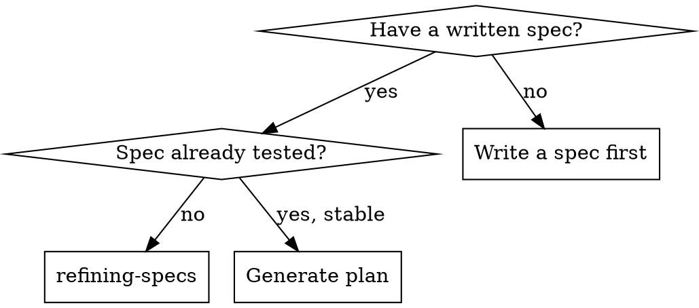
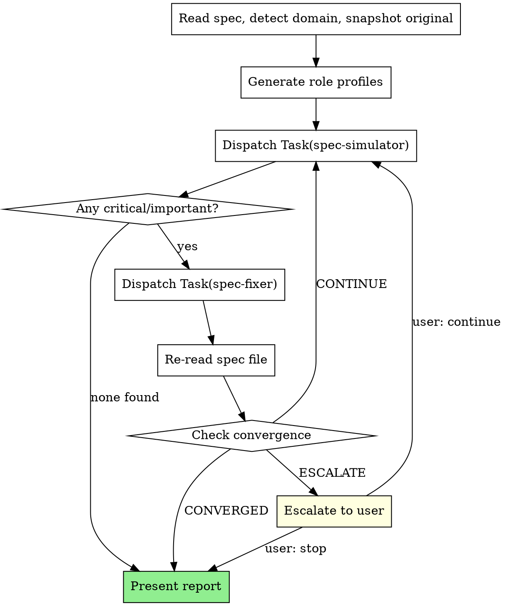

# Refining Specs

Iteratively simulate and refine a spec until stable: simulate plan derivation → find gaps → fix → check convergence → repeat.

**Core principle:** Simulate plan derivation before writing plans — catch gaps in the spec, not during planning

**Announce at start:** "I'm using the refining-specs skill to pressure-test this spec."

## When to Use



## When NOT to Use

- No written spec exists yet — use superpowers:brainstorming first
- The "spec" is a rough idea or notes, not a design document
- Already in planning or execution phase — too late for spec refinement
- Spec describes only internal architecture with no observable behavior gaps to find

## The Process

You MUST create a task for each phase step and complete in order.

1. **Read spec & detect domain** — identify domain, technologies, key concerns
2. **Generate role profiles** — create simulator and fixer personas
3. **Run simulation loop** — dispatch simulator, evaluate findings, dispatch fixer, check convergence
4. **Present refinement report** — summarize rounds, findings, and final state
5. **Hand off** — invoke writing-plans or offer another refinement pass

**Harness requirement:** This skill dispatches simulator and fixer subagents each iteration. It requires a platform with subagent support (such as Claude Code or Codex). If subagents are not available, notify the user and stop — refining-specs cannot run in single-agent mode.



### Phase 1: Domain Detection

Read the spec and determine domain (backend, frontend, infrastructure, data, plugin-dev, ML/AI, devops, full-stack, other), technologies, and key concerns.

Generate role profiles:
- spec-simulator: "Senior {domain} engineer who pressure-tests {technology} specs by attempting to derive implementation plans"
- spec-fixer: "{domain} specialist who patches {technology} spec gaps while preserving design decisions"

Log detected domain and roles before proceeding.

### Phase 2: Iteration Loop

Default max iterations: 5. For each round:

1. **Dispatch spec-simulator** — provide full spec text inline (not file path), role profile, iteration number, previous fixes summary (if iteration > 1). Use the template in `spec-simulator-prompt.md`.
2. **Evaluate** — no critical/important findings → CONVERGED, skip to Phase 3
3. **Dispatch spec-fixer** — provide spec file path, full spec text inline, critical + important findings, original snapshot. Instruct fixer to mark all inferred additions with `[inferred]` tag. Use the template in `spec-fixer-prompt.md`.
4. **Re-read spec file** — fixer edits in-place, so orchestrator must refresh its copy of the spec text for the next simulation round.
5. **Check convergence:**
   - No critical/important findings → CONVERGED
   - Same critical concern persists across rounds (round 2+) → ESCALATE
   - Drift detection: spec changed direction from original snapshot → ESCALATE
   - Otherwise → CONTINUE

Track per round: `Round {N}: critical={X} important={Y} minor={Z} → {signal}`

### Phase 3: Report & Handoff

```markdown
## Spec Refinement Complete

**Spec:** {spec_path}
**Domain:** {detected_domain}
**Iterations:** {completed}/{max}
**Stop Reason:** {CONVERGED | MAX_ITERATIONS | USER_STOPPED}

| Round | Critical | Important | Minor | Signal |
|-------|----------|-----------|-------|--------|
| ...   | ...      | ...       | ...   | ...    |
```

Then offer next steps:

**The terminal state is invoking writing-plans** when the spec converges, or **re-running refining-specs** if the user wants another pass.

After presenting the report, announce:

> "Spec refinement complete and committed. Ready to generate an implementation plan using writing-plans, or run another refinement pass?"

Do NOT invoke any implementation skill directly. The only next skills are writing-plans or another refining-specs pass.

On ESCALATE: present stuck findings with context on what was tried. User can make the decision themselves and re-run, or accept the spec as-is with known gaps.

## The [inferred] Tag

The spec-fixer marks every piece of information it adds that was not explicitly stated in the original spec with an `[inferred]` tag at the end of the added sentence or clause.

**Purpose:** Downstream readers (plan authors, reviewers) can distinguish original design decisions from gap-fills inferred during refinement.

**Rule:** Only new additions get tagged. Existing spec content is never tagged.

## Red Flags

**Never:**
- Skip simulation and go straight to plan generation
- Let spec-fixer restructure the spec (only patch gaps inline)
- Continue after CONVERGED or ignore ESCALATE signal
- Run spec-fixer without simulation findings
- Modify the spec yourself (only spec-fixer subagent edits)

## Remember

- Simulate before planning — never skip straight to plan generation
- Fixer only patches gaps inline — never restructures
- Every addition gets an `[inferred]` tag — distinguish original decisions from gap-fills
- Re-read the spec file after every fix round — fixer edits in-place
- CONVERGED means stop iterating; ESCALATE means surface to user
- Orchestrator never edits the spec directly — only spec-fixer subagent touches the file
