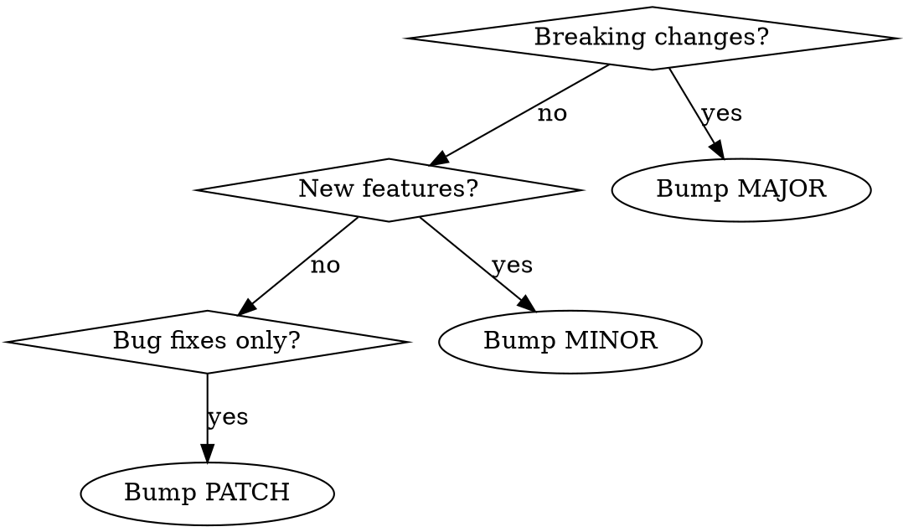

# Releasing

## Overview

Create releases with proper versioning, documentation, and verification. Ensures quality gates pass before publishing.

**Core principle:** Verify → Document → Tag → Publish → Verify.

**Announce at start:** "I'm using the releasing skill to create a new release."

## Detect Release Notes File

The releasing skill works with whatever release notes file the project uses. Detect it at the start:

```bash
if [ -f RELEASE-NOTES.md ]; then
  RELEASE_FILE="RELEASE-NOTES.md"
elif [ -f CHANGELOG.md ]; then
  RELEASE_FILE="CHANGELOG.md"
else
  RELEASE_FILE="RELEASE-NOTES.md"  # default for new projects
fi
```

All subsequent commands reference `$RELEASE_FILE` instead of a hardcoded filename.

**If neither file exists** (new project), bootstrap the file:

```bash
cat > RELEASE-NOTES.md << 'EOF'
# Release Notes

## [Unreleased]

EOF
```

Then add the first version header (see Step 1).

## Pre-Release Checklist

**ALL items must pass before proceeding:**

### 1. Working Tree Clean

```bash
git status
```

**MUST show:** `nothing to commit, working tree clean` or `Your branch is up to date`

**If dirty:**
```
Working tree has uncommitted changes:
[Show git status output]

Commit or stash changes before releasing.
```

Stop. Don't proceed.

### 2. Tests Pass (skip this check only if the project has no test suite — no test runner configured, no test directory)

```bash
# Project-specific
npm test / cargo test / pytest / go test ./...
```

**If tests fail:** Stop and fix. Don't release broken code.

**If no tests:** Note in release process, proceed.

### 3. Release Notes Updated

```bash
grep -E "^## v[0-9]|^## \[v[0-9]" "$RELEASE_FILE" | head -1
```

**MUST contain:** Version number matching the planned release.

**If missing:**
```
$RELEASE_FILE missing vX.Y.Z section.

Add release notes entry before releasing.
```

Stop. Update release notes first.

### 4. Version Decision

Determine version bump using Semantic Versioning:

```
MAJOR.MINOR.PATCH

PATCH (0.0.X): Bug fixes, typo corrections
MINOR (0.X.0): New features, backward compatible
MAJOR (X.0.0): Breaking changes, restructure
```

**Decision flow:**



### 5. Review Changes

**Before releasing, verify the changes are complete and correct.** This catches stale references, missed files, and incomplete migrations — exactly the kind of gap that a per-file review misses.

```bash
# Review diff since last release
git diff vPREVIOUS...HEAD --stat
```

Then dispatch a subagent to check for gaps:

```
Review the changes between vPREVIOUS and HEAD for:
1. Stale references to renamed/removed files
2. Cross-file consistency (e.g., if a filename changed, are all references updated?)
3. Missing updates that the change implies but didn't include
4. Any hardcoded values that should have been updated
```

**If gaps found:** Fix before releasing. Commit the fix, then restart the checklist.

**If clean:** Proceed to Step 1.

## Release Process

### Step 1: Confirm Version

Ask user to confirm version number:

```
Based on the changes, this should be vX.Y.Z (PATCH/MINOR/MAJOR).

Release notes show version: [grep result]

Is this correct?
```

Wait for confirmation.

### Step 2: Final Commit (if needed)

If release notes were just updated:

```bash
git add "$RELEASE_FILE"
git commit -m "docs: Update $RELEASE_FILE for vX.Y.Z release

👾 Generated with [Letta Code](https://letta.com)

Co-Authored-By: Letta Code <noreply@letta.com>"
```

### Step 3: Create Annotated Tag

```bash
git tag -a vX.Y.Z -m "vX.Y.Z - Brief description"
```

**Tag message format:** `vX.Y.Z - One-line summary`

### Step 4: Push Commits and Tag

```bash
git push origin main
git push origin vX.Y.Z
```

### Step 5: Create GitHub Release

Using GitHub CLI:

```bash
gh release create vX.Y.Z --title "vX.Y.Z - Release Title" --notes "$(cat <<'EOF'
[Release notes content for this version from $RELEASE_FILE]
EOF
)"
```

Or direct user to GitHub UI:

```
Tag vX.Y.Z pushed. Create release at:
https://github.com/OWNER/REPO/releases/new

Select tag: vX.Y.Z
Title: vX.Y.Z - Brief description
Copy release notes section as body.
Click "Publish release"
```

### Step 6: Verify Release

Check that:
- Release appears at `https://github.com/OWNER/REPO/releases/tag/vX.Y.Z`
- Source archives (zip/tar) are downloadable
- Release notes render correctly

### Step 7: Close Milestone (if applicable)

If a GitHub milestone exists for this release, close it:

```bash
# Find the milestone number for this version
MILESTONE_NUMBER=$(gh api repos/{owner}/{repo}/milestones \
  --jq ".[] | select(.title == \"vX.Y.Z\") | .number")

# Close the milestone
if [[ -n "$MILESTONE_NUMBER" ]]; then
  gh api repos/{owner}/{repo}/milestones/$MILESTONE_NUMBER \
    --method PATCH \
    --field state=closed
fi
```

**Skip if:** No milestone exists for this version, or the project doesn't use milestones.

## Tag Naming Convention

| Pattern | Example | Use Case |
|---------|---------|----------|
| `vMAJOR.MINOR.PATCH` | v1.2.3 | Stable release |
| `vMAJOR.MINOR.PATCH-rc.N` | v1.2.0-rc.1 | Release candidate |
| `vMAJOR.MINOR.PATCH-beta.N` | v1.2.0-beta.1 | Beta testing |
| `vMAJOR.MINOR.PATCH-alpha.N` | v1.2.0-alpha.1 | Early development |

**Format:** Always prefix with `v`, use lowercase for prerelease suffix.

## Post-Release Verification

After publishing:

1. Check release URL is accessible
2. Download links work (zipball/tarball)
3. Release notes version header matches tag
4. Ask user: "Release published. Anything else?"

## Quick Reference

### Pre-Release Checklist

| # | Check | Command |
|---|-------|---------|
| 1 | Clean tree | `git status` |
| 2 | Tests pass | `<test command>` |
| 3 | Release notes updated | `grep "$RELEASE_FILE"` |
| 4 | Version confirmed | Ask user |
| 5 | Review changes | `git diff` + subagent gap check |

### Release Process

| Step | Command | Purpose |
|------|---------|---------|
| 1 | Confirm version | Ask user to verify |
| 2 | `git add` + `git commit` | Final release notes commit |
| 3 | `git tag -a vX.Y.Z` | Create annotated tag |
| 4 | `git push origin main` + `git push origin vX.Y.Z` | Push commits and tag |
| 5 | `gh release create` or GitHub UI | Create release |
| 6 | Check release URL | Verify release |
| 7 | `gh api` PATCH milestone | Close milestone (if applicable) |

## Common Mistakes

**Releasing with dirty tree**
- **Problem:** Uncommitted changes not included in release
- **Fix:** Always verify `git status` first

**Skipping release notes**
- **Problem:** Release notes empty or outdated
- **Fix:** Make release notes check mandatory

**Wrong version number**
- **Problem:** Breaking change released as PATCH
- **Fix:** Use version decision flow, confirm with user

**Tag without release**
- **Problem:** Users can't find release notes
- **Fix:** Always create GitHub release after tag

**Hardcoded filename**
- **Problem:** Skill fails on projects using RELEASE-NOTES.md instead of CHANGELOG.md
- **Fix:** Always detect the release notes file first

## Red Flags

**Never:**
- Release with failing tests
- Release with dirty working tree
- Skip release notes update
- Force-push tags (unless explicitly requested)
- Delete tags without user confirmation

**Always:**
- Run pre-release checklist
- Detect the release notes file (don't hardcode)
- Confirm version with user
- Create GitHub release (not just tag)
- Verify release after publishing

## Integration

**Can be called by:**
- `finishing-a-development-branch` (Option 3: Merge and Create Release, post-merge follow-up)
- Directly when user says "create a release" or "do a release"

**Sequence after finishing-a-development-branch:**
1. Merge completes → Option 3 selected
2. Invoke releasing skill
3. Complete release workflow
4. Return to cleanup worktree
