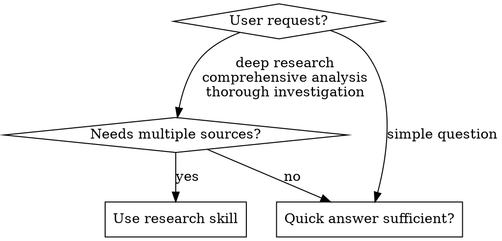

# Deep Research

## Overview

Comprehensive research using subagents, web search, and web scraping. Iteratively decomposes topics, gathers evidence from quality sources, and synthesizes findings into structured reports.

**Core principle:** Decompose questions, research in parallel with subagents, evaluate confidence, iterate until sufficient, synthesize with source attribution.

**REQUIRED BACKGROUND:** This skill dispatches subagents. See `superpowers:dispatching-parallel-agents` for dispatch patterns.

## When to Use



**Use when:**
- User explicitly asks for "deep research" or "comprehensive analysis"
- Topic requires multiple authoritative sources
- Need to track confidence and identify gaps
- Want structured output with source attribution

**Don't use when:**
- Simple factual question (single search sufficient)
- User wants quick answer, not exhaustive report
- Topic is too narrow for 8-question decomposition

## Required Tools

| Tool | Purpose | Required |
|------|---------|----------|
| `WebSearch` | Search queries (built-in) | Yes |
| `Task` | Spawn research subagents | Yes |
| `firecrawl-mcp:firecrawl_scrape` | Scrape full page content (preferred) | No |
| `WebFetch` | Fetch page content (built-in fallback) | Fallback |

**Tool Selection:** In INIT phase, check if `firecrawl-mcp:firecrawl_scrape` is available. If not, use `WebFetch` (built-in). Record choice in `state.json` as `"scraper": "firecrawl"` or `"scraper": "webfetch"`.

**Tradeoffs:**
- `firecrawl-mcp:firecrawl_scrape`: Better content extraction, handles JS-rendered pages
- `WebFetch`: Always available, sufficient for static pages

## State Machine

```
INIT → DECOMPOSE → RESEARCH → EVALUATE → [RESEARCH or SYNTHESIZE] → DONE
```

**State File:** `research/{slug}/state.json`

```json
{
  "topic": "string",
  "phase": "INIT|DECOMPOSE|RESEARCH|EVALUATE|SYNTHESIZE|DONE",
  "iteration": 0,
  "totalSearches": 0,
  "scraper": "firecrawl|webfetch",
  "questions": [{"id": 1, "text": "...", "status": "pending|done", "confidence": null}]
}
```

**Rule:** Read `state.json` before acting. Write `state.json` after acting.

### State Recovery

**On skill invocation, first check for existing state:**

1. If `research/{slug}/state.json` exists:
   - Parse JSON; if invalid, offer to restart
   - Resume from current `phase`
   - Notify user: "Resuming research from {phase} phase"

2. Verify state consistency before resuming:
   - RESEARCH: Ensure pending questions exist
   - EVALUATE: Ensure `findings.json` has data
   - SYNTHESIZE: Ensure all questions marked "done"

3. If inconsistent, offer user choice:
   - Delete state and restart
   - Attempt repair (mark incomplete questions as pending)

---

## Phase: INIT

**1. Generate slug from topic:**

- Lowercase the topic
- Replace spaces with hyphens
- Remove special characters (keep only `a-z`, `0-9`, `-`)
- Truncate to 50 characters
- Example: "AI in Healthcare 2024!" → `ai-in-healthcare-2024`

**2. Detect available scraper:**

Check if `firecrawl-mcp:firecrawl_scrape` tool exists. Set `scraper` accordingly:
- If firecrawl available → `"scraper": "firecrawl"`
- If not available → `"scraper": "webfetch"` (uses built-in `WebFetch`)

**3. Create working directory:**

```bash
mkdir -p research/{slug}
```

**4. Initialize state files:**

**state.json:**
```json
{"topic": "...", "phase": "DECOMPOSE", "iteration": 0, "totalSearches": 0, "scraper": "firecrawl|webfetch", "questions": []}
```

**findings.json:**
```json
[]
```

---

## Phase: DECOMPOSE

Generate exactly 8 questions covering these angles:

| # | Angle | Example |
|---|-------|---------|
| 1 | Definition/background | What is X? History and context? |
| 2 | Current state | What's happening now? Recent developments (last 1-2 years)? |
| 3 | Key entities | Who are the main people, companies, organizations? |
| 4 | Core mechanisms | How does it work? What are the processes? |
| 5 | Evidence and data | What studies, statistics, data exist? |
| 6 | Criticisms and limitations | What are the problems, risks, downsides? |
| 7 | Comparisons | How does it compare to alternatives? |
| 8 | Future developments | What's coming next? Predictions? |

Add questions to `state.json` with `status="pending"`. Set `phase="RESEARCH"`.

---

## Phase: RESEARCH

Batch pending questions (max 3 at a time). For each, dispatch a subagent.

**Read `scraper` from state.json** and use the appropriate prompt:

---

### If `scraper: "firecrawl"`:

> You are a research subagent with access to `WebSearch` and `firecrawl-mcp:firecrawl_scrape`.
>
> **TASK:** {QUESTION}
>
> **PROCESS:**
>
> 1. Run exactly 4 searches:
>    - Core query
>    - Add "research" or "study"
>    - Add current year or "recent"
>    - Rephrase with synonyms
>
> 2. Rank URLs by quality:
>    - **Tier 1:** .gov, .edu, journals, official docs
>    - **Tier 2:** Reuters, AP, BBC, industry publications
>    - **Tier 3:** Company blogs, Wikipedia
>    - **Skip:** Forums, social media, SEO spam
>
> 3. Select top 4 URLs (prefer Tier 1-2)
>
> 4. Use `firecrawl-mcp:firecrawl_scrape` on each. Continue if one fails.
>
> 5. Extract specific facts with sources.

---

### If `scraper: "webfetch"`:

> You are a research subagent with access to `WebSearch` and `WebFetch`.
>
> **TASK:** {QUESTION}
>
> **PROCESS:**
>
> 1. Run exactly 4 searches:
>    - Core query
>    - Add "research" or "study"
>    - Add current year or "recent"
>    - Rephrase with synonyms
>
> 2. Rank URLs by quality:
>    - **Tier 1:** .gov, .edu, journals, official docs
>    - **Tier 2:** Reuters, AP, BBC, industry publications
>    - **Tier 3:** Company blogs, Wikipedia
>    - **Skip:** Forums, social media, SEO spam
>
> 3. Select top 4 URLs (prefer Tier 1-2)
>
> 4. Use `WebFetch` on each with a prompt like "Extract the main content and key facts from this page". Continue if one fails.
>
> 5. Extract specific facts with sources.

---

### Return format (both scrapers):

> **RETURN ONLY THIS JSON:**
> ```json
> {
>   "questionId": {ID},
>   "questionText": "{QUESTION}",
>   "searchQueries": ["query1", "query2", "query3", "query4"],
>   "searchesRun": 4,
>   "urlsScraped": 4,
>   "scrapeFailures": [],
>   "findings": [{"fact": "...", "sourceUrl": "...", "tier": 1}],
>   "gaps": ["what you couldn't find"],
>   "contradictions": ["X says A, Y says B"],
>   "confidence": "high|medium|low",
>   "confidenceReason": "..."
> }
> ```

**After each subagent response:**
1. Validate JSON. Retry once if malformed.
2. Append to `findings.json`
3. Update `state.json`: mark question done, increment `totalSearches`

**After batch:** Set `phase="EVALUATE"`.

---

## Phase: EVALUATE

Calculate metrics:

| Metric | Calculation |
|--------|-------------|
| `avgConfidence` | high=3, medium=2, low=1, average all |
| `totalSearches` | sum from state |
| `significantGaps` | unique gaps across findings |

**Decision table:**

| iteration >= 3 | totalSearches >= 50 | avgConfidence >= 2.5 AND gaps <= 2 | → Decision |
|:--------------:|:-------------------:|:----------------------------------:|:----------:|
| Yes | - | - | SYNTHESIZE |
| - | Yes | - | SYNTHESIZE |
| - | - | Yes | SYNTHESIZE |
| No | No | No | RESEARCH |

First matching row wins. `-` means "don't care".

**If continuing:**
1. Generate max 4 follow-up questions from gaps/contradictions
2. Add to questions with `status="pending"`
3. Increment iteration
4. Set `phase="RESEARCH"`

---

## Phase: SYNTHESIZE

Write `report.md`:

```markdown
# {Topic}

## Executive Summary
[300-400 words. Most important finding first. State confidence. Note caveats.]

## Background
[200 words. Key terms. Context.]

## Key Findings

### [Theme 1]
[Grouped findings. Inline citations. Note source strength.]

### [Theme 2]
[3-5 themes total]

## Conflicting Information
[Both sides. Which has better sourcing.]

## Gaps & Limitations
[What's unknown. What needs more research.]

## Source Assessment
- **High confidence:** [claims with 3+ quality sources]
- **Medium confidence:** [claims with 1-2 sources]
- **Low confidence:** [single source or Tier 3 only]

## Sources

### Primary
[Tier 1 sources with URLs]

### Secondary
[Tier 2-3 sources with URLs]

---
*Searches: {n} | Iterations: {n} | Date: {date}*
```

Set `phase="DONE"`.

---

## Error Handling

| Error | Action |
|-------|--------|
| Malformed JSON | Retry once, then mark low confidence |
| Scrape fails | Continue with other URLs |
| Rate limit | Wait 60s, reduce batch to 2 |
| No results | Mark low confidence, rephrase as follow-up |
| Tool not found | Fall back to WebFetch, update state.json |

---

## Limits

| Resource | Max |
|----------|-----|
| Iterations | 3 |
| Total searches | 50 |
| Subagents per batch | 3 |
| URLs per subagent | 4 |
| Follow-ups per iteration | 4 |

---

## Common Mistakes

**Too broad topic:** "Research AI" → Too vague, 8 questions won't cover it
**Fix:** Narrow scope: "Research transformer architecture advances 2024"

**Skipping state file:** Losing track of progress across turns
**Fix:** Always read/write state.json

**Ignoring source tiers:** Treating all sources equally
**Fix:** Weight Tier 1 sources higher in synthesis

**No iteration:** Stopping after first pass with gaps
**Fix:** Check EVALUATE criteria, iterate if needed
