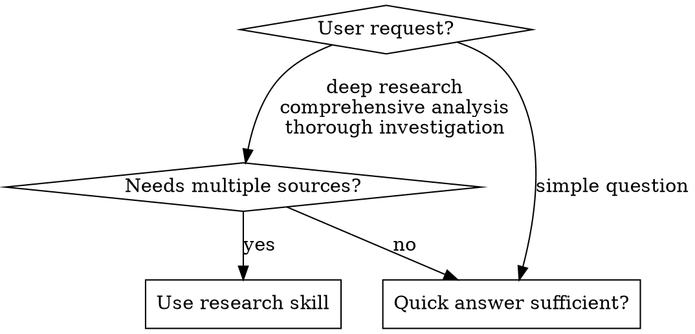

<objective>
Comprehensive research using subagents, web search, and web scraping. Iteratively decomposes topics, gathers evidence from quality sources, and synthesizes findings into structured reports.

Core principle: Decompose questions, research in parallel with subagents, evaluate confidence, iterate until sufficient, synthesize with source attribution.
</objective>

<quick_start>
1. Run `/research [topic]` to start
2. Research continues automatically until `targetSources` is met
3. A Stop hook enforces the source gate—you cannot exit early
4. On completion, a resource usage report is displayed
</quick_start>

<success_criteria>
Task is complete when ALL of these are true:
- [ ] `state.json` exists with valid JSON
- [ ] `sourcesGathered >= targetSources` (primary gate - enforced by Stop hook)
- [ ] All questions marked `"done"` with confidence ratings
- [ ] `report.md` synthesizes findings with source attribution
- [ ] `phase` is `"DONE"` in state.json
- [ ] Conflicting information documented with source quality assessment
- [ ] Gaps and limitations explicitly noted in report
</success_criteria>

<when_to_use>


Use when:
- User explicitly asks for "deep research" or "comprehensive analysis"
- Topic requires multiple authoritative sources
- Need to track confidence and identify gaps
- Want structured output with source attribution

Don't use when:
- Simple factual question (single search sufficient)
- User wants quick answer, not exhaustive report
- Topic is too narrow for 8-question decomposition
</when_to_use>

<required_tools>
| Tool | Purpose | Required |
|------|---------|----------|
| `WebSearch` | Search queries (built-in) | Yes |
| `Task` | Spawn research subagents | Yes |
| `firecrawl-mcp:firecrawl_scrape` | Scrape full page content (preferred) | No |
| `WebFetch` | Fetch page content (built-in fallback) | Fallback |

Tool Selection: In INIT phase, check if `firecrawl-mcp:firecrawl_scrape` is available. If not, use `WebFetch` (built-in). Record choice in `state.json` as `"scraper": "firecrawl"` or `"scraper": "webfetch"`.

Tradeoffs:
- `firecrawl-mcp:firecrawl_scrape`: Better content extraction, handles JS-rendered pages
- `WebFetch`: Always available, sufficient for static pages
</required_tools>

<state_machine>
```
INIT → DECOMPOSE → RESEARCH → EVALUATE → [RESEARCH or SYNTHESIZE] → DONE
```

State File: `research/{slug}/state.json`

```json
{
  "topic": "string",
  "phase": "INIT|DECOMPOSE|RESEARCH|EVALUATE|SYNTHESIZE|DONE",
  "iteration": 0,
  "targetSources": 30,
  "sourcesGathered": 0,
  "totalSearches": 0,
  "subagentCalls": 0,
  "findingsCount": 0,
  "startTime": "ISO-8601 timestamp",
  "scraper": "firecrawl|webfetch",
  "questions": [{"id": 1, "text": "...", "status": "pending|done", "confidence": null}]
}
```

Rule: Read `state.json` before acting. Write `state.json` after acting.
</state_machine>

<source_gate_enforcement>
A Stop hook prevents the session from ending until `sourcesGathered >= targetSources`. This is a hard gate—you cannot bypass it by rationalizing.

How it works:
1. When you try to complete, the hook checks `state.json`
2. If sources are insufficient, exit is blocked and you're prompted to continue
3. Once target is met AND phase is DONE, exit is allowed with a resource report

Default target: 30 sources. Adjust in INIT phase based on topic complexity.
</source_gate_enforcement>

<state_recovery>
On skill invocation, first check for existing state:

1. If `research/{slug}/state.json` exists:
   - Parse JSON; if invalid, offer to restart
   - Resume from current `phase`
   - Notify user: "Resuming research from {phase} phase"

2. Verify state consistency before resuming:
   - RESEARCH: Ensure pending questions exist
   - EVALUATE: Ensure `findings.json` has data
   - SYNTHESIZE: Ensure all questions marked "done"

3. If inconsistent, offer user choice:
   - Delete state and restart
   - Attempt repair (mark incomplete questions as pending)
</state_recovery>

<workflow>

<phase name="INIT">
1. Generate slug from topic:
   - Lowercase the topic
   - Replace spaces with hyphens
   - Remove special characters (keep only `a-z`, `0-9`, `-`)
   - Truncate to 50 characters
   - Example: "AI in Healthcare 2024!" → `ai-in-healthcare-2024`

2. Detect available scraper:
   - Check if `firecrawl-mcp:firecrawl_scrape` tool exists
   - If firecrawl available → `"scraper": "firecrawl"`
   - If not available → `"scraper": "webfetch"` (uses built-in `WebFetch`)

3. Create working directory:
   ```bash
   mkdir -p research/{slug}
   ```

4. Determine target sources based on topic complexity:
   - Narrow topic (specific question): 20 sources
   - Standard topic (most research): 30 sources (default)
   - Broad topic (comprehensive review): 40 sources

5. Initialize state files:

   state.json:
   ```json
   {
     "topic": "...",
     "phase": "DECOMPOSE",
     "iteration": 0,
     "targetSources": 30,
     "sourcesGathered": 0,
     "totalSearches": 0,
     "subagentCalls": 0,
     "findingsCount": 0,
     "startTime": "2024-01-15T10:30:00Z",
     "scraper": "firecrawl|webfetch",
     "questions": []
   }
   ```

   findings.json:
   ```json
   []
   ```
</phase>

<phase name="DECOMPOSE">
Generate exactly 8 questions covering these angles:

| # | Angle | Example |
|---|-------|---------|
| 1 | Definition/background | What is X? History and context? |
| 2 | Current state | What's happening now? Recent developments (last 1-2 years)? |
| 3 | Key entities | Who are the main people, companies, organizations? |
| 4 | Core mechanisms | How does it work? What are the processes? |
| 5 | Evidence and data | What studies, statistics, data exist? |
| 6 | Criticisms and limitations | What are the problems, risks, downsides? |
| 7 | Comparisons | How does it compare to alternatives? |
| 8 | Future developments | What's coming next? Predictions? |

Add questions to `state.json` with `status="pending"`. Set `phase="RESEARCH"`.
</phase>

<phase name="RESEARCH">
Batch pending questions (max 3 at a time). For each, dispatch a subagent.

Read `scraper` from state.json and use the appropriate prompt:

<subagent_prompt scraper="firecrawl">
You are a research subagent with access to `WebSearch` and `firecrawl-mcp:firecrawl_scrape`.

**TASK:** {QUESTION}

**PROCESS:**

1. Run exactly 4 searches:
   - Core query
   - Add "research" or "study"
   - Add current year or "recent"
   - Rephrase with synonyms

2. Rank URLs by quality:
   - **Tier 1:** .gov, .edu, journals, official docs
   - **Tier 2:** Reuters, AP, BBC, industry publications
   - **Tier 3:** Company blogs, Wikipedia
   - **Skip:** Forums, social media, SEO spam

3. Select top 4 URLs (prefer Tier 1-2)

4. Use `firecrawl-mcp:firecrawl_scrape` on each. Continue if one fails.

5. Extract specific facts with sources.
</subagent_prompt>

<subagent_prompt scraper="webfetch">
You are a research subagent with access to `WebSearch` and `WebFetch`.

**TASK:** {QUESTION}

**PROCESS:**

1. Run exactly 4 searches:
   - Core query
   - Add "research" or "study"
   - Add current year or "recent"
   - Rephrase with synonyms

2. Rank URLs by quality:
   - **Tier 1:** .gov, .edu, journals, official docs
   - **Tier 2:** Reuters, AP, BBC, industry publications
   - **Tier 3:** Company blogs, Wikipedia
   - **Skip:** Forums, social media, SEO spam

3. Select top 4 URLs (prefer Tier 1-2)

4. Use `WebFetch` on each with a prompt like "Extract the main content and key facts from this page". Continue if one fails.

5. Extract specific facts with sources.
</subagent_prompt>

<subagent_return_format>
**RETURN ONLY THIS JSON:**
```json
{
  "questionId": {ID},
  "questionText": "{QUESTION}",
  "searchQueries": ["query1", "query2", "query3", "query4"],
  "searchesRun": 4,
  "urlsScraped": 4,
  "scrapeFailures": [],
  "findings": [{"fact": "...", "sourceUrl": "...", "tier": 1}],
  "gaps": ["what you couldn't find"],
  "contradictions": ["X says A, Y says B"],
  "confidence": "high|medium|low",
  "confidenceReason": "..."
}
```
</subagent_return_format>

After each subagent response:
1. Validate JSON. Retry once if malformed.
2. Append to `findings.json`
3. Update `state.json`:
   - Mark question done
   - Increment `totalSearches` by `searchesRun` from response
   - Increment `subagentCalls` by 1
   - Increment `sourcesGathered` by `urlsScraped` from response
   - Increment `findingsCount` by length of `findings` array from response
4. Log progress: `"Sources: {sourcesGathered}/{targetSources}"`

After batch: Set `phase="EVALUATE"`.
</phase>

<phase name="EVALUATE">
Calculate metrics:

| Metric | Calculation |
|--------|-------------|
| `sourcesGathered` | from state.json (primary gate) |
| `targetSources` | from state.json |
| `avgConfidence` | high=3, medium=2, low=1, average all |
| `significantGaps` | unique gaps across findings |

Decision table (two-stage):

Stage 1: Source Gate (MANDATORY)

| sourcesGathered >= targetSources | → Action |
|:--------------------------------:|:--------:|
| No | RESEARCH (forced, cannot proceed) |
| Yes | Continue to Stage 2 |

You MUST gather enough sources before considering other criteria.

Stage 2: Quality Gate (only if Stage 1 passes)

| avgConfidence >= 2.5 AND gaps <= 2 | → Decision |
|:----------------------------------:|:----------:|
| Yes | SYNTHESIZE |
| No | RESEARCH (generate follow-ups) |

Note: The Stop hook enforces the source gate—you cannot exit until target is met.

If continuing to RESEARCH:
1. Generate max 4 follow-up questions from gaps/contradictions
2. Add to questions with `status="pending"`
3. Increment iteration
4. Set `phase="RESEARCH"`
5. Log: `"Continuing research: {sourcesGathered}/{targetSources} sources, need more to meet target"`
</phase>

<phase name="SYNTHESIZE">
Write `report.md`:

```markdown
# {Topic}

## Executive Summary
[300-400 words. Most important finding first. State confidence. Note caveats.]

## Background
[200 words. Key terms. Context.]

## Key Findings

### [Theme 1]
[Grouped findings. Inline citations. Note source strength.]

### [Theme 2]
[3-5 themes total]

## Conflicting Information
[Both sides. Which has better sourcing.]

## Gaps & Limitations
[What's unknown. What needs more research.]

## Source Assessment
- **High confidence:** [claims with 3+ quality sources]
- **Medium confidence:** [claims with 1-2 sources]
- **Low confidence:** [single source or Tier 3 only]

## Sources

### Primary
[Tier 1 sources with URLs]

### Secondary
[Tier 2-3 sources with URLs]

---
*Sources: {sourcesGathered} | Searches: {totalSearches} | Subagents: {subagentCalls} | Iterations: {iteration} | Duration: {duration} | Date: {date}*
```

Set `phase="DONE"`.

On completion: The Stop hook will display a resource usage summary when you exit.
</phase>

</workflow>

<error_handling>
| Error | Action |
|-------|--------|
| Malformed JSON | Retry once, then mark low confidence |
| Scrape fails | Continue with other URLs |
| Rate limit | Wait 60s, reduce batch to 2 |
| No results | Mark low confidence, rephrase as follow-up |
| Tool not found | Fall back to WebFetch, update state.json |
</error_handling>

<limits>
| Resource | Default | Notes |
|----------|---------|-------|
| Target sources | 30 | Adjustable in INIT (20-40 based on complexity) |
| Subagents per batch | 3 | Parallel research questions |
| URLs per subagent | 4 | Sources scraped per question |
| Follow-ups per iteration | 4 | New questions from gaps |

No hard iteration or search limits. The source gate is the primary constraint. Research continues until `sourcesGathered >= targetSources`.
</limits>

<red_flags>
STOP if you catch yourself thinking any of these:

| Thought | Reality |
|---------|---------|
| "I have high confidence, I can skip the source target" | The Stop hook will block you. Gather the sources—it's non-negotiable. |
| "This topic is too broad for 8 questions" | Narrow the scope first. Don't start research on vague topics. |
| "I'll just synthesize what I have" | Check `sourcesGathered >= targetSources`. If not met, you cannot proceed. |
| "I don't need to update state.json" | You will lose track. Always read/write state.json. |
| "All sources are equal" | Weight Tier 1 sources higher in synthesis. |
| "I'm stuck, I'll just finish" | Narrow the scope or generate better follow-up questions. The source gate is non-negotiable. |
</red_flags>
