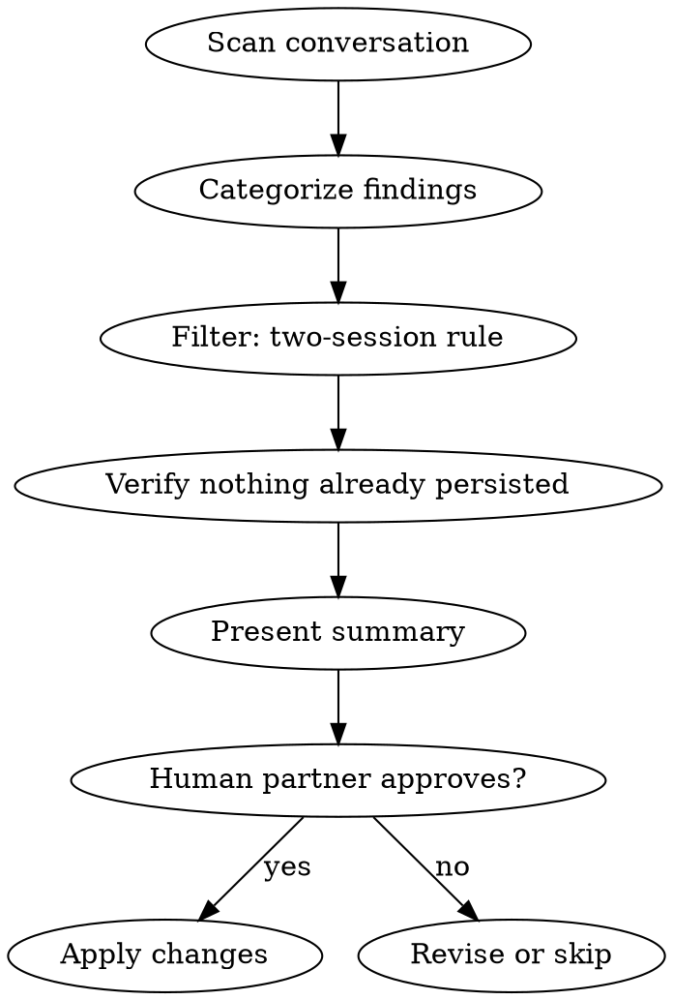

# Retrospective

## Overview

Extract non-obvious lessons from the session and persist them where they'll prevent the same friction next time, with your human partner's approval.

**Announce at start:** "I'm using the retrospective skill to review this session for improvements."

## When to Use

- Your human partner says `/retrospective` or "let's wrap up"
- End of a long session with corrections, friction, or workarounds

**Not needed for:** Short sessions with no friction or corrections.

## The Process



### Step 1: Scan Conversation for Signals

| Signal Type | What to Look For |
|-------------|-----------------|
| **Corrections** | Your human partner corrected you (strongest signal — always persist) |
| **Friction** | Errors, retries, wrong assumptions, config issues, missing env vars |
| **New patterns** | Solutions that would apply to future work |
| **Outdated docs** | CLAUDE.md instructions that were wrong or incomplete |
| **Missing context** | Things you had to discover that should have been documented |

### Step 2: Categorize and Filter

For each finding, determine where it belongs:

| Finding type | Destination |
|-------------|-------------|
| Project-wide convention, command, env var | **CLAUDE.md** |
| Domain-specific pattern for this repo | **Rule** |
| Reusable technique across ANY project | **Skill** |
| Cross-project personal preference | **Global memory** |

**Categorization test:** "Would this help someone on a completely different project?" Yes → Skill. Same tech stack only → Rule. Only this project → CLAUDE.md.

**Two-session rule — only persist if:**
- Your human partner explicitly corrected you (always persist)
- Issue appeared in 2+ conversations
- Your human partner asked to remember something
- Finding fills a clear documentation gap

**Do NOT persist:** one-off debugging steps, session-specific context (paths, branch names), speculative conclusions, duplicates of existing CLAUDE.md content.

### Step 3: Verify Before Presenting

**Do not assume prior persistence.** If you did not write to a file using a tool during THIS conversation, it does not exist. Do not hallucinate that findings are "already saved."

Before claiming something is persisted, verify with Read or Glob. If you cannot verify, propose it as a new write.

**This is the #1 failure mode of this skill.** Agents fabricate that corrections are "already captured" and skip the entire retrospective.

### Step 4: Present Summary and Get Approval

**Never write changes silently.** Present this structure:

```
## Retrospective Summary

### CLAUDE.md Updates
- Add docker compose commands to Build & Run section

### New/Updated Rules
- .claude/rules/docker.md — local dev networking patterns

### Suggested Skills
- None this session (or: skill-name — brief description)

### Pruning
- Remove outdated X from Y
```

Wait for your human partner's approval before writing any changes.

### Step 5: Apply Changes

After approval: update CLAUDE.md surgically (don't rewrite), append to memories (don't overwrite), follow **superpowers:writing-skills** for new skills.

## Common Mistakes

| Mistake | Fix |
|---------|-----|
| Persisting everything | Apply the two-session rule strictly |
| Vague memories ("Docker can be tricky") | Be specific: exact image, exact issue, exact fix |
| Claiming findings are "already saved" | If you didn't write it in THIS conversation, it doesn't exist |
| Classifying cross-project patterns as memories | Reusable across any project → Skill, not memory |
| Skipping user approval | Always present summary first |
| Dropping structure under social pressure | A compact summary is still a summary |

## Red Flags

**Never:** write changes without approval, persist session-specific details, claim something is "already saved" without tool verification, classify a cross-project pattern as a memory.

**Always:** get approval first, apply the two-session rule, maintain structured summary format regardless of session tone.
