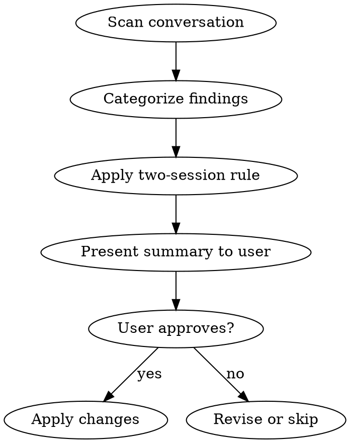

# Retrospective

## Overview

Review the current conversation for friction, mistakes, corrections, and patterns — then codify improvements across CLAUDE.md files, rules, agent memories, and skills. The goal is continuous improvement: every session makes future sessions smoother.

**Core principle:** Extract non-obvious lessons from the session and persist them in the right place, with user approval.

**Announce at start:** "I'm using the retrospective skill to review this session for improvements."

## When to Use

- End of a long or complex session
- User explicitly requests `/retrospective`
- After resolving a tricky debugging session with reusable lessons
- After a session where multiple corrections or workarounds were needed

**When NOT to use:**
- Short sessions with no friction or corrections
- Sessions that only involved reading/exploring code

## The Process



### Step 1: Scan Conversation for Signals

Read through the conversation and identify:

| Signal Type | What to Look For |
|-------------|-----------------|
| **Friction** | Errors, retries, wrong assumptions, config issues, missing env vars |
| **Corrections** | User corrected Claude on something (strongest signal) |
| **New patterns** | Solutions that would apply to future work |
| **Outdated info** | CLAUDE.md instructions that were wrong or incomplete |
| **Missing context** | Things Claude had to discover that should have been documented |
| **Repeated actions** | Manual workflows that could become skills or scripts |

### Step 2: Categorize Each Finding

For each finding, determine WHERE it belongs:

| If the finding is... | It goes in... |
|---------------------|---------------|
| Project-wide convention, command, env var | **CLAUDE.md** (`<repo>/CLAUDE.md`) |
| Domain-specific pattern | **Rule** (`<repo>/.claude/rules/<topic>.md`) |
| Agent-specific lesson | **Agent memory** (`<repo>/.claude/agent-memory/<agent>/MEMORY.md`) |
| Reusable multi-step workflow | **Skill** (`~/.claude/skills/<name>/SKILL.md`) |
| Cross-project personal preference | **Global memory** (`~/.claude/projects/.../memory/MEMORY.md`) |

### Step 3: Apply the Two-Session Rule

**Only persist findings that meet one of these criteria:**
- User explicitly corrected Claude (always persist)
- Issue appeared in 2+ conversations (check agent memories for prior mentions)
- User explicitly asked to remember something
- Finding fills a clear documentation gap (e.g., missing env var, wrong port)

**Do NOT persist:**
- One-off debugging steps unlikely to recur
- Session-specific context (temp file paths, current branch name)
- Speculative conclusions from reading a single file
- Anything that duplicates existing CLAUDE.md content

### Step 4: Present Summary Before Writing

**Never write changes silently.** Present a structured summary:

```
## Retrospective Summary

### CLAUDE.md Updates
- [repo] Add docker compose commands to Build & Run section
- [repo] Fix incorrect default port (was 8001, should be 8000)

### New/Updated Rules
- [repo] .claude/rules/docker.md — local dev networking patterns

### Agent Memory Updates
- [agent] lesson learned from this session

### Suggested Skills
- None this session (or: skill-name — brief description)

### Pruning
- [repo] Remove outdated X from agent memory Y
```

Wait for user approval before writing any changes.

### Step 5: Apply Changes

After approval:
- Group file edits by repo
- Update CLAUDE.md sections surgically (don't rewrite entire file)
- Append to agent memories (don't overwrite existing entries)
- For new skills, follow **superpowers:writing-skills**

## Quick Reference

| Signal | Persist? | Where? |
|--------|----------|--------|
| User correction | Always | CLAUDE.md or rule |
| Recurring issue (2+ sessions) | Yes | Appropriate location |
| Clear documentation gap | Yes | CLAUDE.md |
| One-off debugging step | No | — |
| Session-specific context | No | — |
| Reusable workflow pattern | Yes | Skill |

## Common Mistakes

| Mistake | Fix |
|---------|-----|
| Persisting everything | Apply the two-session rule strictly |
| Vague memories ("Docker can be tricky") | Be specific: exact image, exact issue, exact fix |
| Duplicating CLAUDE.md content in memories | Memories are for agent-specific lessons, not general docs |
| Rewriting entire files | Make surgical edits — append, don't overwrite |
| Skipping user approval | Always present summary first |
| Writing incident reports instead of patterns | Extract the reusable pattern, not the story |

## Red Flags

**Never:**
- Write changes without presenting summary first
- Persist session-specific details (paths, branch names, temp files)
- Duplicate content already in CLAUDE.md
- Create vague, non-actionable memories

**Always:**
- Get user approval before writing
- Apply the two-session rule
- Be specific and actionable in what you write
- Categorize findings into the right persistence layer
