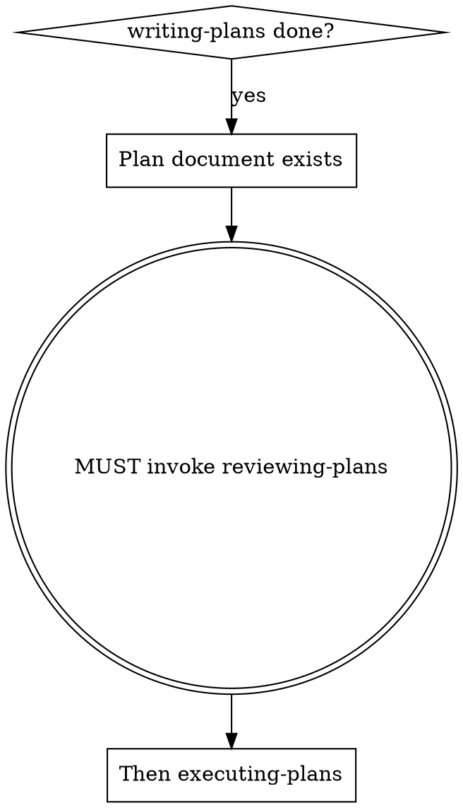

# Reviewing Plans

## Overview

Mandatory review gate between writing-plans and executing-plans. Catches design flaws, missing edge cases, and incomplete specifications before implementation begins.

**Core principle:** Never execute a plan you haven't reviewed. Implementing a flawed plan wastes more time than reviewing it.

## When to Use

**Trigger:** A plan document has been written and is ready for execution.

**This is NOT optional.** Every plan goes through review before execution — even "simple" ones. Simple plans are where unexamined assumptions cause the most waste.

## Process

### Step 1: Ask user to choose review mode

Present two options:

**A. Collaborative Walkthrough** — You and the user review the plan together, section by section. Best for important or complex plans where the user wants to understand and shape every decision.

**B. Agent Review** — Dispatch architect agents (e.g., Whis) to review independently and produce a report. Best when the user trusts the design and wants a quality check.

### Step 2: If Collaborative Walkthrough chosen

**Ask user to choose granularity:**
- **By Task** — review each task individually (thorough, slower)
- **By Feature/Section** — group related tasks into blocks (balanced)
- **Smart Grouping** — you identify which sections need deep analysis vs quick confirmation (fastest)

**For each section, analyze across 5 dimensions:**

| Dimension | What to evaluate |
|-----------|-----------------|
| **Reasonableness** | Is the logic sound? Are assumptions correct? |
| **Completeness** | Missing edge cases, interactions, dependencies? |
| **Best Practice** | Is this the best approach? Simpler alternatives? |
| **Risk** | What could go wrong? Impact on existing code? |
| **Test Sufficiency** | Do tests cover behavioral changes? Are assertions precise? |

**For each section:**
1. Present the section content
2. Analyze across the 5 dimensions
3. Flag any issues (tag as: Blocker / Should Fix / Suggestion)
4. Confirm user understanding before moving to next section

### Step 3: If Agent Review chosen

Dispatch a subagent (via Agent tool) to independently review the plan. The agent should:
- Read the plan document AND the actual source files it references
- Analyze across the same 5 dimensions (Reasonableness, Completeness, Best Practice, Risk, Test Sufficiency)
- Produce a structured report using the Issue Summary Table format

Present the agent's report to the user for decision.

### Step 4: Produce output

After review (either mode), present:

**A. Issue Summary Table** — All flagged issues, sorted by severity:
- **Blocker** — Must fix before execution (design flaw, missing logic, incorrect assumption)
- **Should Fix** — Important but not blocking (weak tests, missing docs, naming issues)
- **Suggestion** — Nice to have (optimization, style, future consideration)

**B. Decision Log** — Decisions made during review:
- What was discussed and resolved
- What was deferred and why
- Any scope changes (features moved to future versions)

**C. Next Step Options** — Ask user:
- **Update plan** → apply fixes to the plan document, commit changes, then re-review only the changed sections
- **Execute plan** → proceed to executing-plans
- **Split plan** → move incomplete features to a separate future plan document, commit both files

## Red Flags — STOP and Discuss

If you catch yourself thinking any of these during review, the section needs deeper discussion:

- "This implementation step is vague but probably fine" — ambiguity in a plan becomes a bug in code
- "The test just checks `> 0` but that's enough" — weak assertions in a plan become weak assertions in code
- "This only touches one file, should be simple" — unmentioned files = unplanned side effects
- "These two features don't interact" — unspecified interactions are the #1 source of plan-stage design flaws
- "I'll figure out the details during implementation" — if you can't specify it now, you can't implement it correctly later

**ALL of these mean: STOP. Flag the section. Discuss with the user before proceeding.**

## Common Mistakes

| Mistake | Fix |
|---------|-----|
| Skipping review because "plan is simple" | Simple plans have unexamined assumptions. Review anyway. |
| Reading sections without analyzing | Each section needs the 5-dimension analysis, not just a read-through. |
| Not flagging weak test assertions | `> 0` in a plan will become `> 0` in code. Catch it now. |
| Rubber-stamping agent review output | Read the agent report critically. Agents can miss things too. |
| Not asking user for confirmation per section | The user may have context you don't. Check after each section. |
