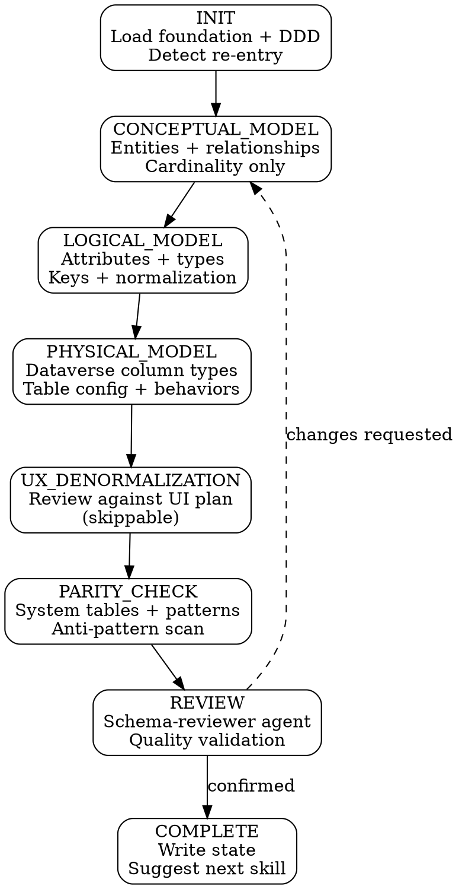

# Schema Design

schema-design translates your domain model (or entity map) into a Dataverse physical data model. It walks through four modeling stages — conceptual, logical, physical, and denormalization — then validates against known patterns and anti-patterns. The primary output is `docs/schema-physical-model.md`, consumed by ui-design, security, and business-logic.

**Announce:** "I'm using the schema-design skill to [create/resume/update] your physical data model."

## Plan Mode Exit

<HARD-GATE>
This skill writes files at PHYSICAL_MODEL, UX_DENORMALIZATION, and COMPLETE stages. If plan mode is active, tell the developer:
"schema-design needs to write files as we go. Please exit plan mode (Shift+Tab) so I can proceed."
Do NOT continue past Mode Selection while plan mode is active.
</HARD-GATE>

---

## Prerequisites

<HARD-GATE>
Before proceeding, verify all of the following exist in `.foundation/` and are NOT placeholders:
- `00-project-identity.md`
- `01-requirements.md`
- `02-architecture-decisions.md`
- `03-entity-map.md`

If ANY are missing or placeholder → STOP and tell the developer:
"I need a complete project foundation before I can design your schema. Run solution-discovery first."

Also verify `.foundation/.discovery-state.json` shows `"stage": "COMPLETE"`.
If discovery is not complete → STOP:
"solution-discovery is still in progress (stage: [stage]). Complete discovery first, then run schema-design."
</HARD-GATE>

---

## DDD Model Detection

Check for `docs/ddd-model.md`:

```
IF docs/ddd-model.md exists AND is complete:
  → Load DDD model. Aggregates, bounded contexts, and ubiquitous language
    pre-inform all modeling stages.
  → Announce: "DDD model loaded — [N] contexts, [M] aggregates."

IF docs/ddd-model.md does not exist OR is incomplete:
  → Warn: "No DDD model found. Running without application-design means
    aggregate boundaries, bounded context assignments, and naming standards
    are undefined. I'll proceed using the entity map alone, but schema
    decisions about relationship behaviors and table groupings will require
    more developer input.
    Consider running application-design first for a stronger foundation."
  → Proceed using 03-entity-map.md only.
```

---

## Mode Selection

At INIT, determine the operating mode:

```
IF .pp-context/skill-state.json does not exist
   OR does not contain schema-design entries → CREATE mode (first run)
IF skill-state.json shows activeSkill == "schema-design"
   AND activeStage != "COMPLETE" → RESUME mode
IF skill-state.json shows "schema-design" in completedSkills:
  → Check for existing schema artifacts (docs/schema-physical-model.md)
  → If artifacts exist, offer re-entry options:
    - "Full re-run" — walk all stages, diff against previous model
    - "Delta mode" — start from existing model, propose only updates
  → If no artifacts, treat as CREATE mode
```

## Companion File Loading

<EXTREMELY-IMPORTANT>
Load companion files at the specified points. These are directives, not suggestions.

**CREATE mode:**
1. Read `./conversation-guide.md` now.
2. Read `./knowledge-domains.md` when you enter the LOGICAL_MODEL stage — not before.

**RESUME mode:**
1. Read `.pp-context/skill-state.json` to determine resume point.
2. Read `./conversation-guide.md` to continue from the first incomplete stage.
3. If resuming at LOGICAL_MODEL or later, also read `./knowledge-domains.md`.

**Re-entry (full re-run or delta):**
1. Read `./conversation-guide.md` now.
2. Read `docs/schema-physical-model.md` to load previous model.
</EXTREMELY-IMPORTANT>

---

## CREATE Mode State Machine



## Stage-Gate Summary

| Stage | Writes | Can skip? | Gate condition |
|---|---|---|---|
| INIT | — | No | Foundation loaded, DDD status determined, mode selected |
| CONCEPTUAL_MODEL | — | No | All relationships documented with cardinality, parent-child ownership identified |
| LOGICAL_MODEL | — | No | Attributes confirmed per entity, naming conventions accepted, candidate keys identified, normalization resolved |
| PHYSICAL_MODEL | `docs/schema-physical-model.md`, ERD | No | All column types, table properties, and relationship behaviors confirmed |
| UX_DENORMALIZATION | `docs/schema-denormalization-log.md` | Yes — if no `05-ui-plan.md` | Each denormalization candidate confirmed or rejected |
| PARITY_CHECK | — | No | All HIGH findings resolved, MEDIUM addressed or accepted |
| REVIEW | — | No | Spec compliance + quality checks pass, developer confirms |
| COMPLETE | `.pp-context/skill-state.json` | No | State written, next skill suggested, developer responds |

## REVIEW — Agent Dispatch

At the REVIEW stage, dispatch the **schema-reviewer** agent with:
- `docs/schema-physical-model.md`
- Foundation sections (00-03, 05 if available)
- `docs/ddd-model.md` (if available)
- `docs/schema-denormalization-log.md` (if exists)

The agent returns a findings report with severity levels (HIGH/MEDIUM/LOW) and an overall assessment (PASS/PASS WITH NOTES/FAIL). See `agents/schema-reviewer.md` for the full evaluation criteria.

Present findings to the developer. HIGH findings must be resolved. MEDIUM findings must be resolved or accepted with rationale. LOW findings are noted.

---

## Red Flags

<HARD-GATE>
**Never do these:**

- Never skip from conceptual to physical — the three modeling stages (conceptual → logical → physical) are sequential gates
- Never proceed past a stage gate without developer confirmation
- Never auto-start the next skill after COMPLETE — suggest, then wait
- Never write the physical model document before the developer confirms column types, table properties, AND relationship behaviors
- Never apply denormalization without presenting the tradeoff analysis first
- Never dismiss a HIGH finding from parity check or schema-reviewer — it must be resolved
- Never assume DDD model decisions without reading the actual document — if it doesn't exist, use entity map only
- Never use placeholder timestamps in state files or documents
</HARD-GATE>

---

## Integration

- **Upstream:** solution-discovery (foundation), application-design (DDD model — recommended, not required)
- **Downstream:**
  - ui-design — reads columns, types, required/optional, lookups, denormalized columns
  - security — reads entity inventory, column inventory, table ownership type
  - business-logic — reads relationships, column constraints, alternate keys, cascade behaviors
- **Agent:** schema-reviewer (dispatched at REVIEW stage)
