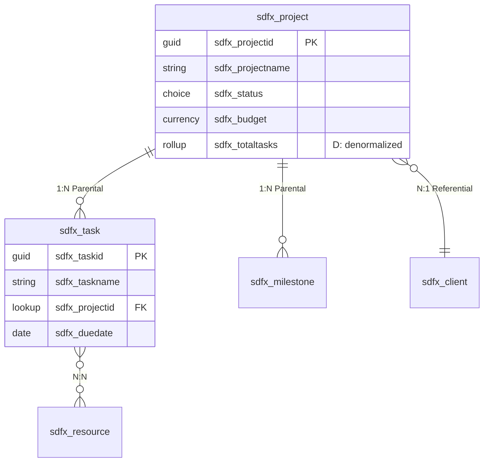

# Conversation Guide — schema-design

This file is the stage-by-stage reference for running schema-design. Read it at the start of CREATE, RESUME, or re-entry mode. Follow each stage's flow, presentation templates, and gate conditions exactly.

<EXTREMELY-IMPORTANT>
**Timestamps:** Use actual UTC timestamps (e.g., `2026-04-02T14:30:00Z`) in all state file writes and document metadata. Never use placeholder timestamps like `T00:00:00Z`.

**State writes:** Write to `.pp-context/skill-state.json` at every stage transition. If `.pp-context/` does not exist, create it.

**Developer confirmation:** Every stage gate requires explicit developer confirmation before proceeding. Do not assume confirmation from silence or partial responses.

**Knowledge domains:** Read `./knowledge-domains.md` when you enter LOGICAL_MODEL — not before. You need its reference tables from LOGICAL_MODEL through PARITY_CHECK.
</EXTREMELY-IMPORTANT>

---

## Stage: INIT

### Actions

1. Read foundation sections:
   - `.foundation/00-project-identity.md` — extract publisher prefix
   - `.foundation/01-requirements.md`
   - `.foundation/02-architecture-decisions.md`
   - `.foundation/03-entity-map.md`

2. Check for DDD model:
   - If `docs/ddd-model.md` exists → load it, extract contexts, aggregates, ubiquitous language
   - If absent → note for warn-but-allow flow

3. Check for UI plan:
   - If `.foundation/05-ui-plan.md` exists and is not placeholder → note for UX_DENORMALIZATION
   - If absent or placeholder → UX_DENORMALIZATION will be skipped

4. Check for existing schema artifacts:
   - If `docs/schema-physical-model.md` exists → offer re-entry options (see Re-entry below)

5. Read context files if available:
   - `.pp-context/environment.json`
   - `.pp-context/session.json`

6. Write initial state:
   ```json
   {
     "activeSkill": "schema-design",
     "activeStage": "INIT",
     "stageHistory": [
       { "stage": "INIT", "startedAt": "<UTC timestamp>" }
     ],
     "lastCompleted": "application-design",
     "suggestedNext": null,
     "completedSkills": ["solution-discovery", "application-design"]
   }
   ```
   Note: If application-design was not run, adjust `lastCompleted` and `completedSkills` accordingly.

### Presentation (first run, with DDD model)

> "I've loaded your foundation and DDD model. Starting schema design for [Project Name]:
> - [N] entities across [M] bounded contexts
> - [X] aggregates with defined roots and cascade scope
> - Publisher prefix: [prefix]
> - UI plan: [available | not available — denormalization will be limited]
>
> We'll work through four modeling stages: conceptual → logical → physical → denormalization, then validate against known patterns. Ready to start with the conceptual model?"

### Presentation (first run, without DDD model)

> "I've loaded your foundation. Note: No DDD model found at `docs/ddd-model.md`. I'll proceed using the entity map, but aggregate boundaries and naming conventions will need to be defined as we go.
>
> Consider running **application-design** first if you want DDD-informed schema decisions.
>
> Starting schema design for [Project Name]:
> - [N] entities in entity map
> - Publisher prefix: [prefix]
>
> Ready to proceed?"

### Re-entry Flow

If `docs/schema-physical-model.md` exists:

> "I found existing schema design artifacts from a previous run:
> - Physical model: `docs/schema-physical-model.md` (last updated [date])
> - [ERD status]
>
> How would you like to proceed?
> - **Full re-run** — walk through all stages again, diffing against the previous model
> - **Delta mode** — start from the existing physical model, identify what changed, and propose only the updates"

**Full re-run:** Walk all stages. At each stage, pre-populate with previous model's decisions. Developer confirms or changes each. REVIEW produces a diff.

**Delta mode:**
1. Compare current foundation/DDD model against previous physical model
2. Identify new entities, removed entities, changed relationships, new columns
3. Present proposed changes for confirmation
4. Update physical model spec and ERD
5. Skip to PARITY_CHECK → REVIEW → COMPLETE

### Gate

Foundation loaded. DDD status determined. Mode selected. Proceed to CONCEPTUAL_MODEL.

### State Write

Update `activeStage` to `"CONCEPTUAL_MODEL"`, add INIT to stageHistory with `completedAt`.

---

## Stage: CONCEPTUAL_MODEL

### Input

Entity map from foundation. DDD model if available.

### With DDD Model

The conceptual model is largely pre-informed. Present aggregate-derived entity groupings:

> "Based on your DDD model, here's the conceptual data model:
>
> **[Aggregate 1]** (root: [Entity A])
> - [Entity A] → [Entity B]: 1:N (parent-child, cascade delete)
> - [Entity A] → [Entity C]: 1:N (parent-child, cascade delete)
>
> **[Aggregate 2]** (root: [Entity D])
> - [Entity D] → [Entity E]: 1:N (parent-child, restrict delete)
> - [Entity D] ↔ [Entity F]: N:N (cross-aggregate reference)
>
> **Cross-aggregate relationships:**
> - [Entity B] → [Entity D]: lookup (referential)
>
> Does this conceptual model look right? Any relationships to add or change?"

### Without DDD Model

Derive from entity map alone. Ask clarifying questions:

> "Based on your entity map, here are the entities and relationships I can identify:
>
> | Entity | Relationships |
> |---|---|
> | [Entity A] | → [Entity B] (1:N), → [Entity C] (1:N) |
> | [Entity D] | → [Entity E] (1:N), ↔ [Entity F] (N:N) |
>
> A few questions to clarify the model:
> 1. Which entities are 'parent' entities that own the lifecycle of their children? (This determines cascade delete scope.)
> 2. Are there any N:N relationships I haven't captured?
> 3. Are any of these entities already existing Dataverse system tables or D365 tables?"

### Gate

Developer confirms entity list, all relationships documented with cardinality, parent-child ownership identified.

### State Write

Update `activeStage` to `"LOGICAL_MODEL"`, add CONCEPTUAL_MODEL to stageHistory with `completedAt`.

---

## Stage: LOGICAL_MODEL

<EXTREMELY-IMPORTANT>
Read `./knowledge-domains.md` now. You need the naming conventions, column type reference, and anti-patterns for this stage and all subsequent stages.
</EXTREMELY-IMPORTANT>

### Round 1 — Entity-by-entity attribute definition

For each entity (process in aggregate order if DDD available — root first, then children):

> "**[Entity A]** — [description from entity map or DDD model]
>
> | Attribute | Data type | Required? | Notes |
> |---|---|---|---|
> | [Name] | Text (100) | Yes | Primary name field |
> | [Status] | Choice | Yes | Active/Inactive |
> | [Start Date] | Date only | Yes | |
> | [Amount] | Currency | No | |
>
> Naming convention applied: `[prefix]_[entityname]_[attributename]` (lowercase, underscore-separated)
>
> What would you add, remove, or change?"

### Round 2 — Candidate keys and uniqueness

> "Which attributes (or combinations) uniquely identify a record for each entity? These become alternate keys in Dataverse.
>
> | Entity | Candidate key | Attributes |
> |---|---|---|
> | [Entity A] | Natural key | [attribute combination] |
>
> Note: Dataverse always creates a GUID primary key. Alternate keys are for integration scenarios and duplicate detection."

### Round 3 — Normalization review

> "Checking normalization:
> - [observation about repeated data groups → suggest extraction to related table]
> - [observation about multi-valued attributes → suggest N:N or child table]
> - [observation about transitive dependencies → suggest normalization]
>
> Any of these should be addressed before moving to the physical model?"

### Gate

Attributes confirmed per entity. Naming conventions accepted. Candidate keys identified. Normalization issues resolved.

### State Write

Update `activeStage` to `"PHYSICAL_MODEL"`, add LOGICAL_MODEL to stageHistory with `completedAt`.

---

## Stage: PHYSICAL_MODEL

### Round 1 — Column type mapping

For each entity, map logical attributes to Dataverse column types:

> "**[Entity A]** — Dataverse column mapping:
>
> | Attribute | Logical type | Dataverse type | Properties |
> |---|---|---|---|
> | [Name] | Text (100) | Single line of text | Max: 100, Format: Text |
> | [Status] | Choice | Choice | Values: Active (1), Inactive (2) |
> | [Start Date] | Date only | Date only | Behavior: User local |
> | [Amount] | Currency | Currency | Precision: 2, Min: 0 |
> | [Parent] | FK to [Entity B] | Lookup | Relationship behavior: Referential |
>
> Any type mappings to adjust?"

### Round 2 — Table type and properties

For each entity:

> "Table configuration for [Entity A]:
>
> | Property | Value | Rationale |
> |---|---|---|
> | Table type | Standard | [or Activity, Virtual, Elastic — with rationale] |
> | Ownership | User/Team | [or Organization — based on security profile] |
> | Audit changes | Yes | [recommended for entities with business logic] |
> | Change tracking | Yes | [recommended for integration scenarios] |
> | Duplicate detection | [Yes/No] | [based on alternate key candidates] |
>
> Confirm or adjust?"

### Round 3 — Relationship behaviors

> "Relationship behavior configuration:
>
> | Relationship | Type | Behavior | Cascade actions |
> |---|---|---|---|
> | [Entity A] → [Entity B] | 1:N | Parental | Assign: Cascade, Delete: Cascade, Share: Cascade, Reparent: Cascade |
> | [Entity A] → [Entity C] | 1:N | Referential | Assign: None, Delete: Restrict, Share: None, Reparent: None |
> | [Entity D] ↔ [Entity F] | N:N | — | N/A (intersection table managed by Dataverse) |
>
> [If DDD available:] These behaviors align with your aggregate cascade scope definitions.
> [If DDD not available:] I've inferred these behaviors from the parent-child ownership you confirmed. Review carefully — cascade delete is permanent.
>
> Confirm or adjust?"

### Output

After all three rounds are confirmed:

1. **Write `docs/schema-physical-model.md`** using the template below
2. **Generate ERD** — check for Whimsical MCP tools. If available, use `flowchart_create` with Mermaid ER syntax. If not, generate Mermaid code block in the document.

### Physical Model Document Template — `docs/schema-physical-model.md`

```markdown
# Physical Data Model — [Project Name]

**Generated by:** schema-design (pp-superpowers)
**Date:** [UTC timestamp]
**DDD model:** [available at docs/ddd-model.md | not used]
**Publisher prefix:** [prefix]

---

## Overview

- Total tables: [N]
- Custom tables: [N]
- System/D365 tables extended: [N]
- Relationships: [N] (1:N: [x], N:N: [y])
- Bounded contexts: [N] (from DDD model, or "not defined")

## Naming Conventions

| Element | Convention | Example |
|---|---|---|
| Table logical name | `[prefix]_[entityname]` | `sdfx_project` |
| Table display name | Title Case, singular | Project |
| Column logical name | `[prefix]_[attributename]` | `sdfx_projectname` |
| Column display name | Title Case, spaces | Project Name |
| Lookup column | `[prefix]_[relatedentity]id` | `sdfx_clientid` |
| Choice (local) | `[prefix]_[entityname]_[choicename]` | `sdfx_project_status` |
| Choice (global) | `[prefix]_[choicename]` | `sdfx_priority` |
| Alternate key | `[prefix]_[keyname]_key` | `sdfx_projectcode_key` |

---

## Tables

### [Table Name 1] — `[prefix]_[tablename]`

**Bounded context:** [context name, if DDD available]
**Aggregate:** [aggregate name] (role: [root | member])
**Table type:** [Standard | Activity | Virtual | Elastic]
**Ownership:** [User/Team | Organization]

| Configuration | Value |
|---|---|
| Audit changes | [Yes | No] |
| Change tracking | [Yes | No] |
| Duplicate detection | [Yes | No] |
| Business process flows | [Yes | No] |

**Columns:**

| # | Display name | Logical name | Type | Required | Properties | Notes |
|---|---|---|---|---|---|---|
| 1 | [Name] | [prefix]_[name] | Single line of text | Yes | Max: 100, Format: Text | Primary name column |
| 2 | [Status] | [prefix]_[status] | Choice | Yes | Values: Active (1), Inactive (2) | |
| 3 | [Amount] | [prefix]_[amount] | Currency | No | Precision: 2, Min: 0 | |
| 4 | [Start Date] | [prefix]_[startdate] | Date only | Yes | Behavior: User local | |
| 5 | [Parent] | [prefix]_[parent]id | Lookup | Yes | Target: [parent table] | Relationship: Parental |
| D1 | [Total Amount] | [prefix]_[totalamount] | Rollup | — | Source: [child table].[amount], Function: SUM | *Denormalized — see log* |

> Columns prefixed with "D" are denormalized columns added during UX_DENORMALIZATION. See `docs/schema-denormalization-log.md` for full rationale.

**Alternate keys:**

| Key name | Columns | Purpose |
|---|---|---|
| [prefix]_[keyname]_key | [column list] | [integration | duplicate detection | upsert] |

**Relationships (as parent):**

| Child table | Type | Behavior | Cascade: Assign | Cascade: Delete | Cascade: Share | Cascade: Reparent |
|---|---|---|---|---|---|---|
| [child table] | 1:N | Parental | Cascade | Cascade | Cascade | Cascade |
| [related table] | 1:N | Referential | None | Restrict | None | None |

**Relationships (as child):**

| Parent table | Lookup column | Behavior |
|---|---|---|
| [parent table] | [prefix]_[parent]id | [Parental | Referential] |

**N:N relationships:**

| Related table | Intersection table | Notes |
|---|---|---|
| [table] | [auto-generated or custom] | [attributes on intersection, if any] |

### [Table Name 2] — `[prefix]_[tablename]`
[same structure]

---

## ERD

### Full ERD
[Whimsical link or "See Mermaid diagram below"]

### Mermaid (fallback or supplementary)

[Mermaid ER diagram code block]

---

## Schema Version History

| Version | Date | Changes | Mode |
|---|---|---|---|
| 1.0 | [date] | Initial schema design | [First run] |
```

### ERD Mermaid Syntax



### Gate

All column types, table properties, and relationship behaviors confirmed.

### State Write

Update `activeStage` to `"UX_DENORMALIZATION"`, add PHYSICAL_MODEL to stageHistory with `completedAt`.

---

## Stage: UX_DENORMALIZATION

### Skip Check

If `.foundation/05-ui-plan.md` does not exist or is a placeholder:

> "No UI plan available — skipping denormalization review. Denormalization can be revisited after ui-design produces the UI plan."

Skip to PARITY_CHECK. Write skip note to state.

### Denormalization Patterns to Evaluate

| Pattern | When to apply | Dataverse mechanism |
|---|---|---|
| Rollup column | Parent needs a count or sum from children | Rollup column (real-time or scheduled) |
| Calculated column | Derived value from same-record attributes | Calculated or formula column |
| Denormalized lookup | Form needs to display a field from a related record without navigating | Copy value via plugin or flow on change |
| Status rollup | Parent status depends on children's statuses | Rollup or plugin-maintained status field |

### Presentation

For each candidate:

> "Reviewing your physical model against the UI plan:
>
> **Candidate 1: [Rollup on Entity A]**
> - UI requirement: [Persona X] needs to see total [Amount] on the [Entity A] form
> - Current state: Requires navigation to child records to calculate
> - **Recommendation:** Add rollup column `[prefix]_total[amount]` on [Entity A]
> - **Tradeoff:** Rollup columns update on a schedule (or real-time with config) — not instant
>
> **Candidate 2: [Denormalized lookup on Entity B]**
> - UI requirement: [Entity B] form needs to display [Entity A]'s [Name] without navigation
> - **Recommendation:** This is handled natively by Dataverse lookup rendering — no denormalization needed
>
> Accept, reject, or modify each recommendation?"

### Output

1. Add accepted denormalization columns to `docs/schema-physical-model.md` (prefixed with "D")
2. Write `docs/schema-denormalization-log.md` using template below

### Denormalization Log Template — `docs/schema-denormalization-log.md`

```markdown
# De-normalization Decision Log — [Project Name]

**Generated by:** schema-design (pp-superpowers)
**Date:** [UTC timestamp]

---

## Summary

| # | Table | Column | Type | Decision | Impact |
|---|---|---|---|---|---|
| 1 | [table] | [column] | Rollup | Accepted | [brief impact] |
| 2 | [table] | [column] | Calculated | Rejected | [brief reason] |

---

## Decision Details

### D1: [Column Name] on [Table Name]

**Type:** [Rollup | Calculated | Formula | Denormalized lookup | Plugin-maintained]

**UI requirement:** [What the UI plan says — which persona needs this, on which form]

**Current state:** [How this information is accessed today]

**Proposed change:** [What denormalization adds]

**Benefits:**
- [performance improvement, UX improvement, reduced clicks]

**Costs:**
- [staleness risk, storage overhead, maintenance complexity, sync mechanism needed]

**Decision:** [Accepted | Rejected | Deferred]

**Rationale:** [Why this tradeoff is worth it — or why it isn't]

**Implementation notes:** [Dataverse mechanism: rollup column config, calculated field formula, plugin trigger for sync]

### D2: [Column Name] on [Table Name]
[same structure]
```

### Gate

Each denormalization candidate confirmed or rejected.

### State Write

Update `activeStage` to `"PARITY_CHECK"`, add UX_DENORMALIZATION to stageHistory with `completedAt`.

---

## Stage: PARITY_CHECK

### Actions

Compare the proposed schema against known patterns. Use the reference material from `./knowledge-domains.md` section 6 (Parity Check Reference).

### Check Categories

**1. System table awareness:**
Are any proposed custom tables duplicating functionality already available in Dataverse system tables or D365 tables? Check against the system table lists in knowledge-domains.md.

**2. Platform pattern alignment:**
Does the schema follow established Dataverse patterns? Check against the platform patterns in knowledge-domains.md (Activity, Connection, Queue, Note, BPF patterns).

**3. Known anti-patterns:**
Scan for anti-patterns from knowledge-domains.md section 5:
- Excessively wide tables (100+ columns)
- Deep relationship chains (5+ levels)
- N:N relationships without intersection entity attributes
- Overuse of global option sets
- Missing alternate keys on integration entities
- Calculated columns for cross-entity logic

**4. Documentation verification (via pp-research if available):**
If Microsoft Learn MCP tools (`microsoft_docs_search`, `microsoft_docs_fetch`) are available, verify:
- Column type limitations are respected
- Relationship behavior combinations are supported
- No deprecated features in use

If MCP tools are not available:
> "pp-research / Microsoft Learn tools are not available. Manual documentation verification recommended for column type limits and relationship behavior support."

### Presentation

> "Parity check results:
>
> **System table overlap:**
> - [Finding or "No overlap detected"]
>
> **Pattern alignment:**
> - [Finding or "Schema follows standard Dataverse patterns"]
>
> **Anti-pattern scan:**
> - [HIGH/MEDIUM/LOW] [finding description and recommendation]
>
> **Documentation verification:**
> - [Results from Microsoft Learn, or "Microsoft Learn tools not available — manual verification recommended"]
>
> Address findings before proceeding to review?"

### Gate

All HIGH findings resolved. MEDIUM findings addressed or explicitly accepted with rationale. LOW findings noted.

### State Write

Update `activeStage` to `"REVIEW"`, add PARITY_CHECK to stageHistory with `completedAt`.

---

## Stage: REVIEW

### Stage 1 — Spec compliance (schema-reviewer agent)

Dispatch the **schema-reviewer** agent (defined in `agents/schema-reviewer.md`) with:
- `docs/schema-physical-model.md`
- Foundation sections (00-03, 05 if available)
- `docs/ddd-model.md` (if available)
- `docs/schema-denormalization-log.md` (if exists)

Present the agent's findings report to the developer:

> "Schema review — spec compliance:
>
> [Present findings table from agent]
>
> **Summary:**
> - HIGH: [N] | MEDIUM: [N] | LOW: [N]
> - Assessment: [PASS | PASS WITH NOTES | FAIL]"

If FAIL: resolve HIGH findings before proceeding.
If PASS WITH NOTES: confirm MEDIUM acceptances with developer.

### Stage 2 — Quality validation

After spec compliance passes:

> "Schema review — quality checks:
> - [checkmark/cross] No unresolved anti-patterns from parity check
> - [checkmark/cross] Denormalization decisions documented with rationale
> - [checkmark/cross] Column types appropriate for data stored
> - [checkmark/cross] Table ownership aligned with security profile personas
> - [checkmark/cross] Physical model document complete per template
> [If DDD not available:]
> - Note: DDD model was not available — aggregate boundaries were defined ad-hoc during schema design
>
> [If any items fail:] Issues to resolve: [list]
> [If all items pass:] Schema design is complete. Ready to close?"

### Gate

All checks pass. Developer confirms.

### State Write

Update `activeStage` to `"COMPLETE"`, add REVIEW to stageHistory with `completedAt`.

---

## Stage: COMPLETE

### Actions

1. **Write completion state** to `.pp-context/skill-state.json`:
   ```json
   {
     "activeSkill": null,
     "activeStage": null,
     "stageHistory": [
       { "stage": "INIT", "completedAt": "<timestamp>" },
       { "stage": "CONCEPTUAL_MODEL", "completedAt": "<timestamp>" },
       { "stage": "LOGICAL_MODEL", "completedAt": "<timestamp>" },
       { "stage": "PHYSICAL_MODEL", "completedAt": "<timestamp>" },
       { "stage": "UX_DENORMALIZATION", "completedAt": "<timestamp>" },
       { "stage": "PARITY_CHECK", "completedAt": "<timestamp>" },
       { "stage": "REVIEW", "completedAt": "<timestamp>" },
       { "stage": "COMPLETE", "completedAt": "<timestamp>" }
     ],
     "lastCompleted": "schema-design",
     "suggestedNext": "ui-design",
     "completedSkills": ["solution-discovery", "application-design", "schema-design"],
     "artifacts": [
       { "skill": "application-design", "file": "docs/ddd-model.md", "createdAt": "<timestamp>" },
       { "skill": "schema-design", "file": "docs/schema-physical-model.md", "createdAt": "<timestamp>" },
       { "skill": "schema-design", "file": "docs/schema-denormalization-log.md", "createdAt": "<timestamp>" }
     ]
   }
   ```
   Note: Adjust `completedSkills` and `artifacts` if application-design was not run.

2. **Present the handoff suggestion:**

   > "Schema design is complete. Your physical model has [N] tables, [M] relationships, and [X] denormalization decisions.
   >
   > Artifacts produced:
   > - Physical model: `docs/schema-physical-model.md`
   > - ERD: [Whimsical link or "Mermaid diagram in physical model document"]
   > - De-normalization log: `docs/schema-denormalization-log.md`
   >
   > I'd suggest moving to **ui-design** next — your forms and views need the column definitions from the physical model.
   >
   > Other options:
   > - **security** — if field-level security design should happen before UI
   > - **business-logic** — if you want to start building plugins or flows
   > - **Any other skill**
   >
   > What would you like to work on next?"

3. **Wait for explicit confirmation.** Do not auto-start the next skill.
