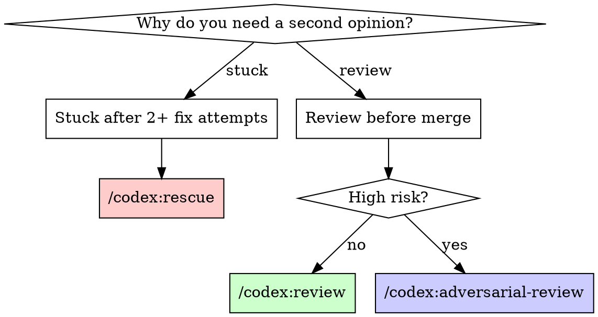

# Second Opinion

Route to the right Codex review based on context. This is a genuinely independent review — different model, no shared context, catches what Claude won't.

## When This Triggers

- Before merge (called by sspower:finishing-a-development-branch)
- After Claude code review passes (called by sspower:requesting-code-review)
- User says "second opinion", "independent review", "check this"
- You've failed to fix something 2+ times

## Decision Flow

## High-Risk Signals

Use `/codex:adversarial-review` when changes touch:
- Authentication, authorization, session handling
- Payment, billing, financial data
- Database migrations, schema changes
- Security-sensitive code (crypto, tokens, secrets)
- Core architecture, shared abstractions
- Public API contracts

Otherwise use `/codex:review`.

## Execution

1. **Check diff size:** `git diff --shortstat`
2. **Pick the right command** based on flow above
3. **Run it:**
   - Small diff (1-3 files): foreground
   - Large diff: `/codex:rescue --background` then check `/codex:status`
4. **Present Codex output verbatim** — do NOT paraphrase or filter
5. **If issues found:** ask user which to address, fix, re-run (max 2 iterations)
6. **If approved:** proceed

## Rules

- Never filter or summarize Codex output — it's the user's second opinion
- Never tell Codex what Claude's review found — reviewer independence
- If Codex and Claude disagree, present both and let user decide
