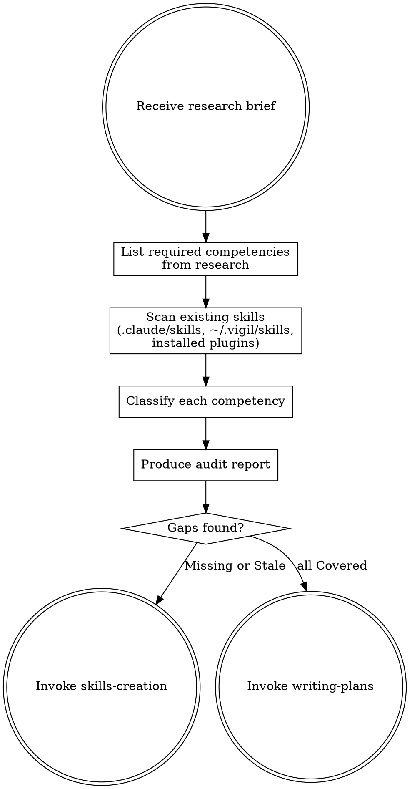

# Skills Audit

## Overview

After deep research produces a brief, audit all existing supporting skills (outside ultrapowers) to determine if you have the knowledge captured to execute well. This prevents starting implementation with incomplete or outdated guidance.

**Important:** This audits supporting skills only — not ultrapowers skills themselves. Ultrapowers skills define the workflow; supporting skills define domain knowledge (e.g., `websocket-axum`, `auth-patterns`).

## When to Use

- Immediately after deep-research produces a research brief
- Before creating an implementation plan

## Process



### 1. List Required Competencies

From the research brief, extract distinct competencies:

```markdown
## Required Competencies
1. WebSocket server setup with axum (library-specific)
2. WebSocket authentication on upgrade (pattern)
3. Reconnection and heartbeat strategies (pattern)
4. Broadcasting to multiple clients (technique)
```

Each competency = a single, testable capability.

### 2. Scan Existing Skills

Check all skill locations:
- `.claude/skills/` — project-level skills
- `~/.vigil/skills/` — vigil-managed skills (if applicable)
- Installed plugins — check available skill descriptions

For each skill found, note what it covers and whether its patterns are current per the research.

### 3. Classify Each Competency

| Status | Meaning | Action |
|--------|---------|--------|
| **Covered** | Existing skill handles this with current patterns | None |
| **Stale** | Skill exists but patterns are outdated | Update via skills-creation |
| **Missing** | No skill covers this | Create via skills-creation |
| **External** | Covered by ultrapowers or well-known practice | Note for plan |

### 4. Produce Audit Report

```markdown
## Skills Audit Report

### Coverage Summary
- Covered: X | Stale: X | Missing: X | External: X

### Detail
| Competency | Status | Existing Skill | Action |
|------------|--------|---------------|--------|
| WS server setup | Missing | — | Create `websocket-axum` |
| Auth on upgrade | Missing | — | Add to `auth-patterns` |
| Reconnection | Missing | — | Include in `websocket-axum` |
| Broadcasting | Covered | `event-bus` | None |

### Skills to Create/Update
1. **Create `websocket-axum`** — covers: server setup, reconnection
2. **Update `auth-patterns`** — add: WebSocket upgrade auth

### Skills to Reference in Plan
- `event-bus` (broadcasting)
- `code-quality-standards` (always)
```

## Grouping Rules

- **Same technology** → one skill
- **Same concern** → one skill
- **Unrelated** → separate skills
- **One-off knowledge** → put in implementation plan, not a skill

## Output

If gaps found → invoke **skills-creation** skill.
If all covered → invoke **writing-plans** skill with skill annotations.
