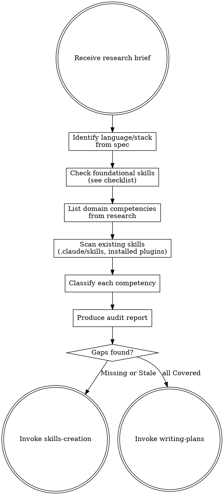

# Skills Audit

## Overview

After deep research produces a brief, audit all existing supporting skills (outside ultrapowers) to determine if you have the knowledge captured to execute well. This prevents starting implementation with incomplete or outdated guidance.

The audit has two parts:
1. **Domain competencies** — skills specific to what we're building (from the research brief)
2. **Foundational development skills** — best practices for the language/stack we're using

**Important:** This audits supporting skills only — not ultrapowers skills themselves. Ultrapowers skills define the workflow; supporting skills define domain knowledge.

## When to Use

- Immediately after deep-research produces a research brief
- Before creating an implementation plan

## Process



## Foundational Development Skills Checklist

Before auditing domain-specific competencies, verify two things:
1. **Language-agnostic category skills** exist for each relevant concern
2. A **single language-specific best practices skill** exists for each language in the stack

### Category Skills (Language-Agnostic)

Each category skill covers universal principles and patterns that apply regardless of language. There is **one skill per category**, not one per language.

| Category | Skill name | What it covers |
|----------|-----------|---------------|
| **Testing / TDD** | `testing-tdd` | TDD cycle, test design, fixtures, mocking strategies, coverage |
| **Error handling** | `error-handling` | Exception vs Result patterns, validation, graceful degradation |
| **Design patterns** | `design-patterns` | SOLID, DDD, composition, separation of concerns |
| **Architecture** | `architecture` | Monolith vs microservices, hexagonal, clean architecture, event-driven |
| **Database** | `database-design` | Schema design, migrations, indexing, query optimization |
| **Caching** | `caching` | Cache strategies, invalidation, TTL, write-through vs write-behind |
| **API design** | `api-design` | REST/GraphQL conventions, versioning, pagination, error responses |
| **Observability** | `observability` | Structured logging, metrics, distributed tracing |
| **Resilience** | `resilience` | Retries, circuit breakers, timeouts, backoff, bulkheads |
| **Security / Auth** | `auth-security` | Authentication, authorization, secrets management, OWASP |
| **Background jobs** | `background-jobs` | Task queues, workers, event-driven processing, idempotency |
| **RAG / AI** | `rag-ai` | Retrieval-augmented generation, embeddings, vector search, chunking |
| **CI/CD** | `ci-cd` | Pipeline design, deployment strategies, rollback |
| **Type safety** | `type-safety` | Type systems, generics, strict checking, contracts |

### Language-Specific Best Practices (One Per Language)

For each language in the stack, check if a single best practices skill exists. This skill covers **language-specific idioms, conventions, tooling, and gotchas** — things that differ from the universal patterns above.

**Naming convention:** `<language>-best-practices` (e.g., `rust-best-practices`, `python-best-practices`, `typescript-best-practices`)

**What a language skill covers:**
- Idiomatic patterns and conventions for that language
- Standard tooling (linters, formatters, package managers)
- Language-specific error handling idioms (e.g., Rust's `Result`/`Option`, Python's exceptions)
- Common pitfalls and anti-patterns specific to that language
- Project structure conventions
- Testing framework specifics (e.g., `cargo test` vs `pytest` vs `vitest`)

**What a language skill does NOT cover:**
- Universal concepts already in category skills (SOLID, TDD cycle, cache invalidation, etc.)
- The language skill complements category skills, it doesn't duplicate them

### Which categories apply?

Not every project needs every category. Use the spec to determine which are relevant:

- **Always required:** Testing/TDD, Error handling, Design patterns, + language best practices
- **If it has a backend:** Architecture, Database, API design, Observability
- **If it handles external calls:** Resilience, Caching
- **If it has auth:** Security/Auth
- **If it processes async work:** Background jobs
- **If it uses AI/LLMs:** RAG/AI
- **If it deploys:** CI/CD

### Checking installed skills

Many category skills may already be installed as plugins. Check the available-skills list in the current session (injected as `<system-reminder>`). Mark installed ones as **External** — they don't need to be created, just referenced in the plan.

**Sibling-pack prefixes are always External.** Any skill whose name starts with `ultrapowers-dev:` or `ultrapowers-business:` is part of a sibling plugin and is classified **External** without further investigation. If a matched profile from brainstorming provided a pre-populated `skills` list, seed the External set from that list before scanning domain competencies — this avoids re-deriving skills the profile already resolved.

When a base-plugin skill and a sibling-pack skill both cover the same concern, **prefer the sibling-pack version** (it's more specialized). Example: prefer `ultrapowers-dev:testing-tdd` over a less-specific reference.

## Domain Competencies

After the foundational check, audit domain-specific competencies from the research brief.

### 1. List Required Competencies

From the research brief, extract distinct competencies:

```markdown
## Required Competencies
1. WebSocket server setup with axum (library-specific)
2. WebSocket authentication on upgrade (pattern)
3. Reconnection and heartbeat strategies (pattern)
4. Broadcasting to multiple clients (technique)
```

Each competency = a single, testable capability.

### 2. Scan Existing Skills

Check all skill locations:
- `.claude/skills/` — project-level skills
- Installed plugins — check available skill descriptions

For each skill found, note what it covers and whether its patterns are current per the research.

### 3. Classify Each Competency

| Status | Meaning | Action |
|--------|---------|--------|
| **Covered** | Existing skill handles this with current patterns | None |
| **Stale** | Skill exists but patterns are outdated | Update via skills-creation |
| **Missing** | No skill covers this | Create via skills-creation |
| **External** | Covered by installed plugin or ultrapowers | Note for plan |

## Produce Audit Report

```markdown
## Skills Audit Report

### Language/Stack: Rust + axum + SQLite

### Language Best Practices
| Language | Status | Skill | Action |
|----------|--------|-------|--------|
| Rust | Missing | — | Create `rust-best-practices` |

### Category Skills
| Category | Status | Skill | Action |
|----------|--------|-------|--------|
| Testing/TDD | External | `testing-tdd` (installed) | None |
| Error handling | Missing | — | Create `error-handling` |
| Design patterns | External | `design-patterns` (installed) | None |
| Architecture | External | `architecture` (installed) | None |
| Database | External | `database-design` (installed) | None |
| API design | External | `api-design` (installed) | None |
| Observability | Missing | — | Create `observability` |

### Domain Competencies
| Competency | Status | Existing Skill | Action |
|------------|--------|---------------|--------|
| WS server setup | Missing | — | Create `websocket-patterns` |
| Auth on upgrade | Missing | — | Add to `auth-security` |
| Reconnection | Missing | — | Include in `websocket-patterns` |
| Broadcasting | Covered | `event-bus` | None |

### Coverage Summary
- Covered: X | Stale: X | Missing: X | External: X

### Skills to Create/Update
1. **Create `rust-best-practices`** — Rust idioms, tooling, project structure
2. **Create `error-handling`** — universal error handling patterns
3. **Create `websocket-patterns`** — server setup, reconnection, heartbeat

### Skills to Reference in Plan
- `testing-tdd`, `design-patterns`, `architecture` (category)
- `rust-best-practices` (language)
- `event-bus` (domain)
```

## Grouping Rules

- **One skill per category** — language-agnostic, universal patterns
- **One skill per language** — language-specific idioms and tooling
- **Domain skills** — group by technology or concern
- **One-off knowledge** → put in implementation plan, not a skill

## Output

If gaps found → invoke **skills-creation** skill.
If all covered → invoke **writing-plans** skill with skill annotations.
