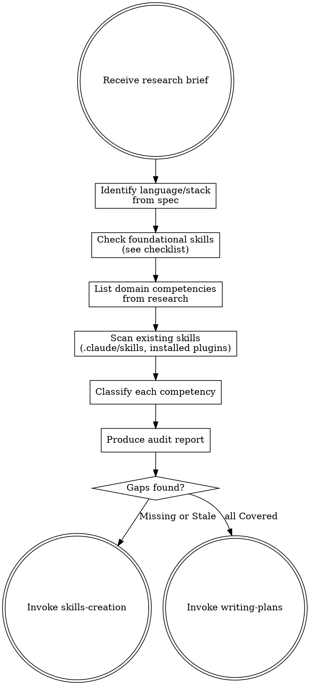

# Skills Audit

## Overview

After deep research produces a brief, audit all existing supporting skills (outside ultrapowers) to determine if you have the knowledge captured to execute well. This prevents starting implementation with incomplete or outdated guidance.

The audit has two parts:
1. **Domain competencies** — skills specific to what we're building (from the research brief)
2. **Foundational development skills** — best practices for the language/stack we're using

**Important:** This audits supporting skills only — not ultrapowers skills themselves. Ultrapowers skills define the workflow; supporting skills define domain knowledge.

## When to Use

- Immediately after deep-research produces a research brief
- Before creating an implementation plan

## Process



## Foundational Development Skills Checklist

Before auditing domain-specific competencies, check that foundational best-practice skills exist **for the specific language/stack** identified in the spec. These are the building blocks every implementation needs.

### Required Categories

For each category, check if a skill exists that covers the **specific language or framework** being used (e.g., `python-testing-patterns` for Python, `rust-code-style` for Rust). A generic skill counts only if it explicitly covers the relevant language.

| Category | What it covers | Example skill names |
|----------|---------------|-------------------|
| **Testing / TDD** | Test framework, fixtures, mocking, TDD cycle for the language | `python-testing-patterns`, `rust-testing`, `typescript-testing` |
| **Code style & conventions** | Naming, formatting, linting, idiomatic patterns | `python-code-style`, `rust-code-style`, `typescript-conventions` |
| **Error handling** | Exception/Result patterns, validation, graceful degradation | `python-error-handling`, `rust-error-handling`, `error-handling-patterns` |
| **Design patterns** | SOLID, DDD, composition, language-specific idioms | `python-design-patterns`, `ddd-patterns`, `typescript-advanced-types` |
| **Architecture** | Monolith vs microservices, hexagonal, clean architecture | `architecture-patterns`, `microservices-patterns`, `monolith-patterns` |
| **Database** | Schema design, migrations, query optimization, ORM patterns | `postgresql-table-design`, `sql-optimization-patterns`, `database-migration` |
| **Caching** | Cache strategies, invalidation, Redis/Memcached patterns | `caching-patterns`, `redis-patterns` |
| **API design** | REST/GraphQL conventions, versioning, pagination | `api-design-principles`, `openapi-spec-generation` |
| **Observability** | Logging, metrics, tracing for the language | `python-observability`, `structured-logging` |
| **Resilience** | Retries, circuit breakers, timeouts, backoff | `python-resilience`, `resilience-patterns` |
| **Security / Auth** | Authentication, authorization, secrets management | `auth-implementation-patterns`, `secrets-management` |
| **Background jobs** | Task queues, workers, event-driven processing | `python-background-jobs`, `async-patterns` |
| **RAG / AI** | Retrieval-augmented generation, embeddings, vector search | `rag-implementation`, `embedding-strategies`, `similarity-search-patterns` |
| **CI/CD** | Pipeline design, deployment strategies | `github-actions-templates`, `deployment-pipeline-design` |
| **Type safety** | Type hints, generics, strict checking | `python-type-safety`, `typescript-advanced-types` |

### Which categories apply?

Not every project needs every category. Use the spec to determine which are relevant:

- **Always required:** Testing/TDD, Code style, Error handling, Design patterns
- **If it has a backend:** Architecture, Database, API design, Observability
- **If it handles external calls:** Resilience, Caching
- **If it has auth:** Security/Auth
- **If it processes async work:** Background jobs
- **If it uses AI/LLMs:** RAG/AI, Embedding strategies
- **If it deploys:** CI/CD

### Checking installed skills

Many foundational skills may already be installed as plugins. Check the available skills list in the current session — skills like `python-testing-patterns`, `architecture-patterns`, `sql-optimization-patterns` etc. are commonly available as installed plugins.

Mark these as **External** in the audit — they don't need to be created, just referenced in the implementation plan.

## Domain Competencies

After the foundational check, audit domain-specific competencies from the research brief.

### 1. List Required Competencies

From the research brief, extract distinct competencies:

```markdown
## Required Competencies
1. WebSocket server setup with axum (library-specific)
2. WebSocket authentication on upgrade (pattern)
3. Reconnection and heartbeat strategies (pattern)
4. Broadcasting to multiple clients (technique)
```

Each competency = a single, testable capability.

### 2. Scan Existing Skills

Check all skill locations:
- `.claude/skills/` — project-level skills
- Installed plugins — check available skill descriptions

For each skill found, note what it covers and whether its patterns are current per the research.

### 3. Classify Each Competency

| Status | Meaning | Action |
|--------|---------|--------|
| **Covered** | Existing skill handles this with current patterns | None |
| **Stale** | Skill exists but patterns are outdated | Update via skills-creation |
| **Missing** | No skill covers this | Create via skills-creation |
| **External** | Covered by installed plugin or ultrapowers | Note for plan |

## Produce Audit Report

```markdown
## Skills Audit Report

### Language/Stack: [e.g., Rust + axum + SQLite]

### Foundational Skills
| Category | Status | Skill | Action |
|----------|--------|-------|--------|
| Testing/TDD | External | `rust-code-style` (partial) | Create `rust-testing` |
| Code style | External | `rust-code-style` | None |
| Error handling | Missing | — | Create `rust-error-handling` |
| Architecture | External | `architecture-patterns` | None |
| Database | External | `sql-optimization-patterns` | None |
| API design | External | `api-design-principles` | None |
| Observability | Missing | — | Create `rust-observability` |

### Domain Competencies
| Competency | Status | Existing Skill | Action |
|------------|--------|---------------|--------|
| WS server setup | Missing | — | Create `websocket-axum` |
| Auth on upgrade | Missing | — | Add to `auth-patterns` |
| Reconnection | Missing | — | Include in `websocket-axum` |
| Broadcasting | Covered | `event-bus` | None |

### Coverage Summary
- Covered: X | Stale: X | Missing: X | External: X

### Skills to Create/Update
1. **Create `rust-testing`** — TDD patterns for Rust
2. **Create `rust-error-handling`** — Result/Option patterns, thiserror, anyhow
3. **Create `websocket-axum`** — server setup, reconnection, heartbeat

### Skills to Reference in Plan
- `rust-code-style` (code style)
- `architecture-patterns` (architecture)
- `api-design-principles` (API design)
- `event-bus` (broadcasting)
```

## Grouping Rules

- **Same technology** → one skill (all Rust testing in one skill)
- **Same concern** → one skill (all auth patterns together)
- **Unrelated** → separate skills
- **One-off knowledge** → put in implementation plan, not a skill

## Output

If gaps found → invoke **skills-creation** skill.
If all covered → invoke **writing-plans** skill with skill annotations.
