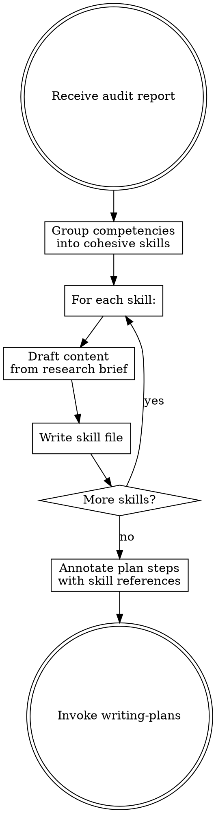

# Skills Creation

## Overview

Turn research findings and audit gaps into reusable skill files. Each skill captures patterns, pitfalls, and implementation guidance so future sessions start with proven knowledge instead of raw research.

**These are supporting skills, not ultrapowers skills.** They live in `.claude/skills/` or project-specific locations, not in the ultrapowers plugin.

## When to Use

- Skills audit identified Missing or Stale competencies
- Deep research produced reusable patterns worth preserving

## Process



### 1. Group Competencies

From the audit report, group related competencies:
- **Same technology** → one skill
- **Same concern** → one skill
- **One-off** → document in plan, not a skill

### 2. Write Skill Files

**Location:** `.claude/skills/` for project skills.

**Format:**
```markdown
---
name: skill-name
description: Use when [triggering conditions]
---

# Skill Name

## Overview
Core principle in 1-2 sentences.

## When to Use
Triggering conditions as bullets.

## Core Patterns
Essential patterns with code examples.

## Common Mistakes
What goes wrong and how to avoid it.
```

**Quality bar:**
- Description starts with "Use when..." — triggers only, no workflow
- One excellent code example beats five mediocre ones
- Under 500 words unless topic requires more
- Actionable without the research brief

### 3. Update Stale Skills

For Stale competencies:
- Read the existing skill
- Update only outdated sections
- Update description if triggers changed

### 4. Annotate for Implementation Plan

Prepare skill references for each implementation step:

```markdown
## Step 3: Implement WebSocket server
- **Skills:** `websocket-axum`, `auth-patterns`
- Task: ...
```

## Naming Convention

- Lowercase with hyphens: `websocket-axum`, `pipeline-context-chaining`
- Verb-first for processes: `debugging-websockets`
- Technology-specific when applicable: `axum-middleware`

## Red Flags

| Signal | Action |
|--------|--------|
| Skill covers too many topics | Split it |
| Skill > 800 words | Trim, move reference to separate file |
| Description summarizes workflow | Rewrite as triggers only |
| No code examples | Add at least one |
| Duplicates an installed skill | Reference, don't duplicate |

## Output

Created/updated skill files + annotated step references for the implementation plan. Invoke **writing-plans** skill next.
